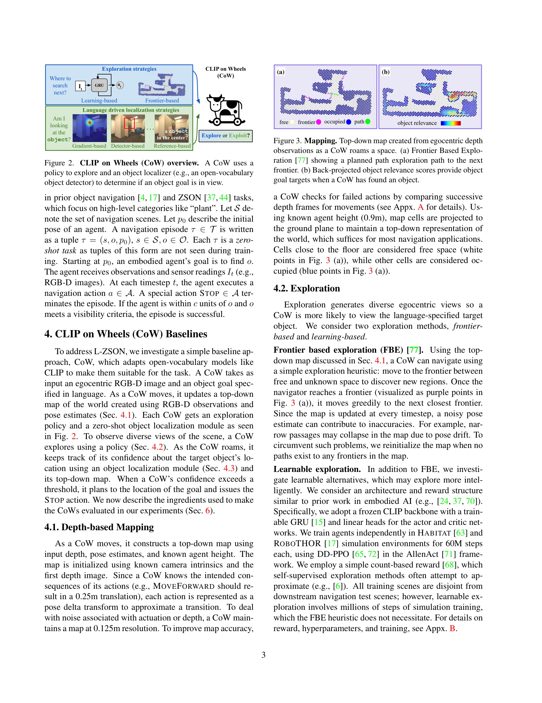
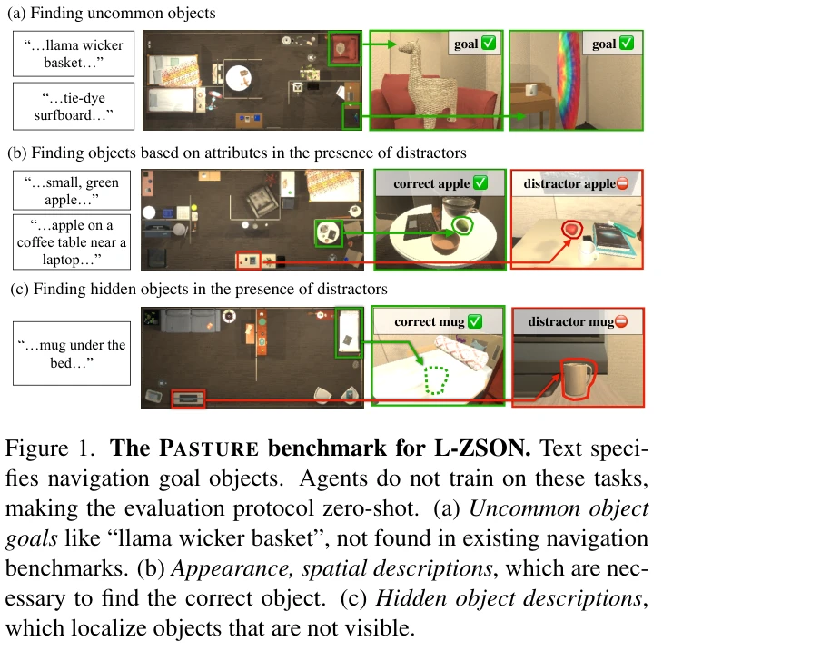

# CoWs on Pasture: Baselines and Benchmarks for Language-Driven Zero-Shot Object Navigation

> **저자**: Samir Yitzhak Gadre, Mitchell Wortsman, Gabriel Ilharco, Ludwig Schmidt, Shuran Song | **날짜**: 2022-03-20 | **URL**: [https://arxiv.org/abs/2203.10421](https://arxiv.org/abs/2203.10421)

---

## Essence

*Figure 2. CLIP on Wheels (CoW) overview. A CoW uses a*

로봇이 자연언어 설명만으로 임의의 물체를 찾을 수 있도록 CLIP 기반의 학습 없는 네비게이션 방법 CoW를 제안하고, 이를 평가하기 위한 Pasture 벤치마크를 소개한다.

## Motivation

- **Known**: 기존 객체 네비게이션은 고정된 카테고리에 대해 훈련되어야 하며, 최근 open-vocabulary 모델들은 이미지 분류에서 성공을 거두었다.
- **Gap**: 로봇이 학습 데이터 없이도 임의의 언어 설명으로 물체를 찾을 수 있는지, 그리고 드물거나 속성 기반의 물체 찾기가 가능한지에 대한 체계적 평가가 부족하다.
- **Why**: 실제 로봇 응용에서는 미리 알려지지 않은 환경과 물체에 대응해야 하므로, 언어 기반의 zero-shot 네비게이션 능력이 중요하다.
- **Approach**: CLIP 기반 open-vocabulary 객체 탐지기와 고전적 탐색 전략을 결합한 CoW 프레임워크를 제안하고, 드물거나 속성 기반, 숨겨진 물체 찾기를 포함한 Pasture 벤치마크에서 평가한다.

## Achievement

*Figure 1. The PASTURE benchmark for L-ZSON. Text speci-*

- **효율적인 학습 없는 베이스라인**: 추가 학습 없이 CLIP 기반 객체 지역화와 고전적 탐색을 조합한 단순한 CoW가 500M 스텝으로 훈련된 ZSON 최신 방법과 네비게이션 효율(SPL)에서 동등하다.
- **강화된 평가 벤치마크**: 드물거나 보이지 않는 물체, 속성 기반 설명을 포함한 Pasture 벤치마크로 기존 벤치마크의 한계를 극복한다.
- **광범위한 실증 연구**: 90k 이상의 네비게이션 에피소드를 평가하여 CoW의 장단점을 명확히 하며, RoboTHOR에서 최신 방법 대비 15.6% 향상을 달성한다.
- **종합적 베이스라인 분석**: 21개의 CoW 변형을 통해 open-vocabulary 모델, 탐색 정책, 프롬팅 전략 등 다양한 요소를 체계적으로 분석한다.

## How

*Figure 2. CLIP on Wheels (CoW) overview. A CoW uses a*

- RGB-D 이미지와 위치 추정값으로부터 top-down map을 생성하여 환경을 매핑한다.
- 탐색 정책(frontier-based, learning-based)을 통해 미탐색 영역을 탐험하고 다양한 시점을 관찰한다.
- CLIP 기반 객체 탐지기(detector-based, reference-based, gradient-based)를 사용하여 대상 물체의 위치 신뢰도를 업데이트한다.
- 신뢰도 임계값을 초과하면 top-down map에서 물체 위치로 경로를 계획하고 STOP 액션을 수행한다.
- Habitat, RoboTHOR, Pasture 환경에서 90k 이상의 에피소드를 통해 성능을 평가한다.

## Originality

- 기존 ZSON 방법들과 달리 시뮬레이션 환경에서의 학습을 완전히 배제하고 open-vocabulary 모델의 zero-shot 능력만으로 객체 네비게이션을 수행하는 접근이 참신하다.
- 드물거나 보이지 않는 물체, 속성 기반 설명 등을 포함한 Pasture 벤치마크는 기존 고정 카테고리 중심 벤치마크의 한계를 극복하고 현실적 응용을 더 잘 반영한다.
- 21개의 다양한 CoW 변형을 통한 체계적 ablation study는 open-vocabulary 모델의 네비게이션 적응 방법을 이해하는 데 새로운 통찰을 제공한다.

## Limitation & Further Study

- CoW 베이스라인들이 언어 설명을 충분히 활용하지 못하며, 특히 속성 기반 설명에서 약점을 보인다.
- 숨겨진 물체 찾기는 시각적 정보만으로는 한계가 있으며, 추가적인 상식 추론 능력이 필요하다.
- 평가가 주로 시뮬레이션 환경(Habitat, RoboTHOR)에 제한되어 실제 로봇 환경에서의 성능 검증이 부족하다.
- 후속 연구는 언어 설명을 더 효과적으로 활용하는 모듈, 숨겨진 물체에 대한 상식 추론 능력, 실제 로봇 플랫폼에서의 검증을 고려해야 한다.

## Evaluation

- Novelty: 4/5
- Technical Soundness: 3/5
- Significance: 4/5
- Clarity: 4/5
- Overall: 4/5

**총평**: 이 논문은 현실적인 로봇 응용을 위해 학습 없는 언어 기반 객체 네비게이션을 체계적으로 연구하며, 새로운 벤치마크와 광범위한 실증 분석을 통해 open-vocabulary 모델의 네비게이션 적응 가능성을 명확히 보여준다. 베이스라인의 단순성과 강력한 성능, 그리고 종합적인 평가 프레임워크는 향후 연구의 중요한 기준을 제시한다.

## Related Papers

- 🔄 다른 접근: [[papers/1340_Context-Aware_Entity_Grounding_with_Open-Vocabulary_3D_Scene/review]] — OVSG는 CoWs보다 더 정교한 문맥 인식 엔티티 그라운딩을 제공하지만 둘 다 오픈 어휘 장면 네비게이션을 다룬다
- 🔗 후속 연구: [[papers/1311_Cognition_to_Control_-_Multi-Agent_Learning_for_Human-Humano/review]] — ApexNav는 CoWs의 언어 기반 zero-shot navigation을 적응적 탐색 전략으로 확장한다
- 🏛 기반 연구: [[papers/1507_OpenBench_A_New_Benchmark_and_Baseline_for_Semantic_Navigati/review]] — OpenBench는 CoWs의 성능 평가를 위한 의미 네비게이션 벤치마크 기반을 제공한다
- 🏛 기반 연구: [[papers/1580_MOSAIC_Bridging_the_Sim-to-Real_Gap_in_Generalist_Humanoid_M/review]] — 크로스 플랫폼 VLA 모델 스케일링 기법이 MOSAIC의 일반화된 휴머노이드 정책 학습을 위한 방법론적 기초를 제공합니다.
- 🔄 다른 접근: [[papers/1340_Context-Aware_Entity_Grounding_with_Open-Vocabulary_3D_Scene/review]] — CoWs on Pasture는 OVSG와 유사한 오픈 어휘 장면 탐색이지만 CLIP 기반의 학습 없는 방법을 사용한다
