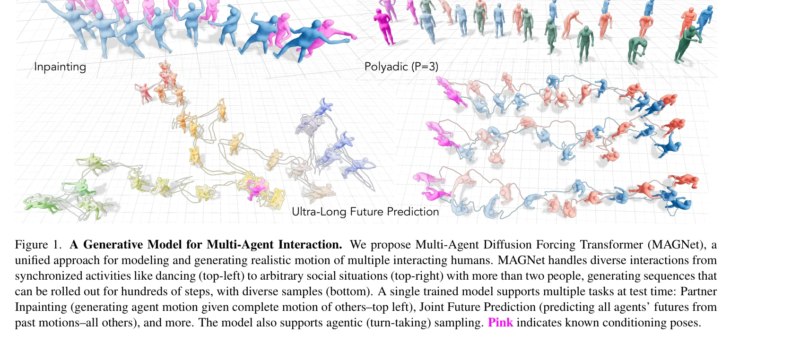

# Diffusion Forcing for Multi-Agent Interaction Sequence Modeling

> **저자**: Vongani H. Maluleke, Kie Horiuchi, Lea Wilken, Evonne Ng, Jitendra Malik, Angjoo Kanazawa | **날짜**: 2025-12-19 | **URL**: [https://arxiv.org/abs/2512.17900](https://arxiv.org/abs/2512.17900)

---

## Essence

*Figure 1. A Generative Model for Multi-Agent Interaction. We propose Multi-Agent Diffusion Forcing Transformer (MAGNet),*

MAGNet은 diffusion forcing을 기반으로 한 unified autoregressive diffusion 프레임워크로, 다양한 multi-agent interaction 태스크(dyadic/polyadic 예측, partner inpainting, agentic 생성 등)를 단일 모델에서 지원하며 수백 스텝의 ultra-long 시퀀스 생성을 가능하게 한다.

## Motivation

- **Known**: Single-agent motion generation은 diffusion models과 transformers를 통해 발전했으며, dyadic motion generation은 cross-attention이나 diffusion을 활용하지만 주로 특정 태스크에 제한되어 있다. 기존 방법들은 주로 두 명의 상호작용만 처리 가능하고 task-specific하다.
- **Gap**: 기존 multi-agent motion generation 방법들은 cross-attention 기반으로 고정된 agent 쌍에만 적용되거나 특정 샘플링 모드(agentic-only)로 제한되어, 임의의 그룹 크기와 diverse한 태스크를 동시에 지원하는 unified 프레임워크가 부재하다.
- **Why**: Multi-person interaction 모델링은 robotics, virtual reality, social computing 등 광범위한 응용 분야에서 중요하며, polyadic 시나리오와 diverse한 interaction 타입(synchronized activities부터 loosely structured social interactions까지)을 실시간으로 처리할 수 있는 통합 모델이 필요하다.
- **Approach**: Agent-time motion tokens를 설계하여 각 token이 agent의 latent pose와 다른 모든 agents에 대한 pairwise relative transforms를 포함하도록 하고, diffusion forcing으로 각 token에 독립적인 noise level을 할당하여 arbitrary agent/timestep 부분집합에 대한 조건부 분포를 학습한다.

## Achievement

- **Unified Framework**: Partner inpainting, partner prediction, joint future prediction, ultra-long rollout, agentic generation, polyadic 생성을 모두 단일 모델에서 지원
- **Relational Motion Representation**: World-agnostic한 relative coordinate frames를 통해 agent 수에 무관하게 polyadic scenarios(P≥3) 자동 확장
- **Inter-agent Coupling in Denoising**: 다른 noise level의 agents도 pairwise transforms로 geometry 정보 유지하여 독립적 denoising 가능
- **Performance**: Dyadic 벤치마크에서 specialized methods와 동등 수준이며, Ready-to-React 대비 89% FD 개선, long-horizon synthesis에서 substantial improvement
- **Long Sequence Generation**: Hundreds of motion steps의 ultra-long sequences를 artifacts 없이 생성

## How

- Motion representation: SMPL body model의 shape β와 joint rotations Θt를 6D rotation representation으로 인코딩
- Coordinate frames: 각 agent마다 (1) root frame at pelvis, (2) canonical frame 정의하여 relative transforms 계산
- Tokenization: Agent-time tokens에 VQ-VAE latent pose와 pairwise relative transforms 포함
- Diffusion forcing: 각 token에 독립적인 noise schedule σ(t)를 할당하여 서로 다른 noise level로 동시 학습
- Transformer architecture: Per-frame canonical coordinates에서 relative transforms를 명시적으로 encoding하여 cross-attention 제거
- Inference modes: (1) 파트너 clean 유지 + 타겟 agent denoise (reactive), (2) 과거 clean + 미래 denoise (joint rollout), (3) agentic sampling 등 유연한 conditioning 지원

## Originality

- Diffusion forcing을 multi-agent scenario에 확장하면서 agents at same timestep이 서로 다른 noise level일 때도 coordination 유지하는 novel design
- Cross-attention 대신 explicit pairwise relative transforms를 token에 포함시켜 polyadic scaling을 자동으로 가능하게 한 새로운 표현 방식
- Single unified model에서 6가지 diverse한 multi-agent generation tasks를 모두 지원하는 통합 프레임워크로, 기존 fragmented landscape를 한 번에 해결
- World-agnostic relational representation으로 agent 수, 공간 배치에 무관한 일반화 가능한 모델 설계

## Limitation & Further Study

- 현재 평가는 주로 visual/quantitative metrics에 기반하며, 사람이 지각하는 coordination quality나 naturalness에 대한 user study 부재
- Text-conditioned 또는 music-conditioned generation은 다루지 않아 high-level semantic control 제한
- Larger polyadic groups(P>4)에서의 scalability와 computational cost에 대한 자세한 분석 부족
- Real-time deployment나 distributed agentic inference 구현에 대한 구체적 성능 수치 미제시
- 후속연구: 대규모 polyadic interactions, semantic conditioning 추가, human evaluation 확대, real-world robotics/VR 응용 검증

## Evaluation

- Novelty: 4/5
- Technical Soundness: 4/5
- Significance: 4/5
- Clarity: 4/5
- Overall: 4/5

**총평**: 이 논문은 diffusion forcing과 relational motion representation을 창의적으로 결합하여 multi-agent interaction generation의 오랜 fragmentation을 해결한 강력한 unified 프레임워크를 제시하며, dyadic 벤치마크에서의 경쟁력 있는 성과와 polyadic scenarios로의 자연스러운 확장성, 그리고 diverse task 지원을 통해 컴퓨터 비전 및 인터랙션 모델링 분야에서 상당한 기여를 한다.

## Related Papers

- 🔄 다른 접근: [[papers/1400_Flexible_Motion_In-betweening_with_Diffusion_Models/review]] — multi-agent interaction modeling을 다른 diffusion 기법으로 접근한 연구다
- 🔗 후속 연구: [[papers/1275_ASE_Large-Scale_Reusable_Adversarial_Skill_Embeddings_for_Ph/review]] — adversarial learning을 multi-agent 상황으로 확장한 sequence modeling이다
- 🏛 기반 연구: [[papers/1502_It_Takes_Two_Learning_Interactive_Whole-Body_Control_Between/review]] — interactive control의 기본 프레임워크를 multi-agent로 확장하는 기반이다
- 🔄 다른 접근: [[papers/1400_Flexible_Motion_In-betweening_with_Diffusion_Models/review]] — diffusion 기반 motion generation을 다른 conditioning 방법으로 구현한다
