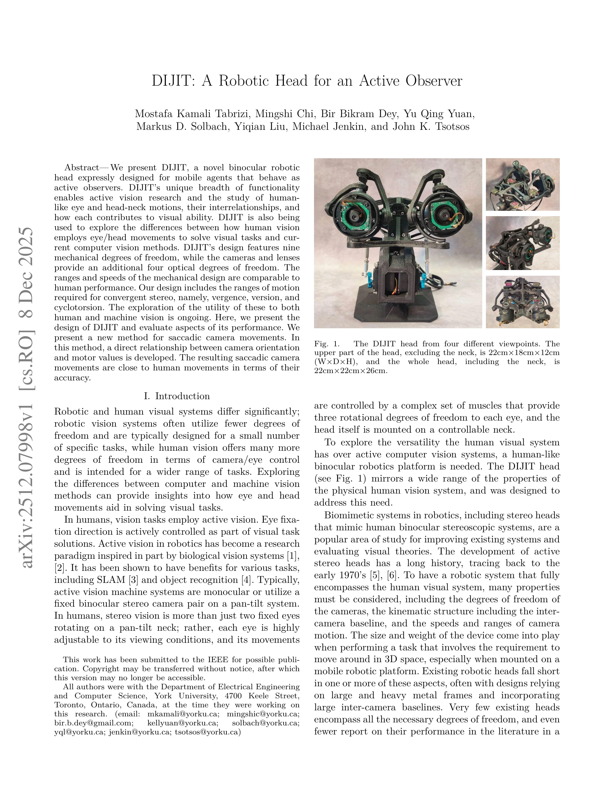

# DIJIT: A Robotic Head for an Active Observer

> **저자**: Mostafa Kamali Tabrizi, Mingshi Chi, Bir Bikram Dey, Yu Qing Yuan, Markus D. Solbach, Yiqian Liu, Michael Jenkin, John K. Tsotsos | **날짜**: 2025-12-08 | **URL**: [https://arxiv.org/abs/2512.07998](https://arxiv.org/abs/2512.07998)

---

## Essence

*Fig. 1.*

DIJIT은 인간의 시각 시스템을 모방한 이족 카메라 로봇 헤드로, 9개의 기계적 자유도와 4개의 광학적 자유도를 갖추어 능동 시각 연구와 인간-기계 시각 차이 분석을 가능하게 한다.

## Motivation

- **Known**: 기존 로봇 헤드 시스템들은 고정 스테레오 기하학이나 제한된 자유도를 사용하며, 대부분 인간 시각계의 다양한 특성(baseline, 운동 범위, 자유도)을 완전히 구현하지 못했다.
- **Gap**: 기존 로봇 헤드 중 인간 수준의 baseline(45-80mm)과 각 카메라당 3개의 자유도 및 목 관절에 3개의 자유도를 모두 갖춘 시스템은 광학적 자유도나 성능 평가가 부족했다.
- **Why**: 능동 시각(active vision)은 인간과 로봇 시각의 근본적 차이를 이해하고, 안구-머리 움직임이 시각 작업 해결에 기여하는 방식을 연구하는 데 필수적이며, 이는 SLAM과 객체 인식 등 로봇 비전 응용을 개선할 수 있다.
- **Approach**: 인간 시각계의 기하학적 특성을 반영한 3자유도 카메라 쌍과 3자유도 목 관절로 DIJIT을 설계하고, 카메라 방향과 모터 값 사이의 직접적 관계식을 개발하여 홈그래피 기반의 새로운 saccade 제어 방법을 제시한다.

## Achievement

*Fig. 1.*

- **완전한 인간형 설계**: 인간과 비교 가능한 baseline(115mm vs 45-80mm), 운동 범위(92×80° vs 89×75°), 그리고 각 카메라당 3자유도 + 목 관절 3자유도를 갖춘 첫 번째 로봇 헤드
- **Saccade 성능**: 인간 saccade 속도의 85% 이상을 달성하고 인간 수준의 정확도를 보임
- **광학적 자유도**: 각 카메라당 4개의 광학적 자유도(렌즈)를 추가하여 수렴 스테레오(vergence, version, cyclotorsion)에 필요한 운동 범위 제공
- **Homography 기반 제어**: 광범위한 학습이나 94분의 칼리브레이션 없이 직접적인 카메라 방향-모터 값 매핑 관계식 개발

## How

- 기계 설계: 피리미터(pyrometer) 기반이 아닌 컴팩트한 기계 구조로 가볍고 모바일 플랫폼 장착 가능
- 자유도 구성: 각 카메라에 pan-tilt-roll 3자유도, 목에 pan(회전)-side-bending(측굴)-flexion/extension(굴곡신전) 3자유도
- Saccade 제어: 카메라 이미지 좌표에서 목표 방향을 계산하고 homography를 이용해 직접 모터 명령으로 변환
- 성능 평가: saccade 움직임의 속도, 정확도, 궤적을 인간 saccade와 정량적으로 비교
- 소프트웨어: ROS 인터페이스 제공, 3D 파트 모델과 코드를 MIT 라이선스로 공개

## Originality

- 인간 시각계의 완전한 기하학적/운동학적 특성을 반영한 첫 로봇 헤드(6+3 자유도, 인간 수준 baseline)
- homography 기반의 간단하면서도 효과적인 saccade 제어 방법으로, 복잡한 역운동학이나 신경망 학습 없이 정확한 제어 달성
- 광학적 자유도를 포함한 종합적 설계로 convergent stereo의 utility를 인간과 기계 시각에서 동시에 탐색 가능

## Limitation & Further Study

- 현재 primary saccade만 평가되었으며, corrective saccade나 다른 안구 운동(smooth pursuit, vergence 추적 등)에 대한 평가 부족
- 기계적 backlash와 센서 오차의 영향이 명시적으로 분석되지 않음
- 제어 방법의 robustness와 실제 시각 작업(SLAM, 객체 인식) 성능에 대한 검증이 부족
- saccade 후 수렴(convergence) 및 cyclotorsion의 실제 활용도와 성능에 대한 실험 결과 미제시
- 후속 연구: 능동 시각 알고리즘 적용 평가, 다른 안구 운동 제어 방법 개발, 모바일 플랫폼에서의 시각-운동 통합 연구

## Evaluation

- Novelty: 4/5
- Technical Soundness: 4/5
- Significance: 4/5
- Clarity: 4/5
- Overall: 4/5

**총평**: DIJIT은 인간 시각 시스템의 완전한 기하학적 특성을 구현한 첫 로봇 헤드이며, homography 기반의 간단한 saccade 제어 방법으로 인간 수준의 성능을 달성했다. 능동 시각 연구와 인간-기계 시각 비교를 위한 중요한 플랫폼으로, 설계와 제어 방법의 독창성, 성능 검증, 그리고 오픈소스 공개를 통해 높은 가치를 지닌다.

## Related Papers

- 🏛 기반 연구: [[papers/1380_Emergent_Active_Perception_and_Dexterity_of_Simulated_Humano/review]] — DIJIT의 능동 시각 시스템은 시뮬레이션된 휴머노이드가 egocentric vision을 활용한 복잡한 가정 작업을 수행하는 PDC 프레임워크의 기술적 기반입니다.
- 🔗 후속 연구: [[papers/1371_EgoMI_Learning_Active_Vision_and_Whole-Body_Manipulation_fro/review]] — DIJIT의 9개 기계적 자유도를 가진 능동 시각 헤드는 EgoMI의 머리 움직임 캡처와 시점 변화 문제 해결에 하드웨어적 솔루션을 제공합니다.
- 🏛 기반 연구: [[papers/1334_Development_of_an_Intuitive_GUI_for_Non-Expert_Teleoperation/review]] — 비전문가 텔레오퍼레이션에서 능동 관찰자를 위한 직관적 인터페이스가 기초가 된다
- 🧪 응용 사례: [[papers/1371_EgoMI_Learning_Active_Vision_and_Whole-Body_Manipulation_fro/review]] — EgoMI의 급격한 시점 변화 문제 해결 방법은 DIJIT의 능동 관찰자 로봇 헤드 제어에 직접 응용하여 더 안정적인 시각 추적을 구현할 수 있습니다.
- 🧪 응용 사례: [[papers/1380_Emergent_Active_Perception_and_Dexterity_of_Simulated_Humano/review]] — PDC의 시각 기반 능동 지각 알고리즘은 DIJIT 로봇 헤드의 9개 기계적 자유도를 활용한 실제 능동 시각 시스템 구현에 직접 적용할 수 있습니다.
- 🔄 다른 접근: [[papers/1543_Learning_to_Look_Around_Enhancing_Teleoperation_and_Learning/review]] — 인간 머리 움직임을 모방한 5자유도 넥 시스템과 능동적 관찰을 위한 로봇 헤드 DIJIT이 동일한 시각 향상 문제를 다룬다.
