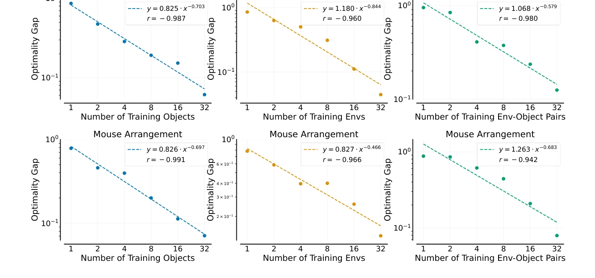
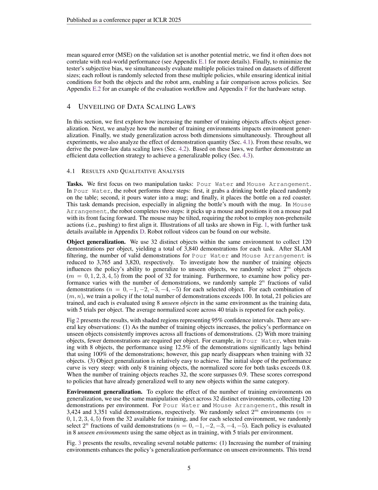

# Data Scaling Laws in Imitation Learning for Robotic Manipulation

> **저자**: Yingdong Hu, Fanqi Lin, Pingyue Sheng, Chuan Wen, Jiacheng You, Yang Gao | **날짜**: 2024-10-24 | **URL**: [https://arxiv.org/abs/2410.18647](https://arxiv.org/abs/2410.18647)

---

## Essence

*Figure 5: Power-law relationship. Dashed lines represent power-law fits, with the equations pro-*

로봇 조작 학습에서 데이터 스케일링 법칙을 실증적으로 규명하고, 환경과 객체 다양성이 절대적 데이터 양보다 중요함을 보여주었으며 이를 기반으로 효율적인 데이터 수집 전략을 제시한다.

## Motivation

- **Known**: NLP와 computer vision에서 데이터 스케일링이 성능 향상을 가져오는 power-law 관계가 존재함이 알려져 있다. 로봇 조작 분야에서도 대규모 데이터셋(예: Open X-Embodiment) 수집 추세가 있으나 체계적인 스케일링 법칙은 미흡하다.
- **Gap**: 기존 로봇 조작 연구는 환경 수, 객체 수, 시연 수 사이의 관계를 종합적으로 분석하지 않았고, 일반화 성능과 각 데이터 차원 간의 정량적 관계가 규명되지 않았다.
- **Why**: 데이터 스케일링 법칙을 이해하면 로봇 정책의 일반화 능력을 체계적으로 개선할 수 있으며, 제한된 자원 내에서 데이터 수집 전략을 최적화할 수 있어 로봇 조작 분야의 실용적 배포 가능성을 높일 수 있다.
- **Approach**: UMI hand-held gripper와 Diffusion Policy를 사용하여 40,000개 이상의 시연을 수집하고, 환경 수, 객체 수, 시연 수를 변수로 조작하여 15,000회 이상의 실제 로봇 롤아웃으로 일반화 성능을 측정하는 포괄적 실증 연구를 수행한다.

## Achievement

*Fig. 3 presents the results, revealing several notable patterns: (1) Increasing the number of training*

- **Power-law 스케일링 법칙**: 정책의 새로운 객체/환경에 대한 일반화 성능이 훈련 객체/환경 수에 대해 대략 power-law 관계를 따른다는 것을 정량적으로 입증
- **다양성 우선 원칙**: 환경과 객체의 다양성이 단순한 시연 수 증가보다 훨씬 효과적이며, 임계값 이상의 시연은 추가 성능 향상을 가져오지 않음을 발견
- **효율적 데이터 수집 전략**: 4명의 수집자가 하루 오후 동안 수집한 데이터로 새로운 환경과 미보유 객체에서 약 90% 성공률 달성
- **일반화 용이성**: 32개 환경 × 1개 객체 × 50개 시연의 조합이 새로운 환경-객체 조합에 대해 우수한 일반화 성능 제공

## How

*Fig 2 presents the results, with shaded regions representing 95% confidence intervals. There are sev-*

- UMI hand-held gripper를 사용하여 다양한 환경과 객체에서 human demonstration 수집
- Diffusion Policy로 behavior cloning 기반 정책 학습
- 환경 일반화(새로운 환경), 객체 일반화(새로운 객체), 결합 일반화(새로운 환경-객체 쌍) 세 가지 차원에서 평가
- 훈련 환경/객체/시연 수를 체계적으로 변화시켜 일반화 성능 곡선 측정
- 95% confidence interval을 포함하는 엄격한 평가 프로토콜 적용
- Pour Water와 Mouse Arrangement에서 스케일링 법칙 도출 후, Fold Towels와 Unplug Charger에서 검증

## Originality

- 로봇 조작 분야에서 처음으로 NLP/CV 스타일의 체계적 데이터 스케일링 법칙을 실증적으로 규명
- 환경, 객체, 시연 수 세 가지 독립 변수의 영향을 동시에 분석한 포괄적 연구 설계
- 40,000개 이상의 실제 로봇 시연과 15,000회 이상의 실제 롤아웃을 통한 대규모 실증 검증
- 다양성의 우월성이라는 직관적이지만 정량적으로 입증된 새로운 인사이트 도출
- 데이터 스케일링 법칙을 기반으로 한 실용적인 데이터 수집 전략 제시

## Limitation & Further Study

- 단일 task 정책에만 초점을 맞추었으며, 멀티태스크 일반화는 고려하지 않음 - task-level 일반화를 위해서는 수천 개 task에서의 대규모 데이터 필요
- 특정 gripper(UMI)와 정책 모델(Diffusion Policy)에만 제한되어 다른 embodiment과 알고리즘에서의 스케일링 법칙 보편성 미확인
- 모델 크기 스케일링은 preliminary exploration 수준이며 충분히 심화된 분석 부재
- 특정 카테고리 내 객체 다양성에만 제한되어, 극단적으로 다른 객체 간 일반화 가능성 불명확
- 후속 연구로 다른 robot embodiment과 학습 알고리즘에서의 스케일링 법칙 보편성 검증 필요
- 더 큰 규모의 모델 아키텍처에 대한 스케일링 법칙 체계적 분석 필요

## Evaluation

- Novelty: 4/5
- Technical Soundness: 3/5
- Significance: 4/5
- Clarity: 4/5
- Overall: 4/5

**총평**: 로봇 조작 분야에서 처음으로 체계적인 데이터 스케일링 법칙을 40,000개 이상의 실제 시연과 엄격한 평가 프로토콜을 통해 규명한 중요한 실증 연구로, 환경-객체 다양성의 우월성이라는 실용적 인사이트는 로봇 데이터 수집 전략의 혁신을 가져올 수 있는 고임팩트 논문이다.

## Related Papers

- 🏛 기반 연구: [[papers/1349_DataMIL_Selecting_Data_for_Robot_Imitation_Learning_with_Dat/review]] — 로봇 학습에서 데이터 스케일링 법칙이 datamodels 기반 데이터 선택 전략의 이론적 근거 제공
- 🔗 후속 연구: [[papers/1372_DROID_A_Large-Scale_In-The-Wild_Robot_Manipulation_Dataset/review]] — DROID와 같은 대규모 데이터셋에서 환경과 객체 다양성 중심의 효율적 데이터 활용 전략
- 🏛 기반 연구: [[papers/1339_Dexterity_from_Smart_Lenses_Multi-Fingered_Robot_Manipulatio/review]] — 스마트 글래스 영상만으로 정책 학습하는 데 필요한 데이터 효율성과 다양성의 스케일링 법칙
- 🏛 기반 연구: [[papers/1493_Neural_Scaling_Laws_in_Robotics/review]] — 로봇공학에서 데이터 스케일링 법칙이 imitation learning의 데이터 크기 영향 분석의 이론적 기반을 제공한다.
- 🏛 기반 연구: [[papers/1578_SPRINT_Scalable_Policy_Pre-Training_via_Language_Instruction/review]] — 로봇 모방 학습에서 데이터 스케일링 법칙 연구가 SPRINT의 대규모 정책 사전학습에서 데이터 효율성의 이론적 기반을 제공한다.
- 🏛 기반 연구: [[papers/1591_Towards_Diverse_Behaviors_A_Benchmark_for_Imitation_Learning/review]] — data scaling laws 연구의 원리를 인간 행동의 다양성을 정량화하고 평가하는 벤치마크로 적용한다.
- 🏛 기반 연구: [[papers/1323_BridgeData_V2_A_Dataset_for_Robot_Learning_at_Scale/review]] — imitation learning의 데이터 scaling law가 BridgeData V2 같은 대규모 데이터셋 설계에 이론적 기초를 제공한다
- 🔄 다른 접근: [[papers/1349_DataMIL_Selecting_Data_for_Robot_Imitation_Learning_with_Dat/review]] — 대규모 데이터에서 작업별 최적 서브셋 선택과 데이터 다양성 확보라는 상호보완적 접근법
- 🧪 응용 사례: [[papers/1372_DROID_A_Large-Scale_In-The-Wild_Robot_Manipulation_Dataset/review]] — DROID 대규모 데이터셋을 활용하여 로봇 조작 학습의 데이터 스케일링 법칙 실증 검증
