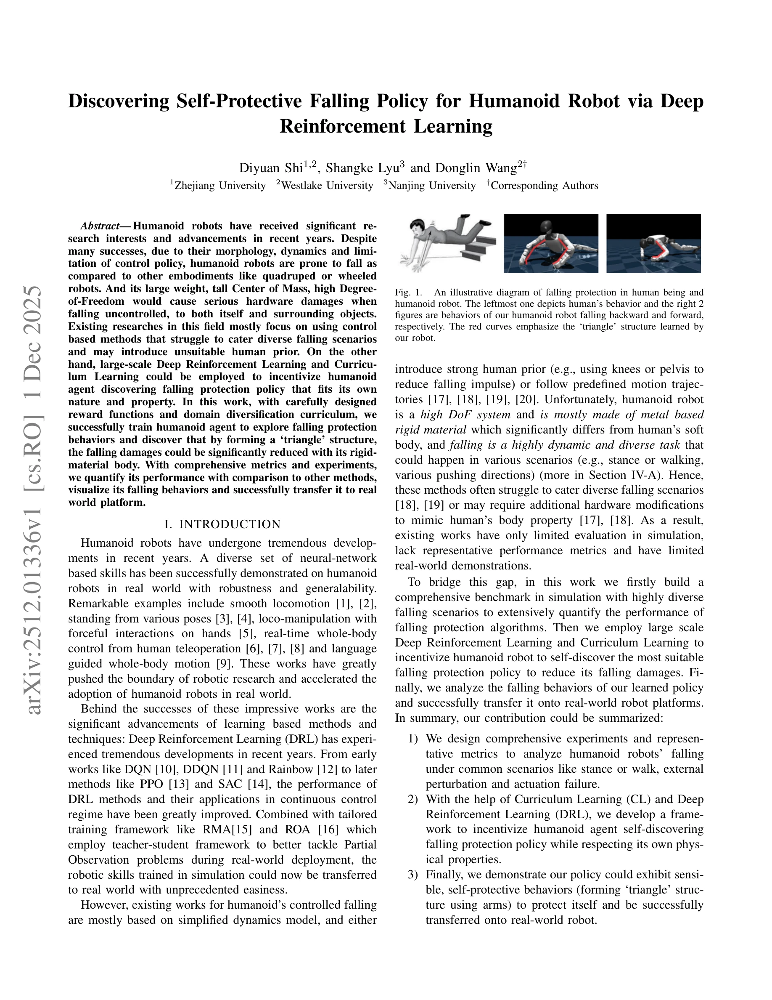

# Discovering Self-Protective Falling Policy for Humanoid Robot via Deep Reinforcement Learning

> **저자**: Diyuan Shi, Shangke Lyu, Donglin Wang | **날짜**: 2025-12-01 | **DOI**: [10.48550/arXiv.2512.01336](https://doi.org/10.48550/arXiv.2512.01336)

---

## Essence

*Fig. 1.*

Deep Reinforcement Learning과 Curriculum Learning을 활용하여 휴머노이드 로봇이 스스로 낙상 보호 정책을 학습하도록 유도하고, 삼각형 구조를 형성하여 낙상 충격을 최소화하는 방법을 제시한다.

## Motivation

- **Known**: 휴머노이드 로봇은 낙상 시 심각한 하드웨어 손상을 입을 수 있으며, 기존 연구들은 주로 제어 기반 방법이나 미리 정의된 궤적을 사용한다. Deep Reinforcement Learning은 연속 제어 작업에서 PPO, SAC 등의 알고리즘으로 우수한 성능을 보여주었다.
- **Gap**: 기존 낙상 보호 연구는 간단한 동역학 모델, 인간 선험 정보(예: 무릎 사용), 또는 사전 정의 궤적에 의존하여 다양한 낙상 시나리오에 대응하기 어렵고, 실제 로봇에 대한 평가와 검증이 부족하다.
- **Why**: 휴머노이드 로봇은 높은 자유도, 무거운 무게, 높은 무게중심을 가지고 있어 통제되지 않은 낙상으로 인한 자신과 주변 물체의 손상이 심각하므로, 로봇 자체의 물리적 특성에 맞는 효과적인 낙상 보호 정책 개발이 중요하다.
- **Approach**: PPO와 LCP를 사용한 DRL과 domain randomization 기반 Curriculum Learning을 통해 다양한 낙상 시나리오(자세 유지, 보행 중, 외부 섭동, 구동 실패)에서 대규모 병렬 시뮬레이션 훈련을 수행하고, 신중하게 설계된 보상 함수로 자체 보호 행동을 유도한다.

## Achievement

*Fig. 1.*

- **포괄적 벤치마크 구축**: 자세 유지, 보행, 외부 섭동, 구동 실패 등 다양한 낙상 시나리오에서 낙상 보호 알고리즘의 성능을 정량적으로 평가할 수 있는 대표적인 지표와 실험 설계를 개발했다.
- **자율 학습 정책 개발**: DRL과 Curriculum Learning을 활용하여 휴머노이드 로봇이 자신의 물리적 특성(금속 강체 몸)을 존중하면서 효과적인 낙상 보호 정책을 스스로 발견하도록 유도했다.
- **삼각형 구조 발견**: 학습된 정책이 팔의 삼각형 구조 형성으로 금속 강체 신체의 낙상 손상을 크게 감소시키는 행동을 학습했다.
- **현실 이전 성공**: 학습된 정책이 Unitree G1 실제 로봇 플랫폼에 성공적으로 이전되었으며, 합리적이고 자기보호적 행동을 시연했다.

## How

*Fig. 2.*

- Nvidia Isaacgym에서 수천 개의 병렬 환경 인스턴스를 사용한 대규모 RL 훈련 수행
- Domain randomization을 통한 Curriculum Learning 기반 환경 다양화
- 신중하게 설계된 보상 함수로 낙상 충격 최소화 유도
- ROA(Regularized Online Adaptation) 프레임워크 활용하여 훈련 중 privileged information 제공 및 배포 시 관찰 데이터로 추론
- PPO와 LCP 알고리즘을 사용한 정책 학습
- Whole-body control으로 29 DoF 로봇의 모든 관절 제어
- PD 제어기 기반 저수준 제어 계층 구성(50Hz 상위 정책, 200Hz PD 제어기)
- 다양한 낙상 시나리오(자세, 방향, 외부 섭동)에서 정책 평가

## Originality

- 기존의 인간 선험 정보 기반 방법과 달리, 로봇 자체의 물리적 특성(금속 강체)에 적합한 자율 학습 방식을 제시
- 높은 자유도의 복잡한 동역학을 대규모 병렬 DRL로 처리하는 새로운 접근
- 다양한 낙상 시나리오를 포괄하는 포괄적 벤치마크와 정량적 지표 개발
- 학습된 정책에서 삼각형 구조라는 새로운 낙상 보호 패턴 발견
- DRL 기반 낙상 정책의 실제 로봇 플랫폼 이전 성공 시연

## Limitation & Further Study

- 실제 로봇에서의 평가가 제한적이며, 더 다양한 로봇 플랫폼(다른 체형, 질량, DoF의 휴머노이드)에 대한 검증 필요
- 보상 함수 설계가 경험적이며, 최적의 보상 가중치 선택에 대한 체계적 분석 부재
- 시뮬레이션과 현실 간의 dynamics gap(특히 접촉 모델, 마찰, 재료 특성)에 대한 상세한 분석 필요
- 낙상 전 상황 인지(예: 실제 낙상 발생 예측)와의 통합에 대한 논의 부족
- 계산 비용(수천 병렬 환경 인스턴스)에 대한 논의 및 더 효율적인 학습 방법 탐색 필요
- 장기적 내구성 및 반복된 낙상 후 정책 성능 유지에 대한 평가 필요

## Evaluation

- Novelty: 4/5
- Technical Soundness: 3/5
- Significance: 4/5
- Clarity: 4/5
- Overall: 4/5

**총평**: 이 논문은 휴머노이드 로봇의 낙상 보호 문제에 대해 DRL과 Curriculum Learning을 창의적으로 적용하여 로봇의 자율 학습을 통한 효과적인 낙상 정책을 달성했으며, 실제 로봇 플랫폼으로의 성공적 이전을 통해 높은 실무적 가치를 보여주는 우수한 연구이다.

## Related Papers

- 🏛 기반 연구: [[papers/1284_Benchmarking_Potential_Based_Rewards_for_Learning_Humanoid_L/review]] — 낙상 보호 학습에 PBRS의 견고한 보상 설계 원리를 활용한다
- 🔗 후속 연구: [[papers/1523_Learning_Getting-Up_Policies_for_Real-World_Humanoid_Robots/review]] — 자기보호 낙상 정책을 일반적인 기립 정책으로 확장한다
- 🔄 다른 접근: [[papers/1541_Learning_to_Get_Up_Across_Morphologies_Zero-Shot_Recovery_wi/review]] — 낙상 보호에서 삼각형 구조 대신 형태학적 다양성 기반 접근 방식을 제시한다
- 🧪 응용 사례: [[papers/1284_Benchmarking_Potential_Based_Rewards_for_Learning_Humanoid_L/review]] — 낙상 보호 학습에서 PBRS의 견고한 보상 설계 원리를 적용한다
- 🏛 기반 연구: [[papers/1447_HiFAR_Multi-Stage_Curriculum_Learning_for_High-Dynamics_Huma/review]] — Multi-stage curriculum learning은 self-protective falling policy 발견의 체계적인 학습 방법론을 제공한다.
- 🔄 다른 접근: [[papers/1523_Learning_Getting-Up_Policies_for_Real-World_Humanoid_Robots/review]] — 낙상 상황에 대한 대응이라는 공통 주제를 다루지만, 일어서기 vs 자기보호적 낙상이라는 정반대의 접근 방식을 제시함
