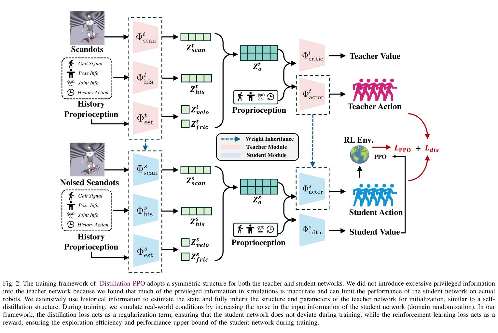
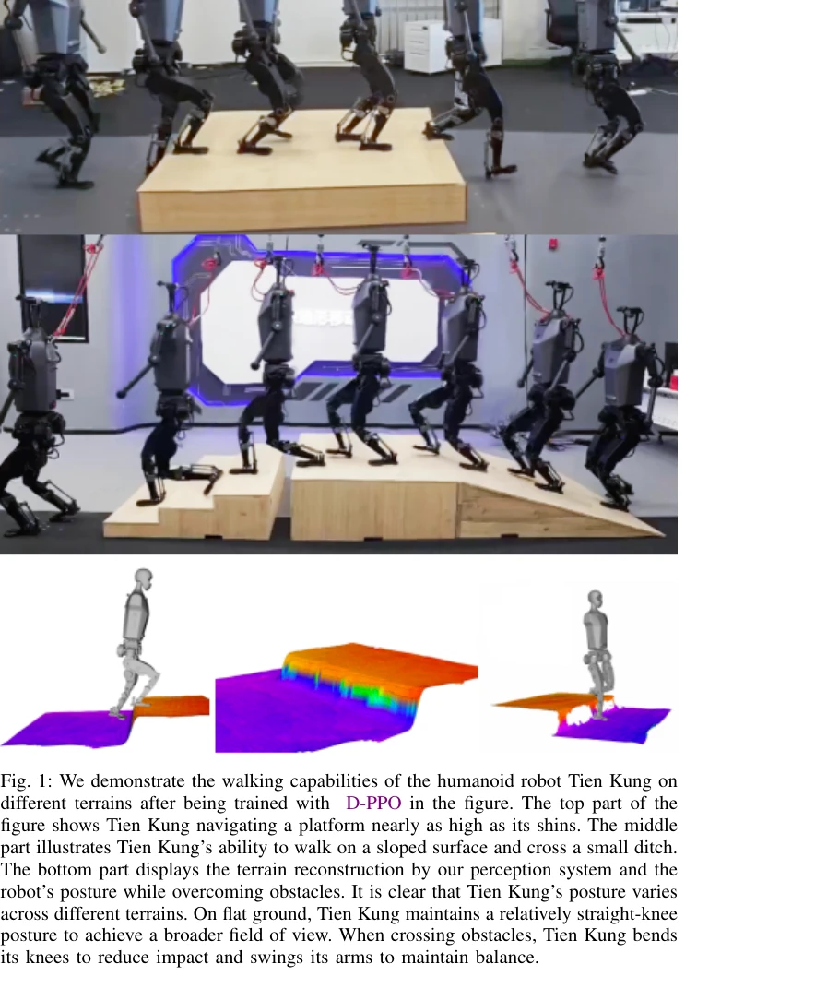

# Distillation-PPO: A Novel Two-Stage Reinforcement Learning Framework for Humanoid Robot Perceptive Locomotion

> **저자**: Qiang Zhang, Gang Han, Jingkai Sun, Wen Zhao, Chenghao Sun, Jiahang Cao, Jiaxu Wang, Yijie Guo, Renjing Xu | **날짜**: 2025-03-11 | **URL**: [https://arxiv.org/abs/2503.08299](https://arxiv.org/abs/2503.08299)

---

## Essence

*Fig. 2: The training framework of Distillation-PPO adopts a symmetric structure for both the teacher and student network*

본 논문은 휴머노이드 로봇의 지각 기반 보행 제어를 위해 teacher policy의 supervision signal과 reinforcement learning을 결합한 Distillation-PPO (D-PPO) 두 단계 학습 프레임워크를 제안한다.

## Motivation

- **Known**: Two-stage methods는 teacher policy의 감독으로 학습 효율을 높이지만 student policy의 잠재력을 제한하고, end-to-end methods는 자유로운 학습이 가능하지만 POMDP에서 불안정성을 보인다.
- **Gap**: 기존 two-stage 방법과 end-to-end 방법 사이의 절충점이 부족하며, teacher policy의 오류 전파와 시뮬레이션-현실 간극 문제가 해결되지 않았다.
- **Why**: 휴머노이드 로봇이 복잡한 환경과 불규칙한 지형에서 견고하고 적응 가능한 보행 제어를 달성하는 것은 로봇 자율성 및 실용성 측면에서 중요하다.
- **Approach**: 첫 번째 단계에서 fully observable MDP에서 teacher policy를 학습하고, 두 번째 단계에서 이를 regularization signal로 활용하면서 동시에 POMDP에서 reinforcement learning으로 student policy를 학습하여 두 접근법의 장점을 결합한다.

## Achievement

*Fig. 1: We demonstrate the walking capabilities of the humanoid robot Tien Kung on*

- **Distillation-PPO 프레임워크**: Teacher policy의 supervision과 RL 보상을 결합한 새로운 두 단계 학습 방법론 제시
- **시뮬레이션 성능**: 제안된 방법이 기존 two-stage 및 end-to-end 방법 대비 더 높은 학습 효율과 안정성 달성
- **실제 로봇 검증**: 휴머노이드 로봇 Tien Kung이 다양한 지형(플랫폼, 경사지, 장애물)에서 견고하고 일반화된 보행 능력 입증

## How

*Fig. 2: The training framework of Distillation-PPO adopts a symmetric structure for both the teacher and student network*

- Teacher network를 fully observable MDP에서 privileged information(gait signal, pose info, joint info 등)으로 학습
- Student network를 symmetric structure로 초기화하고 historical information을 활용하여 state 추정
- Teacher의 action/value에 대한 distillation loss (L_dis)와 PPO loss (L_PPO)를 결합하여 objective function 구성
- 시뮬레이션에서 noised sensor와 observation을 추가하여 현실 조건 모사
- Weight inheritance를 통해 teacher의 학습된 parameter를 student 초기값으로 활용

## Originality

- 기존 distillation 기반 two-stage 방법과 달리, student policy가 teacher policy를 초과할 수 있도록 RL 자유도 보존
- Symmetric network architecture로 teacher와 student 간 구조적 일관성 유지하면서 self-distillation 효과 달성
- privileged information을 과도하게 사용하지 않아 sim-to-real gap 완화
- Historical information 기반 state estimation으로 partial observability 해결

## Limitation & Further Study

- Teacher policy의 품질에 여전히 의존하므로, teacher가 충분히 강력하지 않으면 성능 상한이 제한될 수 있음
- 실제 로봇 실험이 Tien Kung 단일 모델에 국한되어 다양한 휴머노이드 로봇에 대한 일반화 검증 부족
- Distillation loss weight와 RL reward weight의 균형에 대한 상세한 ablation study 및 민감도 분석 미흡
- 후속 연구에서 더 다양한 로봇 플랫폼, 극단적 지형 조건 검증 및 hyperparameter 자동화 방법 필요

## Evaluation

- Novelty: 4/5
- Technical Soundness: 3/5
- Significance: 4/5
- Clarity: 4/5
- Overall: 4/5

**총평**: 본 논문은 two-stage와 end-to-end 방법의 장점을 효과적으로 결합하여 휴머노이드 로봇 보행 제어의 실질적인 문제를 해결하는 실용적 솔루션을 제시하며, 광범위한 실제 로봇 실험으로 검증하여 높은 신뢰도를 제공한다.

## Related Papers

- 🏛 기반 연구: [[papers/1433_H-Zero_Cross-Humanoid_Locomotion_Pretraining_Enables_Few-sho/review]] — Distillation-PPO의 teacher-student 학습 프레임워크는 H-Zero의 cross-embodiment pretraining에서 서로 다른 휴머노이드 간 지식 전이를 위한 핵심 방법론입니다.
- 🔄 다른 접근: [[papers/1377_Embrace_Collisions_Humanoid_Shadowing_for_Deployable_Contact/review]] — D-PPO의 지각 기반 보행 제어와 contact-agnostic 극단적 동작 학습은 휴머노이드의 동적 능력 향상을 위한 서로 다른 접근 방식입니다.
- ⚖️ 반론/비판: [[papers/1377_Embrace_Collisions_Humanoid_Shadowing_for_Deployable_Contact/review]] — 극단적 contact-rich 동작과 D-PPO의 안정적인 지각 기반 보행 제어는 휴머노이드 동적 능력의 안전성과 민첩성 사이의 상충 관계를 보여줍니다.
- 🔗 후속 연구: [[papers/1433_H-Zero_Cross-Humanoid_Locomotion_Pretraining_Enables_Few-sho/review]] — H-Zero의 cross-embodiment locomotion pretraining은 D-PPO의 teacher-student 학습 구조를 여러 휴머노이드 플랫폼으로 확장하여 범용성을 크게 향상시킵니다.
- 🏛 기반 연구: [[papers/1532_Learning_Motion_Skills_with_Adaptive_Assistive_Curriculum_Fo/review]] — A2CF의 강화학습 기반 보조 힘 제공 방식이 Distillation-PPO의 이단계 강화학습 프레임워크를 기반으로 한다.
