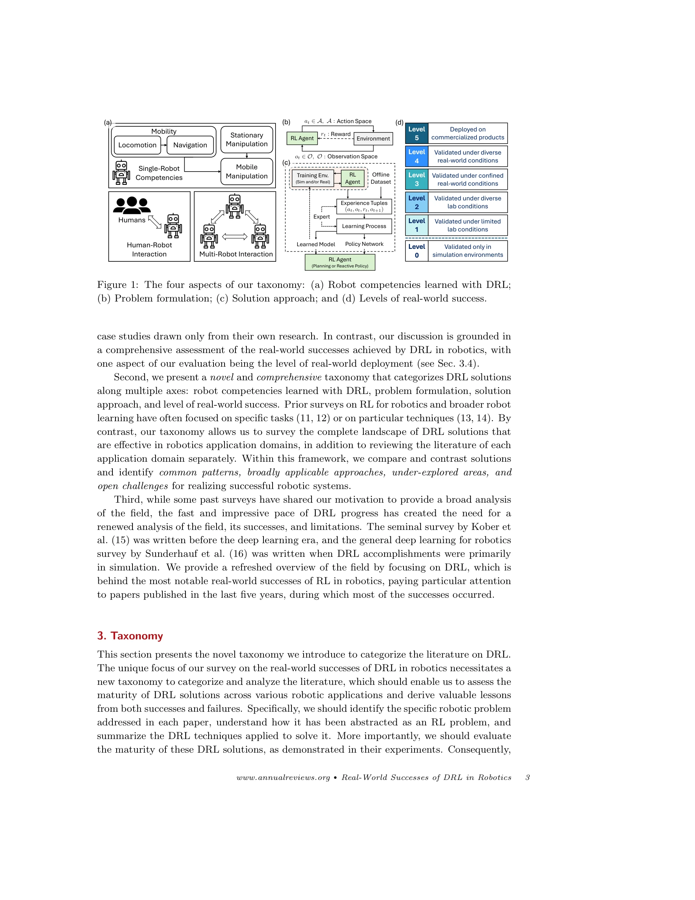

# Deep Reinforcement Learning for Robotics: A Survey of Real-World Successes

> **저자**: Chen Tang, Ben Abbatematteo, Jiaheng Hu, Rohan Chandra, Roberto Martín-Martín, Peter Stone | **날짜**: 2024-08-07 | **URL**: [https://arxiv.org/abs/2408.03539](https://arxiv.org/abs/2408.03539)

---

## Essence

*Figure 1: The four aspects of our taxonomy: (a) Robot competencies learned with DRL;*

본 논문은 로봇 공학에서의 실제 성공 사례들을 중심으로 Deep Reinforcement Learning(DRL)의 현황을 종합적으로 조사하며, 로봇 역량, 문제 공식화, 해결 방법, 실세계 성공 수준의 네 가지 축으로 이루어진 새로운 분류 체계를 제시한다.

## Motivation

- **Known**: RL과 deep neural networks를 결합한 DRL은 board games, video games, healthcare, recommendation systems 등 다양한 분야에서 우수한 성능을 보여주었으나, 대부분의 성과는 시뮬레이션 환경에서만 달성되었고 실제 로봇 시스템에 적용 시에는 샘플 효율성, 안정성, 시뮬레이션과 현실의 괴리 등 근본적인 어려움이 존재한다.
- **Gap**: 기존 RL 관련 로봇 공학 설문은 실세계 성공에 초점을 맞추지 않았으며, DRL이 다양한 로봇 응용 분야에서 어떤 수준의 성숙도를 달성했는지 체계적으로 평가하고 도메인 간 공통 기법과 미개척 영역을 식별하는 종합적인 분석이 부족했다.
- **Why**: 로봇 공학에서 DRL의 실제 배포 사례가 증가하고 있으며, 실세계 환경의 복잡성 속에서 DRL의 적용 가능성과 한계를 명확히 파악하는 것이 향후 로봇 시스템 개발의 방향을 결정하는 데 중요하기 때문이다.
- **Approach**: 로봇 역량(locomotion, navigation, manipulation, mobile manipulation, multi-robot interaction, human-robot interaction)을 분류하고, 문제 공식화와 해결 방법론을 체계적으로 분석하며, 실세계 성공 수준(Level 0-5: 시뮬레이션만→상용화)을 평가하는 종합 분류 체계를 구축하여 현황을 평가한다.

## Achievement

*Figure 1: The four aspects of our taxonomy: (a) Robot competencies learned with DRL;*

- **DRL의 실세계 성공 사례 문서화**: 드론 챔피언 레이싱, 사족 로봇 보행 제어, 자율 주행 등 주요 응용 분야에서 DRL의 달성 수준을 구체적으로 제시
- **4축 분류 체계 제시**: 로봇 역량, 문제 공식화, 솔루션 접근법, 실세계 성공 수준으로 이루어진 새로운 분류법을 통해 DRL 문헌을 체계적으로 조직화
- **도메인 간 공통 기법 식별**: 서로 다른 로봇 응용 분야 간의 기법 교차 분석을 통해 일반적으로 적용 가능한 방법론과 미개척 영역 파악
- **현장 도전 과제 분석**: 샘플 효율성, 안정성, 시뮬-투-리얼 전이, 장기 수평 작업 통합 등 실세계 배포의 주요 장애물 명시

## How

*Figure 1: The four aspects of our taxonomy: (a) Robot competencies learned with DRL;*

- 로봇 역량을 단일 로봇 역량(mobility, manipulation)과 다중 로봇 상호작용으로 계층화하고, mobility를 locomotion과 navigation으로 세분화
- 문제 공식화 측면에서 RL agent-environment 상호작용, 학습 환경(시뮬레이션/실제), 데이터 소스(experience tuples, offline dataset, expert, learned model) 구분
- 솔루션 접근법으로 policy network와 planning-based 방법론 비교
- 실세계 성공 수준을 6단계(Level 0: 시뮬레이션 검증 ~ Level 5: 상용화 제품 배포)로 정의하여 성숙도 평가
- 각 로봇 역량 영역별로 주요 논문, 기법, 성공 사례, 개방형 문제를 체계적으로 검토

## Originality

- 기존 설문과 달리 **실세계 성공에 명시적으로 초점**을 맞추며, 실제 배포 수준을 6단계로 정량화하는 평가 체계 도입
- **다축 분류 체계(4축)**로 기존의 특정 작업이나 기법 중심 분류를 넘어 전체 경관을 통합적으로 분석
- **최근 5년 문헌 중심**(DRL의 주요 성과 시기)으로 현대적 관점에서 필드를 재평가하며, 도메인 간 교차 분석을 통해 공통 패턴과 미개척 영역 식별
- 로봇 공학자와 RL 전문가를 모두 대상으로 하는 이중 관점의 분석 제시

## Limitation & Further Study

- **샘플 효율성**: 실세계 로봇의 상호작용 비용이 높아 충분한 학습 데이터 수집의 어려움이 여전히 미해결 과제
- **시뮬레이션-현실 갭**: 완벽한 물리 시뮬레이션을 구현할 수 없어 sim-to-real transfer의 신뢰성이 제한적
- **장기 수평 작업**: 복잡한 개방형 환경의 장기 작업 완수를 위해 여러 역량을 통합하는 holistic 접근법이 미개발
- **평가 방법론 표준화 부족**: 로봇 시스템 간 공정한 비교를 위한 벤치마크 및 평가 절차의 표준화 필요
- **후속 연구**: 안정적이고 샘플 효율적인 실세계 RL 패러다임 개발, 다양한 로봇 역량을 발견하고 통합하는 원칙 기반 방법론, 엄격한 개발 및 평가 절차 수립이 필요

## Evaluation

- Novelty: 4/5
- Technical Soundness: 3/5
- Significance: 4/5
- Clarity: 4/5
- Overall: 4/5

**총평**: 본 논문은 DRL이 로봇 공학에서 달성한 실제 성공과 한계를 명확하고 체계적으로 분석하는 현대적 설문으로, 네 가지 축의 분류 체계는 필드의 현황을 이해하고 향후 연구 방향을 수립하는 데 유용한 프레임워크를 제공한다. 특히 실세계 배포 수준의 정량화는 기존 설문과의 차별성 있는 기여이며, RL 실무자와 로봇 공학자 모두에게 가치 있는 참고 자료가 될 수 있다.

## Related Papers

- 🏛 기반 연구: [[papers/1397_Foundation_Model_Driven_Robotics_A_Comprehensive_Review/review]] — DRL 실세계 성공사례 분석이 foundation model 기반 로봇공학의 강화학습 적용 방향성 제시
- 🔗 후속 연구: [[papers/1388_Exploring_Embodied_Multimodal_Large_Models_Development_Datas/review]] — DRL 분류체계가 embodied multimodal 모델의 강화학습 통합 연구로 발전
- 🏛 기반 연구: [[papers/1260_AGILE_A_Comprehensive_Workflow_for_Humanoid_Loco-Manipulatio/review]] — 실세계 강화학습 연구의 포괄적 조사가 AGILE 워크플로우 설계의 이론적 기초를 제공한다
- 🔗 후속 연구: [[papers/1328_Deep_Reinforcement_Learning_for_Bipedal_Locomotion_A_Brief_S/review]] — 실세계 DRL 연구를 bipedal locomotion이라는 구체적 도메인으로 특화하여 발전시킨다
- 🔗 후속 연구: [[papers/1397_Foundation_Model_Driven_Robotics_A_Comprehensive_Review/review]] — DRL 실세계 성공사례를 foundation model 통합 관점에서 종합적으로 확장 분석
- 🏛 기반 연구: [[papers/1398_Foundation_Models_in_Robotics_Applications_Challenges_and_th/review]] — feature-based와 GAN-based 학습 방법론 비교가 DRL 문제 공식화의 이론적 기초 제공
- 🏛 기반 연구: [[papers/1582_Natural_Humanoid_Robot_Locomotion_with_Generative_Motion_Pri/review]] — 표현적 휴머노이드 보행의 기반이 되는 자율적 다양한 locomotion 생성 방법론을 제공한다.
- 🏛 기반 연구: [[papers/1589_Olaf_Bringing_an_Animated_Character_to_Life_in_the_Physical/review]] — 표현적 휴머노이드 보행을 위한 자율적 디자인 접근법이 애니메이션 캐릭터 구현을 위한 움직임 생성의 이론적 기초를 제공합니다.
