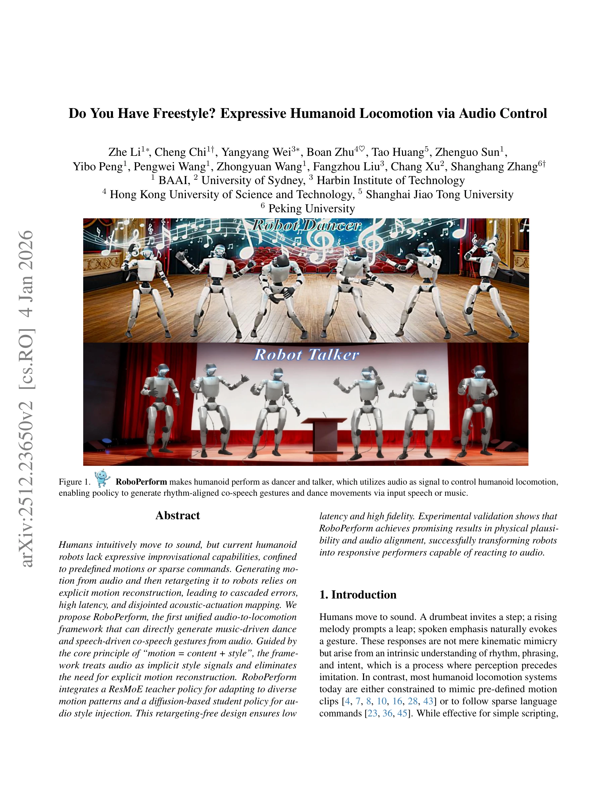
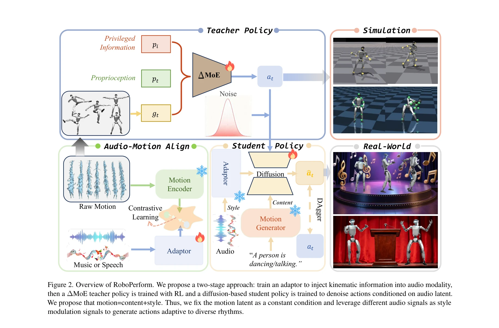

# Do You Have Freestyle? Expressive Humanoid Locomotion via Audio Control

> **저자**: Zhe Li, Cheng Chi, Yangyang Wei, Boan Zhu, Tao Huang, Zhenguo Sun, Yibo Peng, Pengwei Wang, Zhongyuan Wang, Fangzhou Liu, Chang Xu, Shanghang Zhang | **날짜**: 2025-12-29 | **URL**: [https://arxiv.org/abs/2512.23650](https://arxiv.org/abs/2512.23650)

---

## Essence

*Figure 1.*

RoboPerform은 오디오를 직접 제어 신호로 활용하여 휴머노이드 로봇이 음악에 맞춰 춤을 추거나 음성에 반응하여 제스처를 취하도록 하는 통합 audio-to-locomotion 프레임워크이다.

## Motivation

- **Known**: 기존 휴머노이드 제어 방식은 사전정의된 모션 클립 반복이나 희소 언어 명령에 국한되어 있으며, 오디오 기반 모션 생성은 명시적 모션 재구성 후 로봇으로 retargeting하는 단계적 파이프라인을 따른다.
- **Gap**: 기존 cascaded 파이프라인은 에러 축적, 높은 레이턴시, 음향-액추에이션 간 느슨한 결합 등의 문제가 있으며, 오디오를 암묵적 스타일 신호로 직접 활용하는 통합 프레임워크가 부재하다.
- **Why**: 휴머노이드가 음악과 음성에 대해 표현력 있는 즉흥적 반응을 보일 수 있다면 더욱 자연스러운 상호작용과 성능이 가능하며, 이는 로봇의 응용 분야를 크게 확장한다.
- **Approach**: motion = content + style 원칙에 따라 텍스트 명령으로부터 content latent를, 오디오로부터 style latent를 추출하며, ∆MoE 교사 정책과 diffusion 학생 정책을 통해 두 신호를 통합하는 teacher-student 프레임워크를 제안한다.

## Achievement

*Figure 1.*

- **첫 통합 프레임워크**: audio를 implicit 제어 모달리티로 활용한 첫 휴머노이드 locomotion 프레임워크로, retargeting 없이 음악 및 음성 입력 직접 처리
- **∆MoE 교사 정책**: residual mixture-of-experts 구조로 다양한 모션 패턴에 적응하고, diffusion 학생 정책이 content와 style을 분해하여 오디오 기반 style injection 수행
- **성능 개선**: 기존 retargeting 기반 파이프라인 대비 시간적 정렬, 물리적 타당성, 추론 효율성에서 유의미한 향상 달성
- **실제 적용**: freestyle 댄스 및 co-speech gesture 제스처를 통해 로봇이 음성/음악에 반응하는 responsive performer로 기능함을 검증

## How

*Figure 2. Overview of RoboPerform. We propose a two-stage approach: train an adaptor to inject kinematic information int*

- InfoNCE 손실 함수를 통해 오디오 latent와 모션 latent를 alignment하는 adaptor with temporal attention 사용
- ∆MoE 교사 정책에서 3D conditional input을 4개의 nested subspace로 분할하고 gating network가 residual fusion으로 전문가 출력 가중합산
- Diffusion 기반 학생 정책이 content latent (텍스트 기반)와 temporally-aligned style latent (오디오 기반)를 동시에 조건으로 받아 denoising
- Text-to-motion 모델로부터 content latent 인코딩, audio encoder로 style latent 추출 후 통합하여 로봇 액션 생성

## Originality

- 오디오를 암묵적 스타일 신호로 처리하며 explicit motion reconstruction을 제거한 첫 시도
- Motion latent space에서 content-style 분해라는 새로운 관점의 정식화
- Residual mixture-of-experts 아키텍처 (∆MoE)의 도입으로 다양한 모션 영역 전문화
- Retargeting-free 설계로 cascaded error 및 레이턴시 문제를 근본적으로 해결

## Limitation & Further Study

- **데이터 제약**: 오디오-모션 정렬 학습을 위한 대규모 멀티모달 데이터셋의 가용성 제한 가능
- **실시간 성능**: 제안된 추론 효율성 개선 정도와 실제 배포 환경에서의 레이턴시 측정값 구체화 필요
- **제스처 다양성**: Co-speech gesture의 fine-grained 제어 한계 및 복잡한 이중 작업(춤과 말 동시 수행)에 대한 검증 부족
- **후속 연구**: 더 복잡한 음향 특성(예: 멀티 악기, 방언) 처리, sim-to-real transfer 성능 검증, 장시간 연속 성능 유지 능력 평가

## Evaluation

- Novelty: 4/5
- Technical Soundness: 3/5
- Significance: 4/5
- Clarity: 4/5
- Overall: 4/5

**총평**: RoboPerform은 오디오를 암묵적 제어 신호로 활용하는 혁신적 접근으로 휴머노이드의 표현성을 획기적으로 향상시키며, retargeting-free 설계와 ∆MoE를 통해 기술적 우수성과 실용성을 동시에 달성한 우수한 연구이다.

## Related Papers

- 🔄 다른 접근: [[papers/1422_GENMO_A_GENeralist_Model_for_Human_MOtion/review]] — audio-to-motion generation을 다른 generalist 모델 접근법과 비교할 수 있다
- 🔗 후속 연구: [[papers/1281_Being-H0_Vision-Language-Action_Pretraining_from_Large-Scale/review]] — vision-language-action을 audio modality로 확장한 multimodal 접근이다
- 🏛 기반 연구: [[papers/1381_EMOTION_Expressive_Motion_Sequence_Generation_for_Humanoid_R/review]] — expressive motion generation의 기본 방법론을 제공하는 연구다
- 🔄 다른 접근: [[papers/1422_GENMO_A_GENeralist_Model_for_Human_MOtion/review]] — generalist human motion 모델을 다른 통합 프레임워크로 구현한다
