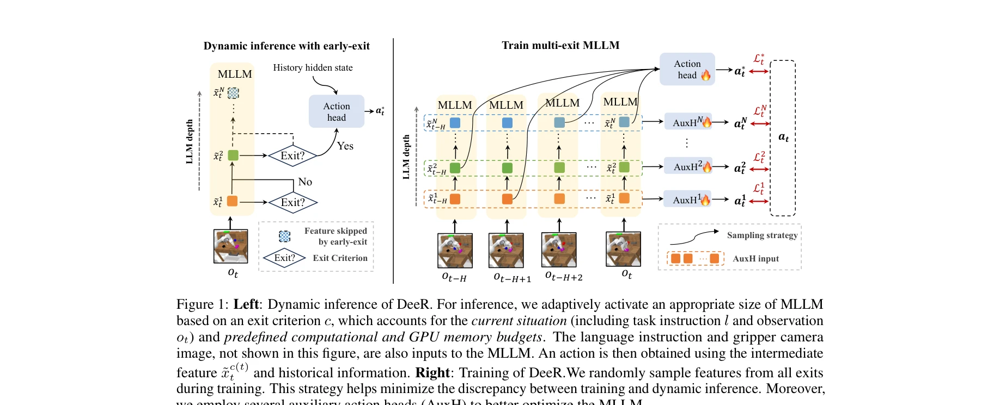
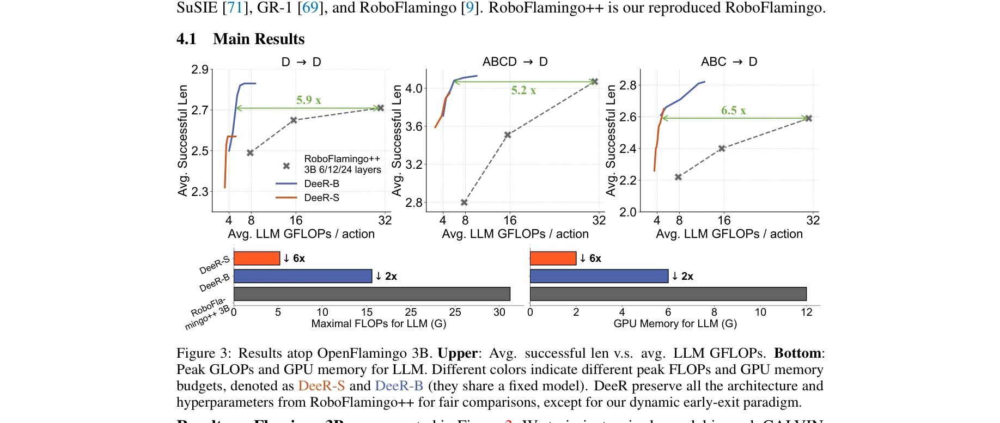
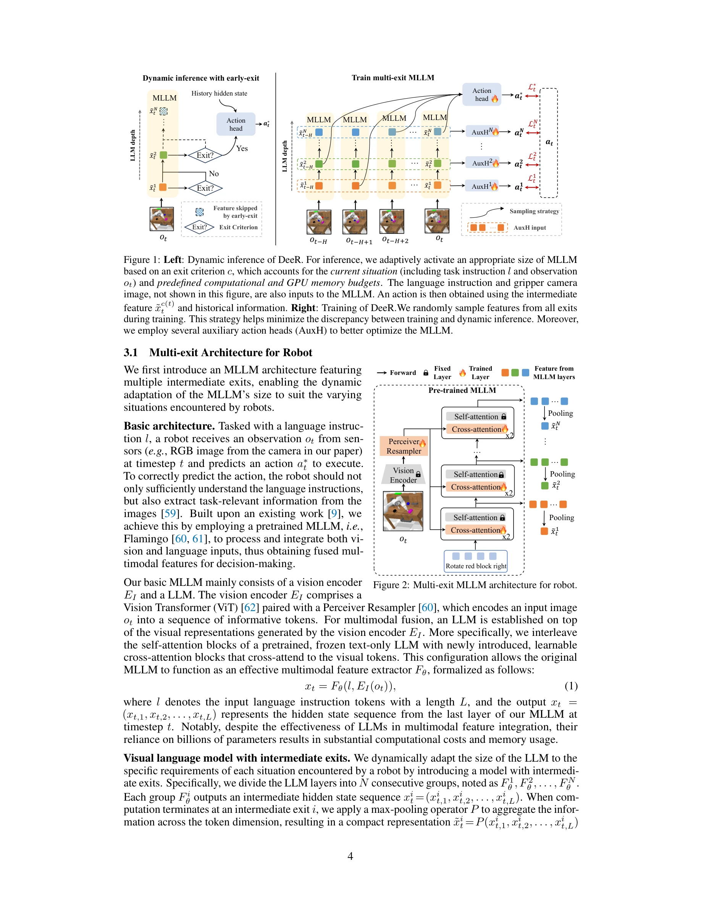

# DeeR-VLA: Dynamic Inference of Multimodal Large Language Models for Efficient Robot Execution

> **저자**: Yang Yue, Yulin Wang, Bingyi Kang, Yizeng Han, Shenzhi Wang, Shiji Song, Jiashi Feng, Gao Huang | **날짜**: 2024-11-04 | **URL**: [https://arxiv.org/abs/2411.02359](https://arxiv.org/abs/2411.02359)

---

## Essence

*Figure 1: Left: Dynamic inference of DeeR. For inference, we adaptively activate an appropriate size of MLLM*

DeeR-VLA는 멀티모달 대형 언어 모델(MLLM)의 동적 조기 종료 프레임워크로, 로봇의 각 상황에 따라 활성화되는 모델 크기를 자동으로 조정하여 계산 효율성을 5.2-6.5배 향상시킵니다.

## Motivation

- **Known**: MLLMs은 복잡한 시각-언어 이해 능력을 보여주며 RT-2와 RoboFlamingo 같은 end-to-end 로봇 제어 시스템이 제안되었으나, 수십억 개의 파라미터로 인한 높은 계산 비용과 메모리 요구가 실제 로봇 배포의 병목이 됩니다.
- **Gap**: 로봇 제어 시나리오의 대부분은 간단한 상황이라는 관찰에도 불구하고, 기존 MLLM 기반 로봇 제어는 모든 상황에서 전체 모델을 활성화하여 계산 자원을 낭비합니다. 상황의 복잡도에 따라 동적으로 모델 크기를 조정하는 방법이 부재합니다.
- **Why**: 로봇 플랫폼은 제한된 계산 능력, 메모리, 배터리 용량을 가지면서도 실시간 응답이 필요하기 때문에, MLLM의 효율적인 배포는 실제 구현 가능한 로봇 시스템 개발에 필수적입니다.
- **Approach**: DeeR는 multi-exit 아키텍처를 갖춘 MLLM을 활용하여 각 시점에서 적절한 깊이의 계층만 활성화하고, 평균 계산 비용, 피크 계산 비용, GPU 메모리 등의 제약 조건에 따른 조기 종료 기준을 알고리즘으로 정의합니다.

## Achievement

*Figure 3: Results atop OpenFlamingo 3B. Upper: Avg. successful len v.s. avg. LLM GFLOPs. Bottom:*

- **계산 효율성 향상**: CALVIN 벤치마크에서 LLM 계산 비용 5.2-6.5배 감소 달성
- **메모리 효율성**: GPU 메모리 사용량 2-6배 감소로 2GB 메모리 제약 하에서도 경쟁력 있는 성능 유지
- **성능 유지**: 계산 비용 감소에도 불구하고 원본 모델과 동등한 작업 성공률 달성
- **온라인 조정 가능성**: 고정된 메인 모델 위에서 종료 기준만 수정하여 계산 비용을 동적으로 조정 가능

## How

*Figure 2: Multi-exit MLLM architecture for robot.*

- Multi-exit 아키텍처: MLLM의 중간 계층들에 출력 헤드를 추가하여 조기 종료 가능하게 구조화
- Action consistency 기반 종료 지표: Softmax 출력이 없는 action 생성 작업에 적합한 새로운 종료 판정 메트릭 개발
- 제약 조건 기반 종료 기준 도출: 평균 계산 비용(전력 소비), 피크 계산 비용(레이턴시), GPU 메모리 사용량 등 다양한 제약에 따른 임계값 알고리즘 개발
- 시간 정보 통합 학습: Temporal information을 multi-exit 아키텍처에 통합하여 로봇 제어를 위한 순차적 의사결정 개선
- 온라인 환경 상호작용을 통한 매개변수화: 실제 로봇 환경과의 상호작용을 통해 종료 기준 파라미터를 결정

## Originality

- 기존 이미지 분류나 NLP의 early exit 방법과 달리, action 생성을 위한 multi-exit MLLM 설계로 새로운 도메인 적용
- Softmax confidence나 entropy 대신 action consistency를 기반으로 한 종료 메트릭 제안 (기존 메트릭이 action 출력에는 부적합)
- 온라인 환경 상호작용을 통해 종료 기준을 도출하는 알고리즘으로, 이전 early-exit 연구에서 탐색되지 않은 새로운 전략 제시
- Temporal information을 multi-exit 구조에 통합하는 맞춤형 학습 방법 개발

## Limitation & Further Study

- CALVIN 벤치마크에서만 평가되어 다양한 로봇 작업 도메인에서의 일반화 가능성 미검증
- Multi-exit 아키텍처의 추가 학습 비용과 메인 모델 대비 정확도 저하 분석 부재
- Action consistency 메트릭이 상황의 실제 복잡도를 완벽히 반영하는지에 대한 검증 부족
- 실제 로봇 하드웨어(CPU, 엣지 디바이스)에서의 배포 검증이 GPU 시뮬레이션 기반임
- 후속 연구: 다양한 로봇 플랫폼과 작업 도메인으로 확장, 종료 지표의 이론적 기초 강화, 실제 하드웨어 배포 검증 필요

## Evaluation

- Novelty: 4/5
- Technical Soundness: 3/5
- Significance: 4/5
- Clarity: 4/5
- Overall: 4/5

**총평**: DeeR-VLA는 로봇 제어를 위한 MLLM 효율화에서 실질적이고 혁신적인 접근을 제시하며, 5배 이상의 계산 비용 감소를 달성하면서도 성능을 유지하는 기술적 성과는 실제 로봇 배포 가능성을 크게 향상시킵니다.

## Related Papers

- 🧪 응용 사례: [[papers/1346_Cross-Platform_Scaling_of_Vision-Language-Action_Models_from/review]] — 동적 추론 프레임워크가 다양한 하드웨어 플랫폼에서 VLA 모델의 실시간 배포 효율성 달성
- 🔄 다른 접근: [[papers/1391_Fast-in-Slow_A_Dual-System_Foundation_Model_Unifying_Fast_Ma/review]] — 계산 효율성 향상을 위해 동적 조기 종료와 dual-system 아키텍처의 서로 다른 접근법
- 🔗 후속 연구: [[papers/1345_DiffCoTune_Differentiable_Co-Tuning_for_Cross-domain_Robot_C/review]] — differentiable co-tuning에서도 상황별 계산 자원 할당을 위한 동적 추론 최적화 적용 가능
- ⚖️ 반론/비판: [[papers/1391_Fast-in-Slow_A_Dual-System_Foundation_Model_Unifying_Fast_Ma/review]] — 단일 모델 내 동적 추론과 dual-system 분리 아키텍처의 계산 효율성 접근법 비교
- 🔄 다른 접근: [[papers/1617_VLA-Cache_Efficient_Vision-Language-Action_Manipulation_via/review]] — 둘 다 VLA 추론 최적화이지만 DeeR-VLA는 동적 추론, VLA-Cache는 캐싱 기반의 다른 가속화 접근법이다
- 🏛 기반 연구: [[papers/1346_Cross-Platform_Scaling_of_Vision-Language-Action_Models_from/review]] — VLA 모델의 하드웨어별 성능 확장 분석이 동적 추론 프레임워크 설계에 중요한 기준점 제공
