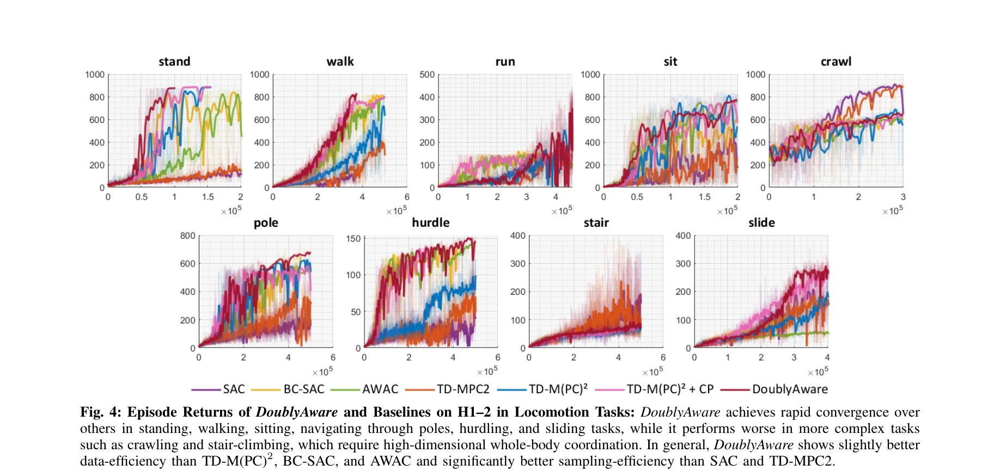
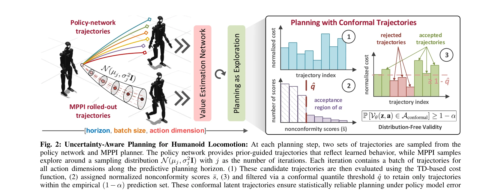

# DoublyAware: Dual Planning and Policy Awareness for Temporal Difference Learning in Humanoid Locomotion

> **저자**: Khang Nguyen, An T. Le, Jan Peters, Minh Nhat Vu | **날짜**: 2025-06-12 | **URL**: [https://arxiv.org/abs/2506.12095](https://arxiv.org/abs/2506.12095)

---

## Essence

*Fig. 1: Overview of DoublyAware: Disjoint uncertainty decomposi-*

DoublyAware는 TD-MPC 프레임워크를 uncertainty-aware 방식으로 확장하여 humanoid locomotion의 planning uncertainty와 policy uncertainty를 명시적으로 분해하고 각각 처리함으로써 sample efficiency와 motion feasibility를 향상시킨다.

## Motivation

- **Known**: TD-MPC는 MPC의 단기 최적화 능력과 TD learning의 sample efficiency를 결합하여 continuous control에 유용하지만, uncertainty가 시간에 따라 누적되어 humanoid locomotion 같은 복잡한 작업에서 성능이 저하된다.
- **Gap**: 기존 TD-MPC 방법들은 planning uncertainty (aleatoric)와 policy uncertainty (epistemic)를 명시적으로 구분하지 않으므로, 각각 특화된 처리 방법을 적용할 수 없어 high-dimensional control에서 robust behavior learning이 어렵다.
- **Why**: Humanoid locomotion은 고차원 action space, 복잡한 contact dynamics, 높은 환경 stochasticity를 가지므로, 구조화된 uncertainty 모델링이 data-efficient하고 안정적인 학습에 필수적이다.
- **Approach**: DoublyAware는 conformal prediction을 이용한 uncertainty-calibrated trajectory filtering으로 planning uncertainty를 처리하고, Group-Relative Policy Constraint (GRPC) optimizer로 policy uncertainty를 처리하여, policy rollouts를 structured informative prior로 활용한다.

## Achievement

*Fig. 4: Episode Returns of DoublyAware and Baselines on H1–2 in Locomotion Tasks: DoublyAware achieves rapid convergence*

- **Uncertainty 분해 및 차별화된 처리**: Aleatoric planning uncertainty와 epistemic policy uncertainty를 명시적으로 구분하여 각각 conformal prediction과 GRPC optimizer로 독립적으로 해결
- **Sample efficiency 및 수렴 속도 개선**: HumanoidBench locomotion 벤치마크에서 RL baseline 대비 improved sample efficiency와 accelerated convergence 달성
- **Motion feasibility 향상**: Conformal quantile filtering으로 kinodynamically feasible한 trajectory를 선택하여 real-world deployment 가능성 증가
- **Principled 통합 설계**: Planning-aware mechanism과 policy-aware learning optimizer를 조화롭게 결합하여 high-confidence, high-reward behavior 추구와 targeted exploration의 균형 달성

## How

*Fig. 2: Uncertainty-Aware Planning for Humanoid Locomotion: At each planning step, two sets of trajectories are sampled *

- Planning phase: Conformal prediction 이론을 적용하여 latent trajectory space에서 quantile-calibrated risk bounds로 candidate trajectory를 필터링
- Policy rollouts: 학습된 policy network의 rollouts를 structured informative prior로 활용하여 high-reward 영역으로 agent를 유도
- Learning phase: Group-Relative Policy Constraint optimizer with adaptive trust-region을 latent action space에 적용하여 distributional consistency 보장
- TD-MPC 통합: 위의 planning-aware와 policy-aware 메커니즘을 TD-MPC 프레임워크에 통합하여 overall optimization 과정 수행
- Evaluation: HumanoidBench locomotion suite에서 Unitree 26-DoF H1-2 humanoid를 대상으로 sample efficiency, convergence speed, motion feasibility 평가

## Originality

- **Explicit uncertainty 분해**: Aleatoric과 epistemic uncertainty를 MBRL-humanoid control 맥락에서 planning과 policy uncertainty로 명시적으로 분해하고 독립적으로 해결하는 접근은 기존 방법과 차별화됨
- **Conformal prediction 적용**: Conformal prediction의 distribution-free calibration 특성을 latent trajectory 선택에 직접 적용하여 statistical consistency와 robustness 보장
- **Policy-aware GRPC optimizer**: Large language model에서 영감을 받은 Group-Relative Policy Constraint를 humanoid control의 latent action space에 적용한 것은 새로운 시도
- **Structured prior 설계**: Policy rollouts를 단순한 regularization이 아닌 structured informative prior로 활용하는 설계는 MBRL-기반 humanoid learning에 새로운 관점 제시

## Limitation & Further Study

- **평가 범위 제한**: HumanoidBench의 locomotion 작업에만 평가되어 manipulation, multi-task learning 등 다른 humanoid 작업에서의 일반화 가능성 미불명
- **실제 로봇 검증 부재**: Simulation (Unitree H1-2)에서만 검증되었으며, sim-to-real transfer와 실제 로봇 환경의 복잡한 dynamics에서의 성능 검증 필요
- **Conformal prediction의 보수성**: Quantile-calibrated risk bounds는 통계적 보장을 제공하지만, 과도하게 conservative할 수 있어 exploration 성능 저해 가능성
- **Computational cost 분석 부재**: Conformal filtering과 GRPC optimizer의 computational overhead가 명확히 제시되지 않아 real-time control applicability 평가 어려움
- **Hyperparameter 민감성**: Conformal quantile level, trust-region scale 등의 hyperparameter에 대한 민감성 분석이 부족함
- **후속 연구 방향**: (1) Multi-task humanoid learning에서의 효과 검증, (2) 실제 humanoid 로봇 (e.g., Boston Dynamics Atlas)에서의 sim-to-real transfer 실험, (3) Conformal prediction의 적응적 quantile level 조정 방법 개발, (4) 다른 MBRL 알고리즘 (e.g., DREAMER, PlaNet)으로의 일반화

## Evaluation

- Novelty: 4/5
- Technical Soundness: 3/5
- Significance: 4/5
- Clarity: 4/5
- Overall: 4/5

**총평**: DoublyAware는 uncertainty를 planning과 policy 차원으로 명시적으로 분해하고 각각 conformal prediction과 GRPC optimizer로 처리하는 principled 접근으로, TD-MPC 기반 humanoid locomotion learning의 robustness와 sample efficiency를 크게 향상시킨 우수한 연구이다. 다만 simulation-only 평가와 broader applicability 검증이 추가로 필요하다.

## Related Papers

- 🔄 다른 접근: [[papers/1408_Full-Order_Sampling-Based_MPC_for_Torque-Level_Locomotion_Co/review]] — 둘 다 MPC 기반이지만 DoublyAware는 uncertainty 분해에, DIAL-MPC는 diffusion 기반 샘플링에 초점을 맞춘다.
- 🏛 기반 연구: [[papers/1385_Evolutionary_Continuous_Adaptive_RL-Powered_Co-Design_for_Hu/review]] — EA-CoRL의 진화 알고리즘과 RL 결합 방식이 DoublyAware의 dual awareness 학습에 이론적 기반을 제공한다.
- 🔗 후속 연구: [[papers/1401_GauDP_Reinventing_Multi-Agent_Collaboration_through_Gaussian/review]] — GauDP의 다중 에이전트 Gaussian 표현이 DoublyAware의 uncertainty 모델링을 다중 로봇 환경으로 확장할 수 있다.
- 🏛 기반 연구: [[papers/1401_GauDP_Reinventing_Multi-Agent_Collaboration_through_Gaussian/review]] — GauDP의 다중 에이전트 3D Gaussian 표현이 DoublyAware의 uncertainty 모델링을 다중 로봇 환경으로 확장하는 기반 기술이다.
- 🔗 후속 연구: [[papers/1385_Evolutionary_Continuous_Adaptive_RL-Powered_Co-Design_for_Hu/review]] — EA-CoRL의 하드웨어-제어 공동 설계 방법에 DoublyAware의 uncertainty 처리를 적용하면 더욱 견고한 시스템 최적화가 가능하다.
- 🏛 기반 연구: [[papers/1408_Full-Order_Sampling-Based_MPC_for_Torque-Level_Locomotion_Co/review]] — DIAL-MPC의 diffusion 기반 iterative refinement가 DoublyAware의 uncertainty-aware MPC 구현에 필수적인 샘플링 방법론을 제공한다.
