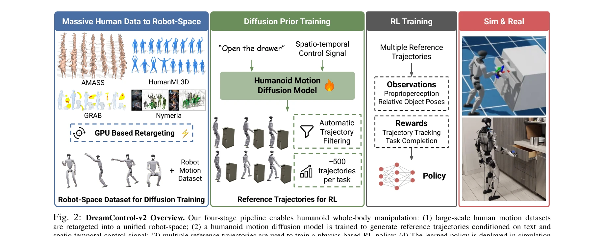
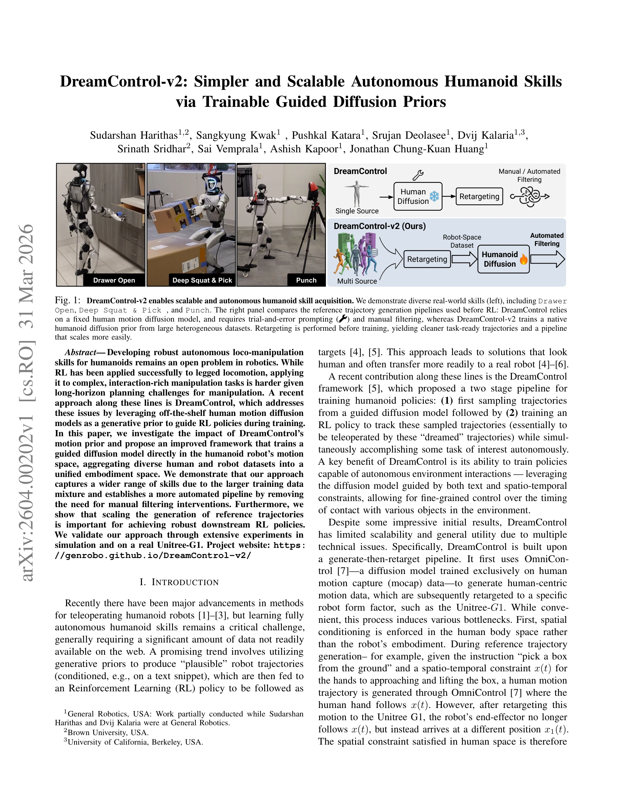

# DreamControl-v2: Simpler and Scalable Autonomous Humanoid Skills via Trainable Guided Diffusion Priors

> **저자**:  | **날짜**: 2026-03-31 | **URL**: [https://arxiv.org/abs/2604.00202](https://arxiv.org/abs/2604.00202)

---

## Essence

*Fig. 2: DreamControl-v2 Overview. Our four-stage pipeline enables humanoid whole-body manipulation: (1) large-scale huma*

Humanoid 로봇의 loco-manipulation 기술 학습을 위해 로봇 모션 공간에서 직접 guided diffusion model을 학습하며, 다양한 human 및 robot 데이터셋을 통합하여 확장 가능한 기술 습득을 실현한다.

## Motivation

- **Known**: DreamControl은 OmniControl 같은 human motion diffusion model을 prior로 활용하여 RL 정책 학습을 가이드하는 방식이 효과적임이 알려져 있다. 대규모 human motion 데이터셋(AMASS)을 활용한 motion synthesis가 robotics 분야에 도입되고 있다.
- **Gap**: 기존 DreamControl은 human 공간에서 생성 후 robot으로 retargeting하는 과정에서 spatial constraint이 보존되지 않아 trial-and-error 튜닝이 필요하며, AMASS 스타일 액션만 생성 가능해 task-specific IK와 manual filtering이 필수적이다.
- **Why**: Humanoid 로봇의 자율 조작 기술은 긴 horizon planning과 환경 상호작용이 복잡하여 학습이 어렵고, scalable하면서도 자동화된 파이프라인이 필요하다.
- **Approach**: Robot 공간에서 직접 학습하는 diffusion model을 구성하기 위해 diverse human motion 데이터셋들을 pre-retargeting하여 robot-space dataset으로 구축하고, 이를 기반으로 text와 spatio-temporal constraint에 jointly conditioned된 diffusion prior를 훈련한다.

## Achievement

*Fig. 1: DreamControl-v2 enables scalable and autonomous humanoid skill acquisition. We demonstrate diverse real-world sk*

- **확장성 개선**: Task-specific IK와 manual filtering 제거로 scalable 파이프라인 구현
- **공간 제약 보존**: Robot 공간에서 직접 생성하여 spatial guidance가 retargeting 후에도 유지됨
- **다양한 기술 습득**: AMASS 외 추가 데이터셋(HumanML3D, GRAB, Nymeria) 통합으로 더 넓은 액션 커버리지
- **실제 로봇 검증**: Unitree-G1에서 Drawer Open, Deep Squat & Pick, Punch 등 diverse skills 실현
- **자동화된 필터링**: Trial-and-error prompt 조정 불필요, automated trajectory filtering 도입

## How

*Fig. 2: DreamControl-v2 Overview. Our four-stage pipeline enables humanoid whole-body manipulation: (1) large-scale huma*

- AMASS, HumanML3D, GRAB, Nymeria 등 multiple human motion datasets를 GPU 기반 retargeting으로 Unitree-G1 형태로 사전 변환
- Robot-space dataset 위에서 guided diffusion model 직접 학습하여 text와 spatio-temporal constraint에 joint conditioning
- 생성된 reference trajectories (~500개/task)를 automatic trajectory filtering으로 정제
- 필터링된 trajectories를 RL policy 학습의 reward signal로 활용하여 motion tracking과 task completion을 동시 최적화
- Simulation 및 실제 로봇에서 성능 검증 및 downstream RL policy의 diffusion model scale 효과 분석

## Originality

- 기존 human-space first 접근에서 robot-space direct training으로 paradigm 전환
- Spatial conditioning을 human body 대신 robot embodiment에서 직접 수행하여 constraint preservation 해결
- Multiple heterogeneous human datasets의 통합 retargeting으로 larger training data mixture 구성
- Automated filtering과 제거된 manual intervention으로 practical scalability 달성
- Reference trajectory scaling이 downstream RL 성능에 미치는 영향에 대한 systematic analysis

## Limitation & Further Study

- Retargeting 과정의 정확도에 의존하므로 source 데이터의 품질이 중요함
- Robot embodiment 특화 학습으로 다른 humanoid 형태로의 generalization 제한 가능
- Simulation-to-real gap 극복을 위한 추가 domain adaptation 기법의 필요성 불명확
- 후속연구: 다중 humanoid embodiment에 대한 unified diffusion model 구축, sim-to-real gap 최소화 전략, visual input 기반 real-time spatial guidance 통합

## Evaluation

- Novelty: 4/5
- Technical Soundness: 4/5
- Significance: 4/5
- Clarity: 4/5
- Overall: 4/5

**총평**: DreamControl-v2는 기존 접근의 명확한 bottleneck을 robot-space 중심 설계로 효과적으로 해결하며, 자동화된 파이프라인과 실제 로봇 검증을 통해 humanoid loco-manipulation의 scalable 학습 방법론을 제시한다.

## Related Papers

- 🔄 다른 접근: [[papers/1237_Ψ_0_An_Open_Foundation_Model_Towards_Universal_Humanoid_Loco/review]] — 둘 다 humanoid loco-manipulation foundation model이지만 DreamControl-v2는 diffusion model을, Ψ0는 VLM+flow expert 결합을 사용한다.
- 🔗 후속 연구: [[papers/1419_H3DP_Triply-Hierarchical_Diffusion_Policy_for_Visuomotor_Lea/review]] — Generative World Modelling for Humanoids의 1X World Model이 DreamControl-v2의 guided diffusion을 더 포괄적인 세계 모델로 확장할 수 있다.
- 🏛 기반 연구: [[papers/1354_Dex1B_Learning_with_1B_Demonstrations_for_Dexterous_Manipula/review]] — DreamControl의 whole-body humanoid control이 DreamControl-v2의 확장 가능한 기술 습득에 대한 기반 방법론을 제공한다.
