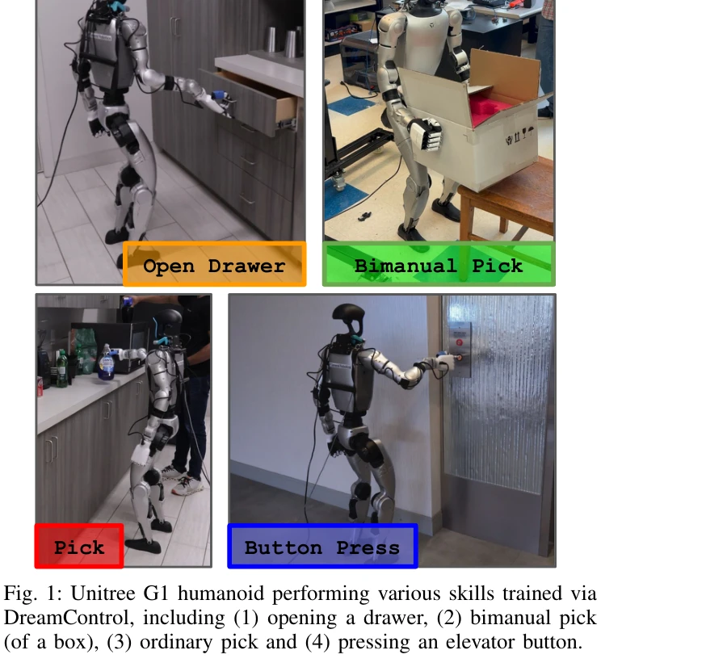

# DreamControl: Human-Inspired Whole-Body Humanoid Control for Scene Interaction via Guided Diffusion

> **저자**: Dvij Kalaria, Sudarshan S. Harithas, Pushkal Katara, Sangkyung Kwak, Sarthak Bhagat, Shankar Sastry, Srinath Sridhar, Sai Vemprala, Ashish Kapoor, Jonathan Chung-Kuan Huang | **날짜**: 2025-09-30 | **DOI**: [10.48550/arXiv.2509.14353](https://doi.org/10.48550/arXiv.2509.14353)

---

## Essence

*Fig. 2: DreamControl Overview: (A) we first generate text and spatiotemporally guided human motion trajectories using di*

DreamControl은 human motion data로 훈련된 diffusion prior를 이용하여 RL 정책을 가이드함으로써 humanoid 로봇이 전신을 조정하며 환경과 상호작용하는 자율 기술을 학습하는 방법론이다.

## Motivation

- **Known**: Humanoid 로봇 제어는 locomotion과 motion tracking에서 진전이 있었으나, 전신 manipulation과 loco-manipulation 태스크에서는 여전히 도전적이다. Diffusion 기반 정책은 long-horizon 문제에 유망하지만 whole-body humanoid 제어를 위한 teleoperation 데이터 수집이 병목이다.
- **Gap**: 기존 접근법은 하체를 고정하거나 상하체를 분리 훈련하며, direct RL은 long-horizon manipulation의 높은 탐색 복잡성으로 인해 부자연스러운 동작을 생성한다. Human motion data의 풍부함을 활용하면서도 teleoperation 데이터 의존성을 줄이는 방법이 부족하다.
- **Why**: Humanoid 로봇이 실제 보조자로 기능하려면 서로 다른 타임스케일의 동시 제어(안정성 유지 + 장기 계획)와 자연스러운 동작이 필요하며, 이는 sim-to-real 전이 성공에도 중요하다.
- **Approach**: 두 단계 방법론으로 (1) OmniControl diffusion 모델을 텍스트와 시공간 가이던스로 조건화하여 human motion을 생성하고 로봇에 retarget한 후, (2) 생성된 reference trajectory 추적과 task completion을 동시에 달성하는 goal-conditioned RL 정책을 훈련한다.

## Achievement

*Fig. 1: Unitree G1 humanoid performing various skills trained via*

- **Human-informed Prior의 효과**: Diffusion prior를 사용한 RL이 direct RL로는 불가능한 솔루션을 발견함을 입증
- **자연스러운 동작**: Diffusion 모델이 극단적인 동작을 피하도록 유도하여 sim-to-real 전이 개선
- **전신 제어 검증**: Unitree G1 로봇에서 drawer open, bimanual pick, button press 등 다양한 전신 협응 태스크 성공
- **Teleoperation 의존성 제거**: Human motion 데이터만으로 충분하여 비용 많이 드는 teleoperation 데이터 수집 불필요
- **배포 유연성**: Privileged 및 non-privileged 버전 정책 모두 지원으로 실제 로봇 배포 용이

## How

*Fig. 2: DreamControl Overview: (A) we first generate text and spatiotemporally guided human motion trajectories using di*

- OmniControl diffusion 모델을 human motion 데이터로 사전 훈련하여 text condition과 spatiotemporal guidance를 입력으로 하는 prior 구축
- 생성된 human motion trajectory를 motion retargeting 기술로 Unitree G1 로봇의 형태 인자에 맞게 변환
- Simulation 환경에서 (1) reference trajectory 추적 보상과 (2) task completion 보상을 결합한 dense reward로 on-policy RL 훈련
- Goal-conditioned RL 정책으로 학습하여 배포 시점에 diffusion 모델의 명시적 reference trajectory 의존성 제거
- Vision 모델을 통해 실제 로봇 환경에서 공간 가이던스 입력 자동 결정 및 완전 자율 실행

## Originality

- Human motion diffusion prior를 RL 가이드로 활용하는 방식은 기존 imitation learning보다 더 풍부한 데이터 소스 활용
- Spatiotemporal guidance를 통한 fine-grained diffusion 제어로 object interaction과 long-range planning을 명시적으로 처리
- 배포 단계에서 reference trajectory 의존성을 제거하면서도 diffusion prior의 이점을 유지하는 설계
- 전신 humanoid의 multiple timescale 제어 문제를 diffusion prior로 long-horizon 계획을 제약하고 RL로 short-horizon 동적 제어를 처리하는 방식으로 해결

## Limitation & Further Study

- Human motion 데이터의 질과 다양성이 retargeting 성공도에 영향을 미칠 수 있으나, 이에 대한 정량적 분석이 부족함
- Simulation 환경의 물리 정확도와 sim-to-real 전이 gap에 대한 상세 분석 및 실패 사례 분석 미흡
- 다양한 로봇 형태 인자에 대한 일반화 가능성이 제한적이며, Unitree G1에서의 검증만 제시됨
- Real world 배포에서의 장기 자율성(long-horizon autonomy)과 외란 복원력에 대한 평가 부족
- 후속 연구로 더 효율적인 motion retargeting 방법, 다중 로봇에의 확장, 그리고 더욱 복잡한 multi-step manipulation 태스크로의 확대 필요

## Evaluation

- Novelty: 4/5
- Technical Soundness: 3/5
- Significance: 4/5
- Clarity: 4/5
- Overall: 4/5

**총평**: DreamControl은 human motion data의 풍부함을 활용하면서 teleoperation 의존성을 획기적으로 줄이는 창의적 접근법으로, diffusion prior와 RL의 상보적 강점을 효과적으로 결합하여 humanoid 전신 제어의 중요한 진전을 보여준다.

## Related Papers

- 🔄 다른 접근: [[papers/1387_ExBody2_Advanced_Expressive_Humanoid_Whole-Body_Control/review]] — DreamControl의 diffusion prior 기반 가이드와 ExBody2의 모션 캡처 데이터 활용은 표현력 있는 전신 움직임 달성을 위한 서로 다른 방법론입니다.
- 🔗 후속 연구: [[papers/1401_Flow_Matching_Imitation_Learning_for_Multi-Support_Manipulat/review]] — DreamControl의 human motion data 기반 diffusion prior는 Flow Matching 기반 multi-support manipulation의 자연스러운 동작 생성을 향상시킬 수 있습니다.
- 🔄 다른 접근: [[papers/1387_ExBody2_Advanced_Expressive_Humanoid_Whole-Body_Control/review]] — ExBody2의 모션 캡처와 시뮬레이션 데이터 결합 방식과 DreamControl의 diffusion prior 기반 접근법은 표현력 있는 휴머노이드 제어를 위한 서로 다른 방법론입니다.
- 🏛 기반 연구: [[papers/1401_Flow_Matching_Imitation_Learning_for_Multi-Support_Manipulat/review]] — Flow Matching을 활용한 multi-support manipulation 학습에서 자연스러운 동작 생성을 위해서는 DreamControl의 human motion prior가 중요한 기반 기술입니다.
