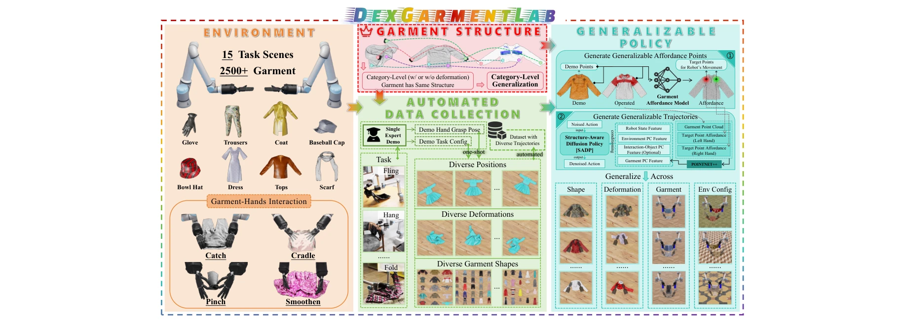

# DexGarmentLab: Dexterous Garment Manipulation Environment with Generalizable Policy

> **저자**: Yuran Wang, Ruihai Wu, Yue Chen, Jiarui Wang, Jiaqi Liang, Ziyu Zhu, Haoran Geng, Jitendra Malik, Pieter Abbeel, Hao Dong | **날짜**: 2025-05-16 | **URL**: [https://arxiv.org/abs/2505.11032](https://arxiv.org/abs/2505.11032)

---

## Essence

*Figure 1: Overview. DexGarmentLab includes three major components: Environment, Automated*

의류 조작을 위한 첫 번째 양손 기민한 손가락 조작 환경 DexGarmentLab을 제시하고, 단일 전문가 시연으로부터 자동 데이터 생성 및 Hierarchical gArment-manipuLation pOlicy (HALO)를 통해 다양한 의류 형상과 변형에 대한 일반화를 달성한다.

## Motivation

- **Known**: 의류 조작은 로봇 조작 연구에서 중요한 과제이지만, 기존 시뮬레이터들은 양손 기민한 조작 능력이 부족하고 현실적인 물리 상호작용을 표현하지 못한다.
- **Gap**: 기존 연구는 노동집약적인 원격 조종이나 전문가 강화학습 정책을 사용한 데이터 수집, 높은 수준의 물리 정확도를 갖춘 환경 부족, 다양한 의류 기하학과 변형에 대한 일반화 부족이라는 세 가지 핵심 문제를 해결하지 못했다.
- **Why**: 양손 기민한 손가락 조작은 의류 포획, 안기, 집기, 부드럽게 하기 등 정교한 작업에 필수적이며, 로봇이 인간과 같은 수준의 의류 조작 능력을 갖추는 것은 실세계 로봇 응용에 중요하다.
- **Approach**: Isaac Sim 기반의 전문화된 환경 DexGarmentLab을 구축하고, 의류 구조적 대응성을 활용하여 단일 전문가 시연으로부터 다양한 궤적을 자동 생성하며, affordance point 식별과 diffusion 기반 궤적 생성을 결합한 HALO 정책을 제안한다.

## Achievement

*Figure 1: Overview. DexGarmentLab includes three major components: Environment, Automated*

- **DexGarmentLab 환경**: 2,500개 이상의 의류, 15개 작업 시나리오, 8개 범주를 지원하는 첫 번째 양손 기민한 의류 조작 환경으로, 고급 시뮬레이션 기법으로 sim-to-real gap을 감소시킴
- **자동 데이터 수집 파이프라인**: 단일 전문가 시연으로부터 의류 구조적 대응성을 활용하여 다양한 궤적의 시연 자동 생성으로 수동 개입 최소화
- **HALO 정책**: affordance 기반 조작 영역 식별 및 diffusion 방법 기반 일반화 가능한 궤적 생성으로, 미본 의류 인스턴스에 대해 기존 방법이 실패하는 경우에도 일반화 달성
- **광범위한 실험 검증**: 시뮬레이션 및 실세계 설정에서 데이터 효율성과 일반화 능력이 기준 방법을 크게 상회함을 입증

## How

*Figure 1: Overview. DexGarmentLab includes three major components: Environment, Automated*

- Isaac Sim 기반의 환경에 adhesion, friction, particle-adhesion/friction-scale 등의 물리 파라미터 추가하여 의류-로봇 상호작용의 현실성 확보
- ClothesNet 데이터셋으로부터 2,500개 이상의 고품질 3D 의류 자산 수집 및 15개 작업 시나리오(드레싱, 접기, 걸기, 던지기 등) 구성
- 의류 구조적 대응성(category-level 의류가 동일한 구조를 가짐)을 활용하여 단일 전문가 시연으로부터 다양한 위치, 변형, 형상에 대한 시연 자동 생성
- PointNet++를 사용하여 의류 점군, affordance, 로봇 상태, 환경 정보를 인코딩
- 계층적 구조로 affordance 모델이 전이 가능한 조작 포인트를 식별하고, Structure-Aware Diffusion Policy (SADP)가 이를 기반으로 일반화 가능한 궤적 생성

## Originality

- **첫 번째 양손 기민한 의류 조작 환경**: 기존 환경들이 단일 손이나 제한된 의류만 지원하는 반면, DexGarmentLab은 양손 조작과 2,500개 이상의 다양한 의류 지원
- **의류 구조적 대응성 기반 자동 데이터 생성**: 기존의 노동집약적 원격 조종이나 강화학습 기반 방식 대신, 단일 시연으로부터 다양한 궤적을 자동으로 생성하는 혁신적 접근
- **Hierarchical gArment-manipuLation pOlicy (HALO)**: affordance와 diffusion 기법을 결합하여 의류의 다양한 형상과 변형에 대한 범주 수준 일반화 달성
- **현실적 물리 시뮬레이션**: 기존 시뮬레이터의 비현실적 상호작용(e.g., 보이지 않는 큐브 부착)을 개선하여 실제 의류-로봇 상호작용의 물리적 신뢰성 향상

## Limitation & Further Study

- **현실 세계 검증 제한**: 논문이 실세계 실험 결과를 제시하지만 규모가 제한적이며, 더욱 광범위한 실제 로봇 실험으로의 확장이 필요
- **의류 범주 제한**: 8개 범주의 의류로 제한되어 있으며, 매우 복잡한 의류(예: 다중 층 구조, 특수 재질)로의 확장 미흡
- **affordance 모델의 의존성**: 제안된 방법이 정확한 affordance 식별에 크게 의존하므로, affordance 추정 오류에 대한 강건성 분석 부족
- **후속 연구 방향**: (1) 실제 의류 데이터셋 확대 및 더 복잡한 의류 범주 추가, (2) 다양한 환경 조건(조명, 배경 등)에 대한 강건성 향상, (3) 온라인 적응 학습 메커니즘 개발으로 실세계 배포 시 동적 적응 능력 강화

## Evaluation

- Novelty: 4/5
- Technical Soundness: 3/5
- Significance: 4/5
- Clarity: 4/5
- Overall: 4/5

**총평**: DexGarmentLab은 양손 기민한 의류 조작이라는 도전적인 영역에서 첫 번째 종합적 환경과 알고리즘을 제시하며, 자동화된 데이터 수집과 HALO 정책을 통해 실질적인 일반화 성과를 달성한 매우 우수한 연구이다.

## Related Papers

- 🔗 후속 연구: [[papers/1338_DexterCap_An_Affordable_and_Automated_System_for_Capturing_D/review]] — 정밀한 손가락 조작 캡처 기술을 의류 조작이라는 복잡한 태스크에 적용한다
- 🔄 다른 접근: [[papers/1291_3D-VLA_A_3D_Vision-Language-Action_Generative_World_Model/review]] — dexterous manipulation을 다른 환경과 정책 학습 방법으로 접근한다
- 🏛 기반 연구: [[papers/1337_Compose_Your_Policies_Improving_Diffusion-based_or_Flow-base/review]] — diffusion 기반 정책 구성의 기본 방법론을 의류 조작에 적용한다
- 🔄 다른 접근: [[papers/1378_Embracing_Bulky_Objects_with_Humanoid_Robots_Whole-Body_Mani/review]] — 둘 다 복잡한 물체 조작을 다루지만 전자는 대형 물체 포용에, 후자는 정교한 garment 조작에 특화되어 있다.
- 🧪 응용 사례: [[papers/1574_SKT_Integrating_State-Aware_Keypoint_Trajectories_with_Visio/review]] — DexGarmentLab의 의류 조작 환경이 SKT의 VLM 활용 의류 조작 성능을 구체적인 실험 환경에서 적용한다.
- 🔗 후속 연구: [[papers/1429_GraspSense_언어_기반_인지와_힘_맵을_활용한_손재주_로봇_파지_계획/review]] — force-aware grasping을 복잡한 조작 환경으로 확장한 응용이다
- 🧪 응용 사례: [[papers/1487_HUMOTO_A_4D_Dataset_of_Mocap_Human_Object_Interactions/review]] — DexGarmentLab의 정밀한 조작 환경이 4D 인간-객체 상호작용 데이터의 실제 활용 사례를 보여줌
- 🔗 후속 연구: [[papers/1556_Lightning_Grasp_High_Performance_Procedural_Grasp_Synthesis/review]] — DexGarmentLab의 정교한 조작 환경이 Contact Field 기반 고성능 그래스프 생성의 확장된 적용 영역을 제시함
- 🧪 응용 사례: [[papers/1548_Learning_Visuotactile_Skills_with_Two_Multifingered_Hands/review]] — 양손 visuotactile 기술 학습이 의복 조작과 같은 복잡한 정교 조작 환경에서 직접 활용될 수 있다.
