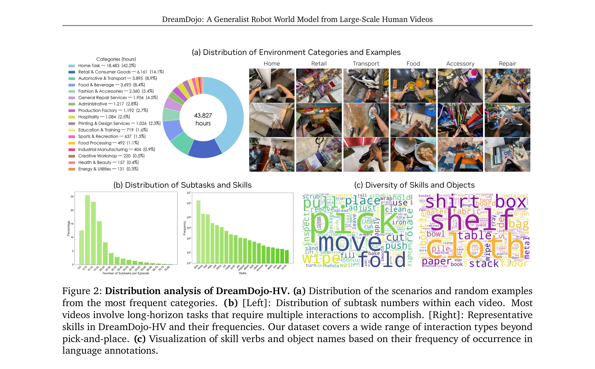

# DreamDojo: A Generalist Robot World Model from Large-Scale Human Videos

> **저자**: Shenyuan Gao, William Liang, Kaiyuan Zheng, Ayaan Malik, Seonghyeon Ye, Sihyun Yu, Wei-Cheng Tseng, Yuzhu Dong, Kaichun Mo, Chen-Hsuan Lin, Qianli Ma, Seungjun Nah, Loic Magne, Jiannan Xiang, Yuqi Xie, Ruijie Zheng, Dantong Niu, You Liang Tan, K. R. Zentner, George Kurian, Suneel Indupuru, Pooya Jannaty, Jinwei Gu, Jun Zhang, Jitendra Malik, Pieter Abbeel, Ming-Yu Liu, Yuke Zhu, Joel Jang, Linxi "Jim" Fan | **날짜**: 2026-02-06 | **URL**: [https://arxiv.org/abs/2602.06949](https://arxiv.org/abs/2602.06949)

---

## Essence

*Figure 1: DreamDojo overview. DreamDojo acquires comprehensive physical knowledge from large-scale*

44k시간의 대규모 인간 영상으로 사전학습하고 continuous latent actions를 도입하여, 접촉이 많은 로봇 작업에 대한 generalist world model인 DreamDojo를 제시한다.

## Motivation

- **Known**: Video world models은 최근 비디오 생성 기술의 발전으로 주목받고 있으나, 주로 이산 제어에 국한되어 있다. 기존 로봇 데이터는 수집 비용이 높고 커버리지가 제한적이며, 대부분 전문가 시연으로 구성되어 있어 강한 action controllability 학습이 어렵다.
- **Gap**: 로봇 데이터의 부족함과 action label의 희소성으로 인해 기존 video world models은 관찰된 설정에만 국한되고 반사실적 action에 반응하지 못한다. 다양한 로봇에 대한 통일된 action 포맷 변환의 엔지니어링 비용도 문제다.
- **Why**: Generalist robot agents의 개발을 위해 다양한 환경에서 action의 결과를 시뮬레이션할 수 있는 world model이 필수적이며, 이는 대규모 정책 평가와 모델 기반 계획 등 실제 배포 없이 로봇 정책을 개발할 수 있게 한다.
- **Approach**: 인간 영상에서의 embodiment gap을 극복하기 위해 기초 물리학 지식이 인간과 로봇에서 일관되다는 점을 활용하고, continuous latent actions을 통일된 프록시 action으로 사용하여 레이블 없는 영상에서도 인과관계를 학습한다.

## Achievement

*Figure 1: DreamDojo overview. DreamDojo acquires comprehensive physical knowledge from large-scale*

- **DreamDojo-HV 데이터셋**: 44k시간의 egocentric 인간 영상으로 기존 로봇 데이터셋 대비 96배 이상의 스킬과 2000배 이상의 장면을 포함하는 최대 규모 world model 사전학습 데이터셋 구축
- **Foundation world model**: continuous latent actions과 Cosmos-Predict2.5 기반 architecture를 통해 다양한 환경과 객체에 대한 zero-shot 일반화 능력을 갖춘 첫 world model 달성
- **실시간 추론 가능화**: Self Forcing 패러다임 기반 distillation pipeline으로 640×480 해상도에서 10.81 FPS의 실시간 예측 달성
- **다중 응용 가능성**: live teleoperation, policy evaluation, model-based planning 등 다양한 downstream application 실현

## How

*Figure 2: Distribution analysis of DreamDojo-HV. (a) Distribution of the scenarios and random examples*

- DreamDojo-HV에서 In-lab, EgoDex 등 3개 egocentric 인간 영상 데이터셋을 수집하여 사전학습
- Latent action model을 통해 프레임 간의 의미론적 action을 자기감독 방식으로 추출하여 모든 비디오에 대한 통일된 action 조건화
- Cosmos-Predict2.5 latent video diffusion model을 기반으로 flow matching loss로 학습
- 목표 로봇 데이터셋에서 post-training 시 action conditioning layer를 리셋하고 새로운 action space 학습
- Self Forcing 기반 distillation pipeline으로 자기 회귀적 예측 가속화 및 context consistency 개선
- 6개의 out-of-distribution benchmark에서 체계적 평가로 일반화 능력 검증

## Originality

- 기존 로봇 world models와 달리 대규모 인간 영상(44k시간)을 활용한 사전학습으로 embodiment gap 극복
- Continuous latent actions를 unified proxy로 사용하여 action label 희소성 문제를 자기감독 학습으로 해결하는 혁신적 접근
- 데이터 스케일과 다양성 측면에서 기존 로봇 학습 데이터셋 대비 획기적 개선 (96×, 2000×)
- First world model으로서 unseen objects와 novel environments에 대한 zero-shot 일반화 능력 달성

## Limitation & Further Study

- 실제 로봇 제어 실험 결과가 제시되지 않았으므로 실제 배포 성능은 미지수
- Post-training에 필요한 로봇 데이터의 규모와 특성에 대한 분석 부족
- Distillation으로 인한 성능 손실 정량화 및 분석 미흡
- 인간-로봇 embodiment gap이 완전히 해결되었는지에 대한 심화 분석 필요
- 다른 world model baseline과의 정량적 비교 평가 부재
- 긴 horizon(1분 이상) 예측 시 누적 오차 특성에 대한 분석 필요

## Evaluation

- Novelty: 4/5
- Technical Soundness: 3/5
- Significance: 4/5
- Clarity: 4/5
- Overall: 4/5

**총평**: 대규모 인간 영상을 활용한 foundation world model 구축이라는 혁신적 접근과 continuous latent actions라는 우아한 솔루션을 제시하여 로봇 학습의 데이터 효율성 문제를 크게 개선했으나, 실제 로봇 배포 및 제어 실험의 충분한 검증이 필요하다.

## Related Papers

- 🔄 다른 접근: [[papers/1419_H3DP_Triply-Hierarchical_Diffusion_Policy_for_Visuomotor_Lea/review]] — 둘 다 대규모 인간 비디오를 활용한 humanoid world model을 제시하지만, DreamDojo는 44k시간 egocentric 데이터에 중점을 둔다.
- 🏛 기반 연구: [[papers/1632_World_Simulation_with_Video_Foundation_Models_for_Physical_A/review]] — Video foundation model 기반의 물리적 AI 시뮬레이션 기술이 DreamDojo의 world model 생성 방법론에 이론적 기반을 제공한다.
- 🔗 후속 연구: [[papers/1581_Structured_World_Models_from_Human_Videos/review]] — Human video로부터 structured world model을 학습하는 방법론을 robot manipulation에 특화된 world model로 확장한다.
- 🔄 다른 접근: [[papers/1371_DreamDojo_A_Generalist_Robot_World_Model_from_Large-Scale_Hu/review]] — 동일한 44k시간 human video dataset을 사용하지만 다른 모델링 접근과 응용 방향을 제시한다.
