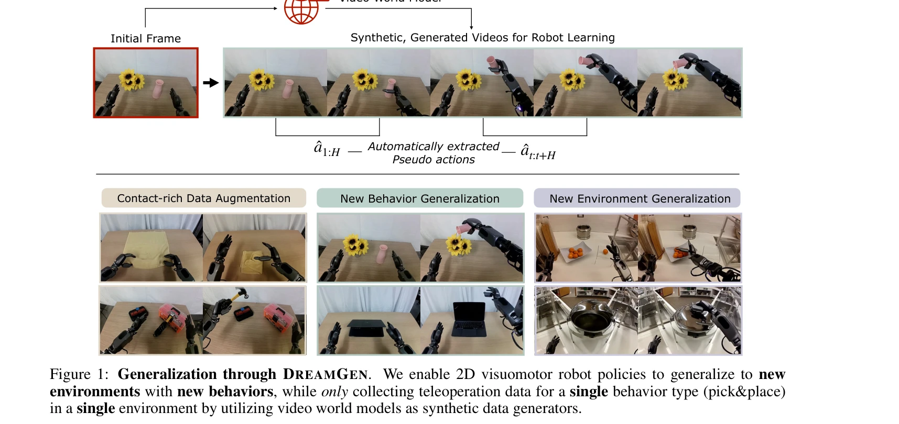

# DreamGen: Unlocking Generalization in Robot Learning through Video World Models

> **저자**: Joel Jang, Seonghyeon Ye, Zongyu Lin, Jiannan Xiang, Johan Bjorck, Yu Fang, Fengyuan Hu, Spencer Huang, Kaushil Kundalia, Yen-Chen Lin, Loic Magne, Ajay Mandlekar, Avnish Narayan, You Liang Tan, Guanzhi Wang, Jing Wang, Qi Wang, Yinzhen Xu, Xiaohui Zeng, Kaiyuan Zheng, Ruijie Zheng, Ming-Yu Liu, Luke Zettlemoyer, Dieter Fox, Jan Kautz, Scott Reed, Yuke Zhu, Linxi Fan | **날짜**: 2025-05-19 | **URL**: [https://arxiv.org/abs/2505.12705](https://arxiv.org/abs/2505.12705)

---

## Essence

*Figure 2: DREAMGEN Overview. We begin by fine-tuning a video world model on teleoperated robot trajectories.*

DreamGen은 video world model을 이용하여 생성한 synthetic robot 비디오에서 pseudo-action을 추출하여 로봇 정책 학습용 neural trajectories를 대량 생성하는 4단계 파이프라인으로, 최소한의 텔레오퍼레이션 데이터로 새로운 행동과 환경에 대한 강력한 일반화를 달성한다.

## Motivation

- **Known**: Robot learning은 대규모 수작업 데이터 수집에 의존하고 있으며, 시뮬레이션 기반 합성 데이터는 sim-to-real gap 문제를 겪고 있다. Video generative model은 자연스러운 움직임과 물리 추론에 강한 사전 지식을 가지고 있다.
- **Gap**: Video world model을 실시간 플래너로 사용하는 기존 연구와 달리, 이들을 확장 가능한 synthetic data generator로 활용하는 방법이 부족하다. 또한 비디오에서 추출한 pseudo-action 기반 학습의 효과성에 대한 체계적 평가가 미흡하다.
- **Why**: 로봇 학습의 데이터 병목을 해결하여 scalable하고 비용 효율적인 정책 학습이 가능해지며, 다양한 로봇 embodiment과 환경에 일반화되는 기초 모델 개발에 기여한다.
- **Approach**: Fine-tuned video world model (WAN2.1)을 이용하여 language instruction으로 조건화된 synthetic 로봇 비디오를 대량 생성하고, Inverse Dynamics Model (IDM) 또는 Latent Action Model (LAPA)을 통해 pseudo-action을 자동 추출하여 neural trajectories로 구성한 후 visuomotor policy를 학습한다.

## Achievement

*Figure 1: Generalization through DREAMGEN. We enable 2D visuomotor robot policies to generalize to new*

- **데이터 스케일링**: RoboCasa에서 원본 인간 시연 대비 333배까지 synthetic 데이터 확장으로 log-linear 성능 향상 달성
- **다중 로봇 일반화**: Fourier GR1, Franka Emika, SO-100 로봇에서 평균 성공률 23-37% → 37-46.4% 향상 (10-13개 real trajectory만 사용)
- **행동 일반화**: 단일 pick-and-place 데이터로부터 pouring, articulated object 조작, tool 사용 등 22개 신규 행동 생성 (GR00T N1의 0% → 43.2%)
- **환경 일반화**: 단일 환경 데이터만으로 10개 신규 환경에서 28.5% 성공률 달성 (zero-to-one improvement)
- **DreamGen Bench**: 8개 video model의 video generation 성능과 downstream policy 성공률 간 강한 상관관계 증명

## How

*Figure 2: DREAMGEN Overview. We begin by fine-tuning a video world model on teleoperated robot trajectories.*

- Step 1: LoRA 기반 video world model fine-tuning을 통해 target robot의 물리 제약과 운동 능력 학습
- Step 2: 초기 프레임과 language instruction으로 조건화된 대량의 synthetic 로봇 비디오 생성 (객체/환경 위치 무작위화)
- Step 3: IDM (diffusion transformer 기반, 2개 프레임 간 action chunk 예측) 또는 LAPA (VQ codebook 기반 latent action) 모델로 pseudo-action 추출
- Step 4: Video-action sequence 쌍(neural trajectories)으로 visuomotor policy 학습
- 평가: Instruction following과 physics following 지표를 통한 video world model 최적 적응 확인
- DreamGen Bench: 미시각 객체/행동/환경 조작 및 물리 준수 능력 평가로 video model 선택 가이드 제공

## Originality

- Video world model을 synthetic data generator로 재해석하는 novel한 활용 (기존: real-time planner)
- IDM과 LAPA를 조합하여 비디오에서 action label 자동 추출하는 pseudo-labeling 파이프라인
- 최소한의 teleoperation 데이터(단일 작업·환경)로 다중 행동·환경 일반화 달성하는 zero-to-one 접근
- Video generation 성능을 직접 평가하는 DreamGen Bench 제시로 downstream task 성능과의 연관성 규명

## Limitation & Further Study

- 초기 프레임의 수작업 수집 필요 (향후 image-to-image diffusion으로 개선 계획)
- Video world model fine-tuning에 필요한 최적 데이터양이 setup마다 상이하여 hyperparameter 튜닝 필요
- IDM과 LAPA의 pseudo-action 정확도 평가 부재 (실제 action과의 오차 분석 필요)
- Real-world 실험이 제한된 규모(총 15개 태스크, 로봇당 2-4개)로 대규모 일반화 검증 부족
- Language instruction의 질과 다양성에 따른 성능 변화에 대한 체계적 분석 미흡
- Multi-view 데이터를 2×2 grid 형태로 flatten하는 방식의 정보 손실 가능성

## Evaluation

- Novelty: 4/5
- Technical Soundness: 3/5
- Significance: 4/5
- Clarity: 4/5
- Overall: 4/5

**총평**: DreamGen은 video world model을 scalable한 synthetic data generator로 활용하는 창의적 패러다임으로, 최소한의 human demonstration으로 강력한 행동/환경 일반화를 달성하여 로봇 학습의 데이터 병목을 혁신적으로 해결한다. 다만 pseudo-action 정확도 분석과 대규모 실제 환경 검증이 보강되면 더욱 설득력 있을 것이다.

## Related Papers

- 🔄 다른 접근: [[papers/1364_Diffusion-VLA_Generalizable_and_Interpretable_Robot_Foundati/review]] — Diffusion-VLA도 계층적 구조에서 diffusion 모델을 활용하는 유사한 VLA 프레임워크이다.
- 🔗 후속 연구: [[papers/1422_Hi_Robot_Open-Ended_Instruction_Following_with_Hierarchical/review]] — Hi Robot의 계층적 vision-language 구조가 DexGraspVLA의 계층적 VLA 설계를 확장한다.
- 🏛 기반 연구: [[papers/1281_Being-H0_Vision-Language-Action_Pretraining_from_Large-Scale/review]] — Being-H0의 대규모 vision-language-action 사전학습이 DexGraspVLA의 foundation model 기반을 제공한다.
- 🔗 후속 연구: [[papers/1354_Dex1B_Learning_with_1B_Demonstrations_for_Dexterous_Manipula/review]] — DreamGen의 합성 데이터 생성 파이프라인이 Dex1B의 대규모 시연 데이터 활용에 도움이 된다.
- 🔄 다른 접근: [[papers/1364_Diffusion-VLA_Generalizable_and_Interpretable_Robot_Foundati/review]] — DexGraspVLA도 diffusion 기반 행동 생성과 reasoning을 결합한 유사한 접근법이다.
- 🏛 기반 연구: [[papers/1387_EWMBench_Evaluating_Scene_Motion_and_Semantic_Quality_in_Emb/review]] — DreamGen의 video world model이 EWMBench의 Embodied World Models 평가 기준과 연결된다.
