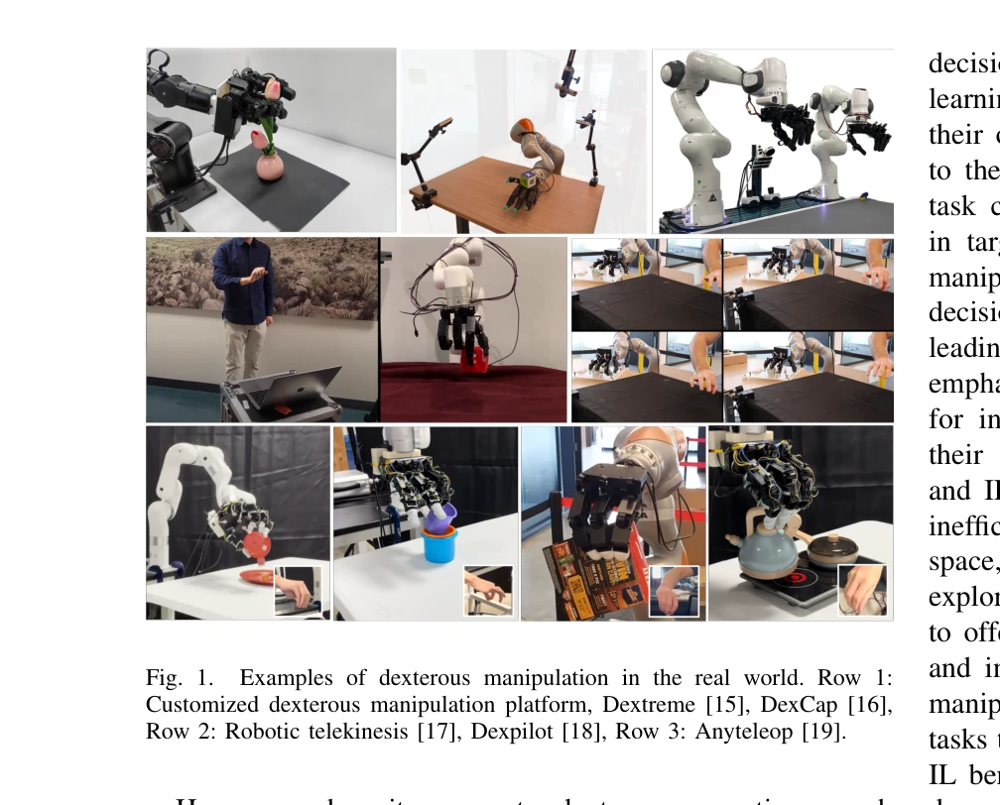
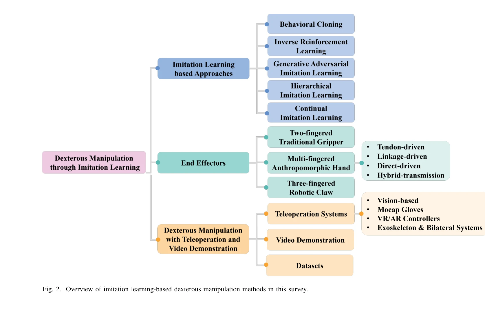
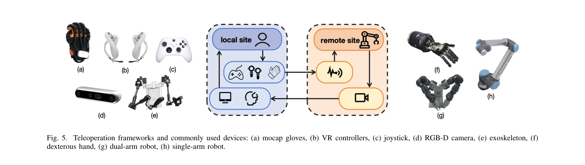

# Dexterous Manipulation through Imitation Learning: A Survey

> **저자**: Shan An, Ziyu Meng, Chao Tang, Yuning Zhou, Tengyu Liu, Fangqiang Ding, Shufang Zhang, Yao Mu, Ran Song, Wei Zhang, Zeng-Guang Hou, Hong Zhang | **날짜**: 2025-04-04 | **URL**: [https://arxiv.org/abs/2504.03515](https://arxiv.org/abs/2504.03515)

---

## Essence

*Fig. 1.*

본 논문은 Imitation Learning(IL)을 활용한 Dexterous Manipulation 방법들을 종합적으로 조사하는 서베이 논문으로, 전문가 시연을 통해 로봇이 인간 수준의 손재주를 습득하도록 하는 방식을 다룬다.

## Motivation

- **Known**: Dexterous manipulation은 로봇 손이나 다중 핑거 엔드 이펙터를 통해 정밀한 객체 제어와 회전을 수행하는 기술이며, 전통적인 모델 기반 접근법과 RL 기반 방법들이 존재해왔다.
- **Gap**: 기존의 model-based 접근법은 높은 차원성과 복잡한 접촉 동역학으로 인해 일반화에 실패하고, RL은 광범위한 훈련 데이터와 신중하게 설계된 보상 함수가 필요하다는 문제가 있다.
- **Why**: Dexterous manipulation은 제조, 의료, 우주/수중 탐사 등 다양한 실무 분야에서 중요하며, IL 기반 접근법은 명시적 모델링 없이 인간의 지식을 직접 활용할 수 있어 현실적이고 효율적이다.
- **Approach**: 본 서베이는 IL 기반 dexterous manipulation의 최근 동향, 핵심 기술, 그리고 미해결 과제들을 종합적으로 정리하고, behavior cloning, hybrid IL-RL, hierarchical IL 등 다양한 IL 분야를 포괄한다.

## Achievement

*Fig. 2. Overview of imitation learning-based dexterous manipulation methods in this survey.*

- **포괄적 기술 분류**: Behavior cloning, DAPG, Implicit Behavioral Cloning, Hiveformer, Diffusion Policy 등 주요 IL 기반 방법론들을 체계적으로 정리
- **실무 기여**: 제조, 의료, 가정 로봇 등 다양한 응용 분야에서 IL 기반 dexterous manipulation의 실질적 가치와 장점을 제시
- **도전과제 식별**: 고품질 시연 데이터 수집의 어려움, 제한된 데이터에서의 일반화 문제 등 현실적 장애물을 명확히 지적
- **미래 방향 제시**: 망막 추적(pose estimation), 데이터 증강(dataset augmentation), 인간-로봇 손 매핑(retargeting) 등 해결 방안을 제안

## How

*Fig. 5. Teleoperation frameworks and commonly used devices: (a) mocap gloves, (b) VR controllers, (c) joystick, (d) RGB-*

- Expert demonstration 수집: 인간 조작자 또는 학습된 에이전트의 궤적 기록
- Behavior cloning: 시연 데이터를 지도학습 방식으로 로봇 정책으로 변환
- Hybrid IL-RL: IL로 초기 정책을 얻고 RL로 추가 최적화 수행 (DAPG 등)
- Pose estimation 기반 매핑: 컴퓨터 비전으로 인간 손 움직임을 로봇 손으로 변환
- Dataset augmentation: 객체와 환경 변화에 대한 일반화 능력 향상
- Hierarchical IL: 복잡한 작업을 계층적 구조로 분해하여 학습

## Originality

- IL과 dexterous manipulation의 교점을 종합적으로 정리하는 첫 대규모 서베이 논문
- 인간-로봇 손 매핑(retargeting)을 통한 시연 데이터 수집 효율화 제안
- IL과 RL의 하이브리드 접근법의 장점을 명확하게 분석 및 비교
- Diffusion Policy 등 최신 생성 모델 기반 접근법을 포함한 최신 기술 동향 반영

## Limitation & Further Study

- 고품질 시연 데이터 수집의 노동 집약성과 시간 소비 문제가 여전히 미해결 상태
- 제한된 시연 데이터로부터의 일반화(generalization) 능력에 대한 구체적 해결책 부족
- 실제 로봇-인간 손 매핑 시 발생하는 물리적 불일치(domain gap) 문제 상세 분석 필요
- 이질 로봇 시스템 간의 정책 전이(policy transfer)에 대한 체계적 연구 필요
- 후속 연구: 자가 감시 학습(self-supervised learning), 시뮬레이션 기반 데이터 생성, 메타 러닝(meta-learning) 등을 활용한 데이터 효율성 개선

## Evaluation

- Novelty: 3/5
- Technical Soundness: 3/5
- Significance: 4/5
- Clarity: 4/5
- Overall: 4/5

**총평**: 본 서베이는 IL 기반 dexterous manipulation 분야의 포괄적이고 실무적인 가이드를 제공하며, 최근 주요 기술 동향을 잘 정리했으나, 구체적인 기술적 깊이와 정량적 성능 비교는 제한적이다.

## Related Papers

- 🏛 기반 연구: [[papers/1336_CogACT_A_Foundational_Vision-Language-Action_Model_for_Syner/review]] — Dexterous manipulation을 위한 데이터 수집과 처리 파이프라인 기술이 imitation learning survey의 핵심 구성요소가 된다.
- 🔗 후속 연구: [[papers/1425_Human2Robot_Learning_Robot_Actions_from_Paired_Human-Robot_V/review]] — Human-robot 데이터 쌍을 활용한 robot action 학습이 dexterous manipulation의 imitation learning 연구로 확장된다.
- 🧪 응용 사례: [[papers/1548_Learning_Visuotactile_Skills_with_Two_Multifingered_Hands/review]] — Two multifingered hands를 통한 visuotactile 스킬 학습이 dexterous manipulation imitation learning의 실제 적용 사례를 제공한다.
- 🔗 후속 연구: [[papers/1626_WHALE_Towards_Generalizable_and_Scalable_World_Models_for_Em/review]] — 제로샷 월드 액션 모델이 WHALE의 retracing-rollout 기법을 정책 학습으로 확장할 수 있는 가능성을 보여줍니다.
