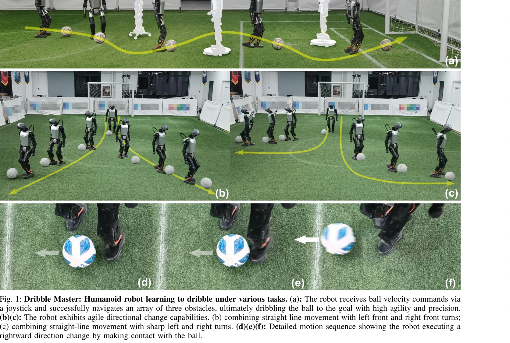
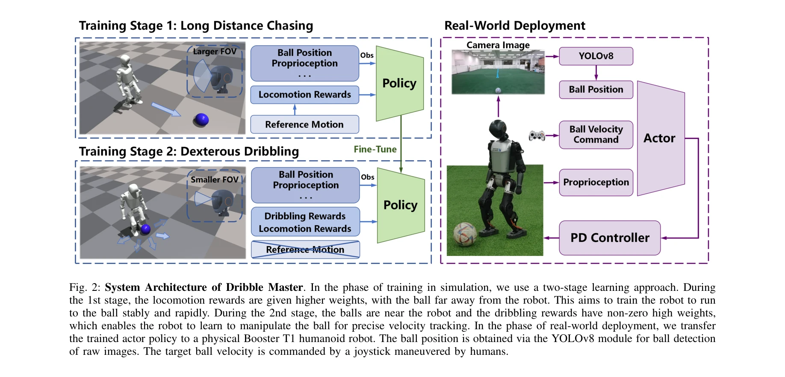

# Dribble Master: Learning Agile Humanoid Dribbling through Legged Locomotion

> **저자**: Zhuoheng Wang, Jinyin Zhou, Qi Wu | **날짜**: 2025-05-19 | **URL**: [https://arxiv.org/abs/2505.12679](https://arxiv.org/abs/2505.12679)

---

## Essence

*Fig. 1: Dribble Master: Humanoid robot learning to dribble under various tasks. (a): The robot receives ball velocity co*

이 논문은 두 단계 curriculum learning 프레임워크와 virtual camera 모델을 활용하여 휴머노이드 로봇이 시뮬레이션에서 학습한 드리블 정책을 실제 로봇에 성공적으로 전이하는 방법을 제시한다.

## Motivation

- **Known**: RL을 통한 휴머노이드 로봇의 동적 보행 학습과 사족 로봇의 드리블 기술 개발이 이루어졌으나, 실제 전신 휴머노이드로봇이 다양한 환경에서 지속적인 드리블을 수행하는 방법은 미개척 영역이다.
- **Gap**: 기존 규칙 기반 방식은 고정된 보행 패턴에 의존하며 실시간 공 동역학에 적응하기 어렵고, end-to-end 학습은 환경 일반화에 제한이 있으며, 계층적 방법은 신뢰할 수 있는 공 추적에 어려움을 겪는다.
- **Why**: 드리블은 동적 균형 유지와 정밀한 공 조작을 동시에 요구하는 복잡한 loco-manipulation 작업으로, 이를 해결하면 휴머노이드 로봇의 실세계 적용 가능성을 크게 확장할 수 있다.
- **Approach**: 두 단계 curriculum learning(기본 보행 학습 → 드리블 기술 미세조정), virtual camera 모델을 통한 현실적 시각 제약 시뮬레이션, 능동 감지 보상 설계로 로봇의 자율적 시각 범위 확대를 구현한다.

## Achievement

*Fig. 1: Dribble Master: Humanoid robot learning to dribble under various tasks. (a): The robot receives ball velocity co*

- **두 단계 curriculum learning 프레임워크**: 불안정한 비대칭 접촉으로 인한 희소 보상과 조기 종료 문제를 해결하며, 로봇이 단계적으로 드리블 기술을 습득 가능
- **Virtual camera 모델 및 능동 감지**: 시뮬레이션에서 실제 로봇의 시야 제약을 반영하고, 보상 함수를 통해 능동적 공 추적을 유도하여 시뮬-실제 간극 감소
- **실제 로봇 배포 성공**: Booster T1 휴머노이드에 정책 전이 성공, 다양한 지형과 도전적 시나리오에서 민첩하고 정밀한 드리블 시연
- **다중 환경 일반화**: 학습 기반 휴머노이드 드리블이 다양한 지형(인공 잔디, 포트홀 등)에서 유연하고 시각적으로 매력적인 동작 수행

## How

*Fig. 2: System Architecture of Dribble Master. In the phase of training in simulation, we use a two-stage learning appro*

- PPO(Proximal Policy Optimization)를 비대칭 액터-크리틱 구조로 구현, 훈련 중 privileged information 활용
- 관찰 공간: 공 속도 명령(x, y), 관절 위치/속도, 신체 방향, 공이 시야 범위 내인지 여부, 리듬적 보행 유도용 sinusoidal clock signal
- 행동 공간: 머리(2-DOF) 및 다리(12-DOF)의 관절 목표 위치 제어, PD 컨트롤러로 추적
- 보상 함수를 두 단계로 설계: 1단계는 기본 보행 안정성, 2단계는 공 속도 추적 정확도 및 능동 감지 포함
- Virtual camera 모델로 시뮬레이션에서 실제 카메라의 시야각, 왜곡, 차폐 현상 모사

## Originality

- 휴머노이드의 **다리를 이용한 정밀 loco-manipulation** 연구로, 기존 팔 기반 조작이나 사족 로봇 중심 드리블 연구와 구별
- Virtual camera 모델을 통한 **현실적 시각 제약의 시뮬레이션 구현**, 시뮬-실제 간극 감소의 새로운 접근
- 능동 감지 보상으로 **자율적 시각 범위 확대 유도**, 불연속적 시각 인식 문제 해결의 혁신적 접근법
- 두 단계 curriculum과 보상 설계로 **희소 보상 환경에서의 단계적 학습 전략** 제시

## Limitation & Further Study

- 관찰 공간에서 공 위치를 직접 입력받음(raw image 대신)으로, 완전한 시각 기반 학습의 한계 존재
- Virtual camera 모델이 실제 센서의 모든 특성(노이즈, 지연 등)을 완벽히 재현하는지 명시되지 않음
- Booster T1 특정 로봇에서만 실제 검증되었으므로, 다른 휴머노이드 플랫폼으로의 일반화 정도 불명확
- 논문에서 실패 사례나 한계 상황에 대한 상세 분석 부재
- **후속 연구**: raw visual input 기반 end-to-end 학습, 동적 환경 변화(풍, 지면 불규칙성 등)에 대한 강건성 강화, 다중 로봇 플랫폼 간 정책 전이 연구

## Evaluation

- Novelty: 4/5
- Technical Soundness: 3/5
- Significance: 4/5
- Clarity: 4/5
- Overall: 4/5

**총평**: 이 논문은 휴머노이드 로봇의 다리를 이용한 정밀 드리블 학습을 성공적으로 구현한 의미 있는 기여로, virtual camera 모델과 능동 감지 보상 설계를 통해 시뮬-실제 전이 문제를 창의적으로 해결하며 실제 로봇 배포까지 성공했다.

## Related Papers

- 🏛 기반 연구: [[papers/1399_FLAM_Foundation_Model-Based_Body_Stabilization_for_Humanoid/review]] — FLAM의 human motion reconstruction 기반 안정화 방법이 드리블링 동작의 전신 균형 제어에 필수적인 기반 기술을 제공한다.
- 🔗 후속 연구: [[papers/1410_Gait-Conditioned_Reinforcement_Learning_with_Multi-Phase_Cur/review]] — Gait-Conditioned RL의 다단계 보행 전환 방법을 드리블링 중 방향 전환과 속도 변화에 적용할 수 있다.
- 🔄 다른 접근: [[papers/1447_HiFAR_Multi-Stage_Curriculum_Learning_for_High-Dynamics_Huma/review]] — HiFAR의 multi-stage curriculum과 Dribble Master의 two-stage curriculum이 각각 다른 방식으로 복잡한 동적 기술을 단계별로 학습한다.
- 🏛 기반 연구: [[papers/1410_Gait-Conditioned_Reinforcement_Learning_with_Multi-Phase_Cur/review]] — Gait-Conditioned RL의 다양한 보행 모드와 전환 방법이 드리블링과 같은 복잡한 동적 기술의 기반 제어 기술이 된다.
- 🔗 후속 연구: [[papers/1399_FLAM_Foundation_Model-Based_Body_Stabilization_for_Humanoid/review]] — FLAM의 인간 동작 기반 안정화 방법을 드리블링과 같은 동적 기술에 적용하면 더욱 안정적인 볼 컨트롤이 가능하다.
- 🔄 다른 접근: [[papers/1518_Learning_Agile_Striker_Skills_for_Humanoid_Soccer_Robots_fro/review]] — 두 논문 모두 휴머노이드의 축구 드리블 기술을 다루지만, 볼 킥킹 vs 드리블링이라는 서로 다른 축구 기술에 집중함
- 🔄 다른 접근: [[papers/1536_Learning_Soccer_Skills_for_Humanoid_Robots_A_Progressive_Per/review]] — 두 논문 모두 휴머노이드 축구 기술을 다루지만, 통합적 점진적 학습 vs 드리블 특화 학습이라는 서로 다른 접근법을 제시함
