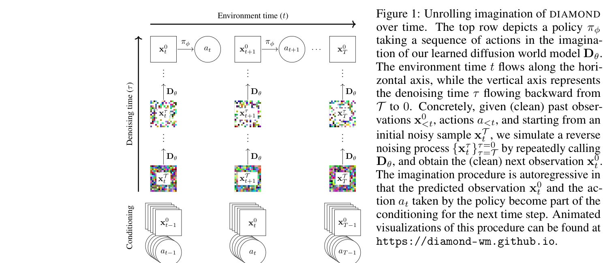
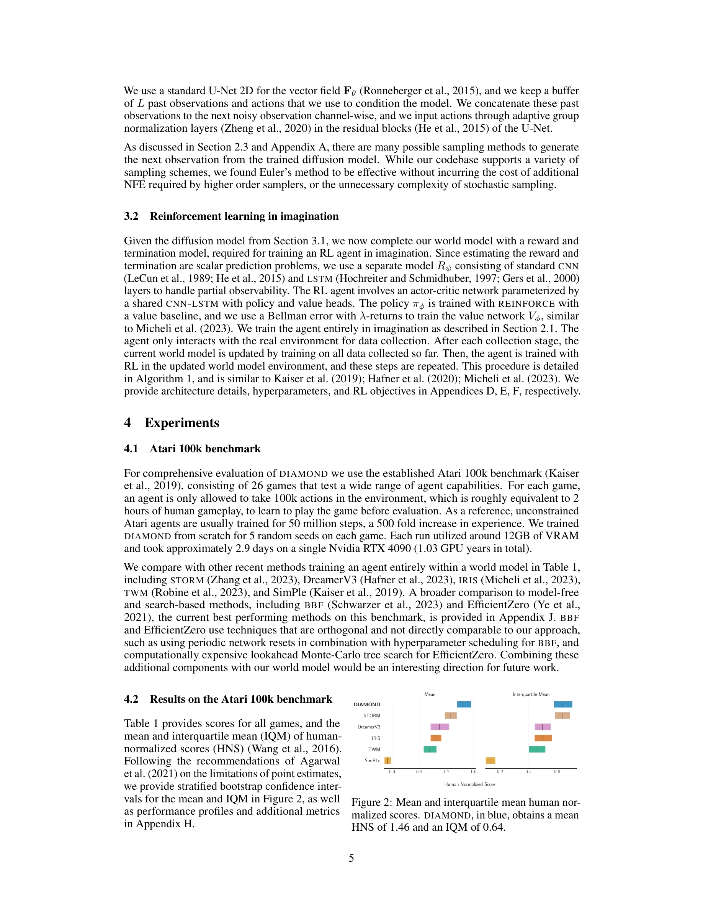

# Diffusion for World Modeling: Visual Details Matter in Atari

> **저자**: Eloi Alonso, Adam Jelley, Vincent Micheli, Anssi Kanervisto, Amos Storkey, Tim Pearce, François Fleuret | **날짜**: 2024-05-20 | **URL**: [https://arxiv.org/abs/2405.12399](https://arxiv.org/abs/2405.12399)

---

## Essence

*Figure 1: Unrolling imagination of DIAMOND*

DIAMOND는 diffusion model을 기반으로 한 world model을 제안하여 RL 에이전트를 학습시키며, 이산 잠재 변수 기반 방식보다 시각적 세부 정보를 더 잘 보존함으로써 Atari 100k 벤치마크에서 새로운 최고 성능을 달성한다.

## Motivation

- **Known**: 최근 world model들은 이산 잠재 변수 시퀀스로 환경 역학을 모델링하고 있으며, diffusion model은 이미지 생성에서 지배적인 접근법이 되고 있다.
- **Gap**: 이산 표현으로의 압축은 RL에 중요한 시각적 세부 정보를 손실시킬 수 있으며, 이를 보정하기 위해 이산 잠재 변수 수를 늘리면 계산 비용이 증가한다.
- **Why**: diffusion model은 고해상도 이미지 생성에 우수하고 다중모달 분포를 유연하게 모델링하며 쉬운 조건화를 제공하므로 world modeling에 적합한 패러다임 전환을 나타낸다.
- **Approach**: DIAMOND는 diffusion model을 world model로 사용하여 과거 관찰과 행동에 조건화된 다음 관찰을 직접 생성하고, RL 에이전트가 상상 공간에서 정책을 학습하도록 설계되었다.

## Achievement

*Figure 2: Mean and interquartile mean human nor-*

- **성능 개선**: Atari 100k 벤치마크에서 평균 인간 정규화 점수 1.46을 달성하여 world model 내에서만 학습된 에이전트의 새로운 최고 기록을 수립
- **시각적 세부 정보 보존**: 이산 latent variable 기반 방식보다 시각적으로 중요한 세부 정보(예: 약한 적, 거리의 물체)를 더 잘 모델링
- **일반화 가능성**: 87시간의 Counter-Strike: Global Offensive 게임플레이로 학습된 대화형 신경망 게임 엔진으로서 diffusion world model의 독립적인 유용성을 입증
- **재현 가능성**: 코드, 에이전트, 비디오 및 상호작용 가능한 world model을 공개하여 향후 연구 장려

## How

*Figure 1: Unrolling imagination of DIAMOND*

- Score-based diffusion model을 조건화하여 p(x_{t+1} | x_{≤t}, a_{≤t})를 모델링하고 denoising score matching 목적함수로 학습
- 자기회귀적 상상 절차에서 예측된 관찰과 정책의 행동을 다음 시간 단계의 조건으로 사용
- 환경 시간 t와 denoising 시간 τ 사이의 2D 격자 구조로 장기간 안정성 확보
- 다중-스텝 샘플링과 단일-스텝 샘플링 간의 설계 선택 최적화를 통한 효율성 개선
- RL 훈련 루프에 world model 훈련을 통합하여 반복적으로 수집, 모델 훈련 및 상상 내 정책 학습을 수행

## Originality

- World modeling을 위해 diffusion model을 적용하는 것이 새로운 접근이며, 이는 기존의 이산 latent variable 패러다임에서 연속 확산 과정 패러다임으로의 전환을 나타냄
- 시각적 세부 정보 보존의 중요성을 명시적으로 강조하고 검증하여 world model 설계의 근본적인 고려사항을 부각
- Static 게임플레이 데이터만으로 대화형 신경망 게임 엔진을 구축하는 응용이 혁신적

## Limitation & Further Study

- Diffusion model의 다단계 생성 과정은 이산 latent model보다 계산 비용이 더 많이 들 수 있으며, 실시간 응용에 확장성이 제한될 가능성
- Atari 100k 벤치마크에 특화된 성과이므로 다른 도메인(예: 복잡한 연속 제어)에서의 일반화 성능이 미검증
- Counter-Strike 응용은 static 데이터로 학습되어 동적 환경 변화에 대한 적응 능력이 제한될 수 있음
- 후속 연구는 더 복잡한 환경에서의 확장, 계산 효율성 개선, 그리고 실제 로봇 제어 작업에서의 검증이 필요

## Evaluation

- Novelty: 4/5
- Technical Soundness: 3/5
- Significance: 4/5
- Clarity: 4/5
- Overall: 4/5

**총평**: DIAMOND는 diffusion model을 world modeling에 체계적으로 적용하여 시각적 세부 정보 보존의 중요성을 입증하며, Atari 100k 벤치마크의 새로운 최고 성능과 다양한 응용을 통해 실질적인 가치를 제시한다.

## Related Papers

- 🔄 다른 접근: [[papers/1337_Compose_Your_Policies_Improving_Diffusion-based_or_Flow-base/review]] — DIAMOND의 diffusion world model과 GPC의 정책 조합 방식은 생성형 모델을 활용한 로봇 정책 설계의 서로 다른 관점을 제시한다
- 🔗 후속 연구: [[papers/1472_Mastering_Diverse_Domains_through_World_Models/review]] — DreamerV3의 world model 기반 범용 RL이 DIAMOND의 diffusion world model 아이디어를 더 일반적인 도메인으로 확장한 버전이다
- 🔄 다른 접근: [[papers/1400_GAIA-1_A_Generative_World_Model_for_Autonomous_Driving/review]] — GAIA-1과 DIAMOND 모두 생성형 world model을 다루지만, 자율주행 vs 게임 환경이라는 서로 다른 응용 도메인을 적용한다
- 🔄 다른 접근: [[papers/1400_GAIA-1_A_Generative_World_Model_for_Autonomous_Driving/review]] — GAIA-1과 DIAMOND 모두 생성형 world model을 활용하지만, 자율주행 시나리오 vs 게임 환경이라는 서로 다른 응용 도메인을 다룬다
- 🏛 기반 연구: [[papers/1472_Mastering_Diverse_Domains_through_World_Models/review]] — DreamerV3의 world model 기반 범용 RL 알고리즘이 DIAMOND의 diffusion world model 설계에 도메인 간 일반화와 안정적 학습의 이론적 기반을 제공한다
- 🏛 기반 연구: [[papers/1494_NORA-15_A_Vision-Language-Action_Model_Trained_using_World_M/review]] — world model 기반 학습에서 시각적 세부사항의 중요성을 다룬 연구로 NORA-1.5의 world model 훈련 방법론에 이론적 기반을 제공한다.
- 🔄 다른 접근: [[papers/1337_Compose_Your_Policies_Improving_Diffusion-based_or_Flow-base/review]] — GPC의 사전학습 정책 조합 방식과 DIAMOND의 diffusion 기반 world model은 생성형 정책 설계에서 서로 다른 접근법을 비교할 수 있다
