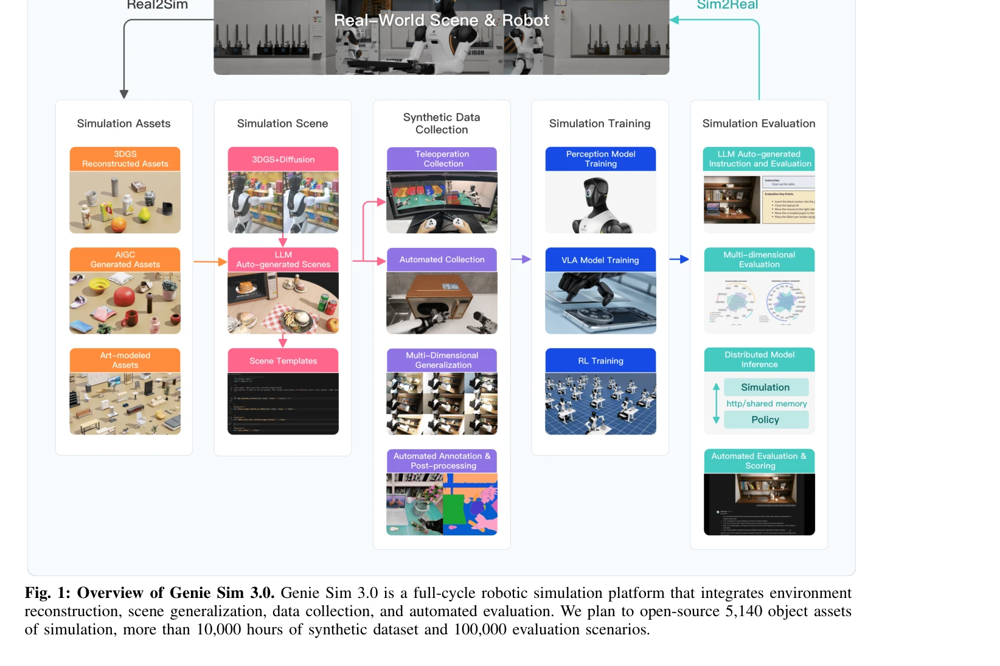

# DualTHOR: A Dual-Arm Humanoid Simulation Platform for Contingency-Aware Planning

> **저자**: Boyu Li, Siyuan He, Hang Xu, Haoqi Yuan, Yu Zang, Liwei Hu, Junpeng Yue, Zhenxiong Jiang, Pengbo Hu, Börje F. Karlsson, Yehui Tang, Zongqing Lu | **날짜**: 2025-06-19 | **URL**: [https://arxiv.org/abs/2506.16012](https://arxiv.org/abs/2506.16012)

---

## Essence

*Fig. 1: Overview of Genie Sim 3.0. Genie Sim 3.0 is a full-cycle robotic simulation platform that integrates environment*

DualTHOR는 실제 로봇 자산과 contingency 메커니즘을 포함한 dual-arm humanoid 로봇용 물리 기반 시뮬레이션 플랫폼으로, 현실 세계의 stochastic 실행을 반영하여 VLM의 robust성과 generalization을 평가한다.

## Motivation

- **Known**: AI2-THOR 같은 시뮬레이션 플랫폼이 embodied AI 학습을 가능하게 했으나, 대부분 simplified robot morphologies를 사용하고 low-level 실행의 stochastic 특성을 무시한다.
- **Gap**: 현존 시뮬레이션 플랫폼은 dual-arm collaboration, 현실적 contingencies, 실제 로봇 morphologies를 충분히 다루지 못하여 sim-to-real transfer 능력이 제한적이다.
- **Why**: Embodied AI의 실제 배포를 위해서는 복잡한 dual-arm 작업, 실제 로봇 역학, 그리고 potential failures를 포함한 현실적 시뮬레이션 환경이 필수적이다.
- **Approach**: AI2-THOR의 확장 버전을 기반으로 실제 로봇 자산, dual-arm collaboration 작업 스위트, humanoid robot용 inverse kinematics solver, 그리고 physics-based low-level 실행을 통한 contingency 메커니즘을 통합한다.

## Achievement

*Fig. 1: Overview of Genie Sim 3.0. Genie Sim 3.0 is a full-cycle robotic simulation platform that integrates environment*

- **현실 기반 시뮬레이션 플랫폼**: 실제 로봇 자산과 humanoid 형태학을 포함하여 sim-to-real gap을 감소시킨다.
- **Contingency 메커니즘**: physics-based low-level 실행을 통해 potential failures를 모의하여 현실적 시나리오를 반영한다.
- **Dual-arm 작업 스위트**: dual-arm collaboration을 요구하는 복잡한 interactive tasks를 제공한다.
- **Comprehensive 평가**: 현재 VLM들이 dual-arm coordination과 contingency 상황에서 제한된 robustness를 보임을 실증한다.
- **오픈소스 공개**: 코드 및 자산을 공개하여 커뮤니티 기여를 활성화한다.

## How

- AI2-THOR 플랫폼을 dual-arm humanoid robot 지원으로 확장
- 실제 로봇 공학 자산 및 정밀한 역학 모델 통합
- Contingency 메커니즘을 통해 execution 실패 (예: 부정확한 grasp, 접촉 불안정성) 시뮬레이션
- Household environment에서 dual-arm collaboration이 필요한 작업 데이터셋 구성
- VLM의 robustness와 generalization을 평가하는 벤치마크 설계
- Vision Language Model을 활용한 작업 수행 능력 평가

## Originality

- Dual-arm humanoid robot 시뮬레이션에 contingency 메커니즘을 최초로 통합하여 현실적 실패 모드를 반영
- Physics-based low-level 실행을 통한 stochastic 불확실성의 현실적 모델링
- AI2-THOR 기반의 dual-arm 특화 확장으로 기존 플랫폼과 차별화
- Household 환경에서 VLM의 다중 팔 coordination 능력에 대한 최초의 종합적 평가

## Limitation & Further Study

- 시뮬레이션 환경의 물리 엔진이 모든 현실적 상호작용(예: 마찰, 변형성)을 완벽히 캡처하지 못할 가능성
- Contingency 메커니즘의 확률 모델이 실제 로봇의 실패 분포와 정확히 일치하지 않을 수 있음
- 현재 평가가 주로 VLM에 초점이 맞춰져 있어 다른 embodied AI 접근법(예: reinforcement learning)의 검증 필요
- 평가 지표가 성공/실패 이진 기준에 의존할 가능성이 있으며, 더 세밀한 task completion 품질 평가 메커니즘 부족
- 후속 연구: 실제 로봇 플랫폼에서의 sim-to-real transfer 검증, 보다 다양한 contingency 시나리오 추가, 다중 embodiment 지원 확대

## Evaluation

- Novelty: 4/5
- Technical Soundness: 3/5
- Significance: 4/5
- Clarity: 4/5
- Overall: 4/5

**총평**: DualTHOR은 dual-arm humanoid 로봇의 현실적 시뮬레이션을 위한 중요한 기여로, contingency 메커니즘을 통해 시뮬레이션-현실 격차를 줄이고 VLM의 robust한 embodied AI 개발을 가능하게 한다. 다만 실제 로봇 배포 검증과 보다 다양한 contingency 시나리오 확장이 필요하다.

## Related Papers

- 🧪 응용 사례: [[papers/1335_Code-as-Monitor_Constraint-aware_Visual_Programming_for_Reac/review]] — dual-arm humanoid 시뮬레이션에서 constraint-aware monitoring을 contingency 상황에 적용
- 🔗 후속 연구: [[papers/1417_GRUtopia_Dream_General_Robots_in_a_City_at_Scale/review]] — DualTHOR 플랫폼이 GRUtopia 대규모 환경에서 dual-arm 작업의 scalability 검증으로 확장
- 🔗 후속 연구: [[papers/1407_Genie_Generative_Interactive_Environments/review]] — 생성형 환경 모델이 DualTHOR와 같은 특화된 시뮬레이션 플랫폼 구축으로 발전
- 🔗 후속 연구: [[papers/1335_Code-as-Monitor_Constraint-aware_Visual_Programming_for_Reac/review]] — VLM 기반 constraint monitoring을 dual-arm humanoid 환경에서 contingency 메커니즘과 함께 확장 적용
- 🧪 응용 사례: [[papers/1413_GBC_Generalized_Behavior-Cloning_Framework_for_Whole-Body_Hu/review]] — GBC의 cross-humanoid 행동 복제가 DualTHOR 플랫폼에서 다양한 humanoid 형태 실험에 적용
