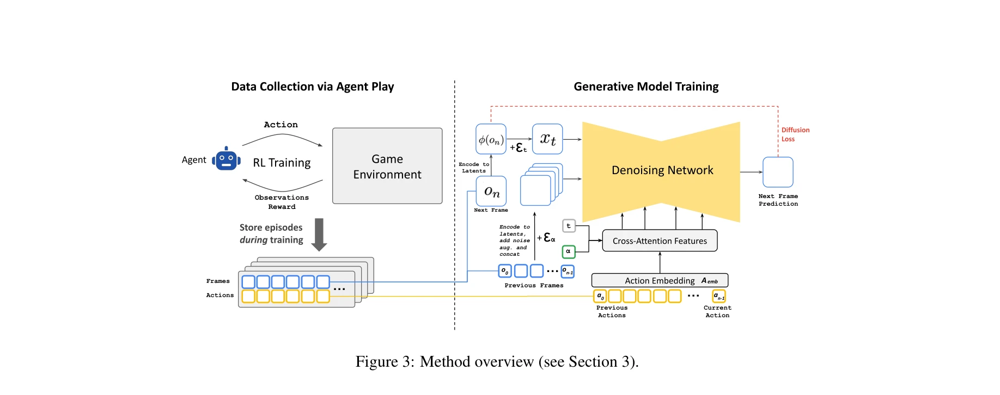
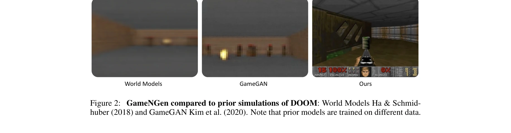
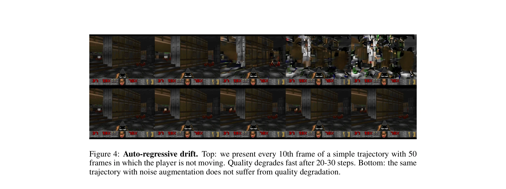

# Diffusion Models Are Real-Time Game Engines

> **저자**: Dani Valevski, Yaniv Leviathan, Moab Arar, Shlomi Fruchter | **날짜**: 2024-08-27 | **URL**: [https://arxiv.org/abs/2408.14837](https://arxiv.org/abs/2408.14837)

---

## Essence

*Figure 3: Method overview (see Section 3).*

GameNGen은 diffusion model을 기반으로 한 신경망 게임 엔진으로, DOOM을 실시간(20 FPS)으로 실행하면서 사람과 구별하기 어려운 수준의 시각적 품질과 게임 상태 일관성을 유지한다.

## Motivation

- **Known**: 최근 generative model들이 text나 이미지 조건으로 고품질 미디어 생성에 성공했으며, 몇몇 선행 연구들이 신경망으로 게임을 시뮬레이션하려 시도했다.
- **Gap**: 기존 게임 시뮬레이션 방식들은 게임 복잡도, 실시간 성능, 장시간 안정성, 또는 시각 품질 중 하나 이상이 부족했으며, interactive world simulation의 독특한 요구사항(스트림 입력 action 조건화)을 충분히 해결하지 못했다.
- **Why**: 신경망 기반 게임 엔진은 게임 개발 패러다임을 바꾸어 자동 생성 게임의 가능성을 열며, 실시간 복잡 환경 시뮬레이션의 실현 가능성을 입증하는 것은 AI 및 게임 산업에 중요하다.
- **Approach**: 두 단계 학습 방식을 채택했다: (1) RL agent가 게임을 플레이하며 학습 궤적 기록, (2) 과거 프레임과 action 시퀀스에 조건화된 diffusion model이 다음 프레임을 예측한다. 특히 noise augmentation으로 auto-regressive drift를 완화한다.

## Achievement

*Figure 2: GameNGen compared to prior simulations of DOOM: World Models Ha & Schmid-*

- **실시간 게임 엔진 실현**: 단일 TPU에서 20 FPS로 DOOM을 실시간 실행하면서 수 분 이상 안정적으로 유지
- **높은 시각 품질**: PSNR 29.4 달성(손실 JPEG 압축 수준), 5분 auto-regressive 생성 후에도 인간이 구별 거의 불가능
- **복잡 게임 상태 관리**: 체력, 탄약 계산, 적 공격, 물체 손상, 문 개방 등 장시간 상태 일관성 유지
- **기술적 기여**: text-to-image diffusion model의 interactive 환경 적응, noise augmentation을 통한 auto-regressive drift 완화, decoder fine-tuning으로 시각 품질 향상

## How

*Figure 4: Auto-regressive drift. Top: we present every 10th frame of a simple trajectory with 50*

- RL agent 학습: 환경 특화 보상 함수로 다양한 게임플레이 시나리오 커버하는 agent 훈련
- 학습 데이터 수집: agent 훈련 과정 전체의 action-observation 궤적을 Tagent 데이터셋으로 기록
- Diffusion model 적응: Stable Diffusion v1.4를 기반으로 text 조건화 제거, action을 embedding token으로 인코딩, 과거 프레임을 VAE 잠재공간에서 연결
- Noise augmentation: 학습 시간에 context 프레임에 가변 가우시안 노이즈 추가, 노이즈 레벨을 model input으로 제공하여 이전 프레임 오류 복구 능력 강화
- Decoder fine-tuning: VAE 디코더를 미세조정하여 시각 세부사항과 텍스트 렌더링 충실도 개선
- Velocity parameterization 손실: L2 손실로 velocity prediction vθ' 최적화

## Originality

- 처음으로 복잡한 비디오 게임을 실시간으로 시뮬레이션할 수 있는 완전히 신경망 기반의 게임 엔진 시연
- Interactive world simulation 문제의 독특한 특성(스트림 action 조건화)을 인식하고 noise augmentation으로 구체적 해결책 제시
- 기존 text-to-image diffusion model을 frame prediction으로 체계적으로 재목적화하는 방법 개발
- RL agent 플레이 궤적 전체(미숙한 단계 포함)를 학습 데이터로 활용하여 다양성 극대화

## Limitation & Further Study

- 완전한 게임 시뮬레이션이 아니며 통계적 근사치(Section 7 제한사항 논의)
- DOOM 특화 보상 함수 설계 필요로 완전한 일반화 미흡
- 단일 게임(DOOM)만 평가, 다른 복잡 게임으로의 확장성 미검증
- 새로운 게임을 자동 생성하는 대신 기존 게임 시뮬레이션만 가능
- Human input으로 완전히 새로운 게임을 생성하는 방법론 미개발
- 후속: 다양한 게임 장르와 복잡도에 대한 확장, 일반화 가능한 보상 함수 설계, 사용자 입력 기반 게임 생성 능력 개발

## Evaluation

- Novelty: 4/5
- Technical Soundness: 4/5
- Significance: 4/5
- Clarity: 4/5
- Overall: 4/5

**총평**: GameNGen은 신경망 게임 엔진의 실현 가능성을 처음 강력히 입증한 획기적 논문으로, noise augmentation을 통한 auto-regressive drift 해결, 체계적 적응 방법론, 실시간 성능과 고품질 시각화의 동시 달성이 높은 기술적 기여도를 보인다.

## Related Papers

- 🏛 기반 연구: [[papers/1452_Learning_Interactive_Real-World_Simulators/review]] — 실시간 게임 엔진으로서의 diffusion 모델이 상호작용 시뮬레이터의 핵심 기술적 기반을 제공합니다.
- 🏛 기반 연구: [[papers/1478_MineDreamer_Learning_to_Follow_Instructions_via_Chain-of-Ima/review]] — 실시간 게임 엔진으로서의 diffusion 모델이 Chain-of-Imagination의 시각적 생성 능력을 뒷받침합니다.
- 🏛 기반 연구: [[papers/1490_NavigateDiff_Visual_Predictors_are_Zero-Shot_Navigation_Assi/review]] — diffusion 모델의 실시간 생성 능력이 시각적 예측을 통한 제로샷 네비게이션의 핵심 기술입니다.
- 🔗 후속 연구: [[papers/1632_World_Simulation_with_Video_Foundation_Models_for_Physical_A/review]] — Diffusion Models as Game Engines의 실시간 생성을 물리 AI 도메인으로 확장하여 로봇 시뮬레이션을 구현했다
- 🏛 기반 연구: [[papers/1604_Video_Language_Planning/review]] — 실시간 게임 엔진으로서의 diffusion model 연구가 VLP의 text-to-video model 기반 상세 계획 생성에 이론적 기반을 제공한다.
- 🏛 기반 연구: [[papers/1421_Genie_Sim_30__A_High-Fidelity_Comprehensive_Simulation_Platf/review]] — 실시간 게임 엔진으로서의 diffusion 모델이 Genie Sim 3.0의 시뮬레이션 환경 구축에 이론적 기반을 제공한다.
