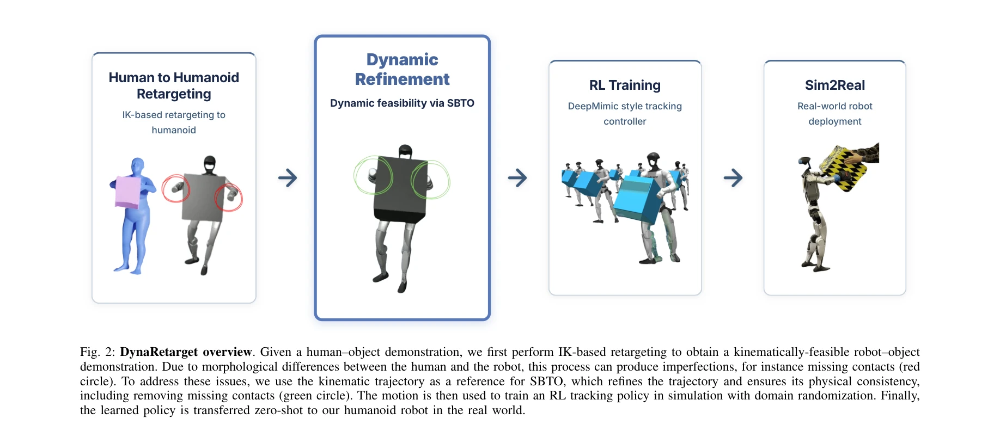
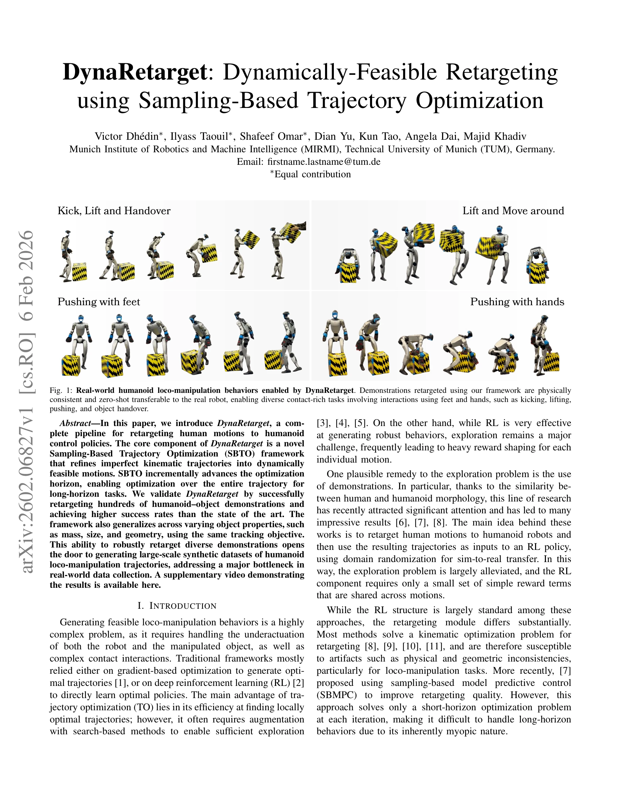

# DynaRetarget: Dynamically-Feasible Retargeting using Sampling-Based Trajectory Optimization

> **저자**: Victor Dhedin, Ilyass Taouil, Shafeef Omar, Dian Yu, Kun Tao, Angela Dai, Majid Khadiv | **날짜**: 2026-02-06 | **DOI**: [10.48550/arXiv.2602.06827](https://doi.org/10.48550/arXiv.2602.06827)

---

## Essence

*Fig. 2: DynaRetarget overview. Given a human–object demonstration, we first perform IK-based retargeting to obtain a kin*

DynaRetarget은 인간 동작을 휴머노이드 로봇으로 재타겟팅하기 위한 완전한 파이프라인으로, 샘플링 기반 궤적 최적화(SBTO)를 통해 운동학적 궤적을 동역학적으로 실현 가능한 동작으로 정제한다.

## Motivation

- **Known**: 기존 방법들은 IK 기반 재타겟팅으로 운동학적 궤적을 생성하거나 SBMPC를 사용하여 단기 지평선에서만 최적화를 수행했다. RL은 강건한 동작 생성에 효과적이지만 탐색이 어렵고 고품질 시연이 필요하다.
- **Gap**: 기존 SBMPC 기반 재타겟팅은 짧은 지평선에서만 최적화하므로 장기 동작에서 실패하기 쉽고, IK 기반 방법은 발 미끄러짐과 침투 같은 동역학적 불일치를 야기한다.
- **Why**: 휴머노이드 로봇의 로코-조작 행동 생성은 복잡하며, 대규모 합성 데이터셋 생성은 현실 데이터 수집의 병목이다. 안정적인 재타겟팅 방법은 RL 기반 정책 학습을 촉진하고 실제 로봇 배포를 가능하게 한다.
- **Approach**: IK 기반 재타겟팅으로 초기 궤적을 생성한 후, 동적 지평선을 점진적으로 증가시키며 전체 궤적을 최적화하는 새로운 SBTO 프레임워크를 제안한다. 최적화된 궤적을 RL로 추적 정책 학습에 사용한다.

## Achievement

*Fig. 1: Real-world humanoid loco-manipulation behaviors enabled by DynaRetarget. Demonstrations retargeted using our fra*

- **완전 지평선 최적화**: 기존의 단기 지평선 SBMPC와 달리, SBTO는 동적 지평선 진행을 통해 장기 동작 전체를 최적화하는 첫 번째 샘플링 기반 궤적 최적화 방법이다.
- **높은 재타겟팅 성공률**: 수백 개의 휴머노이드-물체 시연에서 SOTA 방법보다 훨씬 높은 성공률을 달성했다.
- **물체 특성 일반화**: 동일한 추적 목적 함수로 질량, 크기, 기하학 등 다양한 물체 특성에 걸쳐 강건하게 재타겟팅된다.
- **실제 로봇 배포**: 발차기, 들기, 밀기, 물체 전달 등 다양한 접촉 풍부한 로코-조작 작업에서 시뮬레이션에서 실제 로봇으로 제로샷 전이를 성공했다.

## How

*Fig. 2: DynaRetarget overview. Given a human–object demonstration, we first perform IK-based retargeting to obtain a kin*

- IK 기반 재타겟팅으로 초기 운동학적으로 실현 가능한 궤적 생성
- CEM 또는 MPPI 등 샘플링 기반 최적화를 사용하여 단일 슈팅 방식으로 제어 시퀀스 최적화
- 동적 지평선 프로그래밍: 초기 짧은 지평선에서 시작하여 점진적으로 최적화 지평선을 증가
- 보간 노트(knots)를 샘플링하여 탐색 공간 축소
- 동역학 제약, 접촉 일관성, 기하학적 제약 등을 비용 함수에 통합
- 최적화된 궤적으로 DeepMimic 스타일 추적 컨트롤러를 RL로 학습
- 도메인 랜더마이제이션을 통한 시뮬레이션-투-현실 전이

## Originality

- 동적 지평선 진행을 통한 완전 궤적 최적화는 기존 SBMPC의 근시적 최적화 문제를 해결하는 새로운 접근법이다.
- 장기 로코-조작 동작을 위한 샘플링 기반 전체 지평선 궤적 최적화(FHTO)는 처음 시도된 방법이다.
- 인간-휴머노이드 형태 차이를 보상하면서도 물체 특성 변화에 대한 강건한 일반화를 달성했다.
- 완전한 시뮬레이션-투-현실 파이프라인으로 실제 로봇 배포까지 시연했다.

## Limitation & Further Study

- 동적 지평선 증가 전략의 최적 파라미터 선택에 대한 체계적 가이드라인 부재
- 계산 비용 분석 및 확장성 검토 필요 (수백 동작에 대한 훈련 시간 미상)
- 특정 시뮬레이터(물리 엔진)에 의존적이며, 다른 로봇 형태로의 일반화 한계
- 후속 연구: 보다 효율적인 샘플링 전략, 실시간 온라인 최적화, 모델 기반 최적화 결합, 다중 접촉 시나리오 확장

## Evaluation

- Novelty: 4/5
- Technical Soundness: 4/5
- Significance: 4/5
- Clarity: 4/5
- Overall: 4/5

**총평**: DynaRetarget은 동적 지평선을 통한 완전 궤적 최적화로 기존 방법의 한계를 극복하고, 대규모 합성 데이터셋 생성을 가능하게 하는 실질적으로 중요한 기여다. 실제 로봇 배포까지 성공한 완전하고 검증된 파이프라인이다.

## Related Papers

- 🔄 다른 접근: [[papers/1254_AdaMimic_Towards_Adaptable_Humanoid_Control_via_Adaptive_Mot/review]] — 동작 재타겟팅을 다른 최적화 방법론으로 해결하는 접근법이다
- 🔗 후속 연구: [[papers/1493_Implicit_Kinodynamic_Motion_Retargeting_for_Human-to-humanoi/review]] — implicit 방법을 사용한 kinodynamic retargeting의 확장된 버전이다
- 🏛 기반 연구: [[papers/1600_Opt2Skill_Imitating_Dynamically-feasible_Whole-Body_Trajecto/review]] — humanoid trajectory optimization의 기본 프레임워크를 제공한다
- 🔄 다른 접근: [[papers/1254_AdaMimic_Towards_Adaptable_Humanoid_Control_via_Adaptive_Mot/review]] — 단일 참조 모션으로부터 humanoid 적응 제어를 학습하는 다른 접근 방식을 제시한다
