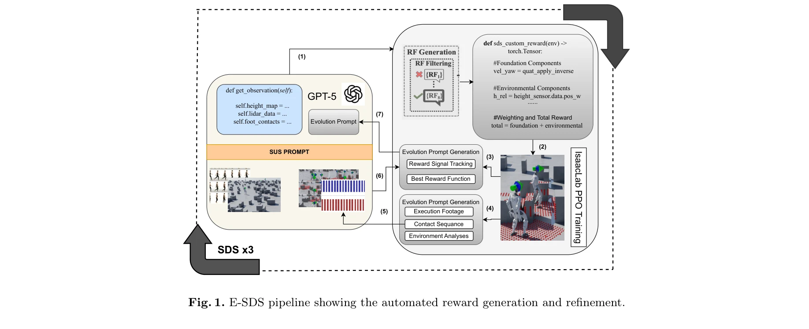
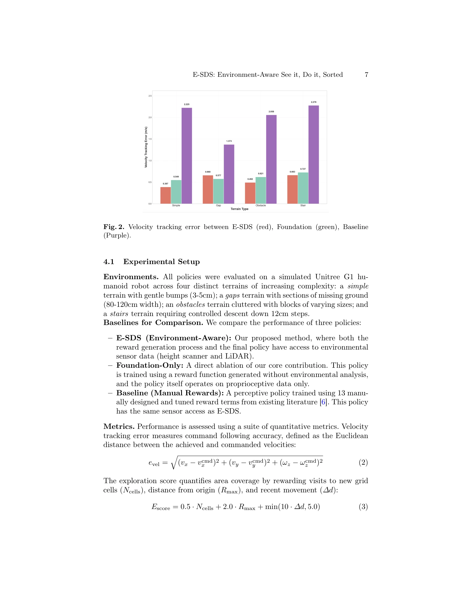

# E-SDS: Environment-aware See it, Do it, Sorted - Automated Environment-Aware Reinforcement Learning for Humanoid Locomotion

> **저자**: Enis Yalcin, Joshua O'Hara, Maria Stamatopoulou, Chengxu Zhou, Dimitrios Kanoulas | **날짜**: 2025-12-18 | **URL**: [https://arxiv.org/abs/2512.16446](https://arxiv.org/abs/2512.16446)

---

## Essence

*Fig. 1. E-SDS pipeline showing the automated reward generation and refinement.*

E-SDS는 VLM(Vision-Language Model)을 실시간 지형 센서 분석과 통합하여 인간형 로봇의 환경 인식 보행 정책 학습을 위한 보상 함수를 자동으로 생성하는 프레임워크이다. 이를 통해 매뉴얼 보상 설계의 병목을 제거하면서도 계단 하강 등 복잡한 동작을 수행할 수 있다.

## Motivation

- **Known**: VLM 기반 자동 보상 설계는 매뉴얼 엔지니어링 노력을 줄였으나, 환경 인식이 부족하여 단순 지형에만 적용 가능했다. 한편, 높이 스캐너와 LiDAR 같은 외수용성 센서를 통합한 지각 보행(perceptive locomotion)은 복잡한 지형에서 우수하나 여전히 매뉴얼 보상 설계에 의존한다.
- **Gap**: 자동 보상 생성과 환경 인식 제어의 통합이 부재했다. 자동화된 시스템은 지형을 인식하지 못하고, 지각 기반 시스템은 보상 설계를 자동화하지 못했다.
- **Why**: 보행 정책 개발의 병목인 매뉴얼 보상 엔지니어링을 제거하면서도 복잡한 지형(계단, 갭, 장애물)에서 강건한 정책을 생성할 수 있다면 로봇 제어의 확장성과 실용성이 크게 향상된다.
- **Approach**: E-SDS는 VLM을 사용한 멀티에이전트 시스템과 정량적 지형 분석(장애물 밀도, 갭 비율, 지형 거칠기)을 결합하여 환경 조건부 보상 함수 코드를 자동으로 생성하고, 훈련 피드백을 통해 반복적으로 실패 사례를 제거하며 개선한다.

## Achievement

*Fig. 2. Velocity tracking error between E-SDS (red), Foundation (green), Baseline*

- **자동 환경 인식 보상 생성**: 정량적 지형 통계에 조건화된 환경 인식 보상 함수 자동 생성 에이전트 개발
- **반복적 실패 제거**: 훈련 피드백을 활용한 폐루프 개선 프로세스로 인간 개입 없이 강건성 향상
- **복잡 행동 실현**: 자동 및 매뉴얼 방법 모두 실패한 계단 하강을 성공적으로 달성
- **성능 향상 및 시간 단축**: 속도 추적 오차 51.9-82.6% 감소, 보상 설계 시간을 수일에서 2시간 미만으로 단축

## How

*Fig. 1. E-SDS pipeline showing the automated reward generation and refinement.*

- Grid-Frame Prompting으로 비디오 데모를 VLM 처리 가능한 프레임 격자로 인코딩
- SUS(See it, Understand it, Sorted) 멀티스테이지 프롬프팅으로 접촉 시퀀스, 보행, 작업 요구사항 분석
- Environment Analysis Agent가 1000개 로봇 시뮬레이션으로 장애물 밀도, 갭 비율, 지형 거칠기 등 통계 계산
- 정량적 지형 컨텍스트를 행동 설명과 결합하여 VLM에 전달, Python 보상 함수 코드 생성
- NVIDIA Isaac Lab PPO 훈련으로 생성된 보상 함수 평가 및 Evolution Prompt로 자동 개선
- Unitree G1 인간형 로봇에서 792차원 관측(고유감각 + 높이 스캐너 27×21 그리드 + LiDAR 144 측정) 사용

## Originality

- 자동 보상 생성(VLM 기반)과 환경 인식 제어(센서 기반)의 최초 통합으로, 지형 통계를 보상 합성에 직접 조건화
- Environment Analysis Agent의 도입으로 정량적 지형 특성(갭 비율, 장애물 밀도 등)을 자동 보상 생성 루프에 포함
- 훈련 피드백 기반 폐루프 개선(Evolution Prompt)으로 인간 개입 없이 정책 강건성을 반복적으로 향상
- 단순 지형부터 계단까지 다양한 지형에서 지각 보행 정책의 자동 생성 가능성 입증

## Limitation & Further Study

- Unitree G1 단일 플랫폼에서만 평가되어 다른 인간형 로봇으로의 일반화 가능성 미검증
- GPT-5 같은 고급 VLM에 대한 의존도가 높아 접근성 제약 가능성
- 환경 분석을 위해 1000개 로봇 시뮬레이션이 필요하여 계산 비용이 상당할 수 있음
- 실제 하드웨어에서의 시뮬 투 리얼(sim-to-real) 전이 성과 미제시
- **후속 연구**: 다양한 플랫폼 검증, sim-to-real 갭 해소, 계산 효율성 개선, 더 복잡한 다작업 학습으로 확장

## Evaluation

- Novelty: 4/5
- Technical Soundness: 3/5
- Significance: 4/5
- Clarity: 4/5
- Overall: 4/5

**총평**: E-SDS는 자동 보상 설계와 환경 인식 제어 사이의 중요한 갭을 처음 해결하여, 매뉴얼 엔지니어링 없이 복잡한 지형 보행을 실현했다는 점에서 원칙 있고 고도로 주목할 만한 기여이다. 계단 하강 성공 및 대폭적인 오차 감소는 실무적 영향을 보여주나, 단일 플랫폼 평가와 sim-to-real 검증 부족이 한계이다.

## Related Papers

- 🏛 기반 연구: [[papers/1444_Language_to_Rewards_for_Robotic_Skill_Synthesis/review]] — Language to Rewards의 자연어 기반 보상 생성 방법이 E-SDS의 VLM 기반 보상 함수 자동 생성의 이론적 기반이 된다.
- 🧪 응용 사례: [[papers/1395_FastStair_Learning_to_Run_Up_Stairs_with_Humanoid_Robots/review]] — E-SDS의 환경 인식 보상 생성 방법을 FastStair의 계단 등반과 같은 특정 지형 과제에 직접 적용할 수 있다.
- 🔗 후속 연구: [[papers/1409_Gait-Adaptive_Perceptive_Humanoid_Locomotion_with_Real-Time/review]] — 실시간 지형 재구성과 E-SDS의 환경 인식을 결합하면 더욱 정교한 지형 적응 보행이 가능하다.
- 🔗 후속 연구: [[papers/1409_Gait-Adaptive_Perceptive_Humanoid_Locomotion_with_Real-Time/review]] — 실시간 지형 재구성과 E-SDS의 환경 인식 보상 생성을 결합하면 더욱 적응적인 지형 주행이 가능하다.
- 🏛 기반 연구: [[papers/1395_FastStair_Learning_to_Run_Up_Stairs_with_Humanoid_Robots/review]] — E-SDS의 환경 인식 보상 생성 방법이 FastStair의 계단 등반과 같은 특정 지형 과제에 대한 적응적 학습을 가능하게 한다.
- 🔗 후속 연구: [[papers/1402_FocusNav_Spatial_Selective_Attention_with_Waypoint_Guidance/review]] — FocusNav의 spatial attention과 E-SDS의 환경 인식을 결합하면 더욱 정교한 지형 인식 네비게이션이 가능하다.
