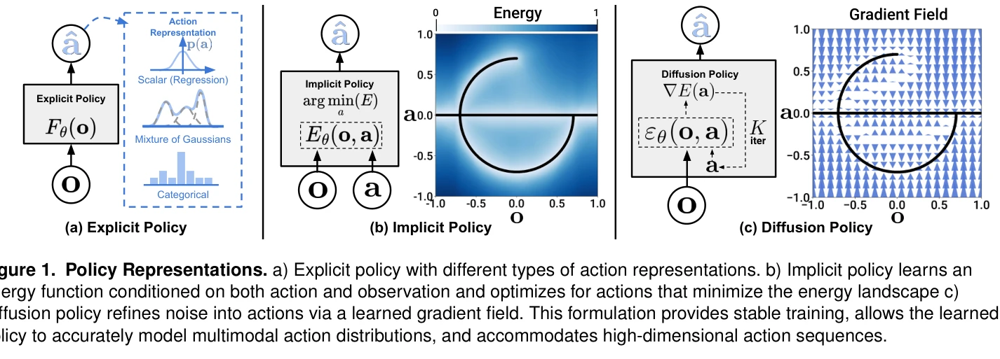
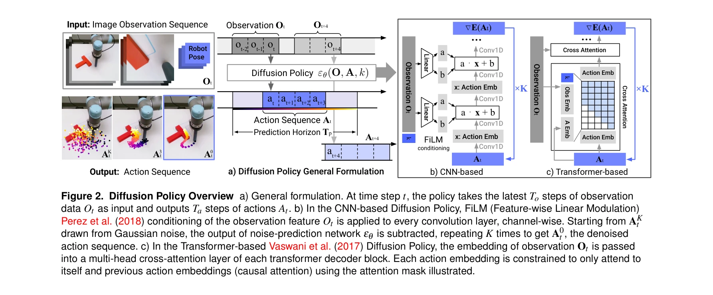

# Diffusion Policy: Visuomotor Policy Learning via Action Diffusion

> **저자**: Cheng Chi, Zhenjia Xu, Siyuan Feng, Eric Cousineau, Yilun Du, Benjamin Burchfiel, Russ Tedrake, Shuran Song | **날짜**: 2023-03-07 | **URL**: [https://arxiv.org/abs/2303.04137](https://arxiv.org/abs/2303.04137)

---

## Essence

*Figure 1. Policy Representations. a) Explicit policy with different types of action representations. b) Implicit policy *

Robot 조작 작업을 위한 visuomotor policy를 conditional denoising diffusion process로 표현하는 Diffusion Policy를 제안하며, 4개 벤치마크의 15개 작업에서 평균 46.9% 성능 향상을 달성했다.

## Motivation

- **Known**: 기존 robot policy learning은 multimodal action distribution, high-dimensional action space, training instability 문제를 안고 있으며, 이를 해결하기 위해 mixture of Gaussians나 categorical representation 같은 다양한 action representation이 제안되었다.
- **Gap**: Diffusion model의 강력한 생성 능력이 robot policy learning에 충분히 활용되지 못했으며, visuomotor policy로 적용할 때 필요한 receding horizon control, visual conditioning, time-series 구조 등의 기술적 해결책이 부재했다.
- **Why**: Robot manipulation은 multimodal behavior, 긴 시간적 상관성, 높은 정밀도를 동시에 요구하므로, 이를 안정적으로 모델링할 수 있는 정교한 policy representation이 중요하다.
- **Approach**: Diffusion Policy는 robot action을 DDPM의 denoising process로 모델링하여 noise prediction network가 action-score gradient를 학습하고, stochastic Langevin dynamics를 통해 iterative refinement를 수행한다.

## Achievement

*Figure 2. Diffusion Policy Overview a) General formulation. At time step t, the policy takes the latest To steps of obse*

- **Multimodal action distribution 표현**: Score function의 gradient 학습을 통해 arbitrary normalizable distribution을 정확하게 모델링할 수 있다.
- **High-dimensional action space 확장성**: 단일 action이 아닌 action sequence 예측이 가능하여 temporal consistency를 개선한다.
- **안정적인 학습**: Negative sampling 없이 gradient field를 직접 학습하여 energy-based model의 학습 불안정성을 해결한다.
- **뛰어난 벤치마크 성능**: 15개 작업에서 일관되게 기존 state-of-the-art 방법을 46.9% 초과 달성한다.
- **기술적 기여**: Receding horizon control, visual conditioning (FiLM), transformer-based architecture를 통해 실제 robot 적용을 가능하게 한다.

## How

*Figure 2. Diffusion Policy Overview a) General formulation. At time step t, the policy takes the latest To steps of obse*

- Denoising Diffusion Probabilistic Model (DDPM)을 robot action space에 적용하여 xK ~ N(0,I)에서 시작하는 K iteration의 denoising process로 action sequence를 생성
- Noise schedule (α, γ, σ)을 iteration step k의 함수로 정의하여 gradient descent의 learning rate scheduling으로 해석
- Visual observation Ot를 conditioning variable로 도입하고 FiLM (Feature-wise Linear Modulation)을 사용하여 CNN 기반 architecture에 통합
- Transformer 기반 architecture 제안으로 over-smoothing을 감소시키고 high-frequency action change와 velocity control 성능 향상
- Receding horizon control을 통해 Ta step의 action sequence를 예측하면서 매 time step마다 replanning하는 closed-loop 구조 구현
- Training은 random noise ε_k를 data에 추가한 후 noise prediction network εθ가 이를 예측하도록 MSE loss로 최적화
- 15개 작업의 behavior cloning 평가: simulation과 real-world, 2DoF~6DoF, single/multi-task, rigid/fluid objects 포함

## Originality

- Diffusion model을 robot visuomotor policy에 처음으로 적용한 것으로, generative modeling의 강점을 policy learning에 창의적으로 전이
- Score function gradient learning 관점에서 diffusion process를 gradient descent로 재해석하여 theoretical foundation 제공
- Receding horizon control과 diffusion의 결합으로 long-horizon planning과 responsiveness의 균형을 새롭게 달성
- Vision-conditioned diffusion formulation으로 visual feature를 joint distribution이 아닌 conditioning으로 처리하여 계산 효율성 혁신
- Time-series diffusion transformer라는 새로운 network architecture로 CNN의 over-smoothing 문제를 transformer의 causal attention으로 해결

## Limitation & Further Study

- K iteration의 denoising step이 필요하므로 inference 시간이 single-step policy에 비해 증가하며, real-time 적용 시 latency 고려 필요
- Diffusion model의 학습이 다른 방법보다 더 많은 computational resource를 요구할 가능성
- Behavior cloning으로만 평가되었으므로 reinforcement learning이나 interactive learning paradigm에서의 성능 미검증
- Noise schedule hyperparameter 선택이 성능에 미치는 영향에 대한 심화 분석 부족
- 다양한 robot morphology와 task domain (예: assembly, contact-rich manipulation)에서의 일반화 성능 검증 필요
- 후속 연구로 online adaptation, meta-learning, multi-task transfer learning 연구 가능

## Evaluation

- Novelty: 4/5
- Technical Soundness: 4/5
- Significance: 4/5
- Clarity: 4/5
- Overall: 4/5

**총평**: Diffusion model의 강력한 생성 능력을 robot policy learning에 창의적으로 도입하여 multimodality, scalability, training stability 문제를 동시에 해결한 획기적 연구로, 광범위한 실험과 기술적 기여를 통해 robot learning 분야에 새로운 패러다임을 제시한다.

## Related Papers

- 🔗 후속 연구: [[papers/1502_One-Step_Diffusion_Policy_Fast_Visuomotor_Policies_via_Diffu/review]] — One-step diffusion policy가 original diffusion policy의 추론 속도 문제를 해결하여 실시간 visuomotor control을 가능하게 한다.
- 🔄 다른 접근: [[papers/1580_Streaming_Flow_Policy_Simplifying_diffusionflow-matching_pol/review]] — Flow-matching policy가 diffusion policy와 다른 생성 모델 접근으로 visuomotor policy learning을 구현한다.
- 🔗 후속 연구: [[papers/1613_VITA_Vision-to-Action_Flow_Matching_Policy/review]] — Vision-to-action flow matching이 diffusion policy의 action diffusion 개념을 flow matching으로 확장한다.
- 🔗 후속 연구: [[papers/1423_Hierarchical_Diffusion_Policy_manipulation_trajectory_genera/review]] — 기본 Diffusion Policy를 hierarchical structure로 확장하여 contact-rich manipulation에 특화한 발전된 형태입니다.
- 🏛 기반 연구: [[papers/1429_HybridVLA_Collaborative_Diffusion_and_Autoregression_in_a_Un/review]] — Diffusion Policy의 연속성과 HybridVLA의 diffusion 기반 action 예측이 직접적인 방법론적 연관성을 갖는다.
- 🏛 기반 연구: [[papers/1465_ManiFlow_A_General_Robot_Manipulation_Policy_via_Consistency/review]] — Diffusion Policy의 기본 개념이 flow matching을 활용한 조작 정책의 이론적 기반을 제공합니다.
- 🏛 기반 연구: [[papers/1447_Latent_Action_Diffusion_for_Cross-Embodiment_Manipulation/review]] — Diffusion Policy의 visuomotor policy learning이 latent space에서의 diffusion policy 학습에 방법론적 기반을 제공한다.
- 🏛 기반 연구: [[papers/1524_Reactive_Diffusion_Policy_Slow-Fast_Visual-Tactile_Policy_Le/review]] — slow-fast 계층 구조의 Reactive Diffusion Policy가 기본적인 Diffusion Policy의 visuomotor 학습 프레임워크를 기반으로 확장되었다.
- 🔗 후속 연구: [[papers/1566_Scaling_Up_and_Distilling_Down_Language-Guided_Robot_Skill_A/review]] — Diffusion Policy의 visuomotor 정책 학습을 다중 작업 언어 조건 환경으로 확장하여 더 복잡한 로봇 스킬 증류를 가능하게 한다.
- 🏛 기반 연구: [[papers/1580_Streaming_Flow_Policy_Simplifying_diffusionflow-matching_pol/review]] — 확산 정책의 기본 아이디어를 스트리밍 플로우로 단순화하여 실시간 액션 생성을 가능하게 한다.
- 🔄 다른 접근: [[papers/1611_PhysDiff_Physics-Guided_Human_Motion_Diffusion_Model/review]] — visuomotor policy를 위한 diffusion 접근법이 PhysDiff의 human motion 중심 접근법과 다른 응용 영역을 보인다
- 🏛 기반 연구: [[papers/1364_Diffusion-VLA_Generalizable_and_Interpretable_Robot_Foundati/review]] — Diffusion Policy의 기본 diffusion 기반 정책 학습이 Diffusion-VLA의 이론적 기반이다.
- 🏛 기반 연구: [[papers/1584_NoMaD_Goal_Masked_Diffusion_Policies_for_Navigation_and_Expl/review]] — NoMaD가 기반으로 하는 diffusion policy의 원리와 구현 방법을 Diffusion Policy 논문에서 제시
- 🏛 기반 연구: [[papers/1337_Compose_Your_Policies_Improving_Diffusion-based_or_Flow-base/review]] — Diffusion Policy의 확산 기반 정책 학습 방법론이 GPC의 diffusion 정책 조합 설계에 이론적 기반을 제공한다
- 🔄 다른 접근: [[papers/1339_Consistency_Policy_Accelerated_Visuomotor_Policies_via_Consi/review]] — 둘 다 diffusion policy 기반이지만 Consistency Policy는 consistency distillation을, Diffusion Policy는 원본 diffusion을 사용한다.
