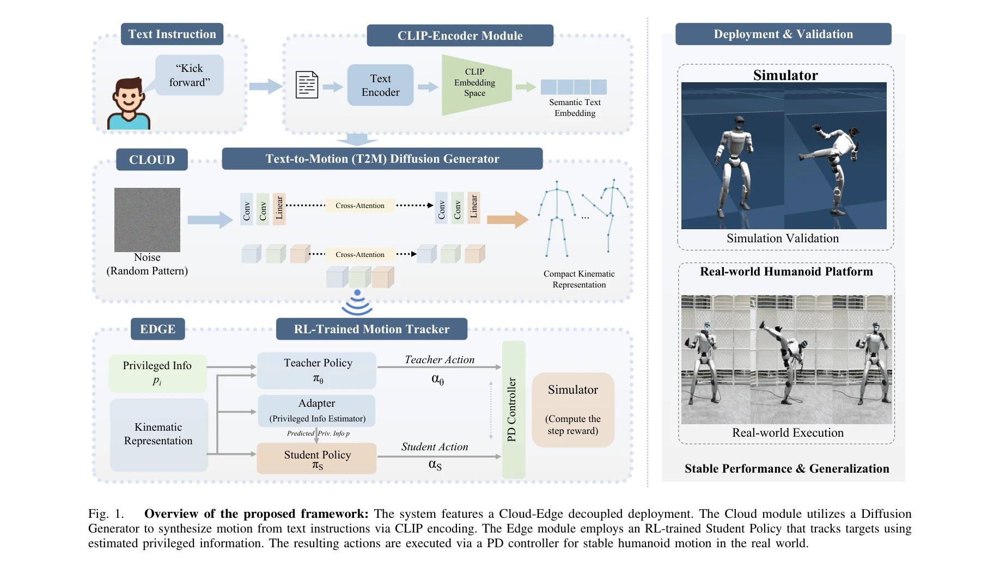

# ECHO: Edge-Cloud Humanoid Orchestration for Language-to-Motion Control

> **저자**: Haozhe Jia, Jianfei Song, Yuan Zhang, Honglei Jin, Youcheng Fan, Wenshuo Chen, Wei Zhang, Yutao Yue | **날짜**: 2026-03-17 | **URL**: [https://arxiv.org/abs/2603.16188](https://arxiv.org/abs/2603.16188)

---

## Essence

*Fig. 1.*

자연어 명령으로 휴머노이드 로봇을 제어하기 위해 클라우드의 diffusion 기반 text-to-motion 생성기와 엣지의 RL 트래커를 분리 배포하는 edge-cloud 프레임워크를 제안한다. 38차원 robot-native 모션 표현을 통해 inference 시 retargeting을 제거하고 실제 Unitree G1 로봇에서 안정적인 실행을 달성했다.

## Motivation

- **Known**: 텍스트 기반 휴머노이드 제어는 vision-language 모델과 대규모 모션 데이터셋, sim-to-real RL의 발전으로 가능해졌으며, 기존에는 end-to-end 언어-행동 모델이나 human motion 기반 retargeting 파이프라인이 사용되어 왔다.
- **Gap**: End-to-end 접근은 온보드 리소스 제약으로 실시간성과 확장성이 제한되고, human motion 기반 파이프라인은 retargeting 과정에서 형태 불일치와 오차 축적이 발생하며, latent 기반 방법은 로봇 플랫폼 이식성이 낮다.
- **Why**: 안정적이고 확장 가능한 휴머노이드 제어를 위해 생성과 실행을 명확히 분리하고, robot-native 표현을 통해 engineering 복잡성을 줄이며, 다양한 로봇 플랫폼으로 이식 가능한 모듈식 아키텍처가 필요하다.
- **Approach**: 클라우드의 1D convolutional UNet diffusion 모델이 CLIP 인코딩된 텍스트로 조건화되어 로봇 네이티브 38D 모션을 생성하고, 엣지의 teacher-student RL 트래커가 이를 폐루프로 추적하며, evidential adaptation 모듈이 sim-to-real 전이를 수행한다.

## Achievement

*Fig. 1.*

- **생성 품질**: 재타겟된 HumanML3D 벤치마크에서 FID 0.029, R-Precision Top-1 0.686 달성
- **실제 배포**: Unitree G1 휴머노이드에서 하드웨어 fine-tuning 없이 다양한 텍스트 명령 안정적 실행
- **효율성**: DDIM 10 denoising 스텝으로 약 1초의 클라우드-로봇 레이턴시 달성
- **안전성**: Motion Safety Score (MSS)와 Root Trajectory Consistency (RTC) 메트릭으로 하드웨어 제약 준수 및 경로 일관성 정량화
- **모듈성**: Retargeting-free 38D 표현으로 로봇 플랫폼 이식성과 추적기 호환성 확보

## How

*Fig. 1.*

- Cloud 측: CLIP 텍스트 인코더 + 1D Conv UNet backbone + cross-attention으로 text-conditioned diffusion 모델 구성
- Motion 표현: 29D 관절각도 + 2D 근부 평면 속도 + 1D 근부 높이 + 6D 연속 근부 회전으로 구성된 38D velocity-based 벡터
- Edge 측: Asymmetric Actor-Critic teacher-student 파이프라임으로 privileged teacher 정책을 경량 student 정책으로 distillation
- Sim-to-real 전이: Evidential Deep Regression 기반 adaptation 모듈 + morphological symmetry loss + domain randomization
- Fall recovery: IMU 기반 낙하 감지 및 pre-built 모션 라이브러리에서 회복 궤적 검색
- 배포: WebSocket을 통해 50 FPS 모션 스트리밍 및 PD 제어기로 실행

## Originality

- Generation과 execution의 명확한 분리를 통한 edge-cloud 아키텍처로 온보드 계산 오버헤드 최소화
- Inference 시점에서 retargeting을 완전히 제거하는 robot-native 38D 모션 표현의 설계
- Morphological symmetry loss와 evidential adaptation을 결합한 sim-to-real 전이 방식
- Motion Safety Score와 Root Trajectory Consistency라는 로봇 배포 중심의 새로운 평가 메트릭

## Limitation & Further Study

- HumanML3D 데이터셋의 General Motion Retargeting을 통한 초기 학습 데이터 생성은 여전히 retargeting 과정을 포함
- 클라우드 모델의 1초 레이턴시는 실시간 대화형 제어보다는 사전 계획된 명령 실행에 적합
- Unitree G1 단일 로봇에서만 검증되었으므로 다른 휴머노이드 플랫폼으로의 일반화 가능성 미확인
- Fall recovery가 pre-built 모션 라이브러리에 의존하므로 예측 불가능한 낙하 상황 대응 제한
- 후속연구: 다양한 로봇 플랫폼에서의 실험, 더 낮은 레이턴시의 경량 생성 모델 개발, 동적 환경에서의 적응 강화

## Evaluation

- Novelty: 4/5
- Technical Soundness: 3/5
- Significance: 4/5
- Clarity: 4/5
- Overall: 4/5

**총평**: ECHO는 edge-cloud 분리 배포와 robot-native 모션 표현을 통해 언어 기반 휴머노이드 제어의 실용성과 확장성을 크게 향상시킨 강력한 프레임워크이며, 실제 로봇 배포 검증과 새로운 평가 메트릭으로 높은 가치를 입증했다.

## Related Papers

- 🏛 기반 연구: [[papers/1511_LangWBC_Language-directed_Humanoid_Whole-Body_Control_via_En/review]] — LangWBC의 언어 기반 전신 제어 방법이 ECHO의 자연어 명령 처리와 모션 생성의 핵심 기반 기술이다.
- 🔗 후속 연구: [[papers/1423_GentleHumanoid_Learning_Upper-body_Compliance_for_Contact-ri/review]] — ECHO의 edge-cloud 분산 처리 구조에 GentleHumanoid의 compliance 제어를 통합하면 안전한 원격 조작이 가능하다.
- 🔄 다른 접근: [[papers/1584_NoMaD_Goal_Masked_Diffusion_Policies_for_Navigation_and_Expl/review]] — ThinkAct와 ECHO 모두 언어-행동 연결을 다루지만 전자는 추론 중심, 후자는 실시간 분산 처리에 집중한다.
- 🏛 기반 연구: [[papers/1423_GentleHumanoid_Learning_Upper-body_Compliance_for_Contact-ri/review]] — 언어 기반 상체 동작 제어가 ECHO의 자연어 명령 처리와 안전한 인간 상호작용에 필수적인 기반 기술이 된다.
- 🏛 기반 연구: [[papers/1511_LangWBC_Language-directed_Humanoid_Whole-Body_Control_via_En/review]] — 자연언어 명령을 로봇 행동으로 변환하는 기본 아이디어가 ECHO의 언어-동작 매핑 프레임워크와 근본적으로 동일함
- 🏛 기반 연구: [[papers/1595_OmniXtreme_Breaking_the_Generality_Barrier_in_High-Dynamic_H/review]] — 확산 정책 기반 비주얼모터 학습이 OmniXtreme의 flow-matching 생성형 정책의 이론적 기초를 제공합니다.
