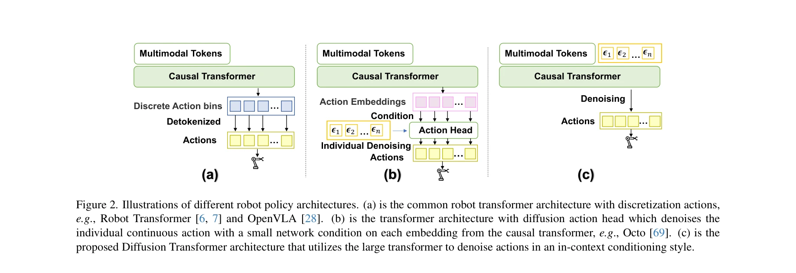
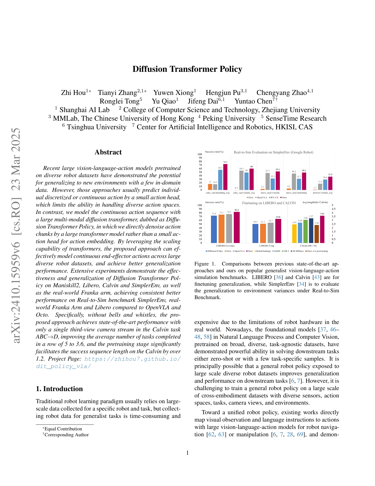

# Diffusion Transformer Policy

> **저자**: Zhi Hou, Tianyi Zhang, Yuwen Xiong, Hengjun Pu, Chengyang Zhao, Ronglei Tong, Yu Qiao, Jifeng Dai, Yuntao Chen | **날짜**: 2024-10-21 | **URL**: [https://arxiv.org/abs/2410.15959v4](https://arxiv.org/abs/2410.15959v4)

---

## Essence

*Figure 2. Illustrations of different robot policy architectures. (a) is the common robot transformer architecture with d*

Diffusion Transformer Policy는 큰 멀티모달 diffusion transformer를 사용하여 연속 action sequence를 직접 denoising함으로써, 작은 action head 대신 transformer의 scaling 능력을 활용하는 generalist robot policy이다.

## Motivation

- **Known**: 최근 large vision-language-action 모델들은 diverse robot dataset으로 pretrain되어 새로운 환경에서 few-shot generalization을 보여주고 있다. 그러나 Robot Transformer, OpenVLA, Octo 등 기존 방식들은 discretized action이나 작은 action head로 개별 action을 예측하여 diverse action space 처리 능력이 제한적이다.
- **Gap**: 기존 diffusion policy 방식(예: Octo)은 작은 MLP network로 single embedding 기반 action을 denoising하고, 사전 fused embedding에 기반하여 action anticipation에 필요한 상세한 역사적 관찰을 충분히 활용하지 못한다. Cross-embodiment dataset의 다양한 camera view와 action space를 처리하는데 한계가 있다.
- **Why**: Generalist robot policy는 diverse한 robot dataset에서 학습하여 새로운 embodiment과 환경으로의 generalization을 가능하게 하며, 이는 로봇 데이터 수집의 시간과 비용을 크게 줄일 수 있다.
- **Approach**: Diffusion Transformer Policy는 in-context conditional diffusion transformer 아키텍처를 통해 action chunks를 직접 denoising한다. 각 historical image observation patch에 조건화되어 visual detail을 보존하면서 transformer의 scalability를 유지하는 causal transformer 기반 구조를 사용한다.

## Achievement

*Figure 1.*

- **다중 벤치마크 우수성**: ManiSkill2, Libero, Calvin, SimplerEnv 등 시뮬레이션 벤치마크와 실제 Franka arm에서 OpenVLA, Octo 대비 일관되게 우수한 성능 달성
- **Calvin ABC→D 작업 SOTA**: 단일 third-view camera만으로 completed tasks 평균을 5에서 3.6으로 개선
- **Real-to-Sim 일반화**: SimplerEnv Google Robot 벤치마크에서 강력한 real-to-sim generalization 성능 입증
- **Pretraining 효과**: Calvin에서 success sequence length를 1.2 이상 향상시킴
- **Continuous action 처리**: Discretization 없이 연속 7D end-effector action을 효과적으로 모델링

## How

*Figure 2. Illustrations of different robot policy architectures. (a) is the common robot transformer architecture with d*

- Frozen CLIP으로 언어 instruction tokenization
- DINOv2로 image patch feature 추출 후 end-to-end joint optimization
- Q-Former와 FiLM conditioning으로 instruction context 기반 image feature 선택
- 7D continuous action vector (translation 3D + rotation 3D + gripper 1D)를 zero-padding으로 token dimension에 정렬
- In-context conditional style로 multimodal tokens와 action을 causal transformer로 처리
- Action chunk 단위로 diffusion denoising 수행 (개별 action이 아님)
- Open X-Embodiment Dataset으로 large-scale cross-embodiment pretraining 수행

## Originality

- 기존 Octo의 작은 MLP diffuser 대신 **큰 transformer를 diffuser로 사용**하여 action denoising의 capacity 획기적 증대
- **In-context conditioning 방식** 도입으로 각 historical observation patch에 직접 조건화되어 fused embedding 기반 접근의 한계 극복
- Action chunk 단위 denoising으로 **action sequence의 temporal coherence 향상**
- Continuous action 기반 접근으로 discretization의 내부 편차 문제 해결
- Large-scale cross-embodiment dataset에서의 **transformer scalability 활용** 최적화

## Limitation & Further Study

- Pretrain 단계의 Open X-Embodiment Dataset 접근성과 계산 비용 요구 사항이 높음
- DINOv2는 web data 기반이므로 robot-specific visual feature 학습에 최적화되지 않을 수 있음
- Zero-padding 기반 action representation이 다양한 action space dimension에 효율적인지 불명확
- **후속연구**: 다양한 action type (gripper 비이진화, manipulation-specific action) 처리 확장
- **후속연구**: Real-world deployment에서 computational latency와 실시간 성능 평가 필요
- **후속연구**: Multi-modal diffusion의 computational complexity 최적화 연구

## Evaluation

- Novelty: 4/5
- Technical Soundness: 4/5
- Significance: 4/5
- Clarity: 4/5
- Overall: 4/5

**총평**: Diffusion Transformer Policy는 transformer 기반 diffusion 아키텍처로 기존 generalist robot policy의 action space 처리 한계를 효과적으로 극복하며, 여러 벤치마크에서 SOTA 성능과 강력한 generalization을 입증한 의미 있는 기여이다.

## Related Papers

- 🏛 기반 연구: [[papers/1510_OpenVLA_An_Open-Source_Vision-Language-Action_Model/review]] — OpenVLA의 오픈소스 vision-language-action model이 diffusion transformer policy 연구의 기반 모델 역할을 한다.
- 🔄 다른 접근: [[papers/1577_SpecPrune-VLA_Accelerating_Vision-Language-Action_Models_via/review]] — SpecPrune을 통한 VLA 모델 가속화가 diffusion transformer의 scaling 문제를 다른 관점에서 접근한다.
- 🔗 후속 연구: [[papers/1475_Humanoid_Whole-Body_Locomotion_on_Narrow_Terrain_via_Dynamic/review]] — Universal controller를 위한 transformer 기반 MetaMorph가 diffusion transformer policy의 일반화 능력을 확장한다.
- 🔗 후속 연구: [[papers/1316_Behavior_Transformers_Cloning_k_modes_with_one_stone/review]] — Diffusion Transformer Policy가 BeT의 transformer 기반 multi-modal action learning을 diffusion 기법으로 더욱 발전시킨다.
- 🔄 다른 접근: [[papers/1375_Efficient_Diffusion_Transformer_Policies_with_Mixture_of_Exp/review]] — Diffusion Transformer Policy의 scaling approach가 MoDE의 efficiency 중심 접근과 대조된다.
- 🏛 기반 연구: [[papers/1432_H-RDT_Human_Manipulation_Enhanced_Bimanual_Robotic_Manipulat/review]] — Diffusion Transformer Policy의 기본 구조를 human-enhanced bimanual manipulation에 적용한 구체적 사례입니다.
