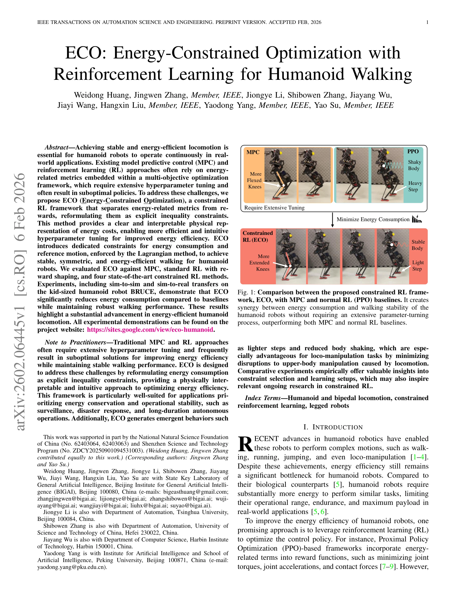

# ECO: Energy-Constrained Optimization with Reinforcement Learning for Humanoid Walking

> **저자**: Weidong Huang, Jingwen Zhang, Jiongye Li, Shibowen Zhang, Jiayang Wu, Jiayi Wang, Hangxin Liu, Yaodong Yang, Yao Su | **날짜**: 2026-02-06 | **URL**: [https://arxiv.org/abs/2602.06445](https://arxiv.org/abs/2602.06445)

---

## Essence

*Fig. 1: Comparison between the proposed constrained RL frame-*

ECO는 에너지 소비를 명시적인 제약 조건으로 재구성하는 제약 RL 프레임워크로, 휴머노이드 로봇의 에너지 효율적인 보행을 달성하면서 광범위한 하이퍼파라미터 튜닝을 제거한다.

## Motivation

- **Known**: MPC와 표준 RL 방법들은 보상 함수에 에너지 항을 포함시켜 에너지 효율성을 개선하려 했으나, 이는 광범위한 가중치 튜닝을 필요로 하고 종종 차선의 정책을 초래한다.
- **Gap**: 기존 다목적 최적화 프레임워크는 에너지 최소화와 보행 안정성 간의 상충을 직관적으로 해결하지 못하며, 이러한 충돌하는 목표들이 수렴 실패 또는 불안정한 보행을 야기한다.
- **Why**: 휴머노이드 로봇의 에너지 효율성 개선은 실시간 운영 범위, 지구력, 최대 탑재량을 크게 제약하는 주요 병목이므로, 직관적이고 효율적인 최적화 방법이 필수적이다.
- **Approach**: ECO는 에너지 관련 메트릭을 보상에서 분리하여 명시적 부등식 제약으로 재구성하고, Lagrangian 방법을 통해 이를 강제하면서 에너지 소비 한계를 물리적으로 직관적인 선형 탐색을 통해 튜닝한다.

## Achievement

- **에너지 효율성 달성**: ECO는 MPC 대비 약 6배, PPO 대비 약 2.3배 낮은 에너지 소비를 실현하면서도 안정적인 보행 성능을 유지
- **하이퍼파라미터 튜닝 간소화**: 에너지 제약을 물리적 의미가 명확한 명시적 제약으로 재구성하여 직관적이고 효율적인 튜닝 프로세스 제공
- **창발적 행동 관찰**: 무릎 확장, 가벼운 발걸음, 신체 흔들림 감소 등의 자연발생적 효율적 보행 패턴 학습
- **실제 로봇 검증**: BRUCE 휴머노이드 로봇에서 sim-to-real 이전을 통해 처음으로 제약 RL 기반 에너지 효율적 보행 실현

## How

*Fig. 2: Overview of the training and deployment process in proposed ECO framework. The policy network, taking velocity c*

- PPO-Lagrangian 알고리즘을 기반으로 에너지 소비와 참조 동작에 대한 전용 제약 조건 도입
- 에너지 제약 임계값을 선형 탐색 알고리즘으로 점진적으로 조정하여 물리적으로 직관적인 튜닝 프로세스 구현
- 네 가지 최신 제약 RL 알고리즘(P3O, IPO, CRPO)과 다양한 제약 설정에 대한 광범위한 비교 실험 수행
- 시뮬레이션 환경에서 훈련 후 BRUCE 로봇으로의 sim-to-sim 및 sim-to-real 이전 검증
- 에너지 소비, 보행 안정성, 속도 추적 등 다양한 메트릭을 통한 포괄적 성능 평가

## Originality

- 에너지 최소화를 명시적 제약으로 재구성하는 새로운 문제 설정이 기존의 다목적 보상 설계와 구별됨
- 제약 RL을 휴머노이드 보행에 적용한 최초의 실제 로봇 검증 연구
- 물리적으로 직관적인 선형 탐색을 통한 에너지 제약 임계값 튜닝 방법론 제안
- 여러 제약 RL 알고리즘의 비교 분석을 통해 휴머노이드 보행 최적화에 적합한 설정 도출

## Limitation & Further Study

- kid-sized 휴머노이드 로봇(BRUCE) 단일 플랫폼에서만 검증되어 다른 크기 및 형태의 휴머노이드 로봇에 대한 일반화 미검증
- 시뮬레이션 환경의 마찰 계수, 지면 특성 등 실제 환경과의 격차로 인한 domain shift 가능성
- 제약 조건 선택(에너지, 참조 동작)의 이론적 정당성이 실험적 결과에 의존하며, 다른 제약 조합의 체계적 탐색 부족
- 후속 연구로 다양한 크기의 휴머노이드 로봇, 불규칙한 지면, 급격한 환경 변화에 대한 일반화 평가 필요
- 제약 RL의 표본 효율성 개선과 실시간 제약 조정 메커니즘 개발 연구 가능

## Evaluation

- Novelty: 4/5
- Technical Soundness: 3/5
- Significance: 4/5
- Clarity: 4/5
- Overall: 4/5

**총평**: ECO는 에너지 제약의 명시적 분리를 통해 휴머노이드 보행의 에너지 효율성과 안정성의 상충을 우아하게 해결하며, 실제 로봇 플랫폼에서 처음으로 달성한 의미 있는 기여이다. 다양한 플랫폼과 환경에 대한 일반화 검증이 향후 과제이다.

## Related Papers

- 🏛 기반 연구: [[papers/1284_Benchmarking_Potential_Based_Rewards_for_Learning_Humanoid_L/review]] — Potential-based rewards 벤치마킹이 ECO의 에너지 제약 조건을 보상으로 재구성하는 방법론의 이론적 기반을 제공한다.
- 🔄 다른 접근: [[papers/1410_Gait-Conditioned_Reinforcement_Learning_with_Multi-Phase_Cur/review]] — ECO는 에너지 제약을 명시적으로 다루고 Gait-Conditioned RL은 자연스러운 보행 패턴으로 에너지 효율성을 추구한다.
- 🔗 후속 연구: [[papers/1567_Mechanical_Intelligence-Aware_Curriculum_Reinforcement_Learn/review]] — Mechanical Intelligence-Aware Curriculum과 ECO의 에너지 제약을 결합하면 하드웨어 특성을 고려한 효율적 학습이 가능하다.
- 🔗 후속 연구: [[papers/1410_Gait-Conditioned_Reinforcement_Learning_with_Multi-Phase_Cur/review]] — ECO의 에너지 효율성과 gait-conditioned 보행을 결합하면 에너지 최적화된 다양한 보행 패턴을 달성할 수 있다.
- 🔗 후속 연구: [[papers/1583_No_More_Marching_Learning_Humanoid_Locomotion_for_Short-Rang/review]] — 에너지 제약 최적화가 단거리 이동에서의 효율적인 보상 설계에 추가적인 제약 조건을 제공할 수 있습니다.
