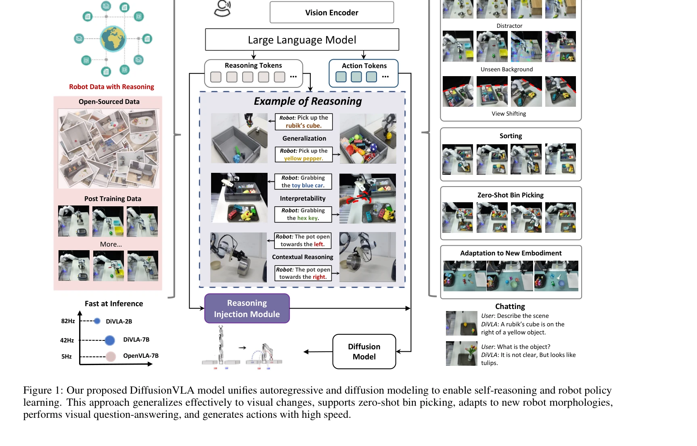
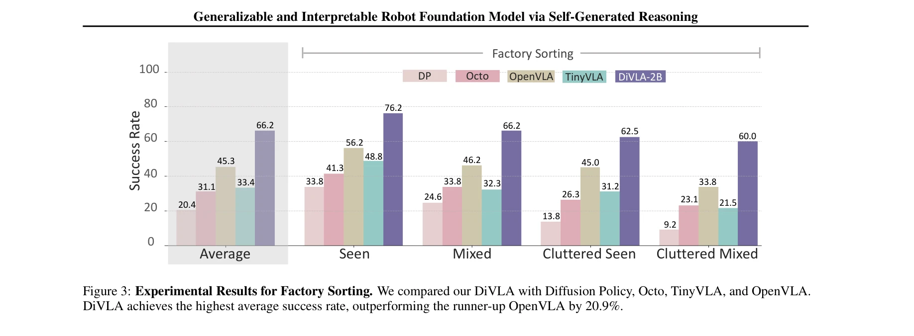

# Diffusion-VLA: Generalizable and Interpretable Robot Foundation Model via Self-Generated Reasoning

> **저자**: Junjie Wen, Minjie Zhu, Yichen Zhu, Zhibin Tang, Jinming Li, Zhongyi Zhou, Chengmeng Li, Xiaoyu Liu, Yaxin Peng, Chaomin Shen, Feifei Feng | **날짜**: 2024-12-04 | **URL**: [https://arxiv.org/abs/2412.03293](https://arxiv.org/abs/2412.03293)

---

## Essence

*Figure 1: Our proposed DiffusionVLA model unifies autoregressive and diffusion modeling to enable self-reasoning and rob*

DiffusionVLA는 autoregressive 모델의 추론 능력과 diffusion 모델의 견고한 행동 생성을 결합한 로봇 foundation 모델로, reasoning injection 모듈을 통해 자가 생성된 추론을 정책 학습에 직접 통합한다.

## Motivation

- **Known**: Autoregressive VLA 모델(RT-2, OpenVLA)은 다음 토큰 예측으로 추론 능력이 뛰어나지만 정확한 행동 생성이 제한적이고, diffusion-based 정책은 행동 생성에 강하나 추론 능력이 부족하다.
- **Gap**: 기존 방법들은 autoregressive 또는 diffusion 중 한 가지에만 초점을 맞춰 추론 능력과 견고한 행동 생성을 동시에 달성하지 못했고, 논리적 추론과 실행 가능한 로봇 정책 사이의 명시적 간극이 존재한다.
- **Why**: 로봇이 복잡한 작업을 수행할 때 시각적 변화에 강건하면서도 의사결정 과정을 설명할 수 있어야 하므로, 추론과 행동 생성의 통합이 실용적 로봇 시스템에 필수적이다.
- **Approach**: Reasoning injection 모듈을 통해 pre-trained VLM의 autoregressive 추론 출력을 diffusion 기반 정책 헤드에 직접 임베딩함으로써 추론과 행동 생성을 긴밀히 연결한다.

## Achievement

*Figure 3: Experimental Results for Factory Sorting. We compared our DiVLA with Diffusion Policy, Octo, TinyVLA, and Open*

- **시각적 일반화**: 학습되지 않은 객체를 자가 생성 추론으로 인식하고 분류하며, 102개의 미학습 객체에 대해 zero-shot bin picking에서 63.7% 정확도 달성
- **해석 가능성**: Reasoning injection 모듈이 정책의 의사결정 과정을 명시적으로 가시화하여 장애 분석 및 실패 원인 파악 지원
- **적응성**: 새로운 지시사항을 따를 수 있으며 대화 능력 유지, bimanual 로봇 등 새로운 embodiment에 빠르게 적응 가능
- **추론 속도**: DiVLA-2B는 A6000 GPU에서 82Hz, DiVLA-7B는 42Hz로 실시간 반응성 보장
- **데이터 효율성**: 복잡한 작업을 50개 미만의 demonstration으로 학습 가능
- **확장성**: 2B에서 72B 파라미터로 스케일링 시 일반화 및 성능 향상 입증

## How

*Figure 1: Our proposed DiffusionVLA model unifies autoregressive and diffusion modeling to enable self-reasoning and rob*

- Pre-trained Vision-Language Model을 기반으로 autoregressive 추론 능력 유지
- Diffusion model을 정책 헤드로 적용하여 noise-denoising 과정으로 행동 시퀀스 생성
- Reasoning injection 모듈: 자가 생성된 추론 구문을 정책 학습 프로세스에 직접 임베딩
- Next-token prediction 목표를 사용하여 사용자 쿼리에 대해 현재 관찰을 기반으로 효과적인 추론 수행
- Internet-scale vision-language 데이터와 로봇 데이터를 결합한 post-training 수행
- Factory sorting, zero-shot bin picking, visual question-answering 등 다중 작업에서 평가

## Originality

- Autoregressive 모델과 diffusion 모델의 첫 번째 실질적 통합: 추론을 위해 autoregressive, 행동 생성을 위해 diffusion 활용
- Reasoning injection 모듈의 제안: 추론 출력을 정책 학습에 직접 임베딩하여 implicit gap 해소
- Self-generated reasoning을 통한 해석 가능성 달성: 모델의 사고 과정을 명시적으로 가시화
- 단순하면서도 유연한 프레임워크: 다양한 로봇 플랫폼에 쉬운 배포 및 업그레이드 가능
- 실세계 로봇 실험을 통한 광범위한 검증: 시각적 변화, 새로운 embodiment, 미학습 객체에 대한 강건성 입증

## Limitation & Further Study

- Reasoning과 action 간 coupling의 정도에 대한 상세한 ablation study 부족: 각 모듈의 독립적 기여도 분석 필요
- 추론 생성의 오류가 정책 성능에 미치는 영향에 대한 정량적 분석 미흡
- 다양한 로봇 morphology에 대한 적응 메커니즘의 자동화 수준 불명확
- 계산 비용 분석 부족: reasoning 모듈 추가로 인한 전체 inference latency 오버헤드 정량화 필요
- 후속 연구: reasoning과 action의 상호작용을 더 깊이 있게 분석하는 이론적 프레임워크 개발, 더 큰 규모 로봇 데이터셋에서의 성능 검증, 다중 로봇 협력 시나리오 확장

## Evaluation

- Novelty: 4/5
- Technical Soundness: 3/5
- Significance: 4/5
- Clarity: 4/5
- Overall: 4/5

**총평**: DiffusionVLA는 autoregressive와 diffusion 모델을 창의적으로 결합하고 reasoning injection 모듈로 추론과 행동 생성을 효과적으로 통합함으로써, 해석 가능성과 강건한 일반화를 동시에 달성한 혁신적인 로봇 foundation 모델이다. 실세계 다중 로봇 실험과 확장성 검증을 통해 실용적 가치를 입증했으나, 모듈 간 상호작용에 대한 심층 분석이 보강되면 더욱 완성도 있을 것으로 판단된다.

## Related Papers

- 🔄 다른 접근: [[papers/1356_DreamGen_Unlocking_Generalization_in_Robot_Learning_through/review]] — DexGraspVLA도 diffusion 기반 행동 생성과 reasoning을 결합한 유사한 접근법이다.
- 🔗 후속 연구: [[papers/1381_Embodied-Reasoner_Synergizing_Visual_Search_Reasoning_and_Ac/review]] — Embodied-Reasoner의 추론과 행동 통합이 Diffusion-VLA의 reasoning injection을 발전시킨다.
- 🏛 기반 연구: [[papers/1362_Diffusion_Policy_Visuomotor_Policy_Learning_via_Action_Diffu/review]] — Diffusion Policy의 기본 diffusion 기반 정책 학습이 Diffusion-VLA의 이론적 기반이다.
- 🔄 다른 접근: [[papers/1356_DreamGen_Unlocking_Generalization_in_Robot_Learning_through/review]] — Diffusion-VLA도 계층적 구조에서 diffusion 모델을 활용하는 유사한 VLA 프레임워크이다.
- 🔗 후속 연구: [[papers/1481_Motus_A_Unified_Latent_Action_World_Model/review]] — 해석 가능한 로봇 파운데이션 모델의 3D 공간 표현을 HumanoidPano의 기하학적 제약에 통합할 수 있다
