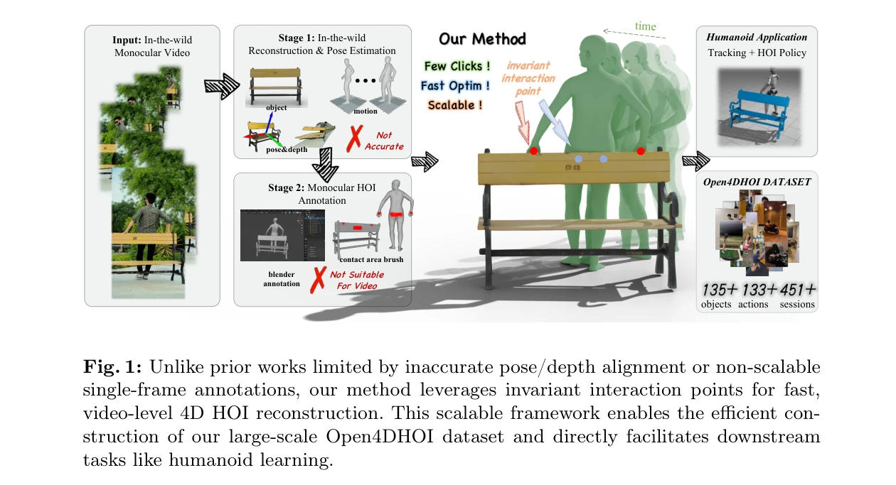
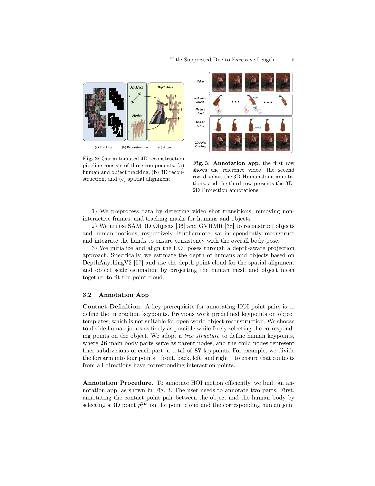

# Efficient and Scalable Monocular Human-Object Interaction Motion Reconstruction

> **저자**: Boran Wen, Ye Lu, Sirui Wang, Keyan Wan, Jiahong Zhou, Junxuan Liang, Xinpeng Liu, Bang Xiao, Ruiyang Liu, Yong-Lu Li | **날짜**: 2025-11-30 | **URL**: [https://arxiv.org/abs/2512.00960](https://arxiv.org/abs/2512.00960)

---

## Essence

*Fig. 1: Unlike prior works limited by inaccurate pose/depth alignment or non-scalable*

단안 비디오로부터 효율적으로 4D 인간-물체 상호작용 데이터를 추출하기 위해 sparse contact point annotation과 optimization 기반 reconstruction framework를 제안하고, 대규모 Open4DHOI 데이터셋을 구축한다.

## Motivation

- **Known**: 기존 멀티뷰 HOI 캡처 시스템은 고정밀도이지만 비용이 높고 실내 환경에 제한적이며, 단안 비디오 기반 최근 연구들도 자동화된 pose/depth 정렬의 부정확성과 동영상에 대한 비확장성 문제를 가진다.
- **Gap**: 단안 비디오로부터 시공간적 일관성과 물리적 그럼직함을 유지하면서 4D HOI를 정확하고 확장성 있게 추출하는 것이 미해결 과제이며, 주석의 비용 병목이 대규모 데이터셋 구축을 저해한다.
- **Why**: 로봇의 일반화된 학습을 위해 다양하고 대규모의 HOI 데이터가 필수적이며, 인터넷 비디오는 무한한 데이터 소스를 제공하므로 효율적인 추출 방법이 중요하다.
- **Approach**: temporally invariant interaction point를 기반으로 한 sparse annotation paradigm을 도입하고, InterPoint 멀티모달 예측기를 통해 human-in-the-loop 데이터 엔진을 구축한 후, 4DHOISolver optimization framework로 고품질의 물리적으로 그럼직한 4D HOI를 재구성한다.

## Achievement

*Fig. 1: Unlike prior works limited by inaccurate pose/depth alignment or non-scalable*

- **Scalable annotation engine**: InterPoint를 기반으로 한 human-in-the-loop 데이터 엔진으로 주석 비용을 크게 감소시키고 지속적 개선을 통한 데이터 플라이휠 효과 달성
- **Novel optimization framework**: 두 단계 4DHOISolver 프레임워크로 least-squares matching, inverse kinematics, 그리고 gradient-based optimization을 결합하여 시공간적으로 일관성 있고 물리적으로 그럼직한 4D HOI 재구성
- **Large-scale dataset**: 451개 비디오, 135개 물체 카테고리, 133개 동작을 포함하는 Open4DHOI 데이터셋 구축 및 공개
- **Robotic application validation**: contact-guided reward function을 설계하여 RL 기반 에이전트가 복잡한 HOI 모션 모방을 성공적으로 학습하도록 입증

## How

*Fig. 2: Our automated 4D reconstruction*

- 자동 4D 재구성 파이프라인: SAM 3D Objects와 GVHMR을 이용한 물체 및 인간 모션 재구성, DepthAnythingV2 기반 깊이 정렬
- 효율적 sparse annotation: temporally invariant interaction point pair를 주석하는 경량 방식으로 per-frame dense labeling 대체
- InterPoint 예측기: 멀티모달 네트워크로 초기 contact point 자동 제안, 검증된 데이터로 지속적 fine-tuning
- 4DHOISolver 최적화: least-squares matching으로 빠른 기하학적 정렬 후 gradient-based 최적화로 물리적 그럼직함과 시공간 일관성 강화
- RL 기반 검증: contact 정보를 활용한 reward function으로 humanoid agent의 HOI 모션 모방 학습 검증

## Originality

- Dense per-frame annotation에서 temporally invariant sparse contact point annotation으로 패러다임 전환으로 주석 효율성 극대화
- Human-in-the-loop 데이터 엔진에 prediction-based guidance 통합으로 자동화-검증 피드백 루프 구성
- 최적화 기반 4D HOI 재구성에서 시공간 일관성 제약을 명시적으로 포함한 two-stage framework 제안
- 대규모 in-the-wild 비디오에서 135개 물체, 133개 동작의 다양한 open-vocabulary HOI 데이터셋 최초 구축

## Limitation & Further Study

- 현재 방법은 손 재구성의 정확성이 전체 성능을 제한할 수 있으며, 복잡한 손-물체 상호작용의 경우 개선 필요
- Sparse point annotation의 표현력 한계로 세밀한 접촉 영역 정보 손실 가능
- 4DHOISolver의 최적화 수렴성과 계산 비용에 대한 상세 분석 부족
- 후속 연구로는 더 정밀한 hand reconstruction 모델 통합, dense contact map으로의 확장, 다양한 로봇 작업에 대한 적용성 검증이 필요

## Evaluation

- Novelty: 4/5
- Technical Soundness: 3/5
- Significance: 4/5
- Clarity: 4/5
- Overall: 4/5

**총평**: 단안 비디오로부터 4D HOI를 효율적으로 추출하는 실질적 솔루션을 제시하고 대규모 dataset과 robotic application 검증으로 강력한 임팩트를 보여주는 우수한 연구이나, 기술적 깊이와 일부 method의 이론적 정당화 측면에서 미개선 부분이 있다.

## Related Papers

- 🔄 다른 접근: [[papers/1324_CRISP_Contact-Guided_Real2Sim_from_Monocular_Video_with_Plan/review]] — monocular video에서 human-object interaction을 다른 contact modeling으로 복원한다
- 🔗 후속 연구: [[papers/1487_HUMOTO_A_4D_Dataset_of_Mocap_Human_Object_Interactions/review]] — 4D human-object interaction을 더 대규모 데이터셋으로 확장한 연구다
- 🧪 응용 사례: [[papers/1576_MobileH2R_Learning_Generalizable_Human_to_Mobile_Robot_Hando/review]] — human-object interaction 데이터가 mobile robot manipulation에 활용된다
- 🔄 다른 접근: [[papers/1324_CRISP_Contact-Guided_Real2Sim_from_Monocular_Video_with_Plan/review]] — 단안 비디오에서 human-object interaction을 다른 최적화 방법으로 복원한다
