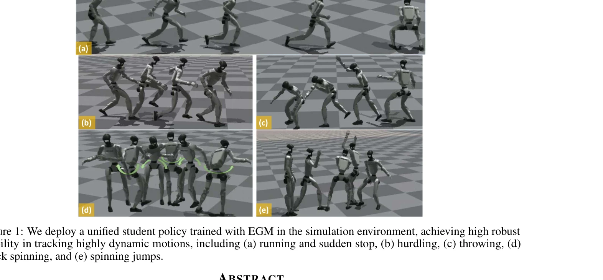
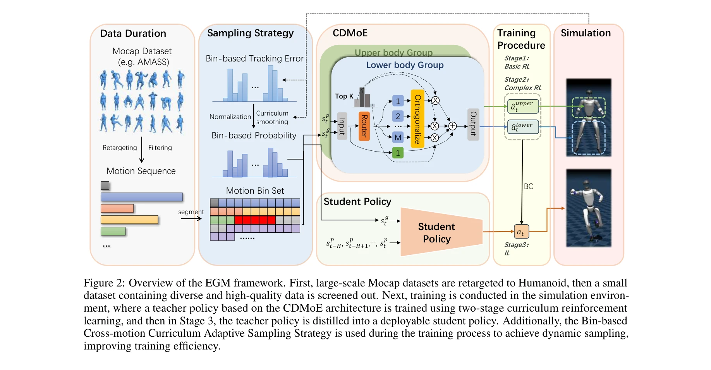

# EGM: Efficiently Learning General Motion Tracking Policy for High Dynamic Humanoid Whole-Body Control

> **저자**: Chao Yang, Yingkai Sun, Peng Ye, Xin Chen, Chong Yu, Tao Chen | **날짜**: 2025-12-22 | **DOI**: [10.48550/arXiv.2512.19043](https://doi.org/10.48550/arXiv.2512.19043)

---

## Essence

*Figure 1: We deploy a unified student policy trained with EGM in the simulation environment, achieving high robust*

EGM은 효율적인 데이터 이용과 동적 움직임 추적을 위해 Bin-based Cross-motion Curriculum Adaptive Sampling과 Composite Decoupled Mixture-of-Experts 아키텍처를 통합한 일반적인 인간형 로봇 모션 추적 정책 학습 프레임워크이다.

## Motivation

- **Known**: DeepMimic 이후 인간형 로봇의 모션 추적 연구가 진행되었으나, 기존 방법들은 단일 모션에 국한되거나 대규모 데이터에 의존하면서 동적 모션 추적 성능이 제한적이다.
- **Gap**: 기존 방법들은 AMASS 같은 대규모 mocap 데이터에서 비효율적인 데이터 이용으로 인한 중복성 문제와 동적 모션 추적 성능 부족 문제를 동시에 해결하지 못하고 있다.
- **Why**: 인간형 로봇이 다양한 동작을 안정적으로 수행할 수 있는 일반적 제어기의 개발은 실제 응용의 핵심이며, 효율적이고 안정적인 모션 추적 방법은 배포 가능성을 크게 향상시킨다.
- **Approach**: EGM은 적응적 샘플링 전략으로 데이터 효율성을 높이고, 신체 부위별로 분리된 전문가 그룹과 일반 특징 전문가를 분리한 CDMoE 아키텍처로 동적 모션 추적 능력을 강화하며, 3단계 커리큘럼 학습으로 점진적 견고성을 개선한다.

## Achievement

*Figure 1: We deploy a unified student policy trained with EGM in the simulation environment, achieving high robust*

- **데이터 효율성**: 4.08시간의 소규모 데이터로 학습하여 49.25시간의 테스트 모션에서 일반화 능력을 입증
- **Bin-based Cross-motion Curriculum Adaptive Sampling**: 모션 bin별 추적 오류를 기반으로 샘플링 확률을 동적으로 조절하여 불균형한 데이터 분포 문제 해결
- **Composite Decoupled Mixture-of-Experts**: 상체/하체 분리 전문가 그룹과 직교 전문가/공유 전문가 분리를 통해 전용 특징과 일반 특징을 효과적으로 처리
- **동적 모션 추적 성능**: 달리기/급정지, 허들링, 던지기, 회전, 점프 등 복잡한 동작에서 높은 안정성과 정확도 달성
- **3단계 커리큘럼 학습**: 기본 추적 → 강화된 제어 → 외란 견고성으로 점진적 정책 향상

## How

*Figure 2: Overview of the EGM framework. First, large-scale Mocap datasets are retargeted to Humanoid, then a small*

- **Teacher-Student 프레임워크**: PPO로 privileged teacher policy 학습 후 DAgger로 배포 가능한 student policy 증류
- **Bin-based Cross-motion Curriculum Adaptive Sampling**: 모션 bin 단위로 추적 오류를 추적하고, 각 bin의 난이도와 길이에 따라 샘플링 확률 동적 조절
- **Composite Decoupled Mixture-of-Experts**: 상체/하체별 전문가 그룹 구성, 직교 제약을 통해 전용 전문가와 공유 전문가를 분리하여 motion-specific과 general feature 동시 학습
- **Data Curation**: 고품질 데이터 선별과 다양성 확보를 통해 효율적 학습 실현
- **3단계 Training Curriculum**: 기본 추적(Stage 1) → 제어 강화(Stage 2) → 외란 견고성(Stage 3)로 점진적 정책 개선

## Originality

- **Bin-level 적응형 샘플링의 혁신**: 기존 motion-level 적응형 샘플링을 bin 단위로 세분화하여 더 정밀한 샘플링 전략 제시
- **CDMoE의 구조적 혁신**: 단순 motion-specific 전문가 분리를 넘어 상체/하체 분리와 전용/공유 전문가 분리를 결합한 이중 분리 구조
- **Data Quality & Diversity 핵심 인사이트**: 대규모 데이터보다 고품질 데이터 선별의 중요성을 강조하고 실증
- **소규모 데이터 기반 강력한 일반화**: 4시간 미만의 데이터로 50시간 이상의 테스트 셋에서 우수한 성능 달성

## Limitation & Further Study

- **시뮬레이션 환경 검증**: 실제 로봇 배포 결과 부재로 sim-to-real gap 가능성 미해결
- **데이터 선별 기준**: 고품질 데이터 선별의 구체적 기준과 자동화 방법에 대한 명확한 설명 부족
- **아키텍처 복잡도**: CDMoE의 상체/하체 분리가 사지 동작이나 중심축 회전이 복잡한 움직임에 미치는 영향 미분석
- **확장성 검토**: 다양한 robot morphology에 대한 적응성과 scalability 검증 필요
- **후속연구**: (1) 실제 로봇에서의 배포 및 sim-to-real transfer 방법 개발, (2) 자동화된 데이터 품질 평가 지표 개발, (3) 다양한 로봇 플랫폼에 대한 일반화 연구

## Evaluation

- Novelty: 4/5
- Technical Soundness: 3/5
- Significance: 4/5
- Clarity: 4/5
- Overall: 4/5

**총평**: EGM은 효율적 데이터 이용과 동적 모션 추적을 위한 체계적이고 창의적인 방법론을 제시하며, 소규모 데이터로 우수한 성능을 달성한 점에서 높은 가치를 지니고 있으나 실제 로봇 배포 검증이 추가되면 더욱 강력한 기여가 될 것이다.

## Related Papers

- 🔄 다른 접근: [[papers/1414_General_Humanoid_Whole-Body_Control_via_Pretraining_and_Fast/review]] — EGM은 효율적 데이터 활용과 MoE 구조에, FAST는 사전학습과 잔차 적응에 초점을 맞춰 일반적 제어를 달성한다.
- 🏛 기반 연구: [[papers/1375_Embodiment-Aware_Generalist_Specialist_Distillation_for_Unif/review]] — EAGLE의 embodiment-aware distillation 방법이 EGM의 cross-motion curriculum에서 서로 다른 동작 간 지식 전이의 기반이 된다.
- 🔗 후속 연구: [[papers/1575_Mobile-TeleVision_Predictive_Motion_Priors_for_Humanoid_Whol/review]] — Mobile-TeleVision의 predictive motion prior를 EGM의 motion tracking에 통합하면 예측 기반 동작 추적이 가능하다.
- 🏛 기반 연구: [[papers/1264_AME-2_Agile_and_Generalized_Legged_Locomotion_via_Attention-/review]] — attention 메커니즘과 신경망 구조 설계의 이론적 기반을 제공한다
- 🔄 다른 접근: [[papers/1375_Embodiment-Aware_Generalist_Specialist_Distillation_for_Unif/review]] — EAGLE은 여러 로봇 간 지식 증류에, EGM은 단일 로봇의 효율적 모션 추적에 초점을 맞춘 일반화 접근법이다.
- 🏛 기반 연구: [[papers/1414_General_Humanoid_Whole-Body_Control_via_Pretraining_and_Fast/review]] — EGM의 효율적 모션 추적 방법이 FAST의 일반적 전신 제어에서 다양한 동작에 대한 빠른 적응의 기반 기술이 된다.
- 🏛 기반 연구: [[papers/1425_GMT_General_Motion_Tracking_for_Humanoid_Whole-Body_Control/review]] — GMT의 기본 motion tracking 개념과 방법론은 EGM의 general motion tracking policy에서 영감을 받았다.
- 🏛 기반 연구: [[papers/1504_JAEGER_Dual-Level_Humanoid_Whole-Body_Controller/review]] — JAEGER의 전신 제어기는 EGM의 general motion tracking을 dual-level로 구현한 결과이다.
