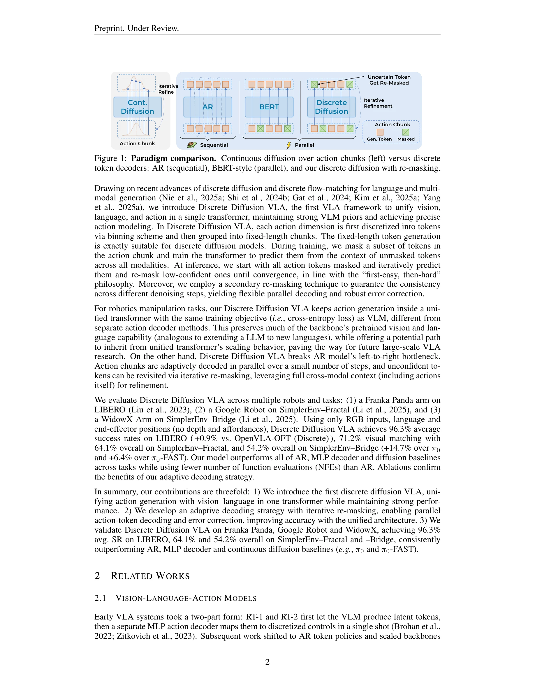
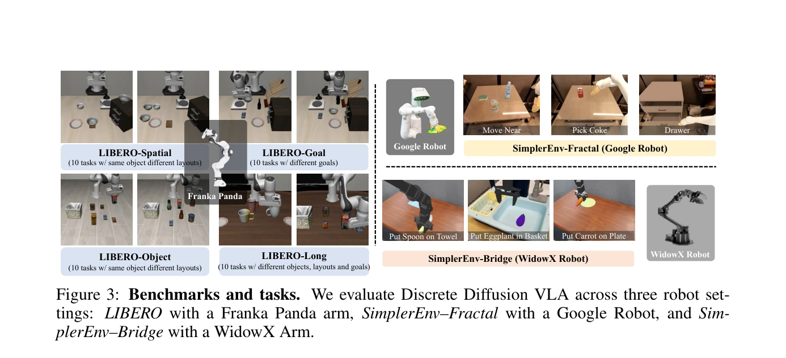
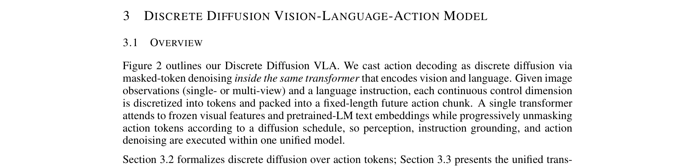

# Discrete Diffusion VLA: Bringing Discrete Diffusion to Action Decoding in Vision-Language-Action Policies

> **저자**: Zhixuan Liang, Yizhuo Li, Tianshuo Yang, Chengyue Wu, Sitong Mao, Tian Nian, Liuao Pei, Shunbo Zhou, Xiaokang Yang, Jiangmiao Pang, Yao Mu, Ping Luo | **날짜**: 2025-08-27 | **URL**: [https://arxiv.org/abs/2508.20072](https://arxiv.org/abs/2508.20072)

---

## Essence

*Figure 1: Paradigm comparison. Continuous diffusion over action chunks (left) versus discrete*

Vision-Language-Action (VLA) 모델에 discrete diffusion을 적용하여 action token을 적응적으로 디코딩하는 unified transformer 정책을 제시한다. 이를 통해 자동회귀 방식의 순서 제약을 극복하고 분리된 decoder 구조의 문제를 해결한다.

## Motivation

- **Known**: 기존 VLA는 자동회귀 방식으로 고정된 순서로 action을 생성하거나 backbone 외부에 MLP/diffusion head를 부착하여 정보 경로가 단편화되고 훈련이 복잡하다.
- **Gap**: VLM의 사전학습된 priors를 보존하면서도 unified transformer 내에서 정교한 action 모델링을 수행할 수 있는 방법이 부재하다.
- **Why**: Robot manipulation에서 정확한 action 모델링과 효율적인 병렬 디코딩이 필수적이며, 통합된 구조는 향후 대규모 VLA 확장의 기초가 될 수 있다.
- **Approach**: Discretized action token에 대해 masked token denoising을 통한 discrete diffusion을 단일 transformer 내에서 수행한다. 적응적 디코딩 순서와 secondary re-masking을 통해 불확실한 예측을 재검토하여 일관성과 오류 정정을 개선한다.

## Achievement

*Figure 3: Benchmarks and tasks. We evaluate Discrete Diffusion VLA across three robot set-*

- **Unified Architecture**: Vision, language, action 생성을 단일 transformer에서 수행하면서 VLM backbone의 사전학습된 능력 보존
- **Adaptive Decoding**: 'easy-then-hard' 철학으로 쉬운 action 요소부터 우선 해결하고 secondary re-masking으로 불확실한 token 재방문", '**성능 개선**: LIBERO 96.3%, SimplerEnv-Fractal 71.2% visual matching, SimplerEnv-Bridge 54.2% 달성 (π0 대비 +14.7%, π0-FAST 대비 +6.4%)
- **효율성**: Autoregressive 방식 대비 병렬 디코딩으로 function evaluation 수 감소
- **일반화**: LIBERO-OOD 벤치마크에서 out-of-distribution 능력 개선

## How

*Figure 2 outlines our Discrete Diffusion VLA. We cast action decoding as discrete diffusion via*

- 연속 control dimension을 binning 방식으로 discrete token으로 변환하고 고정 길이 action chunk으로 구성
- Discrete diffusion의 Markov chain을 적용하여 각 token을 mask token으로 독립적으로 손상
- Frozen visual features와 pretrained LM text embeddings와 함께 단일 transformer에서 cross-entropy loss로 masked token 예측 훈련
- Inference 시 모든 action token으로 시작하여 신뢰도에 따라 예측하고 낮은 신뢰도 token을 re-mask하여 수렴까지 반복
- Secondary re-masking으로 서로 다른 denoising step 간 일관성 보장

## Originality

- VLA 분야에서 discrete diffusion을 처음 적용하여 unified transformer 내에서 action 디코딩 수행
- Adaptive decoding order와 iterative re-masking을 결합한 새로운 추론 메커니즘 도입
- Vision-language capabilities를 보존하면서 action 모델링을 통합하는 아키텍처 설계
- Discrete diffusion이 language 생성에서 성공한 접근을 처음으로 robot action 도메인에 확장

## Limitation & Further Study

- 평가가 RGB input만 사용하며, depth나 affordance 정보 활용 가능성 미검토
- Discrete diffusion의 추가 inference step으로 인한 계산 오버헤드에 대한 상세 분석 부재
- 복합 다중 로봇 협력 시나리오에서의 확장성 검증 필요
- 서로 다른 action discretization 방식의 영향에 대한 ablation study 추가 필요
- 더 다양한 manipulation task와 환경에서의 일반화 성능 평가 필요

## Evaluation

- Novelty: 4/5
- Technical Soundness: 4/5
- Significance: 4/5
- Clarity: 4/5
- Overall: 4/5

**총평**: 본 논문은 discrete diffusion을 VLA에 처음 적용하여 unified transformer 구조로 vision, language, action을 통합하는 혁신적인 접근을 제시하며, 여러 로봇 플랫폼에서 강력한 성과를 입증하고 향후 대규모 VLA 연구의 기초를 마련하는 중요한 기여를 한다.

## Related Papers

- 🔗 후속 연구: [[papers/1619_VLA-RFT_Vision-Language-Action_Reinforcement_Fine-tuning_wit/review]] — VLA reinforcement fine-tuning이 discrete diffusion VLA의 action decoding을 RL 관점에서 더욱 발전시킨다.
- 🔄 다른 접근: [[papers/1503_Iterative_Closed-Loop_Motion_Synthesis_for_Scaling_the_Capab/review]] — Adaptive discrete action을 통한 OneTwoVLA가 discrete diffusion과 다른 방식으로 action token의 순서 문제를 해결한다.
- 🏛 기반 연구: [[papers/1392_FAST_Efficient_Action_Tokenization_for_Vision-Language-Actio/review]] — DCT 기반의 FAST action tokenization이 discrete diffusion VLA의 효율적인 action representation 기반을 제공한다.
- 🔗 후속 연구: [[papers/1392_FAST_Efficient_Action_Tokenization_for_Vision-Language-Actio/review]] — DCT 기반 action tokenization이 discrete diffusion VLA의 효율적인 action representation을 위한 구체적 구현을 제공한다.
- 🔗 후속 연구: [[papers/1624_VQ-VLA_Improving_Vision-Language-Action_Models_via_Scaling_V/review]] — Discrete Diffusion VLA의 이산 확산 모델을 vector quantization 기반으로 확장하여 대규모 데이터 학습을 가능하게 했다
- 🏛 기반 연구: [[papers/1533_Learning_Perceptive_Humanoid_Locomotion_over_Challenging_Ter/review]] — ego-vision world model이 지형 인식 휴머노이드 이동의 세계 모델 기반 인지에 핵심 이론적 기반을 제공한다
