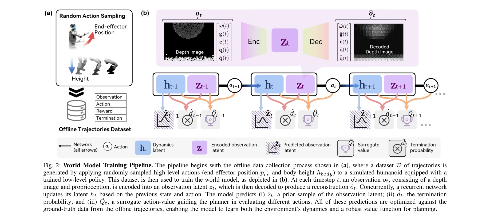
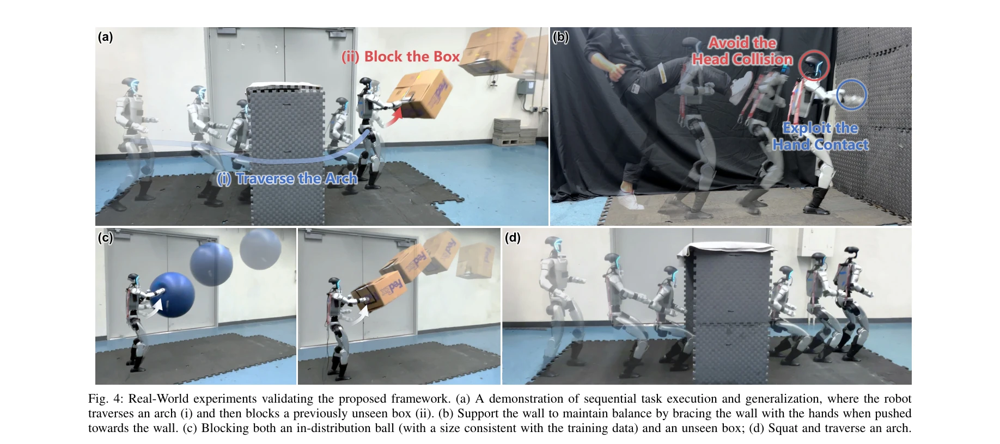
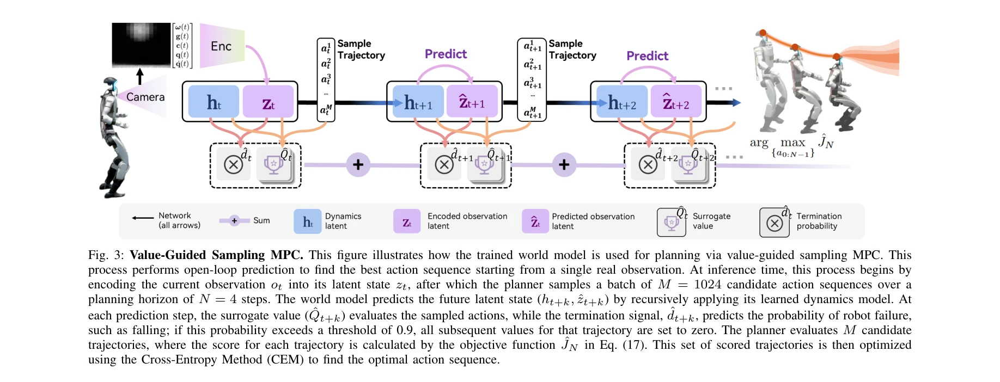

# Ego-Vision World Model for Humanoid Contact Planning

> **저자**: Hang Liu, Yuman Gao, Sangli Teng, Yufeng Chi, Yakun Sophia Shao, Zhongyu Li, Maani Ghaffari, Koushil Sreenath | **날짜**: 2026-03-08 | **DOI**: [10.48550/arXiv.2510.11682](https://doi.org/10.48550/arXiv.2510.11682)

---

## Essence

*Fig. 2: World Model Training Pipeline. The pipeline begins with the offline data collection process shown in (a), where *

휴머노이드 로봇이 학습된 world model과 sampling-based MPC를 결합하여 접촉 기반 작업을 효율적으로 수행할 수 있는 프레임워크를 제안한다. 오프라인 데이터셋에서 훈련된 단일 모델이 다양한 접촉 작업을 지원하며 실시간 시각 기반 계획을 실현한다.

## Motivation

- **Known**: 전통적인 최적화 기반 플래너는 접촉 복잡성으로 인해 어려움을 겪고, on-policy RL은 샘플 효율성이 낮고 멀티태스크 능력이 제한적이다. World model을 이용한 모델 기반 계획은 유망하지만 부분적이고 노이즈가 많은 센서 데이터에서 접촉 상태 예측이 어렵다.
- **Gap**: 휴머노이드 로봇이 고차원 시각 입력에서 효율적으로 학습하면서도 다양한 접촉 작업을 멀티태스크로 수행할 수 있는 방법이 부족하다. 특히 sparse contact reward와 센서 노이즈를 처리하면서 실시간 성능을 유지하는 것이 과제다.
- **Why**: 휴머노이드 로봇이 미구조화된 환경에서 자율성을 달성하려면 접촉을 회피하기보다는 활용해야 하며, 이는 벽 지지, 물체 차단, 장애물 통과 등 실제 작업에 필수적이다.
- **Approach**: Demonstration-free 오프라인 데이터셋에서 압축된 latent space에서 예측하는 visual world model을 학습하고, 학습된 surrogate value function으로 MPC를 안내하여 sparse reward와 센서 노이즈를 처리한다.

## Achievement

*Fig. 4: Real-World experiments validating the proposed framework. (a) A demonstration of sequential task execution and g*

- **스케일 가능한 시각 world model**: 다양한 접촉 작업을 capture하는 단일 모델을 demonstration-free 오프라인 데이터셋만으로 훈련
- **값 가이드 샘플링 MPC**: 학습된 surrogate value function으로 MPC를 안내하여 효율적인 action sequence 평가 가능
- **실시간 물리적 접촉 계획**: 물리적 휴머노이드에서 ego-centric depth image와 proprioception만으로 벽 지지, 물체 차단, 높이 제한 아치 통과 등 여러 접촉 작업 실현
- **샘플 효율성 및 멀티태스크 능력**: on-policy RL 대비 향상된 샘플 효율성과 단일 모델로 다양한 작업 수행

## How

*Fig. 3: Value-Guided Sampling MPC. This figure illustrates how the trained world model is used for planning via value-gu*

- Low-level controller: PPO로 훈련된 컨트롤러가 [v, p_ee, h_body] 명령을 추적하며 proprioceptive 입력만 사용
- Data collection: 시뮬레이션에서 랜덤하게 샘플된 고수준 액션으로 ball, wall, arch 세 가지 객체와의 상호작용 데이터 수집
- World model architecture: 관찰을 latent space로 인코딩하고, recurrent network이 동역학을 학습하며 관찰 latent, 종료 확률, surrogate value를 예측
- Value-guided sampling MPC: 1024개의 후보 action sequence를 4-step planning horizon에서 샘플링하고, surrogate value와 종료 신호로 평가한 후 Cross-Entropy Method로 최적화
- Training objective: 관찰 재구성, 동역학 예측, surrogate value 예측을 모두 최적화

## Originality

- Demonstration-free 오프라인 학습으로 비용이 많이 드는 휴머노이드 whole-body command 데모 제거
- Ego-centric depth image와 proprioception만으로 3D 접촉 기반 작업을 수행하는 방식
- Latent space에서의 world model 학습으로 고차원 시각 입력의 효율적 처리
- Surrogate value function을 MPC에 통합하여 sparse contact reward 문제 해결
- 단일 world model로 여러 다양한 접촉 작업(벽 지지, 물체 차단, 아치 통과)을 수행하는 멀티태스크 능력

## Limitation & Further Study

- Planning horizon이 4 steps로 제한적이므로 더 장기적인 계획이 필요한 복잡한 접촉 시퀀스에 어려움이 있을 수 있음
- Offline 데이터 품질과 다양성에 크게 의존하며, 학습 데이터에 없는 새로운 객체나 환경에서의 일반화 능력 미검증
- 64×48 저해상도 depth image만 사용하여 세밀한 tactile 접촉 정보 활용 부족
- Surrogate value function의 정확도가 planning 성능에 크게 영향을 미치지만 그 검증 기준이 불명확함
- 후속 연구: 더 긴 planning horizon과 hierarchical planning 방식 탐색, tactile sensor 통합, sim-to-real transfer 강화, 새로운 객체/환경에 대한 적응 메커니즘 개발

## Evaluation

- Novelty: 4/5
- Technical Soundness: 3/5
- Significance: 4/5
- Clarity: 4/5
- Overall: 4/5

**총평**: 이 논문은 world model과 MPC를 결합한 기존 접근법에 surrogate value function을 통합하여 sparse contact reward 문제를 창의적으로 해결하고, demonstration-free 학습으로 실용성을 높였다. 물리적 휴머노이드에서 다양한 접촉 작업을 성공적으로 실현한 점은 로봇 접촉 계획 분야에 의미 있는 기여를 한다.

## Related Papers

- 🏛 기반 연구: [[papers/1401_GauDP_Reinventing_Multi-Agent_Collaboration_through_Gaussian/review]] — GauDP의 3D Gaussian 기반 환경 표현 방법이 Ego-Vision World Model의 시각 기반 접촉 계획에 필수적인 공간 이해 기반을 제공한다.
- 🔗 후속 연구: [[papers/1378_Embracing_Bulky_Objects_with_Humanoid_Robots_Whole-Body_Mani/review]] — world model 기반 접촉 계획과 대형 물체 포용 조작을 결합하면 복잡한 물리적 상호작용이 필요한 과제 수행이 가능하다.
- 🏛 기반 연구: [[papers/1631_World_Models/review]] — World Models의 기본 개념과 구조가 Ego-Vision World Model의 접촉 계획을 위한 환경 모델링의 이론적 토대가 된다.
- 🏛 기반 연구: [[papers/1378_Embracing_Bulky_Objects_with_Humanoid_Robots_Whole-Body_Mani/review]] — Ego-Vision World Model의 접촉 계획 방법이 대형 물체와의 전신 접촉을 계획하고 실행하는 데 필수적인 기반 기술이다.
- 🔗 후속 연구: [[papers/1401_GauDP_Reinventing_Multi-Agent_Collaboration_through_Gaussian/review]] — GauDP의 3D Gaussian 기반 협업과 Ego-Vision World Model의 접촉 계획을 결합하면 다중 로봇 협업 조작이 가능하다.
- 🔗 후속 연구: [[papers/1514_Learning_a_Vision-Based_Footstep_Planner_for_Hierarchical_Wa/review]] — ego-vision 기반 월드 모델을 발걸음 계획에 구체적으로 적용한 계층적 제어 시스템으로 발전시킨 형태임
