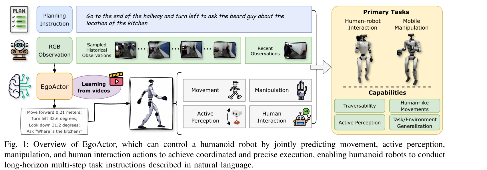

# EgoActor: Grounding Task Planning into Spatial-aware Egocentric Actions for Humanoid Robots via Visual-Language Models

> **저자**: Yu Bai, MingMing Yu, Chaojie Li, Ziyi Bai, Xinlong Wang, Börje F. Karlsson | **날짜**: 2026-02-04 | **URL**: [https://arxiv.org/abs/2602.04515](https://arxiv.org/abs/2602.04515)

---

## Essence

*Fig. 1: Overview of EgoActor, which can control a humanoid robot by jointly predicting movement, active perception,*

EgoActor는 VLM 기반의 통합 모델로서 고수준 자연어 명령을 인간형 로봇의 저수준 행동(이동, 지각, 조작, 인간-로봇 상호작용)으로 직접 변환하여 실시간 제어를 가능하게 한다.

## Motivation

- **Known**: VLM 기반 embodied agent와 mobile manipulation 연구가 진행되었으나, 기존 접근법들은 사전 정의된 스킬 라이브러리에 의존하거나 특정 작업 유형에만 집중했다.
- **Gap**: 인간형 로봇의 불안정성, 부분 정보 관찰, 동적 환경에서 이동, 지각, 조작의 정밀한 통합 제어와 다양한 행동 타입 간의 유동적 전환을 동시에 달성하는 통합 접근법이 부재했다.
- **Why**: 인간형 로봇의 실제 배포는 시공간적 추론, 균형 유지, 정밀한 동작 조정이 필수적이며, 이를 위한 강력한 공간 이해와 다중 모달리티 통합이 중요하다.
- **Approach**: 다양한 실제 데모, 공간 추론 질의응답, 시뮬레이션 환경 데이터로 VLM을 감독하여 locomotion primitive, head movement, manipulation command, human-robot interaction을 포함한 자연어 행동(NLA)을 직접 예측하는 EgoActor를 개발했다.

## Achievement

*Fig. 2: Visualization of EgoActor’s working procedure for a given task: “Approach and pick up the orange on the desk”. T*

- **EgoActing 작업 정의**: 고수준 자연어 지시를 egocentric 관찰 기반의 정밀한 저수준 행동 수열로 변환하는 새로운 작업 공식화
- **통합 VLM 아키텍처**: 이동(거리 및 각도 지정), 자세 조정(서기, 쪼그려앉기), 능동적 지각(머리 방향), 조작(손/팔 제어), 인간 상호작용(제스처, 발화)을 단일 모델에서 통합
- **실시간 추론 성능**: 8B 및 4B 파라미터 모델 모두에서 1초 이하의 추론 지연으로 실시간 제어 지원
- **광범위한 평가**: 모의 환경과 실제 환경 모두에서 인간-로봇 상호작용, mobile manipulation, traversability 작업을 통해 작업 및 환경 수준 일반화 입증
- **오픈소스 공개**: 코드, 모델, 데이터셋, 평가 프로토콜 공개로 재현성 및 후속 연구 촉진

## How

*Fig. 3: Example natural language actions (NLA) in EgoActing.*

- VLM의 언어 추론 능력을 강화된 공간 이해 기능과 결합하여 자연언어 행동(NLA) 형태로 저수준 동작 예측
- 실제 세계 egocentric RGB 비디오 데모, 공간 추론 QA, 시뮬레이션 환경 데모의 다양한 감독 신호 활용
- 행동 타입별 분류(locomotion, perception, manipulation, interaction) 및 매개변수화(거리, 각도, 높이 등)를 통한 구조화된 행동 공간 설계
- Action history(a1:t-1)와 instruction(I), egocentric observation(Ot)을 입력으로 사용하는 조건부 확률 모델(Eq. 1) 기반 다음 행동 예측
- Real-world와 simulated 환경에서의 광범위한 벤치마킹을 통한 일반화 능력 검증

## Originality

- Humanoid robot의 전신 제어를 egocentric 수준에서 통합하는 최초의 VLM 기반 접근법으로, 기존의 분해된(decomposed) 스킬 라이브러리 방식과 차별화
- EgoActing이라는 새로운 작업 정의로 부분 정보 관찰, 동적 환경, 이질적 행동 타입의 유동적 전환을 명시적으로 다룸
- 공간 추론 기능을 직접 VLM에 통합하여 거리, 각도, 높이 등의 정량적 파라미터를 예측하는 메커니즘 도입

## Limitation & Further Study

- 실제 세계 평가가 제한적이며, 정량적 성공률 지표가 명확히 제시되지 않음 (정성적 사례 연구에 의존)
- 모델이 사전 학습된 locomotion, manipulation 정책에 의존하므로, 이러한 저수준 제어기의 성능 한계가 상위 결정 모델의 성과를 제약
- 다양한 humanoid 플랫폼(Boston Dynamics Atlas, Tesla Optimus 등)과의 호환성 검증 부재
- 시뮬레이션 대 실제 환경 간의 domain gap에 대한 체계적인 분석 및 완화 전략 부재
- **후속 연구**: (1) 저수준 제어기 학습의 통합, (2) 다중 로봇 플랫폼 포팅 및 적응 메커니즘, (3) 극단적 상황(고장, 비상 상황) 처리 능력, (4) 사람 피드백 기반 온라인 미세 조정(RLHF) 방법론

## Evaluation

- Novelty: 4/5
- Technical Soundness: 3/5
- Significance: 4/5
- Clarity: 4/5
- Overall: 4/5

**총평**: EgoActor는 인간형 로봇의 실제 배포를 위한 강력한 공간 이해 기능을 갖춘 통합 VLM 기반 제어 프레임워크를 제시하며, 다양한 작업과 환경에서의 일반화 능력을 입증했다는 점에서 의미 있는 기여이다. 다만 실제 세계 평가의 확대와 정량적 성능 지표 보완이 필요하다.

## Related Papers

- 🔗 후속 연구: [[papers/1378_Embodied_Navigation_Foundation_Model/review]] — NavFoM의 크로스-구현체 네비게이션 능력이 DivScene의 open-vocabulary 네비게이션을 일반화한다.
- 🔄 다른 접근: [[papers/1402_GC-VLN_Instruction_as_Graph_Constraints_for_Training-free_Vi/review]] — GC-VLN도 학습 없이 작동하는 vision-language 네비게이션 프레임워크를 제안한다.
- 🏛 기반 연구: [[papers/1432_Improving_Vision-and-Language_Navigation_with_Image-Text_Pai/review]] — VLN-BERT의 vision-language 사전학습이 DivScene의 LVLM 기반 네비게이션의 기초가 된다.
- 🏛 기반 연구: [[papers/1402_GC-VLN_Instruction_as_Graph_Constraints_for_Training-free_Vi/review]] — DivScene의 대규모 네비게이션 데이터가 GC-VLN의 제약 최적화 검증에 활용된다.
- 🔗 후속 연구: [[papers/1432_Improving_Vision-and-Language_Navigation_with_Image-Text_Pai/review]] — DivScene의 대규모 객체 범주가 VLN-BERT의 객체 참조 grounding을 확장한다.
- 🔗 후속 연구: [[papers/1600_UniGoal_Towards_Universal_Zero-shot_Goal-oriented_Navigation/review]] — UniGoal의 universal framework가 DivScene의 open-vocabulary object navigation을 포함하여 더 다양한 목표 유형을 처리할 수 있도록 확장 가능
- 🏛 기반 연구: [[papers/1378_Embodied_Navigation_Foundation_Model/review]] — DivScene의 대규모 네비게이션 데이터셋이 NavFoM의 크로스-태스크 학습에 기여한다.
- 🔗 후속 연구: [[papers/1383_EmbSpatial-Bench_Benchmarking_Spatial_Understanding_for_Embo/review]] — DivScene의 대규모 객체 범주가 EmbSpatial-Bench의 공간 이해 평가를 확장한다.
- 🔄 다른 접근: [[papers/1384_Endowing_GPT-4_with_a_Humanoid_Body_Building_the_Bridge_Betw/review]] — EgoActor도 VLM 기반으로 고수준 명령을 저수준 행동으로 변환하는 유사한 접근법이다.
