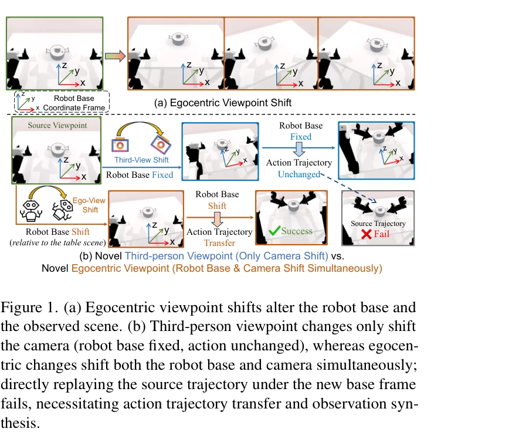
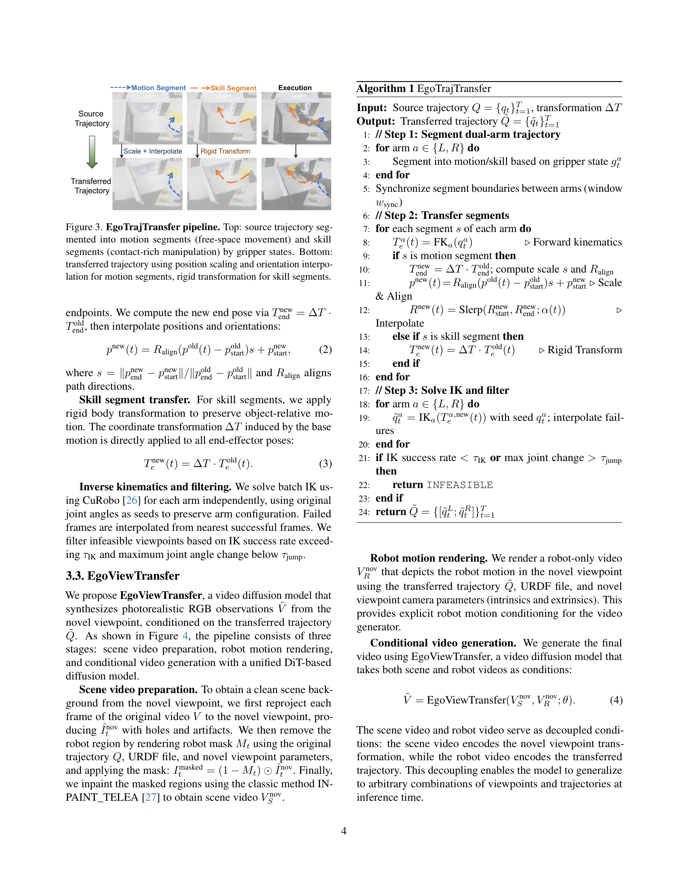

# EgoDemoGen: Egocentric Demonstration Generation for Viewpoint Generalization in Robotic Manipulation

> **저자**: Yuan Xu, Jiabing Yang, Xiaofeng Wang, Yixiang Chen, Zheng Zhu, Bowen Fang, Guan Huang, Xinze Chen, Yun Ye, Qiang Zhang, Peiyan Li, Xiangnan Wu, Kai Wang, Bing Zhan, Shuo Lu, Jing Liu, Nianfeng Liu, Yan Huang, Liang Wang | **날짜**: 2025-09-26 | **URL**: [https://arxiv.org/abs/2509.22578](https://arxiv.org/abs/2509.22578)

---

## Essence

*Figure 2. Overview of EgoDemoGen. Given source demonstrations from a standard egocentric viewpoint, we generate novel de*

EgoDemoGen은 로봇 조작 작업에서 자기중심 시점 변화에 대한 정책의 강건성을 개선하기 위해, 로봇 궤적 전이와 관찰 영상 합성을 동시에 수행하는 시연 생성 프레임워크를 제안한다.

## Motivation

- **Known**: 모방학습 기반 시각운동 정책은 로봇 조작에서 강력한 성능을 보이지만, 자기중심 시점 변화에 민감하다는 문제가 있으며, 기존 방법들은 관찰만 합성하거나 동작만 전이하는 데 그친다.
- **Gap**: 자기중심 시점 변화는 카메라 위치뿐만 아니라 로봇 기저 좌표계도 동시에 변경되므로, 기존의 제3자 시점 합성 방법으로는 시각-동작 정렬을 유지하면서 쌍을 이루는 시연을 생성할 수 없다.
- **Why**: 로봇이 배치될 때 정확하지 않은 위치, 플랫폼 재구성, 환경 레이아웃 변화 등으로 인한 자기중심 시점 변화는 실무에서 자주 발생하며, 모든 시점의 시연을 수집하기는 비용이 너무 크다.
- **Approach**: EgoDemoGen은 EgoTrajTransfer를 통해 동작-스킬 분할과 기하학적 변환으로 궤적을 새로운 자기중심 좌표계에 전이하고, EgoViewTransfer는 reprojected scene video와 rendered robot motion video를 조건으로 하는 diffusion 기반 video generation 모델로 사실적인 관찰을 합성한다.

## Achievement

*Figure 1. (a) Egocentric viewpoint shifts alter the robot base and*

- **paired demonstration 생성**: 자기중심 시점 변화 하에서 시각-동작 정렬을 유지하는 시연을 최초로 생성하는 방법 제안
- **강건성 향상**: 시뮬레이션에서 ±24.6%, ±16.9%, 실제 로봇에서 ±16.0%, ±23.0% 성공률 개선
- **고품질 영상 합성**: EgoViewTransfer가 자기중심 시점의 novel-view 영상을 기존 방법보다 우수한 품질로 생성
- **다중 기하학적 변환 기법**: motion-skill segmentation, geometry-aware transformation, inverse kinematics filtering을 통한 실현 가능한 궤적 생성

## How

*Figure 3. EgoTrajTransfer pipeline. Top: source trajectory seg-*

- 자기중심 시점을 로봇 기저의 위치 변화 (Δx, Δy, Δθ)로 정의하고 무작위 샘플링으로 novel viewpoints 생성
- gripper 상태를 기반으로 source 궤적을 motion과 skill phases로 분할
- 각 phase별로 기하학적으로 정확한 변환 적용 (위치 변화는 직선 변환, 방향 회전은 회전 행렬 적용)
- inverse kinematics로 변환된 궤적을 joint actions로 재구성하고 운동학적 실현 가능성으로 필터링
- source observation video를 novel viewpoint geometry로 reprojection
- transferred trajectory를 URDF와 camera parameters로 렌더링하여 robot motion video 생성
- 두 비디오를 조건으로 하는 diffusion 기반 video generation 모델로 photorealistic observation 합성
- double reprojection self-supervised 전략으로 multi-viewpoint 데이터 없이 모델 훈련

## Originality

- 자기중심 시점 변화의 고유한 특성 (로봇 기저와 카메라의 동시 변화)을 명확히 인식하고 이를 처리하는 최초의 체계적 접근
- 궤적 전이와 영상 합성을 joint optimization 없이 decoupled components로 설계하면서도 정렬을 유지하는 방식
- self-supervised double reprojection 전략으로 multi-viewpoint ground-truth 없이 robust video generation 모델 훈련
- motion-skill 분할을 통한 phase-specific 기하학적 변환으로 복잡한 조작 궤적의 정확한 전이

## Limitation & Further Study

- 궤적 전이의 정확성은 inverse kinematics 솔루션의 품질에 의존하며, 복잡한 self-collision 제약이 있는 로봇에서는 실현 가능한 viewpoint의 범위가 제한될 수 있음
- EgoViewTransfer의 영상 합성 품질은 source observation의 3D 기하학적 일관성 가정에 의존하므로, 복잡한 비강체 객체나 occlusion이 많은 장면에서 성능 저하 가능
- 현재 방법은 손-물체 상호작용이 충분히 명확한 조작 작업에 초점을 맞추고 있으며, 미세한 미끄러짐이나 접촉력이 중요한 작업으로의 확장 필요
- 후속 연구로 더 정교한 자기중심 시점 샘플링 전략, trajectory transfer의 robust feasibility checking, 실시간 적응형 demonstration generation 고려 가능

## Evaluation

- Novelty: 4/5
- Technical Soundness: 3/5
- Significance: 4/5
- Clarity: 4/5
- Overall: 4/5

**총평**: EgoDemoGen은 자기중심 시점 변화라는 실무적으로 중요하면서도 미해결 문제를 명확히 정의하고, 궤적 전이와 영상 합성을 체계적으로 결합하여 해결하는 포괄적인 솔루션을 제시한다. 시뮬레이션과 실제 로봇 실험에서의 일관된 성능 개선과 고품질 영상 생성 능력은 실무 적용 가치가 높다.

## Related Papers

- 🔄 다른 접근: [[papers/1419_H3DP_Triply-Hierarchical_Diffusion_Policy_for_Visuomotor_Lea/review]] — 1X World Model Challenge의 generative humanoid modeling이 DiWA의 world model 기반 정책 적응과 다른 접근을 제시한다.
- 🏛 기반 연구: [[papers/1407_FRoM-W1_Towards_General_Humanoid_Whole-Body_Control_with_Lan/review]] — Genie의 generative interactive environment가 DiWA의 world model 활용 방법론에 이론적 기반을 제공한다.
- 🔗 후속 연구: [[papers/1481_Motus_A_Unified_Latent_Action_World_Model/review]] — Motus의 unified latent action world model이 DiWA의 diffusion policy adaptation을 더 통합된 관점으로 확장한다.
- 🏛 기반 연구: [[papers/1619_VLA-RFT_Vision-Language-Action_Reinforcement_Fine-tuning_wit/review]] — DiWA의 world model adaptation 기법이 VLA-RFT에서 데이터 기반 world model 활용의 이론적 토대가 된다
