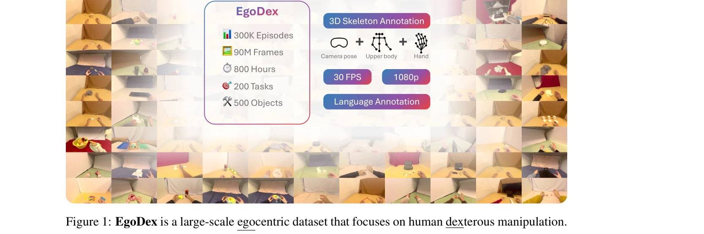

# EgoDex: Learning Dexterous Manipulation from Large-Scale Egocentric Video

> **저자**: Ryan Hoque, Peide Huang, David J. Yoon, Mouli Sivapurapu, Jian Zhang | **날짜**: 2025-05-16 | **URL**: [https://arxiv.org/abs/2505.11709](https://arxiv.org/abs/2505.11709)

---

## Essence

*Figure 1: EgoDex is a large-scale egocentric dataset that focuses on human dexterous manipulation.*

Apple Vision Pro를 이용해 829시간의 egocentric 비디오와 paired 3D hand pose 데이터를 수집한 EgoDex 데이터셋을 소개하고, 이를 통해 dexterous manipulation을 위한 imitation learning의 데이터 부족 문제를 해결한다.

## Motivation

- **Known**: Robot teleoperation은 대규모 manipulation 데이터를 수집할 수 있지만 매우 노동집약적이고 확장성이 낮다. Ego4D와 같은 대규모 egocentric 비디오 데이터셋도 native hand pose annotation과 manipulation 중심의 구성이 부족하다.
- **Gap**: Dexterous manipulation을 위한 Internet-scale의 데이터 코퍼스가 존재하지 않으며, 기존 egocentric 데이터셋들은 정밀한 3D hand skeleton annotation이 없어 복잡한 손가락 움직임 학습에 부적합하다.
- **Why**: 대규모 고품질 데이터셋은 Large Language Model과 Vision Model의 성공처럼 robot manipulation 분야의 혁신을 가능하게 할 수 있으며, passively scalable한 egocentric 데이터는 미래의 wearable headset 환경에서 critical하다.
- **Approach**: Apple Vision Pro의 on-device SLAM과 calibrated cameras를 활용하여 egocentric 비디오 수집 시점에 정밀한 3D hand and finger tracking을 함께 획득하고, 194개의 tabletop manipulation tasks를 포함한 대규모 dataset을 구축한다.

## Achievement

*Figure 1: EgoDex is a large-scale egocentric dataset that focuses on human dexterous manipulation.*

- **최대 규모의 Dexterous Manipulation 데이터셋**: 829시간, 90M frames, 338K trajectories, 194 tasks, 500개 이상의 object category를 포함한 가장 대규모이고 다양한 human manipulation 데이터셋 구축
- **고품질 Annotation**: 수집 시점의 precise 3D hand and finger joint tracking (모든 손가락 관절), camera extrinsics, language annotation을 포함하여 기존 데이터셋 대비 현저히 향상된 annotation 품질 제공
- **Diverse Manipulation Tasks**: Tying shoelaces, folding laundry, unscrewing bottle caps 등 단순 pick-and-place를 넘는 복잡한 long-horizon manipulation behaviors 포함
- **Benchmark and Evaluation**: Hand trajectory prediction을 위한 imitation learning policies를 체계적으로 평가하는 metrics와 benchmarks 제시

## How

- Apple Vision Pro를 활용한 egocentric video 수집으로 wide field of view와 30 FPS 1080p quality 확보
- On-device SLAM과 multiple calibrated cameras를 통해 head, arms, wrists, 그리고 모든 finger joint의 3D pose를 수집 시점에 정밀하게 추적
- Everyday household objects와 tabletop 환경에서 다양한 manipulation behaviors를 체계적으로 수집
- Behavior cloning (BC) 등의 imitation learning 방법론으로 hand trajectory prediction 성능 평가
- Existing large-scale datasets (DROID, Ego4D)와의 비교를 통해 dataset의 우수성과 고유성 입증

## Originality

- **Passive Scalability의 실현**: Egocentric human video를 Internet 데이터처럼 passively scalable하게 수집하면서도 paired 3D annotations 제공
- **Hardware-Agnostic Human Embodiment**: Robot-specific teleoperation 대신 human hand를 common embodiment으로 활용하여 일반화 가능성 확보
- **Precise On-Device Capture**: Apple Vision Pro의 on-device SLAM과 calibrated cameras를 활용한 unprecedented한 precision의 3D hand pose 수집 방식
- **Comprehensive Dataset Design**: 194개 tasks, 500+ objects, 338K trajectories를 포함한 기존 datasets 대비 한 자릿수 이상 큰 규모와 diversity

## Limitation & Further Study

- **Domain Gap**: Egocentric human video에서 학습한 정책이 실제 robot hand/gripper와의 embodiment 차이로 인해 transfer 성능이 제한될 수 있음
- **Task Scope**: Tabletop manipulation에 제한되어 있으며, out-of-reach tasks나 large-scale manipulation tasks는 포함되지 않음
- **Annotation Completeness**: Object-level instance segmentation이나 fine-grained interaction annotation 등 추가 annotation이 부재함
- **Evaluation Metrics**: Hand trajectory prediction metrics의 robot task success와의 correlation이 명확하지 않아, 실제 manipulation performance와의 관계 검증 필요
- **후속연구**: (1) Domain adaptation 기법을 통한 human-to-robot transfer learning 개선, (2) Vision-language models을 활용한 semantic understanding 강화, (3) Multimodal learning으로 tactile/force feedback 정보 통합, (4) Real robot deployment 검증을 통한 실용성 확인

## Evaluation

- Novelty: 4/5
- Technical Soundness: 3/5
- Significance: 4/5
- Clarity: 4/5
- Overall: 4/5

**총평**: EgoDex는 Apple Vision Pro를 활용한 혁신적인 데이터 수집 방식으로 dexterous manipulation 분야의 오래된 데이터 부족 문제를 근본적으로 해결하며, 규모, 품질, 다양성 측면에서 기존 datasets를 크게 능가하는 획기적인 기여를 한다.

## Related Papers

- 🏛 기반 연구: [[papers/1373_EgoVLA_Learning_Vision-Language-Action_Models_from_Egocentri/review]] — EgoDex의 대규모 egocentric 비디오와 3D hand pose 데이터는 EgoVLA의 Vision-Language-Action 모델 학습을 위한 핵심 데이터 소스입니다.
- 🔗 후속 연구: [[papers/1370_EgoHumanoid_Unlocking_In-the-Wild_Loco-Manipulation_with_Rob/review]] — EgoDex의 829시간 egocentric 데이터 수집 방법론은 EgoHumanoid의 로봇 없는 인간 시연 수집 프레임워크를 확장하는 데 직접 활용할 수 있습니다.
- 🔄 다른 접근: [[papers/1335_DexCap_Scalable_and_Portable_Mocap_Data_Collection_System_fo/review]] — DexCap의 휴대형 모션 캡처 시스템과 EgoDex의 Apple Vision Pro 기반 수집 방식은 서로 다른 접근법으로 손동작 데이터를 획득하는 대안적 방법론입니다.
- 🏛 기반 연구: [[papers/1336_DexHub_and_DART_Towards_Internet_Scale_Robot_Data_Collection/review]] — DART의 클라우드 기반 데이터 수집 플랫폼은 EgoDex가 보여준 대규모 egocentric 비디오 수집의 기술적 기반이 됩니다.
- 🔄 다른 접근: [[papers/1337_DexMimicGen_Automated_Data_Generation_for_Bimanual_Dexterous/review]] — DexMimicGen의 시뮬레이션 기반 자동 데이터 생성과 EgoDex의 실제 인간 행동 수집은 bimanual manipulation 데이터 확보를 위한 상호 보완적 접근법입니다.
