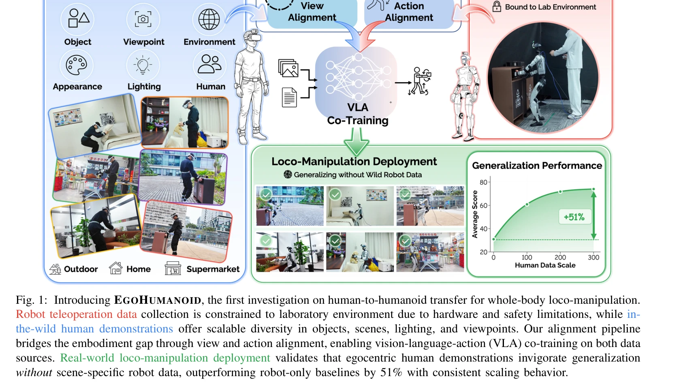
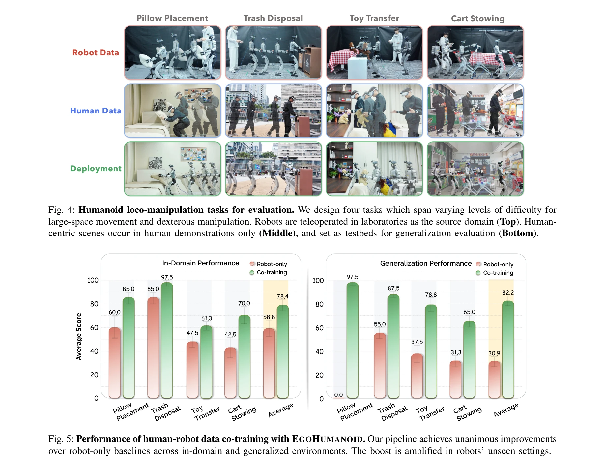

# EgoHumanoid: Unlocking In-the-Wild Loco-Manipulation with Robot-Free Egocentric Demonstration

> **저자**: Modi Shi, Shijia Peng, Jin Chen, Haoran Jiang, Yinghui Li, Di Huang, Ping Luo, Hongyang Li, Li Chen | **날짜**: 2026-02-10 | **DOI**: [10.48550/arXiv.2602.10106](https://doi.org/10.48550/arXiv.2602.10106)

---

## Essence

*Fig. 1: Introducing EGOHUMANOID, the first investigation on human-to-humanoid transfer for whole-body loco-manipulation.*

EgoHumanoid는 로봇 없이 수집한 인간의 egocentric 시연을 제한된 로봇 데이터와 함께 co-training하여 humanoid 로봇이 diverse한 실세계 환경에서 loco-manipulation을 수행할 수 있도록 하는 첫 번째 프레임워크이다.

## Motivation

- **Known**: 기존 humanoid loco-manipulation 학습은 robot teleoperation 데이터에 의존하지만, 이는 높은 비용과 복잡성으로 인해 실험실 환경으로 제한된다. 반면 egocentric 인간 데이터는 diverse하고 scalable하지만 embodiment gap 때문에 로봇에 직접 적용할 수 없다.
- **Gap**: 기존 연구는 고정 기반 조작 작업에서 인간-로봇 co-training을 다뤘으나, 전신 움직임이 필요한 humanoid loco-manipulation으로의 확장은 미탐구 상태이다.
- **Why**: Humanoid 로봇은 가정 보조부터 야외 서비스까지 diverse한 인간 중심 환경에서 작동해야 하며, scalable하고 diverse한 학습 데이터의 부족이 이를 제한하고 있다.
- **Approach**: View alignment와 action alignment로 구성된 embodiment alignment pipeline을 제안하여 인간 시연을 로봇 호환 신호로 변환하고, VR 기반 teleoperation으로 보완 로봇 데이터를 수집한다.

## Achievement

*Fig. 5: Performance of human-robot data co-training with EGOHUMANOID. Our pipeline achieves unanimous improvements*

- **첫 humanoid loco-manipulation을 위한 인간-로봇 transfer**: Egocentric 인간 데이터가 co-training을 통해 humanoid 정책을 효과적으로 향상시킴을 입증했으며, 보지 못한 장면에서 51% 성능 향상을 달성했다.
- **체계적인 embodiment alignment pipeline**: View alignment (깊이 기반 reprojection과 inpainting)와 action alignment (통합 액션 공간 및 kinematic feasibility 보장)를 통해 human-robot gap을 실질적으로 해결했다.
- **포괄적인 실세계 평가**: Unitree G1 humanoid에서 네 가지 loco-manipulation 작업으로 검증하여 어떤 행동이 전이되는지, 인간 데이터를 어떻게 scaling할 수 있는지 특성화했다.

## How

*Fig. 3: Pipeline of human-to-humanoid alignment. (a) View Alignment: Egocentric images are transformed to approximate*

- VR headset, body trackers, egocentric camera를 통합한 portable 인간 데이터 수집 시스템 개발
- View alignment: 깊이 정보를 사용한 egocentric 관찰을 robot viewpoint로 변환하는 reprojection과 inpainting 적용
- Action alignment: 상체 제어를 위한 delta end-effector pose와 locomotion을 위한 discrete command로 통합 액션 공간 구성
- Vision-language-action (VLA) policy를 인간과 로봇 데이터 모두에서 co-training
- Ablation study를 통해 각 컴포넌트의 기여도와 scaling behavior 분석

## Originality

- Whole-body loco-manipulation 작업을 위한 최초의 인간-humanoid transfer 연구로, 기존 고정 기반 조작 중심 접근법에서 근본적인 확장을 제시했다.
- Morphology, kinematics, viewpoint, motion dynamics에서의 큰 gap을 체계적으로 다루는 dedicated view transformation과 action retargeting 방법론 도입
- Portable 인간 데이터 수집 시스템과 VR 기반 robot teleoperation을 통합하여 실용적인 데이터 수집 인프라 구축

## Limitation & Further Study

- 현재 방법론은 Unitree G1 단일 humanoid 플랫폼에서만 검증되었으며, 다른 morphology의 humanoid로의 일반화 가능성이 불명확하다.
- View alignment의 reprojection과 inpainting 방법이 극단적인 viewpoint 변화나 occlusion이 심한 상황에서 품질 저하 가능성
- Action alignment에서 discrete locomotion command의 granularity가 fine-grained한 움직임 제어를 제한할 수 있다.
- **후속 연구**: 다양한 humanoid morphology에 대한 alignment 전략의 적응성 연구, generative model 기반 view synthesis의 향상, continuous locomotion control로의 확장

## Evaluation

- Novelty: 4/5
- Technical Soundness: 3/5
- Significance: 4/5
- Clarity: 4/5
- Overall: 4/5

**총평**: EgoHumanoid는 humanoid loco-manipulation 학습에 egocentric 인간 데이터를 성공적으로 활용한 선구적 연구로, 실용적인 alignment pipeline과 포괄적인 실세계 검증을 통해 인간-로봇 co-training의 잠재력을 명확히 보여준다.

## Related Papers

- 🔄 다른 접근: [[papers/1371_EgoMI_Learning_Active_Vision_and_Whole-Body_Manipulation_fro/review]] — EgoHumanoid의 로봇 없는 egocentric 시연과 EgoMI의 동기화된 머리-손 움직임 캡처는 embodiment gap 해결을 위한 서로 다른 접근법입니다.
- 🔗 후속 연구: [[papers/1426_HumanPlus_Humanoid_Shadowing_and_Imitation_from_Humans/review]] — EgoHumanoid의 robot-free egocentric 시연 수집 방식은 HumanPlus의 RGB 카메라 기반 실시간 shadowing 시스템과 결합하여 더욱 효과적인 데이터 수집이 가능합니다.
- 🔗 후속 연구: [[papers/1369_EgoDex_Learning_Dexterous_Manipulation_from_Large-Scale_Egoc/review]] — EgoDex의 829시간 egocentric 데이터 수집 방법론은 EgoHumanoid의 로봇 없는 인간 시연 수집 프레임워크를 확장하는 데 직접 활용할 수 있습니다.
- 🏛 기반 연구: [[papers/1426_HumanPlus_Humanoid_Shadowing_and_Imitation_from_Humans/review]] — HumanPlus의 RGB 카메라 기반 실시간 shadowing과 자율 학습 시스템은 EgoHumanoid의 로봇 없는 인간 시연 활용 프레임워크의 기술적 기반을 제공합니다.
