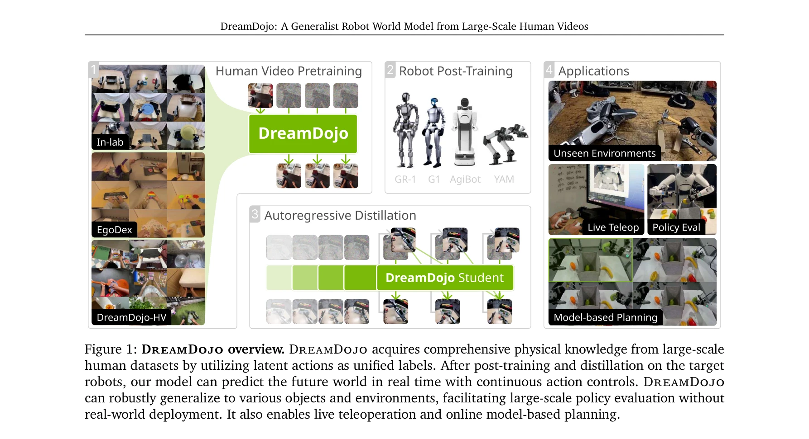

# DreamDojo: A Generalist Robot World Model from Large-Scale Human Videos

> **저자**: Shenyuan Gao, William Liang, Kaiyuan Zheng, Ayaan Malik, Seonghyeon Ye, Sihyun Yu, Wei-Cheng Tseng, Yuzhu Dong, Kaichun Mo, Chen-Hsuan Lin, Qianli Ma, Seungjun Nah, Loic Magne, Jiannan Xiang, Yuqi Xie, Ruijie Zheng, Dantong Niu, You Liang Tan, K. R. Zentner, George Kurian, Suneel Indupuru, Pooya Jannaty, Jinwei Gu, Jun Zhang, Jitendra Malik, Pieter Abbeel, Ming-Yu Liu, Yuke Zhu, Joel Jang, Linxi "Jim" Fan | **날짜**: 2026-02-06 | **URL**: [https://arxiv.org/abs/2602.06949](https://arxiv.org/abs/2602.06949)

---

## Essence

*Figure 1: DreamDojo overview. DreamDojo acquires comprehensive physical knowledge from large-scale*

44k시간의 대규모 인간 비디오에서 학습한 기초 로봇 세계 모델 DreamDojo를 제시하며, continuous latent actions를 통해 라벨 부족 문제를 해결하고 실시간 추론이 가능한 distillation 파이프라인을 제안한다.

## Motivation

- **Known**: Video world models는 최근 비디오 생성 기술의 발전으로 주목받고 있으나, 접촉이 많은 로봇 작업의 고차원 액션 공간에서는 이산 제어에만 국한되어 있다. 기존 로봇 데이터는 수집 비용이 높고 분포 범위가 제한적이다.
- **Gap**: 로봇 데이터의 제한된 커버리지와 액션 라벨의 부족으로 인해 현재 비디오 세계 모델은 관찰된 설정에만 제한되고 반사실적 액션에 반응하지 못한다. 다양한 환경과 물체에 대한 제로샷 일반화 능력이 부족하다.
- **Why**: 일반화된 로봇 정책 개발의 대규모 확장을 위해서는 다양한 환경과 상호작용을 시뮬레이션할 수 있는 세계 모델이 필수적이며, 이는 실 로봇 배포 비용을 줄이고 정책 평가를 가능하게 한다.
- **Approach**: 인간 비디오의 임베디먼트 갭에도 불구하고 기본 물리학이 일관되다는 점을 활용하여 44k시간의 대규모 egocentric 인간 비디오 데이터셋을 구축하고, continuous latent actions를 통합 프록시 액션으로 도입하여 라벨 없는 비디오에서 지식 전이를 강화한다.

## Achievement

*Figure 1: DreamDojo overview. DreamDojo acquires comprehensive physical knowledge from large-scale*

- **DreamDojo-HV 데이터셋**: 44k시간의 egocentric 인간 비디오로 구성된 현재까지 가장 규모 있고 다양한 세계 모델 학습용 데이터 코퍼스 (기존 공개 데이터셋 대비 96배 많은 스킬, 2000배 많은 장면)
- **Foundation world model**: Continuous latent actions를 활용한 통합 프록시로 미본 객체와 새로운 환경에 대한 제로샷 일반화 능력을 갖춘 최초의 일반 목적 로봇 세계 모델
- **Distillation pipeline**: Self Forcing 패러다임을 따르는 효율적인 distillation으로 640×480 해상도에서 10.81 FPS의 실시간 자회귀 예측 달성 및 장시간 컨텍스트 일관성 개선
- **다양한 응용**: Live teleoperation, policy evaluation, model-based planning 등 다수의 다운스트림 애플리케이션에서 1분 이상 실시간 상호작용 가능성 입증

## How

*Figure 3: Latent action model. [Left]: The information bottleneck design of our latent action model enforces*

- Cosmos-Predict2.5 기반 latent video diffusion model을 기초로 WAN2.2 tokenizer의 연속 잠재 공간에서 작동
- Flow matching loss를 사용한 denoiser 학습으로 텍스트, 조건부 프레임, 액션 조건을 통합
- 세 단계 학습: (1) 인간 비디오에서 continuous latent actions 포함하여 사전학습, (2) 대상 로봇 데이터셋에서 액션 조건 레이어 재설정 후 파인튜닝, (3) Self Forcing 기반 자회귀 distillation
- 정보 병목(information bottleneck) 설계를 통한 latent action model로 비지도 방식으로 프레임 간 의미 있는 액션 추출
- 다양한 OOD(out-of-distribution) 벤치마크에서 엄격한 체계적 평가 수행

## Originality

- **대규모 인간 비디오 활용**: 로봇 세계 모델을 위해 인간 비디오를 기초 사전학습으로 처음 대규모로 활용하며, 기존 로봇 데이터셋보다 몇 배수 규모의 데이터 확보
- **Continuous latent actions**: 다양한 액션 포맷의 통일 문제와 라벨 부족을 동시에 해결하는 새로운 프록시 액션 표현 방식
- **실시간 성능**: Distillation을 통해 실제 응용에 필요한 실시간 추론 속도(10.81 FPS) 달성 동시에 예측 품질 유지
- **제로샷 일반화**: 대규모 다양한 데이터와 통합된 액션 표현으로 미본 객체와 환경에 대한 제로샷 일반화 능력 최초 달성

## Limitation & Further Study

- 임베디먼트 갭: 인간과 로봇의 신체 구조 차이로 인한 직접적인 액션 전이의 제약이 완전히 해소되지 않음
- Post-training 의존성: 새로운 로봇 구현체별로 목표 로봇 데이터셋에서의 파인튜닝이 필요하며, 이 단계의 데이터 요구량과 성능 영향 분석 부족
- 평가 범위: 제시된 평가가 주로 비전 기반 메트릭에 집중되어 있으며, 실제 로봇 배포에서의 제어 정확도 및 오류 누적 효과에 대한 실증적 검증 제한
- 확장성 분석: 44k시간의 최적 데이터 규모 및 다양성의 한계, 추가 스케일링의 한계 수익(diminishing returns) 분석 부재
- **후속 연구**: (1) 더 정교한 임베디먼트 갭 브리징 방법 개발, (2) 최소 파인튜닝으로의 다중 로봇 일반화, (3) 실제 로봇 작업에서의 정책 학습 및 평가 성능 벤치마킹, (4) 물리적 상호작용 복잡도 증가에 따른 모델 성능 저하 분석

## Evaluation

- Novelty: 4/5
- Technical Soundness: 3/5
- Significance: 4/5
- Clarity: 4/5
- Overall: 4/5

**총평**: DreamDojo는 대규모 인간 비디오 데이터와 continuous latent actions를 통한 혁신적인 접근으로 일반화된 로봇 세계 모델의 새로운 기준을 제시하며, 실시간 성능 달성과 다양한 응용 가능성으로 로봇 학습 분야에 실질적인 영향을 미칠 수 있는 중요한 기여다.

## Related Papers

- 🔄 다른 접근: [[papers/1355_DreamDojo_A_Generalist_Robot_World_Model_from_Large-Scale_Hu/review]] — 동일한 44k시간 human video dataset을 사용하지만 다른 모델링 접근과 응용 방향을 제시한다.
- 🔗 후속 연구: [[papers/1522_RDT-1B_a_Diffusion_Foundation_Model_for_Bimanual_Manipulatio/review]] — Massive human video를 통한 universal humanoid policy가 DreamDojo의 human video 학습을 humanoid control로 확장한다.
- 🏛 기반 연구: [[papers/1632_World_Simulation_with_Video_Foundation_Models_for_Physical_A/review]] — Video foundation model을 통한 세계 시뮬레이션이 DreamDojo의 human video 기반 world model 구축에 기반을 제공한다.
- 🔄 다른 접근: [[papers/1474_MEM_Multi-Scale_Embodied_Memory_for_Vision_Language_Action_M/review]] — 단일 멀티스케일 world model로 장기 지평 작업을 처리하는 대안적 접근법을 제시한다
- 🧪 응용 사례: [[papers/1603_V-JEPA_2_Self-Supervised_Video_Models_Enable_Understanding_P/review]] — DreamDojo와 함께 대규모 비디오 데이터를 활용한 로봇 세계 모델 학습의 상호 보완적 접근법을 보여준다
