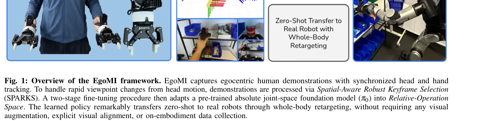
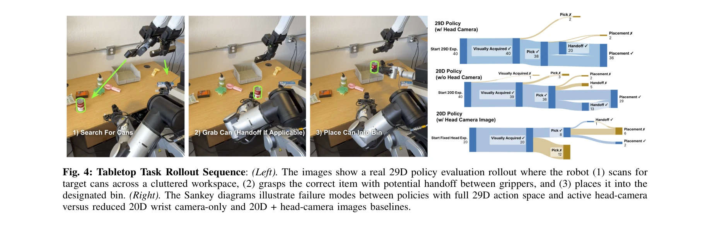

# EgoMI: Learning Active Vision and Whole-Body Manipulation from Egocentric Human Demonstrations

> **저자**: Justin Yu, Yide Shentu, Di Wu, Pieter Abbeel, Ken Goldberg, Philipp Wu | **날짜**: 2025-10-31 | **URL**: [https://arxiv.org/abs/2511.00153](https://arxiv.org/abs/2511.00153)

---

## Essence

*Fig. 1: Overview of the EgoMI framework. EgoMI captures egocentric human demonstrations with synchronized head and hand*

EgoMI는 인간의 동기화된 머리와 손 움직임을 캡처하여 반인간형 로봇의 조작 학습을 위한 모방학습 프레임워크를 제시한다. Spatial-Aware Robust Keyframe Selection (SPARKS)와 메모리 증강 정책을 통해 급격한 시점 변화로 인한 embodiment gap을 효과적으로 해결한다.

## Motivation

- **Known**: 모방학습은 인간 시연으로부터 로봇 기술 습득에 유망한 접근법이지만, egocentric 데이터는 embodiment gap으로 인한 분포 이동 문제를 야기한다. 기존 연구는 손목 카메라 제한, 좌표 불변 표현 등으로 gap을 최소화하려 했다.
- **Gap**: 인간은 조작 중 머리와 손을 동적으로 조정하며 시점을 지속적으로 변경하지만, 기존 로봇 시스템의 정적 카메라는 이를 재현할 수 없다. 특히 급격한 시점 변화 중 과거 관찰 정보의 맥락 손실이 심각한 문제다.
- **Why**: 인간의 active vision 행동을 로봇에 직접 전달할 수 있다면 복잡한 시각 탐색이 필요한 조작 작업의 성능을 크게 향상시킬 수 있다. 또한 시인성 확보 및 폐색 해결이 조작 정확도와 직결되므로 중요하다.
- **Approach**: EgoMI는 AR 글래스와 모션 추적 기술로 인간의 머리와 손 궤적을 동기화하여 캡처하고, SPARKS 알고리즘으로 과거 관찰 프레임을 선택적으로 메모리에 포함시킨다. 사전학습된 π0 foundation model을 relative-operation space로 미세조정하여 로봇으로의 zero-shot 전이를 가능하게 한다.

## Achievement

*Fig. 4: Tabletop Task Rollout Sequence: (Left). The images show a real 29D policy evaluation rollout where the robot (1)*

- **Actuated head의 중요성 입증**: 일상적 조작 작업에서 머리 카메라와 운동 통합의 필수성을 실제 로봇 실험으로 증명
- **SPARKS 메커니즘 개발**: viewpoint novelty, temporal recency, motion smoothness를 활용한 경량 공간 메모리 메커니즘으로 급격한 시점 변화 시 안정성 확보
- **하드웨어 시스템 개발**: 동기화된 egocentric 데이터 수집을 위한 하드웨어 디바이스 및 6-DoF 목 구조를 갖춘 로봇 플랫폼 구축
- **Zero-shot 전이 달성**: 시각 증강, in-painting, viewpoint re-rendering 없이 실제 로봇으로의 zero-shot 전이 성공
- **재현성 보장**: 코드, 하드웨어 설계, 실험 결과 공개로 후속 연구 활성화

## How

*Fig. 1: Overview of the EgoMI framework. EgoMI captures egocentric human demonstrations with synchronized head and hand*

- 상업용 하드웨어와 커스텀 컴포넌트를 통합한 데이터 수집 시스템으로 동기화된 머리, 손, 시각 정보 캡처
- Spatial-Aware Robust Keyframe Selection (SPARKS)로 과거 키프레임 이미지를 선택적으로 선택하여 시점 이동 시 맥락 손실 완화
- 사전학습된 absolute joint-space foundation model (π0)을 Relative-Operation Space로 두 단계 미세조정
- Whole-body retargeting 기법으로 인간의 머리·손 운동을 반인간형 로봇 embodiment으로 직접 변환
- 메모리 증강 정책으로 과거 관찰의 공간 정보를 명시적으로 활용하여 장시간 추론 안정성 강화

## Originality

- **첫 통합 시스템**: 머리와 손 궤적의 동기화 캡처를 동시에 수행하는 유일한 시스템 (Table I 참조)
- **SPARKS 알고리즘**: 학습 없이 viewpoint novelty, temporal recency, motion smoothness를 결합한 새로운 키프레임 선택 전략
- **Actuated head 기반 embodiment gap 해결**: 기존의 제약 기반 접근(제한된 카메라, 좌표 불변 표현)과 달리 인간의 active vision을 직접 모방하는 근본적 접근
- **Foundation model과의 결합**: π0와 같은 대규모 사전학습 모델을 egocentric head-hand 데이터에 특화된 미세조정으로 확장

## Limitation & Further Study

- **평가 대상 제한**: 단일 로봇 플랫폼(수정된 Rainbow-RBY1)에서만 실험되었으며, 다양한 semi-humanoid embodiment으로의 일반화 여부 미확인
- **작업 복잡도**: 논문에 제시된 실험이 tabletop 조작 작업 중심으로, 더 복잡한 전신 동작이 필요한 고차 작업에 대한 성능 미평가
- **데이터 수집 비용**: 동기화된 머리-손 추적 하드웨어 구축에 상당한 비용과 기술적 복잡도 필요
- **메모리 메커니즘의 한계**: SPARKS가 경량이지만 매우 급격한 시점 변화나 장시간 작업에서의 성능 한계 가능성
- **후속 연구 방향**: (1) 다양한 로봇 형태에 대한 일반화 연구, (2) 더 복잡한 다단계 작업으로의 확장, (3) 학습 기반 keyframe 선택 메커니즘 개발, (4) Real-time 성능 최적화

## Evaluation

- Novelty: 4/5
- Technical Soundness: 4/5
- Significance: 4/5
- Clarity: 4/5
- Overall: 4/5

**총평**: EgoMI는 인간의 active vision 행동을 체계적으로 로봇에 전달하는 혁신적 프레임워크로, SPARKS와 메모리 증강 정책을 통해 embodiment gap 문제를 우아하게 해결한다. 실제 로봇 실험과 재현성 약속이 동반된 강력한 기여로, 모방학습 분야의 중요한 진전을 나타낸다.

## Related Papers

- 🏛 기반 연구: [[papers/1380_Emergent_Active_Perception_and_Dexterity_of_Simulated_Humano/review]] — EgoMI의 동기화된 머리-손 움직임 캡처와 SPARKS 알고리즘은 PDC 프레임워크의 egocentric vision 기반 능동 지각 학습을 위한 핵심 기술적 기반입니다.
- 🧪 응용 사례: [[papers/1347_DIJIT_A_Robotic_Head_for_an_Active_Observer/review]] — EgoMI의 급격한 시점 변화 문제 해결 방법은 DIJIT의 능동 관찰자 로봇 헤드 제어에 직접 응용하여 더 안정적인 시각 추적을 구현할 수 있습니다.
- 🔗 후속 연구: [[papers/1273_ARMOR_Egocentric_Perception_for_Humanoid_Robot_Collision_Avo/review]] — 자기중심 시각 기반 능동 비전과 전신 조작에서 ToF 라이다 인지가 확장된다
- 🔗 후속 연구: [[papers/1347_DIJIT_A_Robotic_Head_for_an_Active_Observer/review]] — DIJIT의 9개 기계적 자유도를 가진 능동 시각 헤드는 EgoMI의 머리 움직임 캡처와 시점 변화 문제 해결에 하드웨어적 솔루션을 제공합니다.
- 🔄 다른 접근: [[papers/1370_EgoHumanoid_Unlocking_In-the-Wild_Loco-Manipulation_with_Rob/review]] — EgoHumanoid의 로봇 없는 egocentric 시연과 EgoMI의 동기화된 머리-손 움직임 캡처는 embodiment gap 해결을 위한 서로 다른 접근법입니다.
- 🔗 후속 연구: [[papers/1380_Emergent_Active_Perception_and_Dexterity_of_Simulated_Humano/review]] — PDC 프레임워크의 egocentric vision 기반 능동 지각은 EgoMI의 머리-손 동기화 캡처 기술과 결합하여 더욱 정교한 인간형 행동 모방이 가능합니다.
- 🏛 기반 연구: [[papers/1440_HDMI_Learning_Interactive_Humanoid_Whole-Body_Control_from_H/review]] — EgoMI의 egocentric vision과 모방학습 개념이 HDMI의 인간-로봇 상호작용 학습에 기반이 된다
