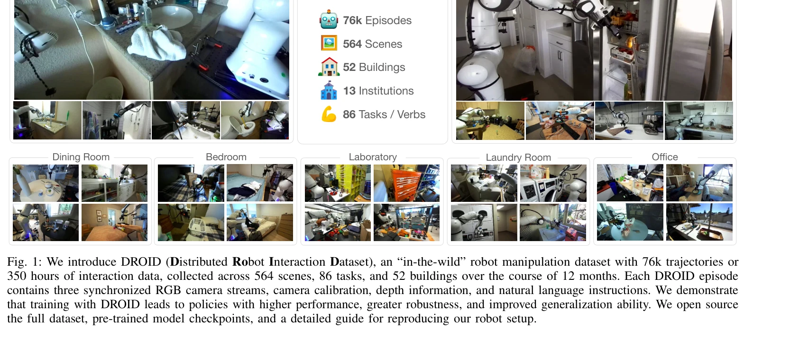
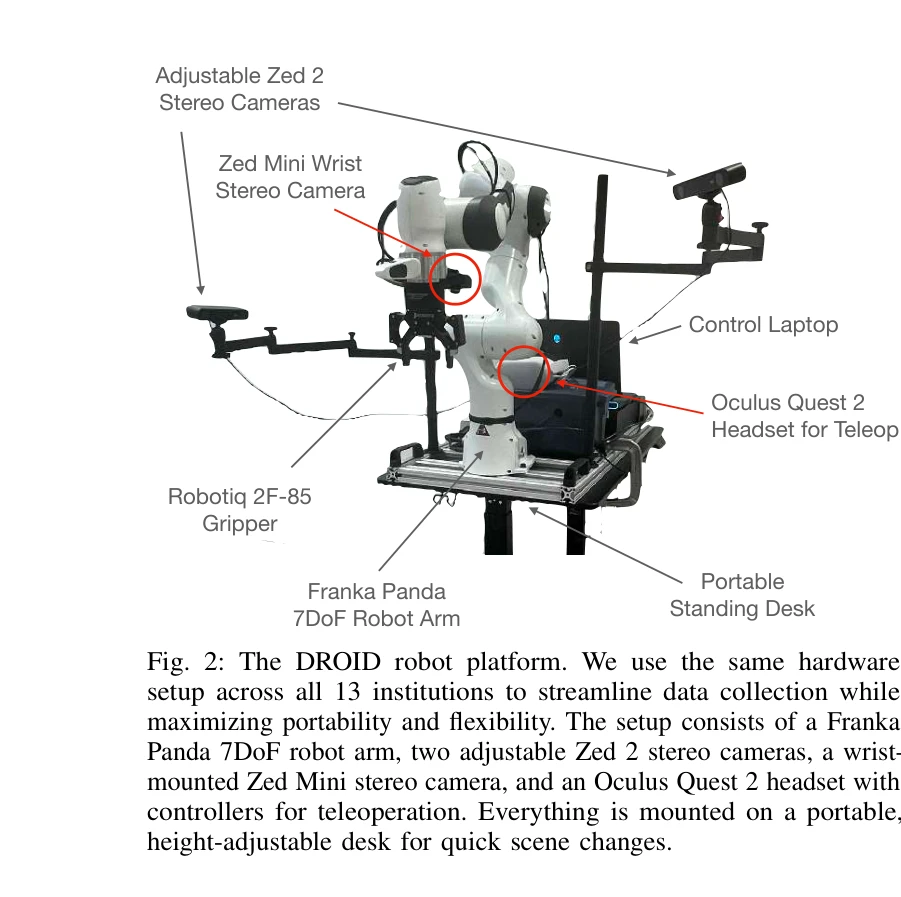

# DROID: A Large-Scale In-The-Wild Robot Manipulation Dataset

> **저자**: Alexander Khazatsky, Karl Pertsch, Suraj Nair, Ashwin Balakrishna, Sudeep Dasari, Siddharth Karamcheti, Soroush Nasiriany, Mohan Kumar Srirama, Lawrence Yunliang Chen, Kirsty Ellis, Peter David Fagan, Joey Hejna, Masha Itkina, Marion Lepert, Yecheng Jason Ma, Patrick Tree Miller, Jimmy Wu, Suneel Belkhale, Shivin Dass, Huy Ha, Arhan Jain, Abraham Lee, Youngwoon Lee, Marius Memmel, Sungjae Park, Ilija Radosavovic, Kaiyuan Wang, Albert Zhan, Kevin Black, Cheng Chi, Kyle Beltran Hatch, Shan Lin, Jingpei Lu, Jean Mercat, Abdul Rehman, Pannag R Sanketi, Archit Sharma, Cody Simpson, Quan Vuong, Homer Rich Walke, Blake Wulfe, Ted Xiao, Jonathan Heewon Yang, Arefeh Yavary, Tony Z. Zhao, Christopher Agia, Rohan Baijal, Mateo Guaman Castro, Daphne Chen, Qiuyu Chen, Trinity Chung, Jaimyn Drake, Ethan Paul Foster, Jensen Gao, Vitor Guizilini, David Antonio Herrera, Minho Heo, Kyle Hsu, Jiaheng Hu, Muhammad Zubair Irshad, Donovon Jackson, Charlotte Le, Yunshuang Li, Kevin Lin, Roy Lin, Zehan Ma, Abhiram Maddukuri, Suvir Mirchandani, Daniel Morton, Tony Nguyen, Abigail O'Neill, Rosario Scalise, Derick Seale, Victor Son, Stephen Tian, Emi Tran, Andrew E. Wang, Yilin Wu, Annie Xie, Jingyun Yang, Patrick Yin, Yunchu Zhang, Osbert Bastani, Glen Berseth, Jeannette Bohg, Ken Goldberg, Abhinav Gupta, Abhishek Gupta, Dinesh Jayaraman, Joseph J Lim, Jitendra Malik, Roberto Martín-Martín, Subramanian Ramamoorthy, Dorsa Sadigh, Shuran Song, Jiajun Wu, Michael C. Yip, Yuke Zhu, Thomas Kollar, Sergey Levine, Chelsea Finn | **날짜**: 2024-03-19 | **URL**: [https://arxiv.org/abs/2403.12945](https://arxiv.org/abs/2403.12945)

---

## Essence

*Fig. 1: We introduce DROID (Distributed Robot Interaction Dataset), an “in-the-wild” robot manipulation dataset with 76k*

DROID는 북미, 아시아, 유럽의 564개 장면과 86개 작업에서 수집한 76k개의 시연 궤적(350시간)을 포함하는 대규모 다양한 로봇 조작 데이터셋이며, 이를 통해 훈련한 정책이 높은 성능과 일반화 능력을 보인다.

## Motivation

- **Known**: 로봇 조작 정책의 일반화는 ImageNet, LAION 같은 대규모 다양한 데이터셋이 중요하며, 기존 RH20T, BridgeData V2 등의 로봇 데이터셋들도 존재하지만 제한된 장면과 작업 다양성을 가진다.
- **Gap**: 기존 로봇 조작 데이터셋은 대부분 소수의 실험실 환경에서 수집되어 장면 다양성이 부족하고, 실제 세계의 다양한 건물과 지리적 위치를 포함한 대규모 in-the-wild 데이터가 필요하다.
- **Why**: 로봇이 실제 환경에서 일반화된 조작을 수행하려면 조명, 환경, 물체, 지시 등의 변화에 강건한 정책이 필수이며, 이는 인터넷 규모의 대규모 다양한 데이터를 통해 달성 가능하다.
- **Approach**: 18개 연구기관의 50명의 데이터 수집자가 12개월 동안 같은 Franka Panda 로봇 하드웨어 스택을 사용하여 52개 건물의 564개 장면에서 분산적으로 데이터를 수집하고, RGB 카메라 3개, 깊이 정보, 카메라 캘리브레이션, 자연언어 주석을 포함시켰다.

## Achievement

*Fig. 1: We introduce DROID (Distributed Robot Interaction Dataset), an “in-the-wild” robot manipulation dataset with 76k*

- **데이터셋 규모**: 76k개의 시연 궤적(350시간)을 564개 장면과 86개 작업에서 수집하여 기존 데이터셋(Open X-Embodiment 311장면 제외시 최대 24장면)을 크게 초과
- **지리적 다양성**: 북미, 아시아, 유럽의 52개 건물에서 수집하여 실제 세계의 in-the-wild 데이터 확보
- **정책 성능 향상**: DROID로 훈련한 정책이 기존 최고 성능 접근법 대비 평균 20% 성능 개선, 강건성 및 일반화 능력 향상
- **구성 요소 충실성**: 카메라 캘리브레이션, 깊이 정보, 자연언어 주석을 포함하여 다양한 연구에 적용 가능
- **개방성**: 전체 데이터셋, 정책 학습 코드, 로봇 하드웨어 및 소프트웨어 설정 재현 가이드를 CC-BY 4.0 라이선스 하에 오픈소스 공개

## How

*Fig. 2: The DROID robot platform. We use the same hardware*

- 동일한 하드웨어 스택(Franka Panda 로봇팔)을 기반으로 18개 연구기관에서 표준화된 설정으로 분산 데이터 수집
- 사람 원격조종(human teleoperation)을 통해 실제 조작 데이터 수집
- 각 에피소드에서 3개의 동기화된 RGB 카메라 뷰, 깊이 정보, 카메라 캘리브레이션 데이터 기록
- 자연언어 지시사항으로 작업에 대한 주석 추가
- 실험을 통해 6개 작업과 4개 위치(실험실, 사무실, 실제 가정)에서 정책 평가 및 성능 검증
- 기존 Open X-Embodiment 데이터셋 기반 baseline과 비교하여 성능 평가

## Originality

- 로봇 조작 데이터셋에서 처음으로 564개 장면의 대규모 in-the-wild 데이터 수집으로 기존 datasets(최대 311장면)을 크게 초과
- 다양한 지리적 위치(북미, 아시아, 유럽)와 52개 건물에서 수집하여 실제 세계의 자연스러운 다양성 반영
- 카메라 캘리브레이션 정보 포함으로 기존 대규모 datasets(Open X-Embodiment 등)과 차별화
- 86개의 고유 동사(verb) 기반 작업 정의로 행동 다양성을 보다 정확하게 표현
- 18개 기관의 협력적 분산 수집으로 로봇 네비게이션/자동운전 데이터셋(KITTI, Ego4D)처럼 in-the-wild 접근 도입

## Limitation & Further Study

- 모든 데이터가 동일한 Franka Panda 로봇 하드웨어를 기반으로 수집되어 다양한 로봇 embodiment에 대한 일반화는 미검증
- 데이터 수집 비용과 노력이 매우 크므로 추후 데이터셋 확장의 실질적 한계 존재 가능성
- 자연언어 주석이 추가되었지만 주석의 정확성, 일관성, 세밀함에 대한 평가 정보 부족
- 기존 벤치마크 작업 정의와의 차이로 인한 다른 datasets과의 직접 비교 어려움
- 실험이 6개 작업과 4개 위치에만 국한되어 수집된 전체 데이터의 일반화 성능을 완전히 검증하지 못함
- 후속 연구: 다양한 로봇 embodiment(예: 다양한 팔, 그리퍼)에 대한 전이 학습 평가, 다국어 자연언어 주석 추가, 다양한 정책 학습 알고리즘과의 성능 비교

## Evaluation

- Novelty: 4/5
- Technical Soundness: 3/5
- Significance: 4/5
- Clarity: 4/5
- Overall: 4/5

**총평**: DROID는 로봇 조작의 대규모 분산 데이터 수집의 실질적 가치를 입증하고, in-the-wild 환경에서의 unprecedented 장면 다양성(564 scenes)과 지리적 다양성을 통해 로봇 정책의 일반화 능력을 크게 향상시키는 의미 있는 기여이다. 단일 하드웨어 스택 제약과 제한된 평가 실험은 아쉬우나, 오픈소스 공개와 명확한 기여로 로봇 학습 커뮤니티에 중대한 영향을 미칠 것으로 예상된다.

## Related Papers

- 🧪 응용 사례: [[papers/1348_Data_Scaling_Laws_in_Imitation_Learning_for_Robotic_Manipula/review]] — DROID 대규모 데이터셋을 활용하여 로봇 조작 학습의 데이터 스케일링 법칙 실증 검증
- 🏛 기반 연구: [[papers/1349_DataMIL_Selecting_Data_for_Robot_Imitation_Learning_with_Dat/review]] — DROID의 다양성 있는 대규모 데이터가 datamodels 기반 작업별 데이터 선택의 기반 자료
- 🧪 응용 사례: [[papers/1272_ARMADA_Augmented_Reality_for_Robot_Manipulation_and_Robot-Fr/review]] — 실제 로봇 조작 데이터셋 구축에서 증강현실 기반 수집 방법이 적용된다
- 🔄 다른 접근: [[papers/1339_Dexterity_from_Smart_Lenses_Multi-Fingered_Robot_Manipulatio/review]] — 인간 시연 데이터 수집에서 스마트 글래스 기반 접근과 대규모 다양성 기반 접근의 차이점 분석
- 🔗 후속 연구: [[papers/1467_Manipulate-Anything_Automating_Real-World_Robots_using_Visio/review]] — 대규모 실세계 조작 데이터셋을 VLM 기반 자동 데이터 생성으로 확장하여 더욱 풍부한 학습 데이터를 구축할 수 있습니다.
- 🏛 기반 연구: [[papers/1515_Phantom_Training_Robots_Without_Robots_Using_Only_Human_Vide/review]] — 로봇 하드웨어 없이 인간 시연으로 학습하는 Phantom의 핵심 데이터셋 구축 철학이 EgoMimic의 egocentric 비디오 기반 모방학습과 일치한다.
- 🧪 응용 사례: [[papers/1527_Real2Render2Real_Scaling_Robot_Data_Without_Dynamics_Simulat/review]] — DROID의 대규모 실제 로봇 데이터가 R2R2R 파이프라인의 실제 적용 성과를 검증함
- 🔗 후속 연구: [[papers/1536_RoboBrain_A_Unified_Brain_Model_for_Robotic_Manipulation_fro/review]] — DROID의 대규모 실제 조작 데이터셋이 RoboBrain의 ShareRobot 데이터셋을 더 광범위한 실제 환경으로 확장한다.
- 🔄 다른 접근: [[papers/1541_RoboMIND_Benchmark_on_Multi-embodiment_Intelligence_Normativ/review]] — 대규모 로봇 조작 데이터셋 구축에서 단일 플랫폼과 다중 embodiment라는 서로 다른 전략을 채택한다.
- 🔄 다른 접근: [[papers/1634_ZeroMimic_Distilling_Robotic_Manipulation_Skills_from_Web_Vi/review]] — EgoMimic의 egocentric learning과 ZeroMimic의 web video distillation이 서로 다른 데이터 소스로 manipulation skill 학습
- 🔗 후속 연구: [[papers/1403_FRAME_Floor-aligned_Representation_for_Avatar_Motion_from_Eg/review]] — egocentric video를 로봇 학습 데이터로 확장 활용하는 방법이다
- 🧪 응용 사례: [[papers/1485_HumanX_Toward_Agile_and_Generalizable_Humanoid_Interaction_S/review]] — EgoMimic의 자기중심 영상 기반 모방 학습이 HumanX framework의 실제 구현 방법을 제시함
- 🔗 후속 연구: [[papers/1440_HDMI_Learning_Interactive_Humanoid_Whole-Body_Control_from_H/review]] — EgoMimic의 egocentric 데이터 활용 방식을 HDMI가 물체 상호작용에 특화하여 확장했다
- 🔄 다른 접근: [[papers/1306_All_Robots_in_One_A_New_Standard_and_Unified_Dataset_for_Ver/review]] — 대규모 로봇 데이터셋을 각각 통합 표준과 in-the-wild manipulation이라는 다른 접근법으로 구축한다
- 🔄 다른 접근: [[papers/1323_BridgeData_V2_A_Dataset_for_Robot_Learning_at_Scale/review]] — 대규모 로봇 manipulation 데이터셋을 각각 저비용 공개 로봇과 in-the-wild 환경으로 다르게 수집한다
- 🔗 후속 연구: [[papers/1348_Data_Scaling_Laws_in_Imitation_Learning_for_Robotic_Manipula/review]] — DROID와 같은 대규모 데이터셋에서 환경과 객체 다양성 중심의 효율적 데이터 활용 전략
- 🧪 응용 사례: [[papers/1349_DataMIL_Selecting_Data_for_Robot_Imitation_Learning_with_Dat/review]] — DROID와 같은 대규모 데이터셋에서 datamodels 패러다임을 활용한 작업별 데이터 선택
