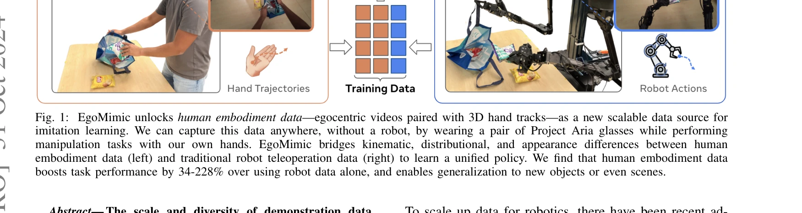
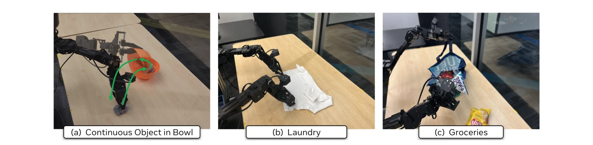
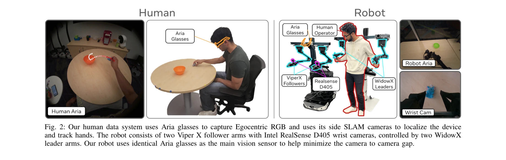

# EgoMimic: Scaling Imitation Learning via Egocentric Video

> **저자**: Simar Kareer, Dhruv Patel, Ryan Punamiya, Pranay Mathur, Shuo Cheng, Chen Wang, Judy Hoffman, Danfei Xu | **날짜**: 2024-10-31 | **URL**: [https://arxiv.org/abs/2410.24221](https://arxiv.org/abs/2410.24221)

---

## Essence

*Fig. 1: EgoMimic unlocks human embodiment data—egocentric videos paired with 3D hand tracks—as a new scalable data sourc*

EgoMimic은 Project Aria 안경으로 수집한 인간 중심 비디오 데이터와 로봇 데이터를 동등하게 취급하여 통합 정책으로 학습하는 조작 모방학습 프레임워크이다. 1시간의 손 데이터가 1시간의 로봇 데이터보다 훨씬 더 가치 있음을 보여준다.

## Motivation

- **Known**: 모방학습은 복잡한 조작 작업을 학습할 수 있지만 새로운 시나리오에서는 취약하며, ALOHA, GELLO 등의 시스템은 로봇 데이터 수집을 위해 특수 하드웨어와 능동적 노력이 필요하다. 최근 연구들은 인간 비디오에서 고수준의 의도만 추출하여 저수준 정책 학습에 활용한다.
- **Gap**: 기존 방식들은 인간 데이터를 보조 데이터 소스로만 취급하거나 분리된 모듈로 처리하며, 진정한 의미의 수동적이고 확장 가능한 인간 중심 데이터 수집 및 통합 학습이 부족하다.
- **Why**: 로봇이 비전, NLP와 유사한 규모의 데이터로 학습해야 일반화 성능을 획기적으로 향상시킬 수 있으며, 소비자급 웨어러블 기기(스마트 안경)의 보급으로 수동적 데이터 수집이 현실화되었기 때문이다.
- **Approach**: Project Aria 안경으로 인간 중심 RGB, 3D 손 추적, SLAM 데이터를 수집하고, 로봇과 동일한 Aria 안경을 주요 시각 센서로 사용하는 저비용 양팔 로봇을 설계하며, 액션 정규화와 시각 마스킹으로 도메인 간 차이를 완화한 후, 공유 비전 인코더와 정책 네트워크로 인간과 로봇 데이터를 함께 학습한다.

## Achievement

*Fig. 5: We evaluate EgoMimic across three real world, long-horizon manipulation tasks. See Sec. IV-A for description.*

- **성능 향상**: 단일팔 및 양팔 조작 작업에서 34-228% 상대 성능 향상을 달성하고 기존 모방학습 방법을 초과
- **일반화**: 인간 데이터에서만 나타난 새로운 물체와 장면으로의 일반화 가능
- **데이터 효율성**: 1시간 손 데이터가 1시간 로봇 데이터보다 훨씬 더 가치 있는 유리한 확장 추세 입증
- **실제 평가**: 연속 물체-그릇 담기, 옷 접기, 장보기 포장 등 장기-지평 실제 조작 작업에서 검증

## How

*Fig. 2: Our human data system uses Aria glasses to capture Egocentric RGB and uses its side SLAM cameras to localize the*

- Project Aria 안경을 이용한 인간 중심 데이터 수집 시스템 구축 (RGB, 3D 손 추적, SLAM)
- 두 개의 Viper X 팔로워 팔과 WidowX 리더 팔로 이루어진 저비용 양팔 로봇 설계 (Aria 안경을 주요 센서로 사용)
- **Action Normalization**: 인간과 로봇 간 자세 분포 차이 정규화
- **Visual Masking**: 인간 팔과 로봇 조작기 간 외관 차이 최소화
- **Unified Architecture**: 공유 vision encoder와 정책 네트워크로 서로 다른 행동 공간을 가진 인간과 로봇 데이터 공동 학습

## Originality

- 인간 데이터를 '일급 데이터 소스'로 취급하여 분리된 모듈이 아닌 통합 end-to-end 정책 학습 수행", '소비자급 XR 기기(Project Aria)를 로봇의 주요 센서로 동일하게 사용하여 camera-to-camera 간격 최소화
- 도메인 적응 관점이 아닌 cross-embodied continuous spectrum으로 인간과 로봇 데이터 정렬
- 수동적 확장성을 가진 완전한 풀스택 프레임워크 제시 (데이터 수집, 하드웨어, 정렬 기법, 학습 아키텍처)

## Limitation & Further Study

- 평가는 3가지 조작 작업에 한정되어 더 다양한 작업에 대한 일반화 검증 필요
- Project Aria 안경의 가용성과 개인정보보호 관련 실제 적용 시 실질적 장벽 존재 가능
- 인간과 로봇의 신체학적 차이(팔 길이, 그립 메커니즘 등)가 더 큰 조작 영역에서 미치는 영향 미분석
- 후속 연구는 더 많은 인간 데이터로부터의 수확 감소 곡선, 다양한 로봇 플랫폼과의 호환성, 실시간 온라인 학습 가능성 탐구 필요

## Evaluation

- Novelty: 4/5
- Technical Soundness: 3/5
- Significance: 4/5
- Clarity: 4/5
- Overall: 4/5

**총평**: EgoMimic은 인간 중심 데이터를 로봇 학습의 스케일링을 위한 핵심 자산으로 위치시키는 창의적이고 실용적인 접근법을 제시한다. 풀스택 시스템 설계, 명확한 성능 개선, 유리한 데이터 확장 특성으로 로봇 조작 학습의 새로운 패러다임을 제시하는 중요한 기여이다.

## Related Papers

- 🔗 후속 연구: [[papers/1494_In-N-On_Scaling_Egocentric_Manipulation_with_in-the-wild_and/review]] — In-the-wild와 on-robot 데이터를 통합한 egocentric manipulation이 EgoMimic의 human-robot 데이터 통합 학습을 확장한다.
- 🔄 다른 접근: [[papers/1376_EmbodMocap_In-the-Wild_4D_Human-Scene_Reconstruction_for_Emb/review]] — EgoScale의 20,854시간 데이터가 EgoMimic보다 훨씬 대규모 egocentric learning을 제시한다.
- 🏛 기반 연구: [[papers/1369_Do_As_I_Can_Not_As_I_Say_Grounding_Language_in_Robotic_Affor/review]] — Large-scale egocentric dexterous manipulation 학습이 EgoMimic의 egocentric video 활용 방법론에 기반을 제공한다.
- 🔄 다른 접근: [[papers/1298_A_Survey_of_Embodied_Learning_for_Object-Centric_Robotic_Man/review]] — 둘 다 대규모 데이터를 활용한 로봇 학습이지만 서베이는 object-centric 관점을, DROID는 일반적인 manipulation 데이터를 다룬다.
- 🏛 기반 연구: [[papers/1281_Being-H0_Vision-Language-Action_Pretraining_from_Large-Scale/review]] — EgoMimic의 egocentric 비디오 스케일링 기법이 Being-H0의 대규모 인간 비디오 활용 방법론의 기반을 제공한다.
- 🔗 후속 연구: [[papers/1237_Ψ_0_An_Open_Foundation_Model_Towards_Universal_Humanoid_Loco/review]] — DROID의 대규모 로봇 조작 데이터셋이 Ψ0의 humanoid 데이터와 결합되어 더 범용적인 foundation model 구축이 가능하다.
- 🔄 다른 접근: [[papers/1376_EmbodMocap_In-the-Wild_4D_Human-Scene_Reconstruction_for_Emb/review]] — EgoMimic의 1시간 human data 효과와 달리 20,854시간의 대규모 데이터로 접근하는 scaling 전략을 제시한다.
- 🔄 다른 접근: [[papers/1425_Human2Robot_Learning_Robot_Actions_from_Paired_Human-Robot_V/review]] — 둘 다 인간 시연 데이터를 활용하지만 Human2Robot은 paired video에, EgoMimic은 egocentric single view에 중점을 둡니다.
- 🔗 후속 연구: [[papers/1520_R3M_A_Universal_Visual_Representation_for_Robot_Manipulation/review]] — egocentric 모방 학습 확장 방법을 R3M의 인간 비디오 기반 로봇 조작 표현 학습에 적용할 수 있다
- 🏛 기반 연구: [[papers/1560_SARA-RT_Scaling_up_Robotics_Transformers_with_Self-Adaptive/review]] — 대규모 이고센트릭 조작 데이터셋으로 AND 데이터셋과 유사한 실제 환경 데이터 수집 방법론을 제공한다.
- 🔗 후속 연구: [[papers/1331_CLASS_Contrastive_Learning_via_Action_Sequence_Supervision_f/review]] — DROID의 대규모 manipulation 데이터가 CLASS의 DTW 기반 action sequence 유사성 측정을 더 다양한 환경에서 검증할 수 있다.
- 🏛 기반 연구: [[papers/1494_In-N-On_Scaling_Egocentric_Manipulation_with_in-the-wild_and/review]] — egocentric 인간 행동 학습 방법론이 대규모 PHSD 데이터셋의 휴머노이드 모방 학습에 핵심 이론적 기반을 제공한다
- 🏛 기반 연구: [[papers/1566_Masquerade_Learning_from_In-the-wild_Human_Videos_using_Data/review]] — 대규모 이고센트릭 비디오 데이터에서 로봇 조작 학습의 기본 데이터셋과 방법론을 제공한다.
