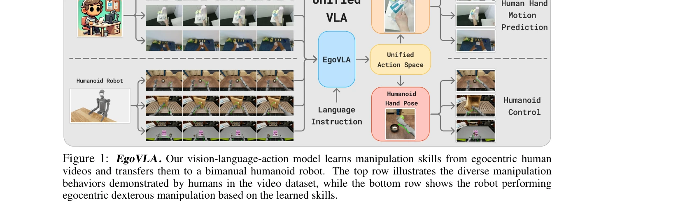
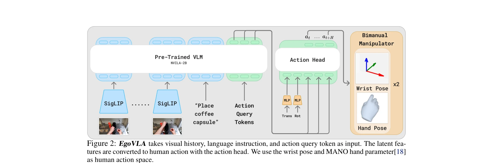
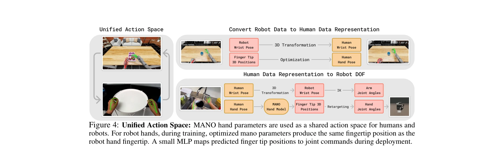

# EgoVLA: Learning Vision-Language-Action Models from Egocentric Human Videos

> **저자**: Ruihan Yang, Qinxi Yu, Yecheng Wu, Rui Yan, Borui Li, An-Chieh Cheng, Xueyan Zou, Yunhao Fang, Xuxin Cheng, Ri-Zhao Qiu, Hongxu Yin, Sifei Liu, Song Han, Yao Lu, Xiaolong Wang | **날짜**: 2025-07-16 | **URL**: [https://arxiv.org/abs/2507.12440](https://arxiv.org/abs/2507.12440)

---

## Essence

*Figure 1: EgoVLA. Our vision-language-action model learns manipulation skills from egocentric human*

EgoVLA는 대규모 인간 egocentric 비디오에서 Vision-Language-Action 모델을 학습하고, Inverse Kinematics와 retargeting을 통해 인간 행동을 로봇 행동으로 변환한 후 소량의 로봇 데모로 fine-tuning하여 bimanual humanoid 로봇 조작을 가능하게 한다.

## Motivation

- **Known**: 로봇 모방 학습은 실제 로봇 데이터 수집으로 발전했으나 하드웨어 요구로 인해 데이터 규모가 제한된다. Vision-Language Model은 다양한 멀티모달 작업에서 강한 일반화 능력을 보여준다.
- **Gap**: 기존 VLA 방식은 대규모 로봇 데이터 수집에 의존하여 확장성이 떨어진다. 인간 egocentric 비디오를 활용하여 다양한 장면과 작업을 학습하면서도 로봇으로 전이 가능한 정책 학습 방법이 부족하다.
- **Why**: 8억 명의 인간이 세계의 모든 환경에서 연속적으로 조작 작업을 수행하므로 대규모의 다양한 인간 비디오 데이터를 활용할 수 있다. 이를 통해 로봇이 쉽게 접근하기 어려운 장면과 teleoperation으로는 수행 어려운 작업도 학습 가능하다.
- **Approach**: 인간 egocentric 비디오에서 wrist와 hand joint angles를 포함한 행동을 예측하는 VLA를 NVILA-2B 백본으로 학습하고, Inverse Kinematics와 retargeting을 통해 인간 행동을 로봇 행동 공간으로 변환한 후 소수의 로봇 데모로 fine-tuning한다. 또한 Ego Humanoid Manipulation Benchmark를 제안하여 평가한다.

## Achievement

*Figure 2: EgoVLA takes visual history, language instruction, and action query token as input. The latent fea-*

- **대규모 인간 데이터 활용**: HOI4D, HOT3D, HoloAssist, TACO 등 4개 데이터셋을 통합하여 약 500,000개의 이미지-행동 쌍으로 구성된 egocentric 인간 조작 데이터셋 구성
- **통합 행동 공간**: MANO 손 파라미터를 공유 행동 공간으로 사용하여 인간과 로봇 간의 embodiment gap을 기하학적 변환으로 근사
- **벤치마크 제안**: 12개의 다양한 bimanual 조작 작업을 포함한 Ego Humanoid Manipulation Benchmark 구축
- **성능 향상**: EgoVLA가 specialist 및 generalist baseline을 단거리 및 장거리 작업에서 모두 능가하며, 시각적 관찰과 공간적 위치에서 더 나은 일반화 달성

## How

*Figure 4: Unified Action Space: MANO hand parameters are used as a shared action space for humans and*

- NVILA-2B를 vision-language 백본으로 사용하여 강력한 시각-의미론적 추론 능력 활용
- RGB 관찰 6 프레임(0.2초 간격, 1초 역사), 언어 명령, 행동 query token, 인간 proprioception state를 입력으로 사용
- MANO 손 모델을 기반으로 hand joint angle과 wrist pose를 행동 공간으로 정의
- Inverse Kinematics를 통해 인간 wrist 위치를 로봇 end-effector 위치로 변환
- Retargeting을 통해 인간 hand joint를 로봇 hand joint로 매핑
- World-frame camera pose를 사용하여 continuous camera motion 문제 완화
- 소수의 로봇 데모(task당 100개)로 fine-tuning하여 로봇 정책 획득
- 3 FPS로 RGB 관찰을 샘플링하여 계산 효율성과 시간적 연속성 균형 유지

## Originality

- 대규모 인간 egocentric 비디오로 VLA를 학습하고 이를 로봇에 직접 전이하는 새로운 패러다임 제시
- MANO 손 파라미터를 통해 인간과 로봇 간의 공유 행동 공간 구축하는 기하학적 접근
- 기존 supervision 방식을 개선한 world-frame camera pose를 사용한 일관된 감시 신호 생성 방식
- 4개의 서로 다른 데이터셋을 의도적으로 혼합하여 구성한 대규모 egocentric 조작 데이터셋
- 12개 작업을 포함한 새로운 Ego Humanoid Manipulation Benchmark 구축

## Limitation & Further Study

- 인간-로봇 embodiment gap을 기하학적 변환으로만 근사하므로, 복잡한 역학적 차이나 제어 특성의 차이를 완전히 해결하지 못함
- HoloAssist의 손 pose 주석이 노이즈가 많아서 1/10만 샘플링하여 사용해야 하므로, 더 정확한 주석 데이터 필요
- Fine-tuning에 task당 100개의 로봇 데모가 필요하므로 완전한 로봇 데이터 의존성 제거는 아님
- Simulation 환경에서만 평가되어 실제 물리적 로봇에서의 성능 검증 부재
- Language instruction이 즉시 행동 실행에 초점을 맞춰 고수준 계획 능력이 제한됨
- 후속 연구: 더 정확한 손 pose 주석 자동화 기법, 시뮬레이션-현실 간 도메인 갭 해결, fine-tuning 데이터 양 최소화

## Evaluation

- Novelty: 4/5
- Technical Soundness: 3/5
- Significance: 4/5
- Clarity: 4/5
- Overall: 4/5

**총평**: EgoVLA는 대규모 인간 egocentric 비디오를 로봇 학습에 효과적으로 활용하는 창의적인 방법론을 제시하며, 통합 행동 공간 설계와 벤치마크 제안으로 로봇 조작 학습 분야에 큰 기여를 한다. 다만 실제 로봇에서의 검증과 embodiment gap 해결의 견고성에 대한 추가 연구가 필요하다.

## Related Papers

- 🔄 다른 접근: [[papers/1342_DexUMI_Using_Human_Hand_as_the_Universal_Manipulation_Interf/review]] — EgoVLA의 대규모 인간 egocentric 비디오 학습과 UniDex의 로봇 중심 데이터셋은 bimanual humanoid 조작을 위한 서로 다른 데이터 기반 접근법입니다.
- 🔗 후속 연구: [[papers/1437_Hand-Eye_Autonomous_Delivery_Learning_Humanoid_Navigation_Lo/review]] — EgoVLA의 Vision-Language-Action 모델과 retargeting 기술은 HEAD의 egocentric vision 기반 navigation과 reaching 능력을 언어 지시까지 확장할 수 있습니다.
- 🔗 후속 연구: [[papers/1335_DexCap_Scalable_and_Portable_Mocap_Data_Collection_System_fo/review]] — DexCap으로 수집한 손동작 데이터를 EgoVLA의 Vision-Language-Action 모델에 통합하면 더욱 정교한 bimanual humanoid 조작이 가능해집니다.
- 🔗 후속 연구: [[papers/1337_DexMimicGen_Automated_Data_Generation_for_Bimanual_Dexterous/review]] — DexMimicGen으로 생성된 대규모 양손 조작 데이터는 EgoVLA의 Vision-Language-Action 모델 학습에 풍부한 훈련 소스를 제공합니다.
- 🏛 기반 연구: [[papers/1342_DexUMI_Using_Human_Hand_as_the_Universal_Manipulation_Interf/review]] — UniDex의 통합 action space와 3D VLA 모델은 EgoVLA의 Vision-Language-Action 학습을 위한 중요한 이론적 기반을 제공합니다.
- 🏛 기반 연구: [[papers/1369_EgoDex_Learning_Dexterous_Manipulation_from_Large-Scale_Egoc/review]] — EgoDex의 대규모 egocentric 비디오와 3D hand pose 데이터는 EgoVLA의 Vision-Language-Action 모델 학습을 위한 핵심 데이터 소스입니다.
- 🏛 기반 연구: [[papers/1437_Hand-Eye_Autonomous_Delivery_Learning_Humanoid_Navigation_Lo/review]] — HEAD의 egocentric vision 기반 navigation과 reaching 학습은 EgoVLA의 Vision-Language-Action 모델이 실제 환경에서 구현될 때의 핵심 기술적 기반입니다.
