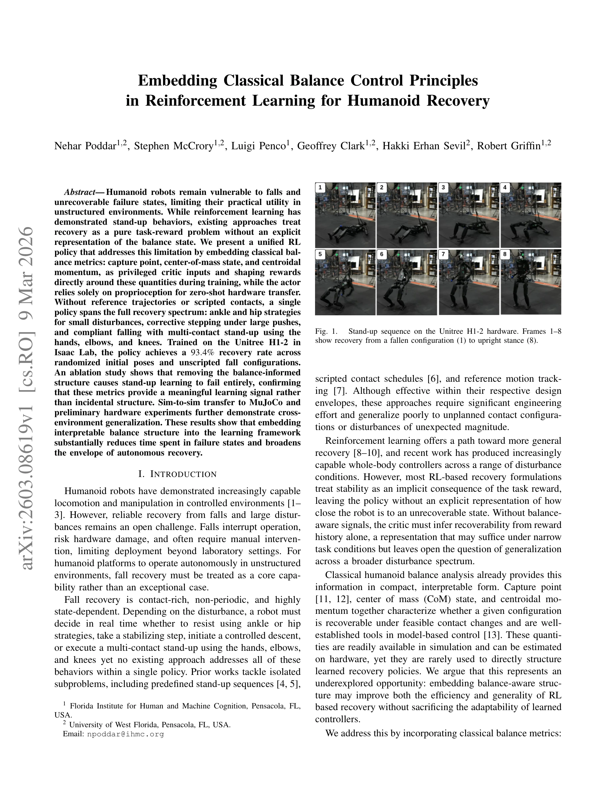

# Embedding Classical Balance Control Principles in Reinforcement Learning for Humanoid Recovery

> **저자**: Nehar Poddar, Stephen McCrory, Luigi Penco, Geoffrey Clark, Hakki Erhan Svil, Robert Griffin | **날짜**: 2026-03-09 | **DOI**: [10.48550/arXiv.2603.08619](https://doi.org/10.48550/arXiv.2603.08619)

---

## Essence

*Fig. 1.*

인간형 로봇의 낙상 복구를 위해 capture point, center-of-mass, centroidal momentum 등 고전적 균형 제어 원리를 RL의 비대칭 critic과 보상 함수에 직접 임베딩하는 통합 정책을 제시한다. 이 접근법을 통해 단일 정책으로 발목/엉덩이 전략부터 다중 접촉 일어서기까지 전체 복구 스펙트럼을 아우른다.

## Motivation

- **Known**: RL은 일어서기 행동을 학습했으나 기존 접근법들은 균형 상태의 명시적 표현 없이 순수 task-reward 문제로 취급했다. 고전 균형 분석(ZMP, capture point, centroidal dynamics)은 모델 기반 제어에 확립되어 있으나 학습된 복구 정책을 직접 구조화하는 데는 거의 사용되지 않았다.
- **Gap**: 기존 RL 기반 복구 방법들은 균형 인식 신호 없이 보상 이력만으로 회복 가능성을 추론해야 하므로 광범위한 외란 스펙트럼에 대한 일반화가 제한된다. 또한 대부분의 접근법은 참조 궤적이나 스크립트된 접촉을 필요로 한다.
- **Why**: 낙상은 인간형 로봇이 실제 비정형 환경에서 자율적으로 작동하기 위한 핵심 능력이며, 균형 인식 구조를 학습 프레임워크에 임베딩하면 실패 상태 체류 시간을 대폭 단축할 수 있다.
- **Approach**: Capture point, CoM 상태, centroidal momentum을 privileged critic 입력과 보상 항으로 통합하되, actor는 proprioception만 사용해 zero-shot 하드웨어 전이를 가능하게 한다. 명시적으로 낙상과 일어서기를 순환하는 curriculum으로 학습한다.

## Achievement

*Fig. 1.*

- **통합 정책 개발**: 발목/엉덩이 안정화, stepping 복구, compliant falling, 손/팔꿈치/무릎을 이용한 다중 접촉 일어서기를 하나의 정책으로 구현
- **높은 복구율**: Unitree H1-2에서 무작위 초기 자세 및 비스크립트 낙상 배치에 대해 93.4% 복구율 달성
- **Ablation 검증**: balance-informed 구조 제거 시 일어서기 학습이 완전히 실패하며 stuck-low 종료율이 0.067에서 1.0으로 상승, 이 메트릭이 의미 있는 학습 신호임을 확인
- **Cross-환경 일반화**: Zero-shot 하드웨어 배포 및 MuJoCo로의 sim-to-sim 전이 성공

## How

- PPO (Proximal Policy Optimization) 기반 on-policy actor-critic 프레임워크 사용
- Actor는 proprioceptive observation (관절 위치, 속도, IMU)만 입력받아 relative joint position 출력
- Critic은 훈련 중 privileged 정보(capture point, CoM 위치/속도, centroidal momentum, contact forces)를 입력으로 받음
- Reward shaping: 기본 생존 보상에 capture point 기반 항과 CoM 기반 항 추가로 명시적 균형 신호 제공
- Curriculum learning: fall-induction과 stand-up 학습을 명시적으로 순환하며 전체 복구 시퀀스 커버
- Isaac Lab에서 Unitree H1-2 시뮬레이션으로 학습, MuJoCo로 검증

## Originality

- 고전적 균합 메트릭(capture point, CoM, centroidal momentum)을 RL의 비대칭 critic 구조에 직접 임베딩한 최초 시도
- 참조 궤적이나 스크립트된 접촉 없이 전체 복구 스펙트럼을 아우르는 단일 통합 정책 제시
- Privileged information 활용으로 훈련 중 균형 인식을 제공하면서 배포 시에는 proprioception만 사용하는 비대칭 구조
- Ablation study로 balance-informed 구조의 필수성을 정량적으로 입증

## Limitation & Further Study

- 하드웨어 실험은 제한적(10 trials from diverse configurations)이며 'preliminary' 수준으로 표현, 광범위한 실제 환경 검증 필요", 'Capture point와 centroidal momentum 추정은 시뮬레이션에서는 정확하지만 하드웨어에서의 추정 정확도 및 그 영향에 대한 상세 분석 부족
- 외란 크기의 범위가 명확하게 정의되지 않았으며, 극단적 외란에 대한 한계 검토 필요
- 다른 인간형 로봇(Unitree H1-2 외 플랫폼)으로의 일반화 가능성 미검증
- 계산 비용 및 실시간 성능(하드웨어 제어 주기)에 대한 정량적 분석 부재
- 후속 연구: 온보드 센서만으로 balance 메트릭 추정 개선, 더 다양한 플랫폼과 환경 조건에서의 평가, 신경망 해석 방법으로 학습된 정책의 균형 제어 메커니즘 분석

## Evaluation

- Novelty: 4/5
- Technical Soundness: 3/5
- Significance: 4/5
- Clarity: 4/5
- Overall: 4/5

**총평**: 본 논문은 고전적 균형 제어 이론과 RL을 효과적으로 결합하여 인간형 로봇의 복구 문제에 대한 새로운 관점을 제시한다. 비대칭 critic을 통한 구조화된 학습과 ablation 검증으로 접근법의 유효성을 명확히 했으나, 하드웨어 검증의 규모와 cross-platform 일반화 가능성에 대한 추가 증거가 요청된다.

## Related Papers

- 🧪 응용 사례: [[papers/1531_Learning_Humanoid_Standing-up_Control_across_Diverse_Posture/review]] — 고전적 균형 제어 원리를 RL에 임베딩하는 방법을 다양한 자세에서의 일어서기 제어에 직접 적용할 수 있다.
- 🔗 후속 연구: [[papers/1505_Keep_on_Going_Learning_Robust_Humanoid_Motion_Skills_via_Sel/review]] — Keep on Going의 robust motion과 고전적 균형 원리를 결합하면 더욱 안정적인 낙상 복구 정책을 개발할 수 있다.
- 🔄 다른 접근: [[papers/1457_HuB_Learning_Extreme_Humanoid_Balance/review]] — 둘 다 극한 균형 상황을 다루지만 전자는 고전 이론 기반, 후자는 순수 학습 기반 접근을 사용한다.
