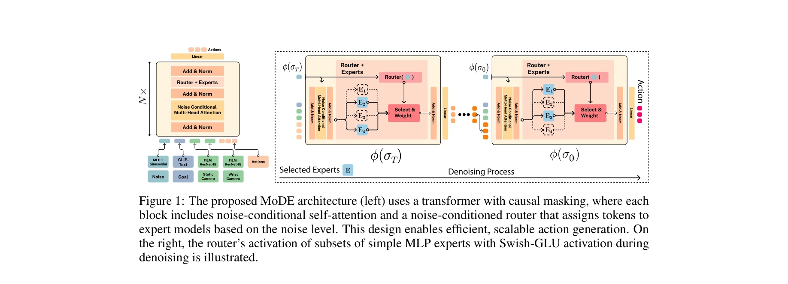
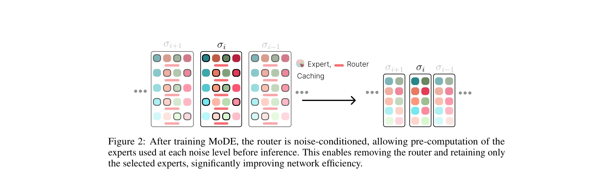

# Efficient Diffusion Transformer Policies with Mixture of Expert Denoisers for Multitask Learning

> **저자**: Moritz Reuss, Jyothish Pari, Pulkit Agrawal, Rudolf Lioutikov | **날짜**: 2024-12-17 | **URL**: [https://arxiv.org/abs/2412.12953](https://arxiv.org/abs/2412.12953)

---

## Essence

*Figure 1: The proposed MoDE architecture (left) uses a transformer with causal masking, where each*

MoDE는 Mixture-of-Experts 아키텍처를 Diffusion Policy에 적용하여 noise-conditioned routing과 noise-conditioned self-attention을 통해 매개변수는 40% 감소시키면서 90% 적은 FLOPs로 더 높은 성능을 달성하는 효율적인 Imitation Learning 정책이다.

## Motivation

- **Known**: Diffusion Policies는 Imitation Learning에서 multimodal 행동 생성 등 강력한 특성을 제공하지만, 모델 규모 증가에 따라 계산 비용이 급격히 증가한다. Mixture-of-Experts는 sparse activation을 통해 매개변수 효율성을 제공한다.
- **Gap**: 기존 Diffusion Policy 아키텍처는 높은 계산 비용으로 인해 실시간 로봇공학 애플리케이션에서 확장성이 제한되며, denoising 과정의 다단계 특성을 활용한 효율적인 설계가 부족하다.
- **Why**: 로봇 정책의 계산 효율성은 온보드 컴퓨팅 리소스가 제한된 모바일 로봇 등 실제 로봇공학 애플리케이션에서 매우 중요하며, 더 나은 성능과 효율성의 균형을 달성할 필요가 있다.
- **Approach**: MoDE는 noise 레벨에 따라 expert를 동적으로 할당하는 noise-conditioned routing과 noise-conditional self-attention 메커니즘을 결합하여, denoising 과정의 다단계 특성을 효율적으로 활용한다.

## Achievement

*Figure 2: After training MoDE, the router is noise-conditioned, allowing pre-computation of the*

- **성능 우수성**: CALVIN ABC에서 4.01, LIBERO-90에서 0.95를 달성하며 4개 벤치마크에서 CNN 기반 및 Transformer Diffusion Policies보다 평균 57% 성능 향상
- **계산 효율성**: Dense Transformer 아키텍처 대비 90% 적은 FLOPs와 40% 감소된 활성 매개변수를 사용하면서도 expert caching을 통해 추론 비용 90% 절감
- **광범위한 평가**: CALVIN과 LIBERO 벤치마크의 134개 태스크에서 state-of-the-art 성능 달성
- **상세한 분석**: routing 전략, noise-injection 기법, expert 분포 등 MoDE 구성 요소에 대한 포괄적인 ablation study 제공

## How

*Figure 1: The proposed MoDE architecture (left) uses a transformer with causal masking, where each*

- **Noise-conditioned Routing**: Router가 현재 noise 레벨을 기반으로 토큰을 expert에 할당하여 denoising 과정의 다단계 특성 활용
- **Noise-conditional Self-Attention**: Self-attention 메커니즘에 noise 정보를 직접 주입하여 다양한 noise 레벨에서의 효과적인 denoising 지원
- **Expert Caching**: 학습 후 router의 noise-conditioned 특성을 이용하여 expert 할당을 사전 계산하고 캐싱하여 추론 가속화
- **Sparse MoE Design**: 각 forward pass에서 전체 매개변수의 부분집합만 활성화하여 FLOPs 감소
- **Load Balancing**: Expert collapse와 router collapse 방지를 위해 load balancing loss 적용
- **다양한 데이터로 사전학습**: 대규모 로봇공학 데이터셋에서 MoDE를 사전학습하여 일반화 성능 향상

## Originality

- **Noise-conditioned Routing의 혁신성**: 기존 MoE 연구는 입력 특성 기반 routing을 사용했으나, diffusion 과정의 noise 레벨을 routing 신호로 활용하는 것은 새로운 접근
- **Diffusion 과정의 다단계 특성 활용**: denoising 단계별로 다른 expert를 할당하는 아이디어는 diffusion 모델의 내재적 특성을 효율적으로 활용
- **Expert Caching 메커니즘**: noise-conditioned routing의 예측 가능성을 활용한 expert 할당 캐싱으로 추론 가속화는 실용적이고 창의적
- **Diffusion Policy에 특화된 MoE**: 기존 Sparse-DP는 task 특화 expert를 사용하지만, MoDE는 denoising 프로세스에 특화된 noise-conditioned expert 설계로 차별화

## Limitation & Further Study

- **모든 데이터셋에서 일관된 개선 검증 부족**: CALVIN과 LIBERO에서만 평가되었으며, 다른 imitation learning 벤치마크나 downstream robot tasks에서의 성능 미확인
- **Expert collapse 위험**: load balancing loss를 적용했으나, expert specialization의 정도나 collapse 방지의 견고성에 대한 깊이 있는 분석 부족
- **Router 설계 복잡성**: noise-conditioned routing의 최적 설계 원리에 대한 이론적 설명이 제한적이며, router 아키텍처 선택의 정당성 미흡
- **메모리 트레이드오프**: expert caching으로 추론 비용은 감소하지만, 다양한 noise 레벨의 expert 조합을 메모리에 캐싱하는 메모리 오버헤드에 대한 분석 부족
- **후속 연구 방향**: 다중 모달 관찰(비전, 언어) 처리에서의 MoE 효과 분석, 온디바이스 로봇 배포 시 메모리 제약 하에서의 성능, offline RL에서의 적용 가능성 탐색 필요

## Evaluation

- Novelty: 4/5
- Technical Soundness: 3/5
- Significance: 4/5
- Clarity: 4/5
- Overall: 4/5

**총평**: MoDE는 noise-conditioned routing이라는 창의적인 아이디어로 Diffusion Policy의 계산 효율성을 획기적으로 개선하면서도 성능을 향상시킨 강력한 기여이다. 광범위한 실험과 ablation study를 통해 검증되었으나, 이론적 기초 강화와 더 다양한 도메인에서의 평가가 필요하다.

## Related Papers

- 🏛 기반 연구: [[papers/1361_Diffusion_Models_for_Robotic_Manipulation_A_Survey/review]] — Diffusion model survey에서 다룬 robotic manipulation 이론이 MoDE의 mixture-of-experts 적용에 기반을 제공한다.
- 🔄 다른 접근: [[papers/1363_Diffusion_Transformer_Policy/review]] — Diffusion Transformer Policy의 scaling approach가 MoDE의 efficiency 중심 접근과 대조된다.
- 🔗 후속 연구: [[papers/1577_SpecPrune-VLA_Accelerating_Vision-Language-Action_Models_via/review]] — SpecPrune의 VLA 가속화 기법이 MoDE의 효율적인 diffusion transformer 개념을 더욱 발전시킨다.
- 🔄 다른 접근: [[papers/1424_HiMoE-VLA_Hierarchical_Mixture-of-Experts_for_Generalist_Vis/review]] — 둘 다 로봇 데이터 이질성을 해결하지만 HiMoE-VLA는 hierarchical MoE를, Efficient DTP는 mixture of experts를 사용한 다른 접근법입니다.
- 🔄 다른 접근: [[papers/1479_MoLe-VLA_Dynamic_Layer-skipping_Vision_Language_Action_Model/review]] — VLA 모델의 계산 효율성 향상에 대한 서로 다른 접근법으로, layer-skipping과 mixture of experts를 각각 활용한다.
- 🔗 후속 연구: [[papers/1361_Diffusion_Models_for_Robotic_Manipulation_A_Survey/review]] — Mixture-of-experts를 diffusion policy에 적용한 구체적 구현이 diffusion model survey에서 다룬 이론적 내용을 실제로 발전시킨다.
