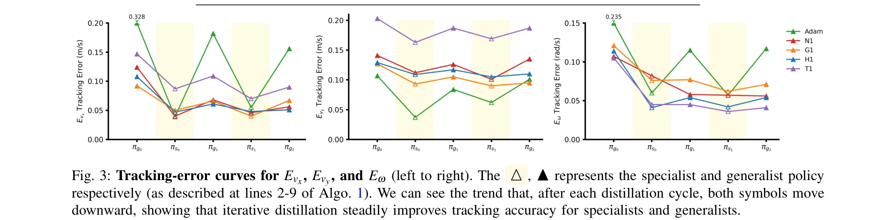

# Embodiment-Aware Generalist Specialist Distillation for Unified Humanoid Whole-Body Control

> **저자**: Quanquan Peng, Yunfeng Lin, Yufei Xue, Jiangmiao Pang, Weinan Zhang | **날짜**: 2026-02-27 | **DOI**: [10.48550/arXiv.2602.02960](https://doi.org/10.48550/arXiv.2602.02960)

---

## Essence

*Fig. 2: Method Overview. (a) Unified command interface. The command vector ct comprises task commands vt (linear*

EAGLE는 여러 이질적인 휴머노이드 로봇을 제어하는 단일 통합 정책을 학습하기 위한 embodiment-aware generalist-specialist distillation 프레임워크이다. 반복적인 전문가 미세조정과 일반화 정책으로의 지식 증류를 통해 로봇별 보상 튜닝 없이 다양한 whole-body 행동(걷기, 스쿼트, 기울기)을 지원한다.

## Motivation

- **Known**: RL 기반 휴머노이드 whole-body controller는 단일 로봇에서 우수한 성능을 보이지만, 대부분 특정 embodiment에 최적화되어 있다. 최근 diffusion model이나 대규모 URDF 랜덤화를 통한 cross-embodiment 학습이 시도되었으나, 저차원 명령만 지원하고 실제 로봇으로의 검증이 부족하다.
- **Gap**: 기존 방법들은 속도 명령 같은 저차원 제어만 지원하며, 토르소 피칭 같은 고차원 행동을 지원하지 못한다. 또한 다양한 물리 로봇에서의 성능 검증이 제한적이어서, 실제 fleet-level 배포에 적합한 통합 제어 정책 부재하다.
- **Why**: 휴머노이드 로봇의 fleet 배포 시 각 로봇마다 처음부터 학습과 보상 튜닝을 해야 하는 비효율을 해결하는 것이 중요하다. 조작 로봇과 달리 다리 로봇은 원격 조종 데이터 수집이 어려워 RL 기반 cross-embodiment 학습이 더욱 필수적이다.
- **Approach**: EAGLE는 pooled embodiment 세트로 학습된 일반화 정책에서 시작하여, 각 로봇별 전문가 정책을 fork하고 미세조정한 후, DAgger 방식으로 새로운 기술을 일반화 정책에 증류하는 반복 루프를 구성한다. 통합 5차원 명령 인터페이스(선형/각속도, 기저 높이, 몸통 피치)를 통해 다양한 행동을 지원한다.

## Achievement

*Fig. 3: Tracking-error curves for Evx, Evy, and Eω (left to right). The △, ▲represents the specialist and generalist pol*

- **Embodiment-aware distillation 프레임워크**: 이질적 형태의 휴머노이드 5종(Unitree H1, G1, Booster T1, Fourier N1, PNDbotics Adam)을 단일 정책으로 제어하며, 로봇별 보상 튜닝 불필요
- **고차원 통합 명령 인터페이스**: 기존 속도 명령을 넘어 스쿼트, 기울기, 높이 조절 등 다양한 whole-body 행동 지원
- **광범위한 실제 로봇 검증**: 시뮬레이션 5종, 실제 환경 4종 로봇에서 실험하여 높은 명령 추적 정확도와 강건성 달성
- **높은 명령 추적 성능**: 기준 방법 대비 속도 추적 오차(Evx, Evy, Eω)에서 우수한 성능 입증

## How

*Fig. 2: Method Overview. (a) Unified command interface. The command vector ct comprises task commands vt (linear*

- **통합 명령 공간 설계**: 명령 벡터 ct = [vx, vy, ω, h, p]로 task command(선형/각속도)와 behavior command(높이/피치) 분리
- **Embodiment-aware 관찰**: 5 프레임의 proprioception(관절 위치/속도, 기저 각속도, 투영 중력)과 gait clock 함수 φ를 활용한 발 상승 학습
- **비대칭 actor-critic 패러다임**: actor는 기본 proprioception으로 행동 결정, critic은 추가 privileged 정보(기저 선형속도, 높이 오차, 발 간격, 접촉력) 활용
- **반복 generalist-specialist 증류 루프**: (1) 일반화 정책 πg를 N개 전문가로 복사, (2) 각 로봇에서 fine-tuning, (3) 수집한 궤적으로 일반화 정책 업데이트, (4) 수렴까지 반복
- **DAgger 기반 증류**: 일반화 정책의 on-policy 상태에 대해 전문가 정책으로 relabel하여 covariate shift 감소

## Originality

- **반복 generalist-specialist 증류**: 기존 single-task 증류가 아닌 다중 embodiment에서 새로운 기술을 동적으로 통합하는 cyclical 구조의 창의성
- **Embodiment-aware 표현 정렬**: 이질적 DoF와 운동학 구조를 가진 로봇들을 네트워크가 형태 정보를 활용하면서도 통합 처리하도록 설계
- **HugWBC 기반 통합 명령 인터페이스**: 기존 저차원 속도 명령을 5차원 고차원 명령으로 확장하여 스쿼트, 기울기 등 새로운 행동 지원
- **실제 로봇 다중 검증**: 시뮬레이션과 실제 환경을 모두 포괄한 cross-embodiment 평가로 실용성 입증

## Limitation & Further Study

- **로봇 형태 제약**: 실험 대상이 모두 이족 휴머노이드로 제한되며, 사족 로봇 등 완전히 이질적 형태로의 확장 검증 부재
- **환경 일관성 가정**: 모든 로봇이 유사한 지형/환경에서 학습된다고 가정하며, 극단적 환경 변화(습지, 계단 등)에 대한 강건성 미검증
- **계산 비용 분석 부재**: 반복 distillation 루프의 전체 학습 시간, 수렴 속도, 정교한 embodiment 수 증가 시 성능 저하 분석 미포함
- **Specialist 간 기술 충돌**: 이질적 embodiment의 전문가 정책이 상충하는 기술을 학습할 경우, 증류 과정에서의 interference 메커니즘 미설명
- **후속 연구 방향**: (1) 더 극단적 형태 차이를 가진 로봇들의 통합, (2) 적응적 환경 변화에 대한 robust generalization, (3) 증류 루프 최적화를 통한 샘플 효율 개선

## Evaluation

- Novelty: 4/5
- Technical Soundness: 3/5
- Significance: 4/5
- Clarity: 4/5
- Overall: 4/5

**총평**: EAGLE는 embodiment-aware distillation의 창의적 설계와 다양한 실제 로봇에서의 광범위한 검증을 통해 humanoid fleet 제어의 실질적 진전을 보여준다. 다만 기술적 깊이와 극단적 형태 확장성 측면에서 개선 여지가 있으나, 실용적 중요도와 광범위한 실험으로 인해 로봇 공학 분야에 상당한 기여를 한다.

## Related Papers

- 🔄 다른 접근: [[papers/1365_EGM_Efficiently_Learning_General_Motion_Tracking_Policy_for/review]] — EAGLE은 여러 로봇 간 지식 증류에, EGM은 단일 로봇의 효율적 모션 추적에 초점을 맞춘 일반화 접근법이다.
- 🧪 응용 사례: [[papers/1477_Humanoid-Gym_Reinforcement_Learning_for_Humanoid_Robot_with/review]] — EAGLE의 embodiment-aware 방법을 Humanoid-Gym 환경의 다양한 휴머노이드 모델에 적용하여 통합 제어가 가능하다.
- 🔗 후속 연구: [[papers/1634_ZeroMimic_Distilling_Robotic_Manipulation_Skills_from_Web_Vi/review]] — ZeroMimic의 웹 비디오 기반 기술 증류와 EAGLE의 전문가 지식 증류를 결합하면 더 광범위한 기술 학습이 가능하다.
- 🏛 기반 연구: [[papers/1365_EGM_Efficiently_Learning_General_Motion_Tracking_Policy_for/review]] — EAGLE의 embodiment-aware distillation 방법이 EGM의 cross-motion curriculum에서 서로 다른 동작 간 지식 전이의 기반이 된다.
- 🔗 후속 연구: [[papers/1414_General_Humanoid_Whole-Body_Control_via_Pretraining_and_Fast/review]] — FAST의 사전학습-적응 프레임워크에 EAGLE의 embodiment-aware 방법을 적용하면 여러 로봇에 대한 빠른 적응이 가능하다.
