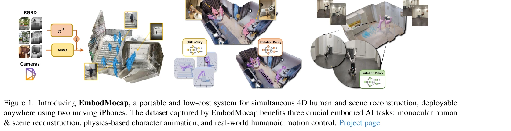
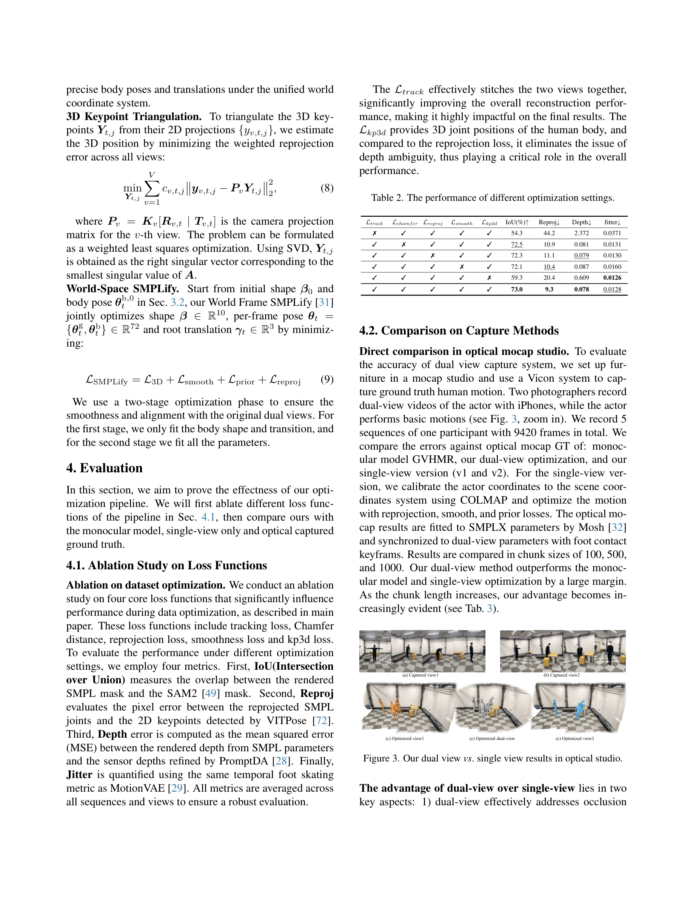
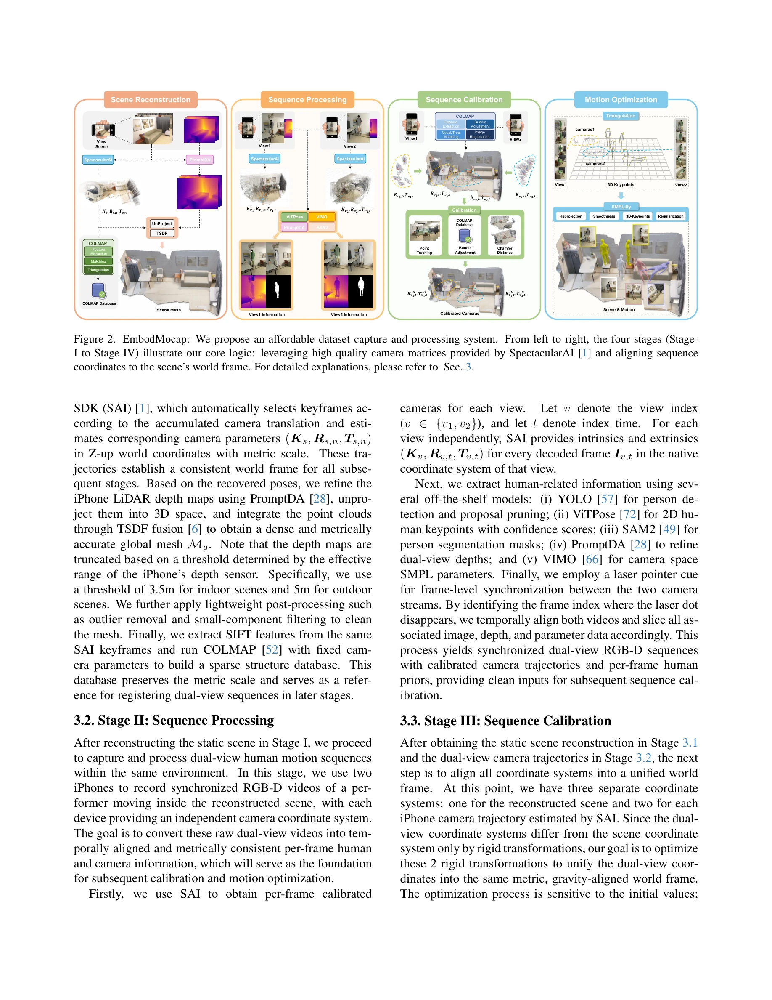

# EmbodMocap: In-the-Wild 4D Human-Scene Reconstruction for Embodied Agents

> **저자**: Wenjia Wang, Liang Pan, Huaijin Pi, Yuke Lou, Xuqian Ren, Yifan Wu, Zhouyingcheng Liao, Lei Yang, Rishabh Dabral, Christian Theobalt, Taku Komura | **날짜**: 2026-02-26 | **URL**: [https://arxiv.org/abs/2602.23205](https://arxiv.org/abs/2602.23205)

---

## Essence

*Figure 1. Introducing EmbodMocap, a portable and low-cost system for simultaneous 4D human and scene reconstruction, dep*

EmbodMocap은 두 개의 iPhone을 이용한 이동형 RGB-D 캡처 시스템으로, 스튜디오 환경 없이 야외에서도 메트릭 스케일의 인체 동작과 장면 기하학을 동시에 재구성할 수 있는 저비용 데이터 수집 파이프라인을 제시한다.

## Motivation

- **Known**: 기존 인체 동작 캡처 시스템은 PROX, RICH, EgoBody 등 다양한 접근법을 제시했으나, 대부분 고가의 멀티카메라 리그, 착용형 센서, LiDAR 스캐너, 또는 정적 카메라 설정에 의존하여 확장 가능한 야외 데이터 수집에 제한적이다.
- **Gap**: 기존 시스템들은 비용이 높고 복잡하며 통제된 스튜디오 환경에 국한되어 있어, 다양한 실제 환경에서 장면 맥락을 보존하는 대규모 인체-장면 상호작용 데이터의 수집이 어렵다.
- **Why**: 구체화된 AI(embodied AI) 연구 발전을 위해서는 자연스러운 환경에서 인체 동작과 3D 장면 기하학을 모두 포함하는 고품질 데이터가 필수적이며, 이는 로봇 제어, 물리 기반 애니메이션, 모노큘러 재구성 등 핵심 응용 분야를 가능하게 한다.
- **Approach**: 이중 iPhone RGB-D 입력을 공동으로 보정 및 최적화하여 통합된 메트릭 세계 좌표계 내에서 인체와 장면을 동시에 재구성하며, 단일 정적 장면 RGB-D를 통해 세계 스케일을 정의한 후 동기화된 이중 뷰 RGB-D 비디오로 인체 동작을 캡처하고 기하학적 정렬과 동작 최적화를 수행한다.

## Achievement

*Figure 3. Our dual view vs. single view results in optical studio.*

- **저비용 캡처 시스템**: 두 개의 iPhone만 사용하여 기존 시스템 대비 약 1K 달러 수준의 극저 비용으로 메트릭 스케일 4D 재구성을 달성하며, 멀티카메라 리그, 착용형 센서, LiDAR 또는 정적 카메라 설정이 불필요함
- **깊이 모호성 완화**: 이중 뷰 설정이 광학 스튜디오 기준에 비해 우수한 정렬 및 재구성 성능을 보이며, 단일 iPhone 또는 모노큘러 모델 대비 깊이 모호성을 현저하게 완화함
- **다양한 응용 검증**: 모노큘러 인체-장면 재구성, 물리 기반 캐릭터 애니메이션(인체-객체 상호작용 기술 확장), 실제 휴머노이드 로봇의 sim-to-real RL 훈련을 통해 파이프라인의 다양성과 실용성을 검증
- **야외 확장성**: 스튜디오 환경이 아닌 다양한 실내외 환경에서 장면 맥락을 보존하는 대규모 데이터 수집을 가능하게 함

## How

*Figure 2. EmbodMocap: We propose an affordable dataset capture and processing system. From left to right, the four stage*

- 단일 RGB-D 시퀀스로부터 정적 장면을 먼저 재구성하여 세계 스케일 기준 설정
- 두 개의 이동 iPhone으로 동기화된 이중 뷰 RGB-D 비디오 캡처
- 공동 보정(joint calibration)을 통해 이중 RGB-D 입력을 정렬
- 기하학적 정렬 및 동작 최적화 수행하여 세계-고정(world-anchored) 인체 포즈 복원
- Human3R 및 HAMSt3R 등의 모노큘러 피드포워드 모델을 수집된 데이터로 파인튜닝
- SMPL-X 및 SMPL 모델을 통한 인체 재구성 및 장면 메시 생성
- 물리 기반 시뮬레이션(PhysX 등)과 RL을 활용한 휴머노이드 제어 정책 학습

## Originality

- **포괄적 이중 뷰 최적화**: 기존 모노큘러 및 다중 정적 카메라 접근법과 달리, 이동 가능한 이중 iPhone을 통해 깊이 모호성을 완화하면서도 완전한 이동성과 저비용을 동시에 달성하는 혁신적인 설계
- **메트릭 스케일 보존**: 정적 장면 RGB-D로 세계 스케일을 정의하고 이후 인체 캡처와 연결함으로써 메트릭 정확도를 보장하는 새로운 워크플로우
- **실제 환경 적용성**: 스튜디오 제약 없이 다양한 실내외 환경에서 고품질 인체-장면 쌍 데이터를 수집하는 최초의 실용적 시스템으로, 기존 PROX, RICH, SLOPER4D 등의 한계를 극복
- **통합 응용 검증**: 모노큘러 재구성, 물리 기반 애니메이션, 실제 로봇 제어를 단일 데이터셋으로 모두 검증하여 데이터 품질과 유용성의 광범위한 증명

## Limitation & Further Study

- **동기화 의존성**: 두 iPhone 간 시간 동기화가 정확해야 하며, 동기화 오류 시 재구성 품질 저하 가능성
- **카메라 보정 정확도**: 이동 중인 카메라의 공동 보정 정확도가 최종 재구성 품질에 직접 영향을 미치는데, 일반 사용자 환경에서의 정확도 유지가 도전적일 수 있음
- **폐색 처리 제한**: 극단적 자세나 복잡한 장면 폐색에서는 여전히 정확도 저하가 발생할 가능성
- **실시간성 부재**: 현재 시스템은 사후 처리 기반이므로 실시간 캡처 및 처리 능력이 제한적
- **후속 연구 방향**: (1) 더 강력한 카메라 보정 및 동기화 알고리즘 개발, (2) 극단적 자세나 폐색 처리 성능 향상, (3) 모바일 장치에서의 실시간 처리 파이프라인 개발, (4) 더 큰 규모의 다양한 환경 데이터셋 수집

## Evaluation

- Novelty: 4/5
- Technical Soundness: 3/5
- Significance: 4/5
- Clarity: 4/5
- Overall: 4/5

**총평**: EmbodMocap은 두 개의 iPhone을 활용한 저비용 이동형 시스템으로 기존의 고가 스튜디오 기반 캡처 방식의 근본적인 제약을 해결하며, 이중 뷰 깊이 모호성 완화 기법과 메트릭 스케일 보존을 통해 우수한 재구성 품질을 달성한다. 모노큘러 재구성, 물리 기반 애니메이션, 실제 로봇 제어를 포함한 다양한 응용 검증과 야외 확장성을 통해 embodied AI 연구의 실질적인 진전을 가능하게 하는 중요한 기여를 제시한다.

## Related Papers

- 🔄 다른 접근: [[papers/1372_EgoMimic_Scaling_Imitation_Learning_via_Egocentric_Video/review]] — EgoMimic의 1시간 human data 효과와 달리 20,854시간의 대규모 데이터로 접근하는 scaling 전략을 제시한다.
- 🔗 후속 연구: [[papers/1494_In-N-On_Scaling_Egocentric_Manipulation_with_in-the-wild_and/review]] — In-N-On의 in-the-wild와 on-robot learning이 EgoScale의 대규모 egocentric learning을 실제 환경으로 확장한다.
- 🏛 기반 연구: [[papers/1522_RDT-1B_a_Diffusion_Foundation_Model_for_Bimanual_Manipulatio/review]] — Massive human video를 통한 universal policy learning이 EgoScale의 대규모 egocentric 데이터 활용에 방법론적 기반을 제공한다.
- 🔗 후속 연구: [[papers/1281_Being-H0_Vision-Language-Action_Pretraining_from_Large-Scale/review]] — EgoScale의 다양한 egocentric 조작 데이터가 Being-H0의 손 동작 모델링을 더 정교하게 발전시킬 수 있다.
- 🔄 다른 접근: [[papers/1372_EgoMimic_Scaling_Imitation_Learning_via_Egocentric_Video/review]] — EgoScale의 20,854시간 데이터가 EgoMimic보다 훨씬 대규모 egocentric learning을 제시한다.
- 🔄 다른 접근: [[papers/1494_In-N-On_Scaling_Egocentric_Manipulation_with_in-the-wild_and/review]] — 다양한 egocentric 조작 데이터 확장에서 EgoScale과 In-N-On은 상호 보완적인 데이터 수집 전략을 제시한다
