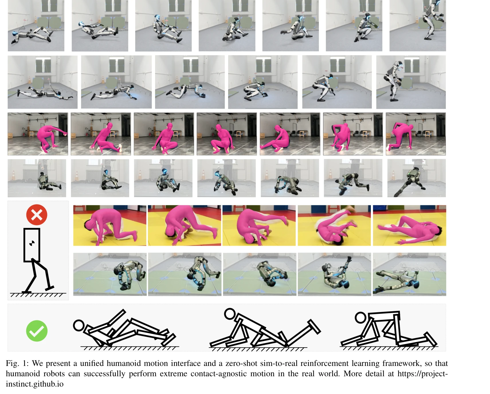
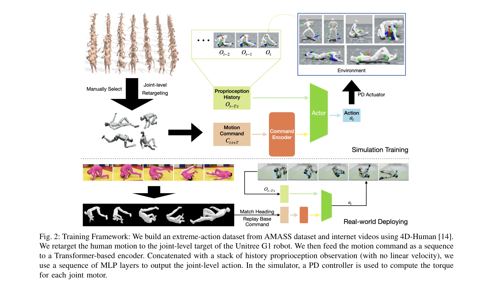
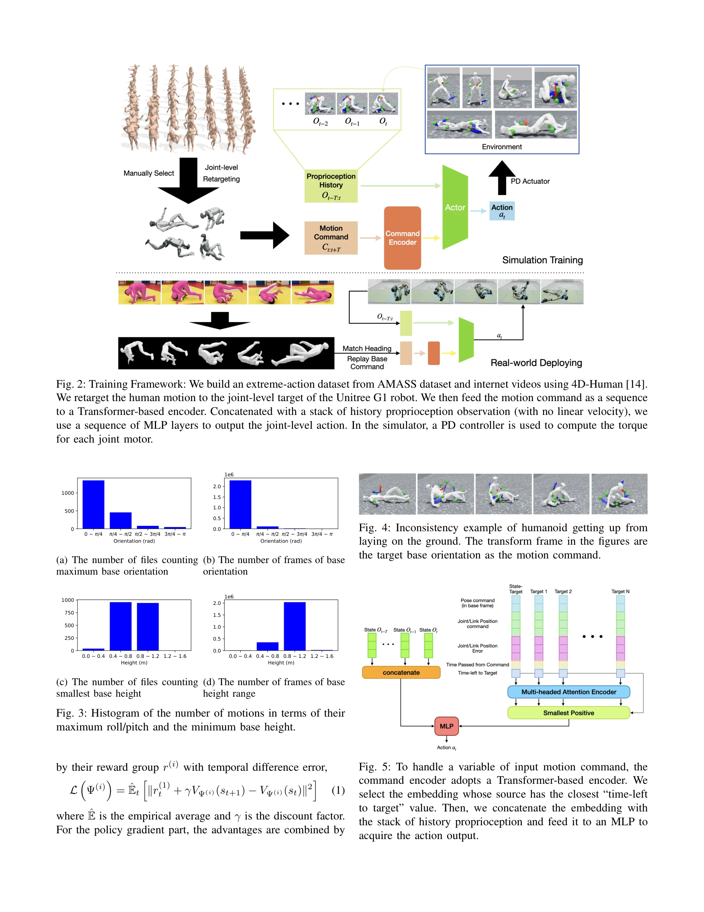

# Embrace Collisions: Humanoid Shadowing for Deployable Contact-Agnostics Motions

> **저자**: Ziwen Zhuang, Hang Zhao | **날짜**: 2025-02-03 | **URL**: [https://arxiv.org/abs/2502.01465](https://arxiv.org/abs/2502.01465)

---

## Essence

*Fig. 1: We present a unified humanoid motion interface and a zero-shot sim-to-real reinforcement learning framework, so *

본 논문은 발과 손 이외의 신체 부위 접촉을 포함하는 극단적 동작을 수행할 수 있는 인휴머노이드 로봇 제어 프레임워크를 제시하며, GPU 가속 시뮬레이터 기반 강화학습으로 zero-shot sim-to-real 전이를 달성한다.

## Motivation

- **Known**: 기존 휴머노이드 로봇 연구는 발과 손만의 접촉을 가정하는 양족 이동 조작 플랫폼으로 제한되어 있다. 강화학습 기반 방법들은 GPU 가속 물리 시뮬레이터에 의존하지만 발-지면 접촉만을 단순화하여 처리한다.
- **Gap**: 몸통의 극단적 회전을 동반한 일반화된 신체 접촉 제어는 미해결 문제이며, 예측 불가능한 접촉 순서와 변화하는 로봇 자세 기준 프레임은 기존 명령 인터페이스 설계를 어렵게 한다.
- **Why**: 휴머노이드 로봇이 인간처럼 앉기, 누운 자세에서 일어나기, 바닥에서 구르기 등 전신 상호작용 능력을 갖추려면 신체 부위 전체의 접촉 제어가 필수적이며, 이는 재해 상황 대응 등 실제 응용에서 중요하다.
- **Approach**: 로봇 기저 프레임 기준의 키프레임 기반 motion command, Transformer 기반 인코더, advantage mixing을 통한 sparse/dense reward 조화, 그리고 새로운 종료 조건 설계를 결합하여 contact-agnostic 동작을 학습한다.

## Achievement

*Fig. 2: Training Framework: We build an extreme-action dataset from AMASS dataset and internet videos using 4D-Human [14*

- **극단적 신체 접촉 제어**: 발, 손뿐만 아니라 몸통, 무릎, 팔꿈치 등 신체 전체를 환경과 상호작용하게 함
- **통합 motion 인터페이스**: 서있거나 누워있는 등 모든 자세에서 로봇 기저 프레임 기준으로 동작 명령을 정의
- **Zero-shot sim-to-real 전이**: 시뮬레이션 학습 정책이 실제 로봇에서 추가 적응 없이 작동
- **극단 행동 데이터셋**: 풍부한 신체 접촉 상호작용을 포함하는 AMASS 기반 극단 동작 데이터셋 구축
- **실시간 제어**: 확률적 접촉과 큰 기저 회전에도 불구하고 실시간 모터 제어 달성

## How

*Fig. 5: To handle a variable of input motion command, the*

- Transformer 기반 다중 헤드 self-attention 네트워크를 motion command encoder로 사용하여 가변 길이의 키프레임 입력 처리
- Multi-critic advantage mixing 기법으로 sparse motion task reward와 dense regularization reward (에너지, 토크, 관절 가속도) 간 충돌 해결
- 로봇 기저 상태가 motion target에서 벗어나는 정도에 기반한 새로운 종료 조건 설계
- GPU 가속 rigid-body 물리 시뮬레이터(Isaac Gym 등 추정)에서 large-scale 병렬 학습
- domain randomization을 통한 시뮬레이션-실제 환경 gap 축소
- Extreme-action 데이터셋에서 극단적 torso roll/pitch를 포함한 샘플 수집

## Originality

- 기존의 발-지면 접촉 가정을 타파하고 신체 전체의 stochastic 접촉을 명시적으로 처리하는 첫 대규모 시도
- Robot base frame 기준의 통일된 motion command 표현으로 자세 변화에 따른 명령 모호성 해결
- Advantage mixing을 통한 sparse/dense reward 조화는 conflict하는 목표 간 균형을 새로운 방식으로 제시
- Extreme-action 데이터셋 구축 및 공개는 향후 연구의 기초 자산 제공
- Contact-agnostic 동작의 실시간 제어라는 새로운 벤치마크 수립

## Limitation & Further Study

- 실제 로봇 실험이 제시되지 않음 - zero-shot 주장이 충분히 검증되지 않을 수 있음
- AMASS 데이터셋의 움직임 불일치 문제를 수동 필터링으로만 해결하여 데이터 품질 보장 방식이 불명확
- GPU 가속 시뮬레이터의 collision shape 단순화 수준과 sim-to-real gap의 정량적 분석 부족
- 복잡한 환경(예: 가구, 다양한 표면)에서의 일반화 가능성 미실증
- Transformer 기반 motion encoder의 해석 가능성이나 ablation study 부재
- 후속 연구: 다양한 실제 환경에서 검증, 시뮬레이션-현실 gap 감소 기법 고도화, multi-robot 협력 동작 확대

## Evaluation

- Novelty: 4/5
- Technical Soundness: 3/5
- Significance: 4/5
- Clarity: 4/5
- Overall: 4/5

**총평**: 본 논문은 휴머노이드 로봇의 전신 접촉 제어라는 미개척 문제를 체계적으로 다루고 실용적 해결책을 제시하여 학술적·산업적 의의가 크나, 실제 로봇 실험 결과의 구체적 제시가 강점을 검증하는 데 필수적이다.

## Related Papers

- ⚖️ 반론/비판: [[papers/1349_Distillation-PPO_A_Novel_Two-Stage_Reinforcement_Learning_Fr/review]] — 극단적 contact-rich 동작과 D-PPO의 안정적인 지각 기반 보행 제어는 휴머노이드 동적 능력의 안전성과 민첩성 사이의 상충 관계를 보여줍니다.
- 🏛 기반 연구: [[papers/1381_EMOTION_Expressive_Motion_Sequence_Generation_for_Humanoid_R/review]] — contact-agnostic 동작 학습에서 인간다운 자연스러운 움직임을 달성하기 위해서는 EMOTION의 표현력 있는 제스처 생성 기술이 필수적입니다.
- 🔄 다른 접근: [[papers/1349_Distillation-PPO_A_Novel_Two-Stage_Reinforcement_Learning_Fr/review]] — D-PPO의 지각 기반 보행 제어와 contact-agnostic 극단적 동작 학습은 휴머노이드의 동적 능력 향상을 위한 서로 다른 접근 방식입니다.
- 🔗 후속 연구: [[papers/1381_EMOTION_Expressive_Motion_Sequence_Generation_for_Humanoid_R/review]] — EMOTION의 자연스럽고 표현력 있는 제스처 생성은 극단적 contact-rich 동작을 수행하는 휴머노이드에 사회적 상호작용 능력을 추가할 수 있습니다.
