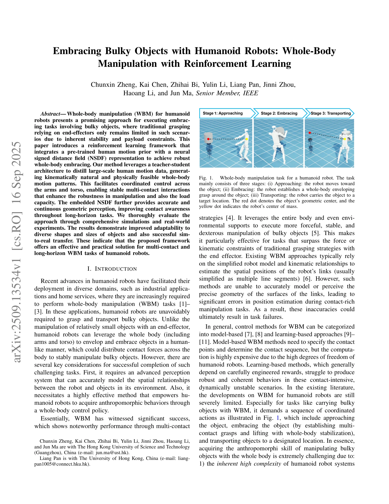
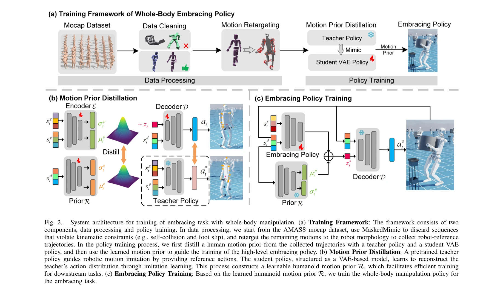

# Embracing Bulky Objects with Humanoid Robots: Whole-Body Manipulation with Reinforcement Learning

> **저자**: Chunxin Zheng, Kai Chen, Zhihai Bi, Yulin Li, Liang Pan, Jinni Zhou, Haoang Li, Jun Ma | **날짜**: 2025-09-16 | **DOI**: [10.48550/arXiv.2509.13534](https://doi.org/10.48550/arXiv.2509.13534)

---

## Essence

*Fig. 1.*

인간 모션 프라이어와 Neural Signed Distance Field(NSDF)를 통합한 강화학습 프레임워크로 휴머노이드 로봇이 전신을 활용하여 대형 물체를 포용하고 운반하는 조작 기술을 습득한다.

## Motivation

- **Known**: 휴머노이드 로봇의 전신 조작(WBM)은 다중 접촉점 전략으로 대형 물체를 안정적으로 조작할 수 있으며, 최근 강화학습과 행동 복제(BC) 기반 방법들이 자연스러운 인간형 움직임을 생성한다.
- **Gap**: 기존 WBM 연구는 대부분 단일 팔이나 상반신 플랫폼에 제한되어 있으며, 다중 접촉 및 장기 수평선(long-horizon) 조작을 위한 완전한 휴머노이드 로봇의 전신 포용 조작에 대한 강화학습 프레임워크가 부재하다.
- **Why**: 휴머노이드 로봇이 산업 및 가정 서비스 영역에서 대형 물체를 조작해야 하는 실무적 필요성이 있으며, 전신 조작을 통해 끝-이펙터 만으로는 불가능한 안정성과 적재 용량을 향상시킬 수 있다.
- **Approach**: teacher-student 아키텍처로 AMASS 대규모 인간 모션 데이터를 증류하여 인간형 동작 분포를 학습 초기에 제공하고, NSDF 표현을 통해 정밀한 기하학적 인식과 접촉 감지를 강화한 강화학습 정책을 훈련한다.

## Achievement

*Fig. 2.*

- **첫 번째 RL 기반 전신 포용 조작 프레임워크**: 휴머노이드 로봇이 전신(팔과 몸통)을 활용하여 대형 물체를 자율적으로 포용하고 운반하는 최초의 RL 프레임워크 제시
- **인간형 운동 학습 가속화**: 모션 프라이어 도입으로 다중 접촉 및 장기 수평선 조작 작업에서 정책 수렴 속도를 향상시키고 인간형 기술 습득 촉진
- **향상된 접촉 인식 및 안정성**: NSDF 기반 표현으로 로봇-객체 상호작용을 정밀하게 인식하여 보상 함수 설계를 개선하고 조작 강건성 대폭 증가
- **다양한 형상과 크기에 대한 적응성**: 시뮬레이션 및 실제 실험을 통해 다양한 물체 형상 및 크기에 대한 적응 능력과 sim-to-real 전이 성공 입증
- **실제 로봇 검증**: 시뮬레이션 기반 평가를 넘어 실제 휴머노이드 로봇에서의 복잡한 전신 포용 조작 작업 성공 달성

## How

*Fig. 2.*

- AMASS mocap 데이터셋에서 대규모 인간 모션을 수집하고 MaskedMimic으로 자기-충돌 및 발 슬립 등 운동학적 제약을 위반하는 시퀀스 필터링
- 필터링된 인간 모션을 로봇 형태(morphology)에 재타겟팅(retargeting)하여 로봇 참조 궤적 생성
- Teacher-student 증류 구조로 BC 정책을 통해 인간 모션 분포를 학습하고 이를 강화학습 정책의 초기 행동 공간으로 활용
- Neural Signed Distance Field(NSDF)를 로봇 자신의 형태 모델링에 구성하여 정밀한 자기-인식 및 접촉 감지 능력 제공
- NSDF 기반 관측 공간과 보상 함수 설계로 상반신이 물체와의 지속적 접촉을 유지하도록 유도
- 강화학습을 통해 접근(approaching), 포용(embracing), 운반(transporting) 세 단계의 조정된 전신 동작 정책 학습

## Originality

- **전신 포용 조작의 RL 최초 프레임워크**: 기존 연구는 단일/양팔 플랫폼이나 상반신에 국한되었으나, 본 연구는 완전 휴머노이드 로봇의 전신 포용 조작을 RL로 해결한 최초 사례
- **모션 프라이어와 NSDF의 시너지 활용**: 인간 모션 데이터의 생물학적 타당성과 NSDF의 정밀한 기하학적 인식을 결합하여 복잡한 접촉-집약적 조작 작업의 학습을 안정화
- **장기 수평선 다중 접촉 조작 해결**: 기존 학습 기반 방법들이 접촉-집약적 동적 불안정 시나리오에서 강건한 동작을 생성하지 못하는 문제를 모션 프라이어로 극복
- **sim-to-real 전이 성공**: 시뮬레이션에서 훈련한 정책이 실제 로봇에서 직접 적용 가능하도록 설계하여 현실적 적용 가능성 입증

## Limitation & Further Study

- **물체 형상 제약**: 현재 접근 방식이 어느 범위의 대형 물체 형상까지 처리 가능한지에 대한 명확한 경계 조건이 제시되지 않음
- **계산 복잡도**: NSDF 표현과 다중 접촉 인식의 실시간 처리에 대한 계산 비용 분석이 부족하며, 실제 배포 환경에서의 계산 효율성 평가 필요
- **일반화 능력 한계**: 훈련된 환경과 크게 다른 물체나 작업 조건(예: 극도로 무거운 물체, 비정형 표면)에 대한 강건성 평가 부족
- **모션 데이터셋 의존성**: AMASS 데이터셋에서 포용 관련 인간 모션이 충분히 포함되지 않을 가능성이 있으며, 특수 도메인 데이터 수집의 필요성 고려
- **접촉 안정성 분석**: 장시간의 다중 접촉 유지 시 전신 안정성과 에너지 효율에 대한 심층 분석 필요
- **후속 연구 방향**: (1) 적응형 포용 전략으로 더 다양한 물체 형상에 대응, (2) 촉각 센서 통합으로 접촉 피드백 강화, (3) 실시간 장애물 회피를 포함한 동적 환경 대응, (4) 이동 베이스 휴머노이드로의 확장

## Evaluation

- Novelty: 4/5
- Technical Soundness: 3/5
- Significance: 4/5
- Clarity: 4/5
- Overall: 4/5

**총평**: 본 논문은 휴머노이드 로봇의 전신 포용 조작을 위해 인간 모션 프라이어와 NSDF를 통합한 강화학습 프레임워크를 최초로 제시하며, 시뮬레이션과 실제 실험으로 복잡한 장기 수평선 다중 접촉 조작의 가능성을 입증한 의미 있는 연구이다.

## Related Papers

- 🔗 후속 연구: [[papers/1392_FALCON_Learning_Force-Adaptive_Humanoid_Loco-Manipulation/review]] — FALCON의 이족 로코-조작 프레임워크에 대형 물체 포용 기술을 통합하면 더욱 다양한 조작 과제 수행이 가능하다.
- 🏛 기반 연구: [[papers/1366_Ego-Vision_World_Model_for_Humanoid_Contact_Planning/review]] — Ego-Vision World Model의 접촉 계획 방법이 대형 물체와의 전신 접촉을 계획하고 실행하는 데 필수적인 기반 기술이다.
- 🔄 다른 접근: [[papers/1355_DexGarmentLab_Dexterous_Garment_Manipulation_Environment_wit/review]] — 둘 다 복잡한 물체 조작을 다루지만 전자는 대형 물체 포용에, 후자는 정교한 garment 조작에 특화되어 있다.
- 🔗 후속 연구: [[papers/1366_Ego-Vision_World_Model_for_Humanoid_Contact_Planning/review]] — world model 기반 접촉 계획과 대형 물체 포용 조작을 결합하면 복잡한 물리적 상호작용이 필요한 과제 수행이 가능하다.
- 🏛 기반 연구: [[papers/1392_FALCON_Learning_Force-Adaptive_Humanoid_Loco-Manipulation/review]] — 대형 물체 전신 조작 기술이 FALCON의 로코-조작에서 하체 안정성과 상체 조작의 협응 제어 방법의 기반이 된다.
