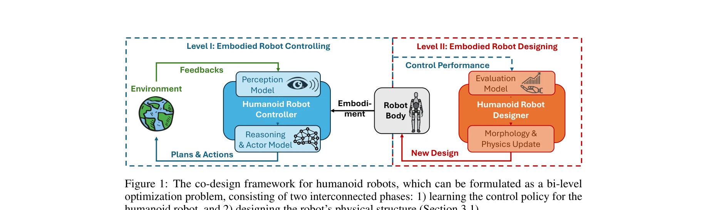

# Embracing Evolution: A Call for Body-Control Co-Design in Embodied Humanoid Robot

> **저자**: Guiliang Liu, Bo Yue, Yi Jin Kim, Kui Jia | **날짜**: 2025-10-03 | **URL**: [https://arxiv.org/abs/2510.03081](https://arxiv.org/abs/2510.03081)

---

## Essence

*Figure 1: The co-design framework for humanoid robots, which can be formulated as a bi-level*

본 논문은 휴머노이드 로봇의 제어 정책과 물리적 구조를 동시에 진화시키는 co-design 메커니즘을 제안하며, 이를 통해 다양한 실제 환경에서 진정한 embodied intelligence를 달성할 수 있음을 주장한다.

## Motivation

- **Known**: 최근 휴머노이드 로봇 연구는 고정된 물리적 구조에 대한 제어 정책 최적화에 중점을 두었으며, quadruped, soft, bipedal, modular 로봇에서는 co-design이 일부 탐구되었다.
- **Gap**: 휴머노이드 로봇의 co-design은 상대적으로 미개척 영역이며, 이 접근법의 필요성과 실현 가능성이 충분히 입증되지 않았다.
- **Why**: Embodied intelligence는 제어 성능뿐만 아니라 물리적 구조에 근본적으로 의존하며, 생물학적 진화에서 생물들이 신체 형태를 적응시키는 것처럼 로봇도 동일한 메커니즘이 필요하다.
- **Approach**: 이 논문은 co-design을 bi-level optimization으로 공식화하고, strategic robot structure exploration, Sim2Real transfer, meta-policy learning 등의 실용적 방법론을 제시한다.

## Achievement

*Figure 1: The co-design framework for humanoid robots, which can be formulated as a bi-level*

- **Co-design 프레임워크 정립**: 휴머노이드 로봇의 제어와 설계를 bi-level optimization 문제로 공식화하여 체계적 접근 제공
- **실현 가능성 입증**: 학습 기반 solver, Sim2Real 패러다임, meta control policy를 통해 co-design의 알고리즘적 실현 가능성 제시
- **필요성 분석**: 방법론, 응용, 커뮤니티 관점에서 co-design의 필수성을 다각적으로 분석
- **미래 연구 방향 제시**: 단기 혁신부터 장기 목표까지 포괄하는 열린 연구 질문 제안

## How

*Figure 1: The co-design framework for humanoid robots, which can be formulated as a bi-level*

- Bi-level optimization: reasoning-acting 아키텍처에 최적화기 통합으로 물리적 구조 진화 실현
- Strategic exploration: 로봇 구조 공간의 효율적 탐색 메커니즘 개발
- Sim2Real transfer: 시뮬레이션 기반 설계 최적화를 실제 로봇에 적용하는 방법론
- Meta-policy learning: 다양한 로봇 형태에 빠르게 적응하는 제어 정책 학습
- VLM 기반 reasoning model: 자연어 명령과 시각 정보를 기반으로 고수준 계획 수립
- MDP 기반 action model: 추론 모델의 출력을 저수준 제어 신호로 변환

## Originality

- 휴머노이드 로봇에 특화된 co-design 프레임워크 최초 제시로 기존 연구의 선택적 적용을 체계화
- 생물학적 진화 원리를 embodied AI에 명시적으로 연결하여 새로운 패러다임 제안
- 단순한 기술 제안을 넘어 방법론-응용-커뮤니티 관점에서 co-design의 필요성을 종합적으로 논증
- Dexterity, Mobility, Perception, Intelligence의 네 가지 능력을 통합하는 embodied 휴머노이드 로봇 요구사항 명시화

## Limitation & Further Study

- **Position paper 특성**: 실제 구현 사례나 실증적 결과가 부족하며 대부분 이론적 논의에 집중
- **알고리즘적 도전**: bi-level optimization의 계산 복잡도 및 수렴성에 대한 구체적 분석 부재
- **물리적 평가**: 실제 로봇에서의 설계 안정성, 제조 가능성, 비용 고려사항 미흡
- **설계 공간**: 휴머노이드의 복잡한 설계 공간을 효과적으로 탐색하는 구체적 전략 부족
- **후속 연구**: Meta-policy learning의 일반화 성능, Sim2Real gap 극복 방안, 대규모 구조 공간 탐색 알고리즘에 대한 실제 검증 필요

## Evaluation

- Novelty: 4/5
- Technical Soundness: 3/5
- Significance: 4/5
- Clarity: 4/5
- Overall: 4/5

**총평**: 본 논문은 휴머노이드 로봇의 co-design을 체계적으로 정식화하고 그 필요성을 종합적으로 논증한 중요한 위치 페이퍼이지만, 실제 구현 사례 부족과 알고리즘적 도전에 대한 구체적 해결책이 제한적이다.

## Related Papers

- 🔗 후속 연구: [[papers/1379_Embracing_Evolution_A_Call_for_Body-Control_Co-Design_in_Emb/review]] — 휴머노이드 로봇의 embodied intelligence를 위한 co-design 접근법이 물리적 구조와 제어의 통합 최적화를 통해 진정한 구현체 지능을 실현한다
- 🏛 기반 연구: [[papers/1415_General_Motion_Tracking_for_Humanoid_Whole-Body_Control/review]] — General Motion Retargeting의 동작 변환 기술이 co-design된 휴머노이드의 최적화된 물리 구조에 맞는 동작 생성에 필요한 기반 기술을 제공한다
- 🧪 응용 사례: [[papers/1262_AGILOped_Agile_Open-Source_Humanoid_Robot_for_Research/review]] — AGILOped 오픈소스 휴머노이드가 co-design 메커니즘을 실제 플랫폼에 적용하여 검증할 수 있는 실용적 테스트베드를 제공한다
- 🧪 응용 사례: [[papers/1415_General_Motion_Tracking_for_Humanoid_Whole-Body_Control/review]] — GMR의 일반적인 동작 리타게팅 기술이 co-design된 휴머노이드의 최적화된 물리 구조에 맞는 동작 적응에 직접 적용될 수 있다
