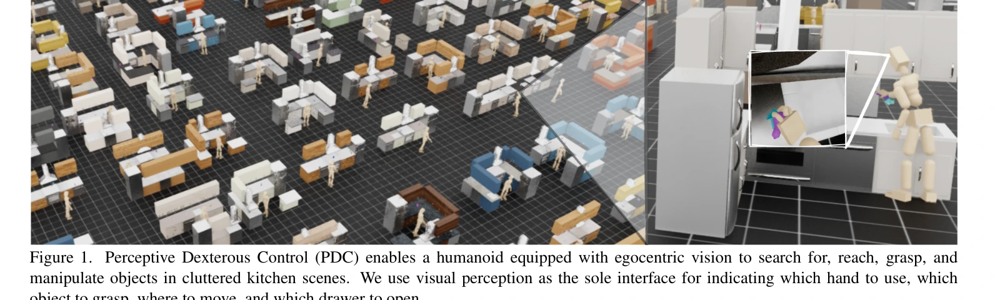
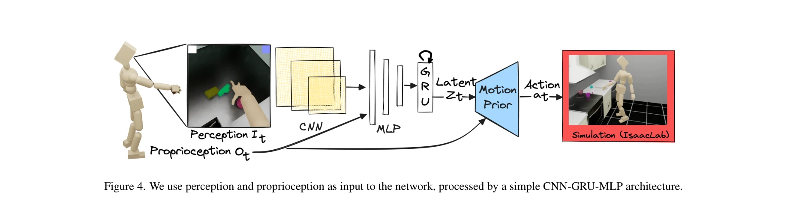

# Emergent Active Perception and Dexterity of Simulated Humanoids from Visual Reinforcement Learning

> **저자**: Zhengyi Luo, Chen Tessler, Toru Lin, Ye Yuan, Tairan He, Wenli Xiao, Yunrong Guo, Gal Chechik, Kris Kitani, Linxi Fan, Yuke Zhu | **날짜**: 2025-05-18 | **URL**: [https://arxiv.org/abs/2505.12278](https://arxiv.org/abs/2505.12278)

---

## Essence

*Figure 1. Perceptive Dexterous Control (PDC) enables a humanoid equipped with egocentric vision to search for, reach, gr*

본 논문은 egocentric vision만을 사용하여 시뮬레이션된 인간형 로봇이 물체 검색, 파지, 배치 등의 복잡한 가정 작업을 수행하도록 하는 Perceptive Dexterous Control(PDC) 프레임워크를 제안한다. 시각 신호를 작업 지정 인터페이스로 활용하여 특권 정보 없이도 인간다운 행동이 자연스럽게 나타난다.

## Motivation

- **Known**: 인간형 로봇의 손재주 있는 전신 제어 및 시각 기반 조작은 오랫동안 연구되어 왔으나, 대부분의 선행 연구는 객체의 3D 위치와 형상 같은 특권 정보에 의존한다. 계층적 RL과 옵션 프레임워크를 통한 기술 재사용도 활발히 탐구되고 있다.
- **Gap**: egocentric vision만으로 높은 자유도의 인간형 로봇이 부분 관찰 환경에서 복잡한 조작 작업을 수행하고, 능동적 검색 같은 인간다운 행동을 자연스럽게 발현할 수 있는 방법이 부재했다. 또한 작업별 재훈련 없이 다중 작업을 지원하는 확장 가능한 시각 기반 작업 지정 패러다임이 없었다.
- **Why**: 시각 기반 로봇 제어는 현실의 로보틱스와 구embodied AI에 필수적이며, 특권 정보 제거는 시뮬레이션에서 현실로의 전이 가능성을 높인다. 인간다운 능동적 지각 행동의 자연 발현은 애니메이션, 로보틱스, 구embodied AI 분야에서 지각-행동 루프를 닫는 핵심이다.
- **Approach**: 본 논문은 대규모 모션캡처 데이터로부터 학습한 제어 사전을 활용하여 RL의 샘플 효율성을 개선하고, 객체 마스크와 3D 마커를 시각 신호로 사용하여 작업을 지정한다. 다양하게 생성된 절차적 주방 환경에서 다중 작업을 동시에 학습하며, RGB, RGB-D, 스테레오 등 다양한 시각 양식을 지원한다.

## Achievement

*Figure 1. Perceptive Dexterous Control (PDC) enables a humanoid equipped with egocentric vision to search for, reach, gr*

- **Vision-driven 전신 제어의 실현**: egocentric vision과 proprioception만을 사용하여 현실적인 가정 환경에서 reaching, grasping, placing, articulated object manipulation 등을 포함한 복잡한 조작 작업을 성공적으로 수행
- **지각 중심 작업 지정 패러다임**: 상태 변수나 위상 변수 대신 시각 신호(객체 마스크, 3D 마커)를 직접 사용하여 작업을 지정하므로, 새로운 작업 추가 시 정책 재훈련 없이 fine-tuning만으로 확장 가능
- **인간다운 행동의 자연 발현**: RL 훈련으로부터 능동적 검색(active search)과 전신 협응(whole-body coordination) 같은 인간다운 행동이 자연스럽게 나타남
- **시각 양식별 성능 분석**: stereo vision이 RGB 대비 9% 높은 성공률을 보이는 등, 다양한 시각 모달리티의 영향을 실증적으로 분석

## How

*Figure 4. We use perception and proprioception as input to the network, processed by a simple CNN-GRU-MLP architecture.*

- 계층적 RL 구조: 저수준 latent-conditioned controller(LLC)를 대규모 모션캡처 데이터로 사전학습하여 다양한 동작 레퍼토리 확보 후, 고수준 controller(HLC)가 시각 입력에 기반해 latent를 예측
- 절차적 환경 생성: 구조와 외관이 다양한 주방을 랜덤하게 생성하고, 객체와 로봇의 초기 위치를 무작위로 배치하여 일반화 능력 강화
- 다중 시각 양식 지원: RGB, RGB-D, Stereo 등 다양한 입력을 동일 네트워크 구조로 처리
- Perception-as-interface 설계: 증강 현실 개념처럼 시각 신호(객체 마스크, 3D 마커)를 정보 제공 인터페이스로 활용
- RL 훈련 최적화: 복잡한 제어 문제의 샘플 효율성을 위해 모션캡처 사전학습 기반 제어 사전 활용

## Originality

- egocentric vision 기반 인간형 로봇의 전신 제어와 능동적 지각을 통합한 최초의 실증적 연구
- 시각 신호 자체를 작업 지정 인터페이스로 사용하는 혁신적 패러다임으로, 자연어나 상태 변수 기반 접근과 차별화
- 특권 정보 완전 제거 상황에서 household manipulation을 다중 작업으로 동시 학습 가능하게 한 점
- 능동적 검색 같은 인간다운 행동이 RL로부터 자연 발현되는 메커니즘의 실증적 증명

## Limitation & Further Study

- 시뮬레이션 환경 제한: 실제 로봇 환경의 복잡한 조명, 질감, 동적 요소 등을 충분히 반영하지 못함
- 객체 마스크 의존성: 시각 신호로 객체 마스크를 사용하므로, 실제 배포 시 마스크 생성 방법의 현실성 미정
- 계산 비용: 대규모 모션캡처 사전학습과 다양한 환경 생성으로 인한 높은 계산 비용
- 일반화 한계: 주로 kitchen 시나리오에서 평가되었으므로, 다른 환경(실내외 다양한 공간)으로의 일반화 가능성 미불명
- 후속 연구: 시뮬-투-리얼(sim-to-real) 전이 학습 및 실제 로봇 검증, 마스크 없이 순수 RGB만으로의 학습 강화, 더 복잡한 상호작용 시나리오 확대

## Evaluation

- Novelty: 4/5
- Technical Soundness: 3/5
- Significance: 4/5
- Clarity: 4/5
- Overall: 4/5

**총평**: 본 논문은 특권 정보 제거와 egocentric vision 기반 다중 작업 학습이라는 도전적 문제를 해결하면서도 인간다운 행동의 자연 발현을 달성한 창의적 연구이다. Perception-as-interface 패러다임은 향후 embodied AI와 로보틱스에서의 새로운 설계 철학을 제시하는 의미가 있으나, 시뮬레이션 중심의 한계와 실제 시스템으로의 전이 검증이 필요하다.

## Related Papers

- 🔗 후속 연구: [[papers/1371_EgoMI_Learning_Active_Vision_and_Whole-Body_Manipulation_fro/review]] — PDC 프레임워크의 egocentric vision 기반 능동 지각은 EgoMI의 머리-손 동기화 캡처 기술과 결합하여 더욱 정교한 인간형 행동 모방이 가능합니다.
- 🧪 응용 사례: [[papers/1347_DIJIT_A_Robotic_Head_for_an_Active_Observer/review]] — PDC의 시각 기반 능동 지각 알고리즘은 DIJIT 로봇 헤드의 9개 기계적 자유도를 활용한 실제 능동 시각 시스템 구현에 직접 적용할 수 있습니다.
- 🏛 기반 연구: [[papers/1347_DIJIT_A_Robotic_Head_for_an_Active_Observer/review]] — DIJIT의 능동 시각 시스템은 시뮬레이션된 휴머노이드가 egocentric vision을 활용한 복잡한 가정 작업을 수행하는 PDC 프레임워크의 기술적 기반입니다.
- 🏛 기반 연구: [[papers/1371_EgoMI_Learning_Active_Vision_and_Whole-Body_Manipulation_fro/review]] — EgoMI의 동기화된 머리-손 움직임 캡처와 SPARKS 알고리즘은 PDC 프레임워크의 egocentric vision 기반 능동 지각 학습을 위한 핵심 기술적 기반입니다.
