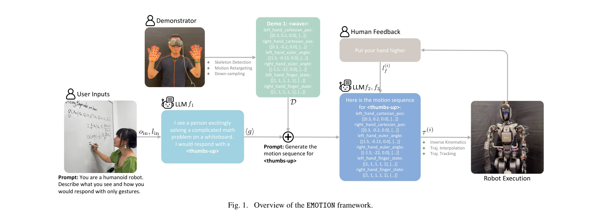

# EMOTION: Expressive Motion Sequence Generation for Humanoid Robots with In-Context Learning

> **저자**: Peide Huang, Yuhan Hu, Nataliya Nechyporenko, Daehwa Kim, Walter Talbott, Jian Zhang | **날짜**: 2024-10-30 | **URL**: [https://arxiv.org/abs/2410.23234](https://arxiv.org/abs/2410.23234)

---

## Essence

*Fig. 1. Overview of the EMOTION framework.*

EMOTION은 대규모 언어 모델(LLM)의 in-context learning 능력을 활용하여 인간형 로봇이 다양한 사회적 맥락에서 자연스럽고 표현력 있는 제스처 모션 시퀀스를 동적으로 생성하는 프레임워크이다. 사용자 연구를 통해 생성된 모션이 인간 시연과 동등하거나 우수한 성능을 보임을 입증했다.

## Motivation

- **Known**: 기존 로봇 비언어 커뮤니케이션 연구는 사전 정의된 시퀀스나 휴리스틱 기반 방법에 의존하며, 최근 생성 모델과 LLM이 로봇 행동 생성에 활용되고 있다. 다만 기존 방법들은 인간의 다양성과 미묘함을 충분히 모방하지 못한다.
- **Gap**: 기존 작업은 인간이 설계한 모션 프리미티브나 사전 녹화된 궤적에 의존하여 막대한 노력과 자원을 요구하며, LLM을 활용한 복잡한 손가락 관절 제어와 다양한 사회적 맥락에 따른 적응형 제스처 생성에 대한 연구가 부족하다.
- **Why**: 인간형 로봇이 자연스럽고 맥락에 적절한 비언어적 커뮤니케이션을 수행할 수 있으면 사용자 만족도와 참여도를 향상시킬 수 있으며, 최소한의 인간 개입으로 다양한 표현 행동을 자동으로 생성하는 것은 로봇 개발 효율성을 크게 높일 수 있다.
- **Approach**: 사용자 언어 지시 및/또는 로봇 이미지 관찰을 LLM에 입력하여 손의 데카르트 위치, 오일러 각도, 손가락 상태 등을 포함한 모션 시퀀스를 생성하고, inverse kinematics와 궤적 보간/추적을 통해 로봇에서 실행한다. EMOTION++는 인간 피드백을 반복적으로 통합하여 생성된 모션을 개선한다.

## Achievement

- **LLM 기반 제스처 생성**: LLM의 in-context learning을 활용하여 10가지 서로 다른 표현력 있는 제스처에 대한 모션 시퀀스를 자동 생성
- **인간 수준 성능**: 온라인 사용자 연구에서 EMOTION과 EMOTION++가 인간 시연과 비교하여 자연스러움과 이해도 면에서 동등하거나 우수한 평가를 획득
- **인간 피드백 통합**: EMOTION++가 자연스러움과 이해도 모두에서 EMOTION보다 유의미하게 높은 평가를 받아 반복적 피드백 통합의 효과 입증
- **설계 지침 도출**: 손의 위치, 움직임 패턴, 팔과 어깨 관절, 손가락 자세, 속도 등 인간 지각에 영향을 미치는 주요 변수들을 식별

## How

*Fig. 1. Overview of the EMOTION framework.*

- 사용자 언어 지시(예: '흥분한 사람에게 엄지손가락')를 프롬프트로 구성", 'LLM에 시연 예제를 in-context로 제공하여 해당 제스처에 대한 모션 시퀀스 생성
- 생성된 모션 시퀀스를 손 위치, 방향, 손가락 상태 등의 연속값으로 표현
- Inverse kinematics를 적용하여 데카르트 좌표를 관절 각도로 변환
- 궤적 보간 및 추적 제어를 통해 로봇에서 실행 가능한 형태로 변환
- 선택적으로 인간 피드백('손을 더 높이 올려')을 받아 프롬프트에 추가하고 모션 재생성(EMOTION++)", '온라인 사용자 연구를 통해 자연스러움과 이해도를 5점 리커트 척도로 평가

## Originality

- 인간형 로봇의 복잡한 손과 손가락 궤적 생성에 LLM을 직접 적용한 첫 시도로, 기존 GenEM 같은 고수준 스킬 배열 방식과 차별화
- 자연 언어 피드백을 직접 모션 시퀀스 개선에 반영하는 in-the-loop 메커니즘 제안
- 10개 제스처에 대한 사용자 평가와 정성적 분석을 통해 로봇 표현성에 영향을 미치는 구체적 변수들을 체계적으로 규명

## Limitation & Further Study

- 선정된 10가지 제스처로 범위가 제한되어 있으며, 더 다양한 제스처에 대한 일반화 가능성 검증 필요
- 일부 제스처(예: 'listening
- jazz-hands')는 3점 이하의 낮은 평가를 받아 특정 모션 유형에서 성능 편차 존재", '사용자 연구가 온라인 비디오 평가 기반이므로 실제 로봇과의 대면 상호작용 시 인식의 차이 가능성
- LLM의 in-context learning에만 의존하여 명시적 로봇 역학 모델링이 부재; 복잡한 동역학 제약이 있는 움직임에서의 성능 미검증
- 향후 연구는 더 광범위한 제스처 세트, 실제 인간-로봇 상호작용 시나리오, 다양한 로봇 플랫폼에 대한 확장을 고려해야 함

## Evaluation

- Novelty: 4/5
- Technical Soundness: 3/5
- Significance: 4/5
- Clarity: 4/5
- Overall: 4/5

**총평**: EMOTION은 LLM의 in-context learning 능력을 인간형 로봇의 표현력 있는 제스처 생성에 창의적으로 적용하였으며, 사용자 연구를 통해 인간 수준의 성능을 입증함으로써 로봇-인간 상호작용 연구에 의미 있는 기여를 한다. 다만 제스처 다양성과 실제 상호작용 환경에서의 일반화 가능성에 대한 추가 검증이 필요하다.

## Related Papers

- 🔄 다른 접근: [[papers/1390_Expressive_Whole-Body_Control_for_Humanoid_Robots/review]] — EMOTION의 LLM 기반 동적 제스처 생성과 ExBody의 모션 캡처 데이터 기반 표현력 있는 전신 제어는 휴머노이드 표현성 향상을 위한 서로 다른 접근법입니다.
- 🔗 후속 연구: [[papers/1377_Embrace_Collisions_Humanoid_Shadowing_for_Deployable_Contact/review]] — EMOTION의 자연스럽고 표현력 있는 제스처 생성은 극단적 contact-rich 동작을 수행하는 휴머노이드에 사회적 상호작용 능력을 추가할 수 있습니다.
- 🔗 후속 연구: [[papers/1289_Bi-Level_Motion_Imitation_for_Humanoid_Robots/review]] — 표현적 휴머노이드 동작 생성에서 계층적 의도-감정 추론이 확장된다
- 🏛 기반 연구: [[papers/1350_Do_You_Have_Freestyle_Expressive_Humanoid_Locomotion_via_Aud/review]] — expressive motion generation의 기본 방법론을 제공하는 연구다
- 🧪 응용 사례: [[papers/1333_Design_and_Control_of_a_Bipedal_Robotic_Character/review]] — 표현적 휴머노이드 동작 생성에서 엔터테인먼트 로봇의 예술적 표현성이 적용된다
- 🏛 기반 연구: [[papers/1377_Embrace_Collisions_Humanoid_Shadowing_for_Deployable_Contact/review]] — contact-agnostic 동작 학습에서 인간다운 자연스러운 움직임을 달성하기 위해서는 EMOTION의 표현력 있는 제스처 생성 기술이 필수적입니다.
- 🔄 다른 접근: [[papers/1390_Expressive_Whole-Body_Control_for_Humanoid_Robots/review]] — 모션 캡처 데이터 기반의 표현력 있는 전신 움직임 학습과 EMOTION의 LLM 기반 동적 제스처 생성은 휴머노이드 표현성을 위한 서로 다른 데이터 소스와 방법론을 사용합니다.
- 🔄 다른 접근: [[papers/1443_Hierarchical_Intention-Aware_Expressive_Motion_Generation_fo/review]] — 둘 다 휴머노이드의 표현적 동작 생성을 다루지만 HIAER은 의도인식에, EMOTION은 감정표현에 중점을 둔다
