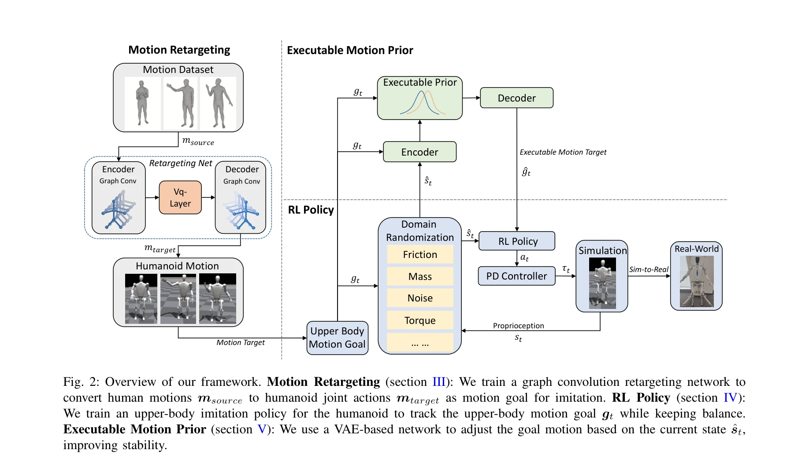
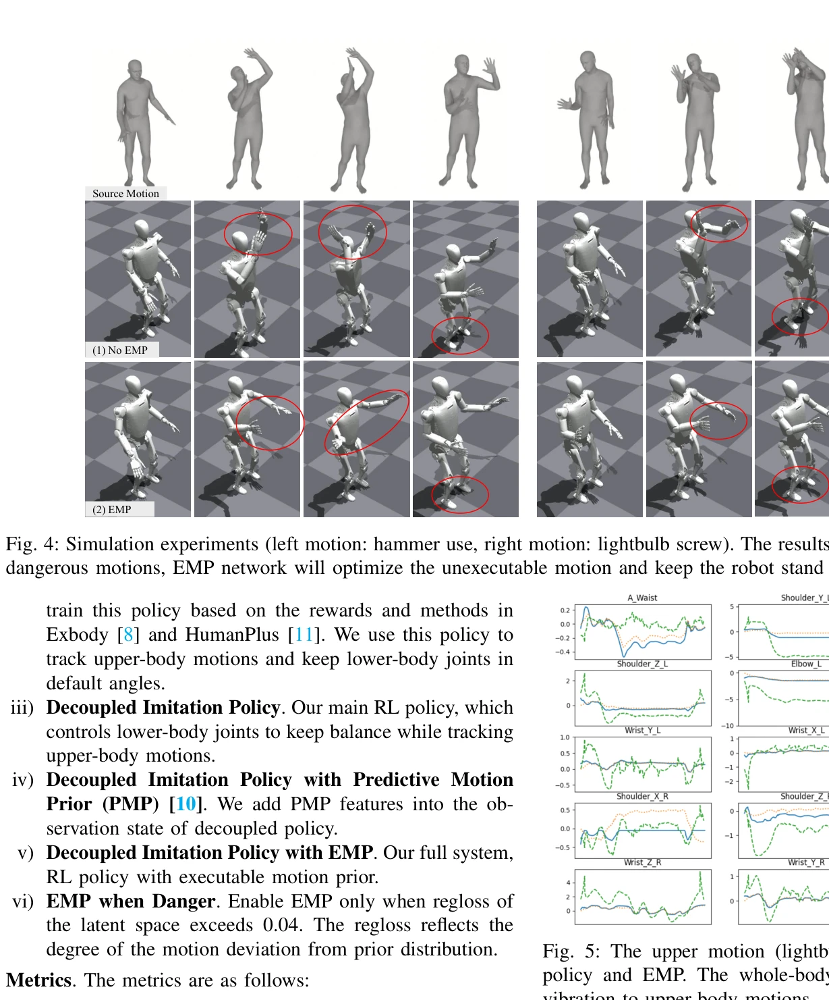

# EMP: Executable Motion Prior for Humanoid Robot Standing Upper-body Motion Imitation

> **저자**: Haocheng Xu, Haodong Zhang, Zhenghan Chen, Rong Xiong | **날짜**: 2025-07-21 | **URL**: [https://arxiv.org/abs/2507.15649](https://arxiv.org/abs/2507.15649)

---

## Essence

*Fig. 2: Overview of our framework. Motion Retargeting (section III): We train a graph convolution retargeting network to*

휴머노이드 로봇이 서 있는 상태에서 상체 동작을 모방하면서 전체 신체의 안정성을 유지하기 위해, Executable Motion Prior(EMP) 모듈을 포함한 강화학습 기반 프레임워크를 제안한다.

## Motivation

- **Known**: 휴머노이드 로봇의 동작 모방은 model-based controller 또는 RL 기반 방식으로 연구되어 왔으며, 동작 retargeting과 전체 신체 제어 정책이 개발되었다.
- **Gap**: 기존 접근법은 전체 신체 제어 시 진동과 편차 문제가 발생하거나, 상체 동작을 직접 실행할 때 로봇의 제어 능력을 초과하여 균형을 잃는 문제가 있다.
- **Why**: 휴머노이드 로봇이 조작 작업을 수행하려면 서 있는 상태에서 안정적으로 상체 동작을 수행할 수 있어야 하며, 이는 로봇의 실제 배포와 안전성을 위해 중요하다.
- **Approach**: Motion retargeting network로 인간 동작을 휴머노이드 동작으로 변환한 대규모 데이터셋을 생성하고, 이를 통해 RL policy를 훈련하며, 로봇의 현재 상태에 기반하여 상체 목표 동작을 조정하는 EMP 모듈을 제안한다.

## Achievement

*Fig. 4: Simulation experiments (left motion: hammer use, right motion: lightbulb screw). The results show that while exe*

- **Motion Retargeting Network**: Graph Convolutional Network를 사용하여 인간 동작을 휴머노이드 관절 동작으로 변환하는 VQ-VAE 기반 아키텍처 개발
- **Executable Motion Prior(EMP)**: 로봇의 현재 상태와 행동 목표를 잠재 공간으로 인코딩한 후 디코딩하여 안정적인 동작으로 변환하는 모듈 제안
- **RL Policy**: Domain randomization을 적용한 강화학습 정책으로 하체 동작 제어를 통해 전체 신체 균형 유지
- **Sim-to-Real Transfer**: 시뮬레이션에서 훈련한 모델을 두 종류의 실제 휴머노이드 로봇에 배포하여 효과 입증

## How

*Fig. 2: Overview of our framework. Motion Retargeting (section III): We train a graph convolution retargeting network to*

- Motion encoder fe와 transformation net ftf, codebook layer, motion decoder fd로 구성된 retargeting network로 인간 골격 A를 휴머노이드 골격 B로 변환
- 상체 동작 추적을 위한 RL policy 훈련 시 도메인 랜더마이제이션(마찰, 질량, 노이즈 등)을 적용하여 강건성 향상
- VAE 기반 EMP network에서 현재 상태 ŝt와 동작 목표 gt를 입력받아 실행 가능한 동작 목표 ĝt로 변환
- World model을 사용하여 환경의 상태 전이 과정을 시뮬레이션하고 그래디언트 역전파 수행
- PD controller를 통해 최종 토크 명령을 로봇에 전달

## Originality

- 기존 전체 신체 제어와 직접 상체 실행의 한계를 보완하기 위해 EMP 모듈을 중간 단계에 삽입하는 새로운 아키텍처 제안
- 상체 동작 목표를 로봇의 현재 상태에 따라 동적으로 조정하는 방식으로 안정성과 동작 유사도의 충돌 해결
- Motion retargeting, RL policy, EMP의 세 구성 요소를 통합한 end-to-end 프레임워크 개발

## Limitation & Further Study

- 상체 동작 범위에 제한되어 있으며, 전신 동작이나 보행 중 동작 모방으로의 확장이 명시되지 않음
- EMP 모듈의 동작 조정이 동작 폭을 최소화한다는 명시적 보장이 수식적으로 입증되지 않음
- 실험은 특정 작업(망치질, 전구 교체)에 제한되어 있으며, 더 다양한 작업에서의 일반화 능력 검증 필요
- 후속 연구로는 전신 동작 모방, 더 복잡한 동적 작업 지원, 그리고 적응형 EMP 모듈 개발이 필요함

## Evaluation

- Novelty: 4/5
- Technical Soundness: 3/5
- Significance: 4/5
- Clarity: 4/5
- Overall: 4/5

**총평**: 본 논문은 휴머노이드 로봇의 상체 동작 모방에서 안정성과 정확성의 균형을 맞추기 위해 새로운 EMP 모듈을 제안하며, Motion retargeting과 RL을 효과적으로 통합하여 실제 로봇에 성공적으로 배포한 실용적인 연구이다.

## Related Papers

- 🔗 후속 연구: [[papers/1423_GentleHumanoid_Learning_Upper-body_Compliance_for_Contact-ri/review]] — EMP의 상체 동작 모방에 GentleHumanoid의 compliance 제어를 추가하면 인간과의 안전한 상호작용이 가능하다.
- 🏛 기반 연구: [[papers/1390_Expressive_Whole-Body_Control_for_Humanoid_Robots/review]] — Expressive Whole-Body Control의 전신 표현 방법이 EMP의 상체 동작 모방과 하체 안정성 조화의 이론적 기반이 된다.
- 🔄 다른 접근: [[papers/1467_Humanoid_Locomotion_as_Next_Token_Prediction/review]] — 둘 다 상체 동작을 다루지만 EMP는 안정성 중심의 모방학습, Humanoid Locomotion은 next token prediction 방식을 사용한다.
- 🏛 기반 연구: [[papers/1399_FLAM_Foundation_Model-Based_Body_Stabilization_for_Humanoid/review]] — 인간 동작 reconstruction 기반 보상이 EMP의 상체 동작 모방에서 전신 안정성을 유지하는 핵심 방법론이 된다.
- 🔗 후속 연구: [[papers/1523_Learning_Getting-Up_Policies_for_Real-World_Humanoid_Robots/review]] — EMP의 실행 가능한 모션 prior 개념을 낙상 복구라는 특수한 상황에 적용하여 구체적인 일어서기 정책으로 발전시킨 형태임
